# Strengthen Operational Security with IBM WebSphere Automation

**Last updated:** April 2022

**Duration:** 60 - 90 minutes

Need support? Contact **Kevin Postreich**

## Introduction to WebSphere Automation

[IBM WebSphere Automation](https://www.ibm.com/cloud/websphere-automation) is focused on delivering value into existing WebSphere Application Server (WAS) environments, helping administrators reduce the cost, effort, and risk of addressing common vulnerabilities, automating tasks, and remediating capacity incidents.

It removes manual toil so that your team can spend more time innovating while minimizing the cost of extending the life and maximizing the ROI of your WebSphere investments.

In conversations with customers, the same three concerns come up repeatedly. Organizations need to keep their IT estate secure and compliant, resilient to disruption and running optimally while reducing costs and maximizing ROI.

WebSphere Automation helps organizations gain visibility, operational efficiencies, and cost savings quickly by extending the life of WebSphere investments and giving teams time back to focus on unlocking new value and fixing the imbalance of pure maintenance versus innovation tasks.

  - WebSphere operators and administrators save time and embrace DevSecOps by implementing patches more efficiently on virtual and container environments to keep operations compliant and secure.

  - Enhance remediation capabilities with insights and recommendations to improve the speed and depth of understanding of outages and anomalies as they occur.

  - Augment the operational experience with access to simplified and consolidated information that enables teams to act.

With WebSphere Automation, security, business efficiency and resiliency become standard. IBM can meet you wherever you are in your optimization and automation journeys to help you quickly deliver value and increase ROI, all while laying a solid automation foundation to support future growth.

IBM WebSphere Automation is available as a stand-alone offering or as an addition to IBM Cloud Pak® for Watson AIOps. As part of IBM Automation platform, IBM WebSphere Automation includes containerized components and common software services on top of a common automation layer, to manage WebSphere’s incidents, hybrid applications, and cost with complete observability, governance, and compliance.

Deploy virtually anywhere through containers supported by Red Hat® OpenShift® software, on IBM Cloud®, on essentially any existing infrastructure on-premises, or through private and public clouds. Use only the capabilities you need with a fully modular approach that’s designed to be easy to consume.

## Business Context

You are a WebSphere Administrator, part of a WebSphere Operations Team responsible for maintaining security compliance of the WebSphere estate in the enterprise. A typical “as-is” process for maintaining security compliance for WebSphere environments is depicted below.

**Today (as-is):**

1.  IBM sends generic “FLASH” to indicate a new WAS security bulletin.

2.  You subscribe and receive IBM Security Bulletins to be aware about vulnerabilities, its potential impact, severity, and recommended solutions.

3.  Generally, WAS inventory is maintained in spreadsheets.

4.  Based on that, you check if this CVE applies to your managed inventory (Spreadsheet)

5.  You determine if an APAR / Fix Pack upgrade should be applied to    existing environment

6.  You deploy the fix to the impacted environments

7.  You update the WAS inventory (Spreadsheet) and provide up-to-date    reports to audit and compliance teams

As is, your inventory is a spreadsheet, containing all information about your servers, such as the versions of the installed servers, which operating system they're installed on, and iFixes which have been applied, etc

Currently, this is a very manual, time-consuming process, and you'd like to automate this process to direct valuable time and resource elsewhere. This is where **IBM WebSphere Automation** will help\!

You would like to have:

  - **Management dashboard:** Consolidated dashboard increases awareness and response time to common vulnerabilities and exposures (CVEs).

  - **Automated vulnerability tracking:** Let WebSphere Automation track new security bulletins across your existing traditional WebSphere and Liberty environments, on virtual machines or containers.

  - **Contextual notifications:** Receive security bulletin notifications only when new vulnerabilities affect the environment you manage, reducing noise and interruptions to the WebSphere operations team.

  - **Shared, live visibility to key stakeholders:** WebSphere operators and security compliance teams can see the real-time security posture of the WebSphere estate, accelerating action and minimizing the risk of miscommunication.

  - **Dix History:** A complete audit trail for when vulnerabilities are detected, and when patches or upgrades are applied to resolve issues 
  
  In this lab, you use the IBM WebSphere Automation to secure operations to reduce risk and meet compliance.

At the end of this lab, you will be able to connect teams with the most relevant information through a single dashboard. This enables you to discover, analyze and remediate common vulnerabilities and exposures across instances. 

You will gain the necessary insights into **Fix History** to help operations teams demonstrate they are meeting patching SLAs, which are very common in large enterprises. 
Furthermore, this information can be exported to a CSV file to be shared amongst the broader team. 

In this lab, you use the IBM WebSphere Automation to secure operations to reduce risk and meet compliance.

At the end of this lab, you will be able to connect teams with the most relevant information through a single dashboard. This enables you to discover, analyze and remediate common vulnerabilities and exposures across instances. 

Furthermore, this information can be exported to a CSV file to be shared amongst the broader team. 

## Accessing and starting the environment

If you are doing this lab as part of an instructor led workshop (virtual or face to face), an environment has already been provisioned for you. The instructor will provide the details for accessing the lab environment.

Otherwise, you will need to reserve an environment for the lab. You can obtain one here. Follow the on-screen instructions for the “**Reserve now**” option.

<https://techzone.ibm.com/my/reservations/create/60da2c20e2cb7a001f656575>

1.  When the demo environment is provisioned, use the provided username and password to access and start the environment. You should see the following screen:

    

     WebSphere Automation is pre-installed in the OCP cluster hosted on the VMs.
	 
	  
	 
2. If the environment is **NOT** already started, go ahead, and **Start** the environment by clicking on the **Play** button. It takes about 10-15 minutes for the environment to start and stabilize.

    

      

3. You will be working on the **STUDENT** VM only. 

    All the WebSphere **images** and **iFixes** required for the lab are pre-installed:

    - /opt/IBM/WebSphere/Liberty20009/

    - /opt/IBM/WebSphere/AppServer9057/

     
	
4.  Click the screen representing the **STUDENT** VM

    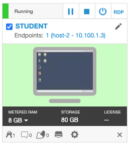

     
	
5.  Once you log in to the Student VM you will see the Desktop, which     contains all the programs that you will be using (browsers, terminal, etc.)

    The login credentials for the **STUDENT”** image is:
 
     - User ID: **ibmuser**

     - Password: **engageibm\!**
	 
	  
 
     
	 
	  

6.  You can resize the virtual desktop with the **Fit to window** button, located at the top of the Skytap environment window.

    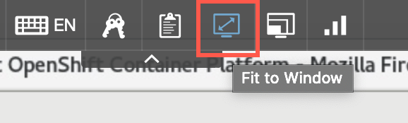

     

## Part1: Receiving vulnerability notifications

### How security works in IBM WebSphere Automation

WebSphere administrators register their WebSphere Application Server or WebSphere Application Server Liberty servers with WebSphere Automation. The WebSphere Automation vulnerability manager assesses the security compliance status of each server. 

Common vulnerabilities or exposures (CVEs) for each server are displayed in the WebSphere Automation UI in an interactive list, and each server is assessed a risk level. Administrators can learn more about the pertinent CVEs and plan their response.

When the IBM Product Security Incident Response Team (PSIRT) publishes new or updated security bulletins, the WebSphere Automation CVE/PSIRT monitor detects them and collects the data about the CVEs from the bulletins. 

The WebSphere Automation vulnerability manager checks the applicability of the new CVEs to the registered servers. If exposures are found, the WebSphere Automation vulnerability notifier sends email notifications to a customizable list of addresses those new vulnerabilities exist.

### Clone the Git repository used for this lab and explore the contents

1.	Clone the GitHub repo with the lab artifacts, then run the following command on your terminal:
    a.	Open a Terminal window on the VM, and ensure you are in the home directory of the user “ibmuser”

        cd /home/ibmuser

    b.	From the terminal window, run the following commands to  clone the repo:

        git clone https://github.com/IBMTechSales/WAS-Automation-LabFiles.git

    

    These commands above clone the public repo named WAS-Automation-LabFiles to the local directory under /home/ibmuser/WAS-Automation-LabFiles directory. 

    c.	Change to the cloned directory in which the lab files are located 
    
        cd /home/ibmuser/WAS-Automation-LabFiles/lab1-CVE

    d.	List the directory contents using the ls -l command 

    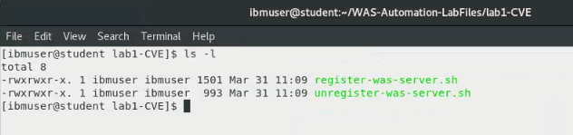

### Accessing the WebSphere Automation UI

A WebSphere administrator sets up WebSphere Automation by registering and configuring WebSphere Application Servers and WebSphere Liberty servers for vulnerability tracking and by configuring email notifications.

WebSphere administrators can also view the results of vulnerability assessment in WebSphere Automation to plan their response for the WebSphere Application Server and WebSphere Liberty servers that they manage.

For this lab, WebSphere Automation is pre-installed on an OCP cluster. You have your individual WebSphere Automation installation. Let’s access your environment.

1.  On the *Student VM*, open a browser and enter the following URL (there is a WebSphere Automation link on bookmark toolbar):
    
    **Note:** It takes about **10-15 minutes** for the environment to start and stabilize once it has started. If you encounter "**Secure Connection Failed**" or  "**502 Gateway Error**" accessing the WebSphere Automation URL, please wait a few minutes and retry. 
    
	<a href="https://cp-console.apps.demo.ibmdte.net/oidc/login.jsp#/homepage">https://cp-console.apps.demo.ibmdte.net/oidc/login.jsp#/homepage</a>

    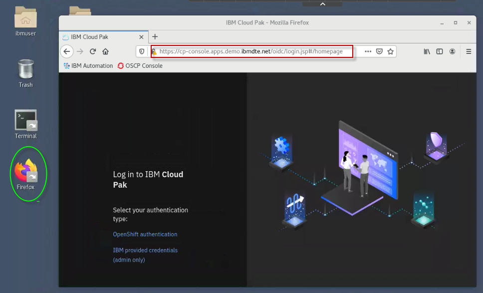
	
	 

2.  On the login page, select the **OpenShift authentication** as the    authentication type.

    **Note:** If using Firefox, enlarge the browser window until you see the graphics, as illustrated below. 

     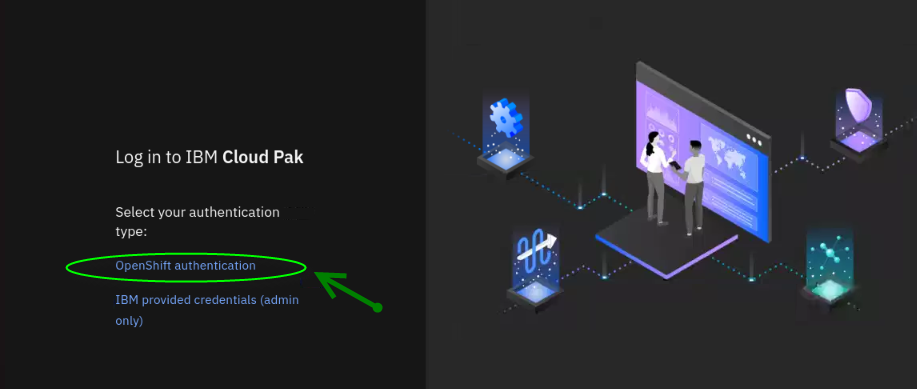
 
     **Note:** If necessary, accept all the warnings and certificates.  Depending on your browser, you might have to scroll down to permit
 access.

     
	
3. Select **htpasswd** as the login selection
  
    
	
	 

4.  Enter **ibmadmin** as username and **engageibm** as password. And click **Log In**.

    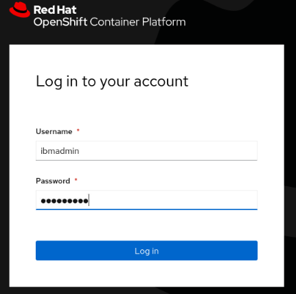

     

5.  The ***IBM Automation Welcome page*** appears.

    

     
	
6.  View the Application Runtimes that have been registered with IBM Automation

    a. Click on the**Navigation Menu** icon located at the upper left corner of the page

      

    b. Click **Operate**, and then click **Application runtimes**.
  
    Application Runtimes represent the Traditional WebSphere and WebSphere Liberty servers that have been registered with IBM Automation

      

       

7. The **Application runtimes – Security** page appears. There should be no data since there not any WebSphere / Liberty servers registered yet.

     

      

8.  Before you start to register servers to the Dashboard, you need to configure an email to received notifications about CVEs.
    
    a. Select the **Notifications** menu item from the navigation list.
    
    b. Click on the Email addresses tab, to add your email address where notifications of new CVEs will be delivered

    
	
	 
	
9.  The Email server configuration is pre-configured for this lab. You only need to add your personal email to receive notifications of new security vulnerabilities.
    
    a. Click the **Add** buttton
    
    b. Enter your **email address**
    
    c. Click **Save**

    

**Great\!** Your email is configured to receive security notifications.

In the next section, you will register servers to WebSphere Automation.

 

## PART 2: Getting configuration parameters needed to register WebSphere / Liberty servers to IBM Automation

Add each of your WebSphere Application Server and WebSphere Liberty servers to WebSphere Automation by registering them with the **usage metering** service.

To register your application servers with the usage metering service in WebSphere Automation, you must configure the usage metering feature in each application server. To configure the usage metering feature in each of your application servers, you must obtain the following usage metering details:

  - **URL**: The URL of the usage metering service in WebSphere Automation. This service registers WebSphere Application Server and Liberty servers with WebSphere Automation so that you can track security vulnerabilities.

  - **API Key**: The token used to authenticate the WebSphere Application Server and Liberty servers during the registration process.

  - **Usage metering certificate**: The certificate that contains the public key. This key allows an application server that is registering with WebSphere Automation to do an SSL handshake with the metering service.

In this section, you will get these configuration parameters that will be used to register application servers.

1.  Return to the desktop and open a new **terminal** window.

    
	
	 

2.  Login to the OpenShift Cluster using the oc CLI command shown below:

        oc login --username=ibmadmin --password=engageibm --insecure-skip-tls-verify=true --server=https://api.demo.ibmdte.net:6443

       
	
	 

3.  Make sure that the project you are working on is **websphere-automation**:

        oc project websphere-automation

    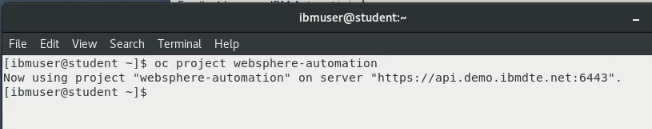

     

4.  Use the **oc** command to get the URL of the usage metering service in WebSphere Automation and save it to a file  “/opt/IBM/WebSphere/metering-url.txt”

        echo https://$(oc get route cpd -n websphere-automation -o jsonpath='{.spec.host}')/websphereauto/meteringapi > /opt/IBM/WebSphere/metering-url.txt

5.  View the contents of the saved file to ensure the URL was captured.

        cat /opt/IBM/WebSphere/metering-url.txt

    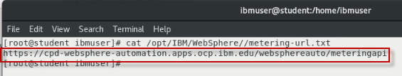
	
	 

6.  Get the **api-key** that will be used to authenticate the WebSphere Application Server and Liberty servers during the registration process. Save it to a file named “/opt/IBM/WebSphere/api-key.txt”

        oc -n websphere-automation get secret wsa-secure-metering-apis-encrypted-tokens -o jsonpath='{.data.wsa-secure-metering-apis-sa}' | base64 -d > /opt/IBM/WebSphere/api-key.txt; echo >> /opt/IBM/WebSphere/api-key.txt

7.  View the contents of the saved file to ensure the api-key (token) was captured.

        cat /opt/IBM/WebSphere/api-key.txt

     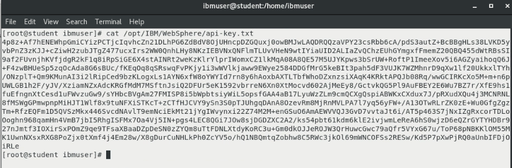
	 
	  

8.  Finally, get the Server certificate that is used for SSL handshake between the servers and IBM Automation, and save it to a file named “/opt/IBM/WebSphere/cacert.pem”

        oc get secret external-tls-secret -n websphere-automation -o jsonpath='{.data.cert\.crt}' | base64 -d > /opt/IBM/WebSphere/cacert.pem

9. View the contents of the saved file to ensure the api-key (token) was captured.

        cat /opt/IBM/WebSphere/cacert.pem

    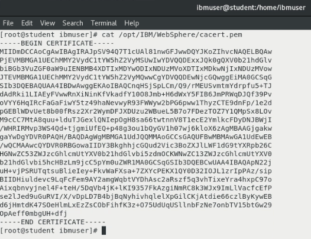

**Great\!** Now you have all the configuration parameters necessary to register the application servers with the usage metering service in WebSphere Automation.

|         |           |  
| ------------- |:-------------|
|    | <strong>For more information:</strong>   For additional details, view the section titled: <strong>Setting up security monitoring</strong> in the WebSphere Automation on-line documentation, or download it as a PDF from this URL: [https://www.ibm.com/docs/en/ws-automation](https://www.ibm.com/docs/en/ws-automation)|

In the next section, you register your first server in WebSphere Automation.

 

## Part 3: Working with Traditional WebSphere servers with IBM Automation – Security Vulnerabilities

You can view the security vulnerability status of each server in your inventory from the Security page in the WebSphere Automation UI. 
For each server, the numerical risk level in the range 0 - 10 represents the highest CVSS value of its CVEs.

To set up security monitoring, add each of your WebSphere Application Server servers and WebSphere Liberty servers to WebSphere Automation by registering them with the usage metering service. 

You can then track security vulnerabilities for your servers from a single user interface (UI) in WebSphere Automation.

To register your application servers with the usage metering service in WebSphere Automation, you must configure the usage metering feature in each application server. 

In Part 3 of the lab, you will perform the following task for WebSphere Traditional servers in IBM Automation. 

1.	**Register a WebSphere traditional application server** (tWAS), version 9.0.5.7 to IBM Automation, using the URL, API Key, and usage Metering Certificate that you gathered in the previous section of the lab. 

    Once registered, you will immediately see the list of all unresolved CVEs and applied IFixes for the server. 

2.	**Resolve the known Log4J vulnerabilities in the WebSphere traditional application server**, by applying the appropriate IFix documented in the security bulletin for this vulnerability. 

    Once the IFix is applied, IBM Automation immediately updates the security information for that application server, showing that the critical Log4J vulnerabilities have been patched. 

3.	**Review the security posture and Fix History of the WebSphere servers**

Once you have patched one of the WebSphere servers, view the Fix History and security posture as it relates to resolved and unresolved CVEs. Here you see the Risk Level for the servers, how long servers are exposed to vulnerabilities, and when CVEs were resolved.  

4.	**Optionally, remove the IFix from the WebSphere traditional application server.** 

    Once the IFix is removed. IBM Automation immediately updates the security vulnerability information for that application server, once again showing its unresolved CSVs for the Log4J vulnerabilities.  

     

## 3.1 Register traditional WebSphere (tWAS) v9.0.5.7

In this section, you configure a traditional WebSphere Application Server to your WebSphere Automation dashboard. With traditional WebSphere, you use the wsadmin script to configure the usage metering service.

1.  First, let’s start the traditional WebSphere (tWAS) 9.0.5.7 server. Return to the terminal window and execute the command below:

        /opt/IBM/WebSphere/AppServer9057/bin/startServer.sh tWAS_9057_server

    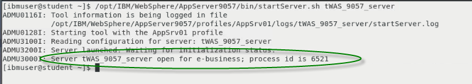
	
	 

2.  Configure usage-metering using the wsadmin script below:

    The wsadmin command invokes a Python script named **configuretWasUsageMetering.py**. The script requires the same **url** and **apiKey** that you gathered earlier from the IBM automation environment. These parameters are captured from the text files that you saved earlier in the lab and inserted into the url and apiKey parameters.

        /opt/IBM/WebSphere/AppServer9057/bin/wsadmin.sh -f /api-usagemetering/scripts/configuretWasUsageMetering.py url=$(cat /opt/IBM/WebSphere/metering-url.txt) apiKey=$(cat /opt/IBM/WebSphere/api-key.txt) trustStorePassword=th1nkpassword

    The script should run successfully as illustrated below.

    
	
	 

    Great, you first traditional WAS server is configured. Let’s check the WebSphere Automation dashboard. 

     

3.	Go back to the browser, navigate to the **Security -> Servers** dashboard, and confirm that the tWAS v9.0.5.7 server was registered in IBM Automation.

    
 
    You should see that this server Risk Level is 10.0, with 14 or more unresolved CVEs. 

    **Note:** Somewhere at the top of that list is the much talked about LOG4J vulnerability, known as CVE-2021-44228, with a critical score of 10.  
 

	|         |           |  
    | ------------- |:-------------|
    |    | <strong>TIP:</strong>  <strong>Note:</strong> New vulnerabilities are discovered constantly, so the number of CVEs discovered may be different than illustrated.
    
     
 
4.  Check your email. A mail notification was sent showing new vulnerabilities for the registered application server.

    

	|         |           |  
    | ------------- |:-------------|
    |    | <strong>Information:</strong>  In the email message, there will be a link that would redirect to the console to show more details on the vulnerability. However, Because of network restrictions in the lab environment, this link will not work. 

     

## 3.2 Register traditional WebSphere (tWAS) v9.0.5.6

In this section, use a provided script to register an additional traditional WebSphere server. This WAS server is version 9.0.5.6. This server will be used later in the lab as you view the fix history of your WAS servers.

1.  From a terminal window, run the script, passing in the argument “**9056**” to indicate to register the tWAS 9.0.5.6 server:

    > **Note:** The script performs the same steps to register the 9056 server that you followed while registering the 9057 WebSphere server. Then the script starts the 9056 server.

        /home/ibmuser/WAS-Automation-LabFiles/lab1-CVE/register-was-server.sh 9056

    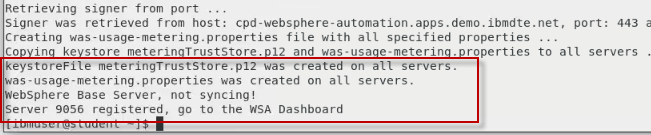

Great, your traditional WebSphere server is configured. Let’s check the WebSphere Automation dashboard.

2.  Go back to the browser, navigate to the **Security -\>** **Servers** dashboard, and confirm that the tWAS v9.0.5.6 server was registered in IBM Automation.

    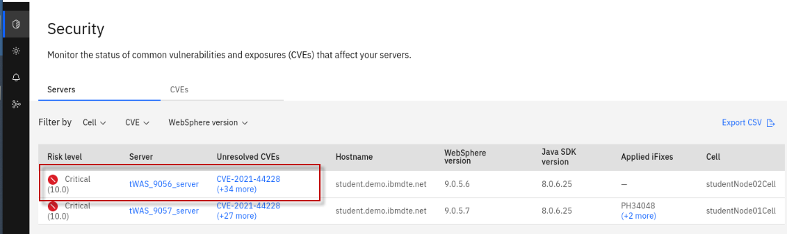

    You should see that this server Risk Level is 10.0, with 14 or more unresolved CVEs.
 
    > **Note:** Somewhere at the top of that list is the much talked about **LOG4J vulnerability**, known as **CVE-2021-44228**, with a critical score of **10**.

## 3.3 Review CVE-2021-44228 to understand the remediation options for the LOG4J vulnerability

In this section, you will review the details of the critical (10.0) **CVE-2021-44228** CVE and determine the appropriate remediation options to resolve the CVE.

In this lab, you will apply the iFix that is documented in the IBM security bulletin to resolve the Log4J vulnerability in the traditional WebSphere 9.0.5.7 server, as reported in **CVE-2021-44228**.

1.  Notice in the IBM Automation console that tWAS 9.0.5.7 is vulnerable to CVE-2021-44228.

    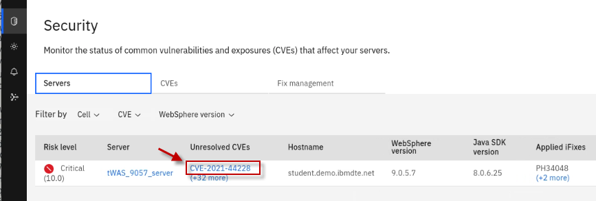

2.  Click on **(+ \<NUMBER\> more)** to expand the list of unresolved CVEs. 
    
    IBM Automation also detected the additional unresolved CVEs related to the Log4J vulnerability, which are highlighted below and documented in the security bulletin.

    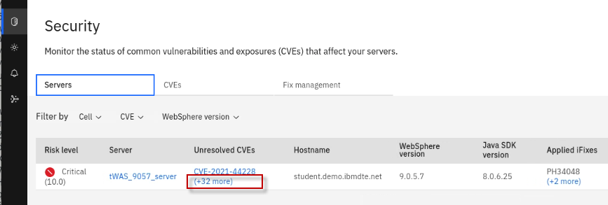
 
    As noted in the IBM security bulletin, which you will explore next, there are three CVEs related to the LOG4J vulnerability. They are highlighted below in the list of Unresolved CVEs for this WebSphere server.
 
    

3.  After viewing the complete list of unresolved CVEs for the 9057 server, close the “**Unresolved CVEs**” view.

4.  View the security bulletin(s) for the **CVE-2021-44228** Log4J vulnerability

    a.  Click on **CVE-2021-44228** link under the 9057 servers **Unresolved CVEs** column

    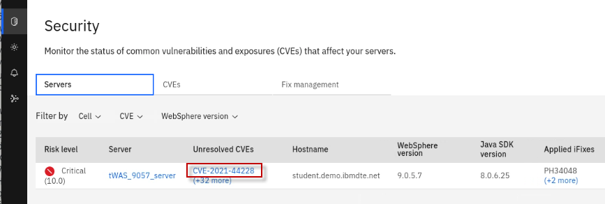

    From the CVE Information page that is displayed, you can see important details about this CVE.

    <u>Here you can see the following details:</u>

    - Risk Level “Critical (10)

    - Date the vulnerability was detected in the “**registered**” server

    - Number of days the 9057 WebSphere server has been “**exposed**” to the vulnerability

    - List of affected servers that are registered with IBM WebSphere Automation.

    - Link to the IBM security bulletin for the CVE

    > **Note:** The **Days Exposed** and **date detected** are expressed from the point of time that the server is registered with IBM WebSphere Automation.

    b.  Click on the **View** Link to view the IBM security bulletin for this CVE.

    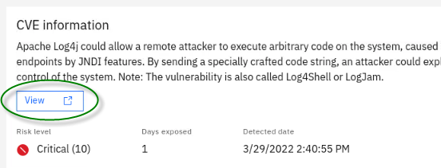

    c.  The security bulletin is displayed in a new browser tab.

    d.  Review the security bulletin to learn about the vulnerability, versions of WebSphere affected, and options for remediating the vulnerability.

    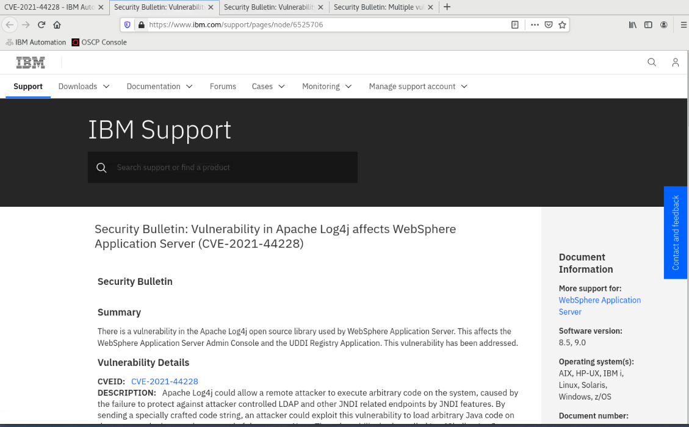
 
    As you see, IBM WebSphere Automation makes it easy for you to get to the related security bulletins directly from the CVE information within the WebSphere Automation dashboard so you can have all the details and remediation options at your fingertips

    > **Note:** The IBM Security Bulletin associated with this vulnerability documents the options for remediating CVE-2021-44228 and related CVEs (CVE-2021-4104 and CVE-2021-45046)

    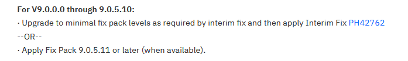

    You can read the security bulletins from the **ibm.com/support** pages. You may be prompted to login using your IBM ID to access the content:

    <https://www.ibm.com/support/pages/node/6525706>

    <https://www.ibm.com/support/pages/security-bulletin-multiple-vulnerabilities-apache-log4j-affect-ibm-websphere-application-server-and-ibm-websphere-application-server-liberty-cve-2021-4104-cve-2021-45046>

5.  Return to the Browser tab that contains the IBM WebSphere Automation dashboard. Then return to the “**Security**” view

    

## 3.4 Update tWAS server v9.0.5.7 to fix the LOG4J vulnerability

In this section, you will apply an iFix to the traditional WebSphere 9.0.5.7 server to resolve the Log4J vulnerability reported in **CVE-2021-44228**.

You will resolve the related CVEs by applying the appropriate iFix that is documented in the IBM security bulletin: **(PH42762)**

1.  First, stop the server, wait until it has stopped:

        /opt/IBM/WebSphere/AppServer9057/bin/stopServer.sh tWAS_9057_server

    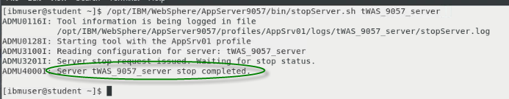
	
     
	
2.  Run the following script to install the iFix:

        sudo /iFix/PH42762-LOG4J/imcl_ifix_install.sh 9057

    When prompted for the password for the ibmadmin user, enter: **engageibm!**

    
	
	 

3.  Start the server once the iFix installation has completed:

        /opt/IBM/WebSphere/AppServer9057/bin/startServer.sh tWAS_9057_server

4.  Go back to the WebSphere Automation dashboard. Notice that the CVE-2021-44228, CVE-2021-4104, and CVE-2021-45046 were removed from the unresolved CVEs list for the tWAS 9.0.5.7 server.

    

     

5.	Also, you can see on the right under “Applied iFixes” the PH42762 fix is now listed as applied. 

    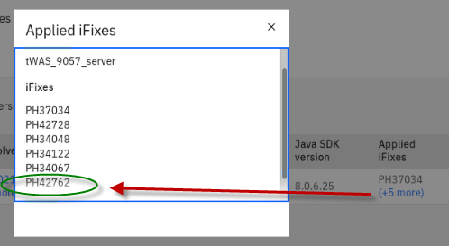

     

## 3.5 View the security posture and Fix History of your WebSphere servers

## **Fix history**

Information technology operations teams must be responsive to the latest security vulnerabilities. A patching service-level agreement (SLA) requires that an operations teams fix vulnerabilities within 30, 60 or 90 days (or faster) based on vulnerability severity.

Therefore, it is vital to be able to demonstrate the date that a vulnerability was detected, and the date that the fix was applied. WebSphere Automation provides a detailed history of fixes applied to each registered server, including information about when each issue was detected, when and how it was fixed, and how many days servers were exposed.

A record of all detected security vulnerabilities (CVEs) and the resolution status makes it easy to respond to patching SLA inquiries. WebSphere Automation keeps track of when vulnerabilities were detected, when and how they were fixed, and how many days servers were exposed.

In this section, you will review the security posture and fix history of the two traditional WebSphere servers used in the lab to demonstrate how WebSphere Automation manages the details so you can handle your patching SLAs with ease.

Now that you have applied the PH42762 iFix, lets examine the updated security posture of the 9057 WebSphere server.

1.  View the tWAS_9057_server CVE Information
    
    a. From the **Security** view in the WebSphere Automation dashboard, click on the **tWAS_9057_server** link located under the **Server** column

    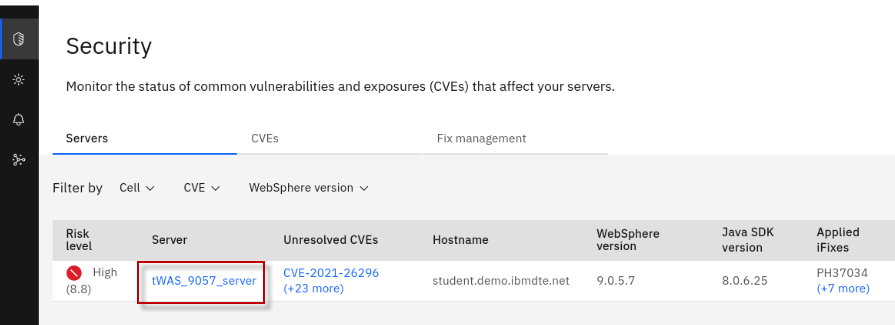
  
    b.  Select the **Information** tab

    

    c.  From the **Information** view, you can see the list of Installed IFixes for the 9057 server.

    
 
    > Notice that the **Fixed date** for the iFixes related to the Log4J vulnerability show that they were installed moments ago.
    > 
    > However, there are additional iFixes that do not have a Fixed date. That is because these fixes were already applied to the server prior to it being registered with IBM WebSphere Automation.

    |                                                |                                                                                                                                                                                                                                                                                                                           |
    | ---------------------------------------------- | ------------------------------------------------------------------------------------------------------------------------------------------------------------------------------------------------------------------------------------------------------------------------------------------------------------------------- |
    |  | IBM WebSphere Automation reports ALL iFixes that have been applied, regardless of when they were applied. However. It can only determine fix dates, number of days the server was vulnerable, and vulnerability detected date for servers from the time the WebSphere server is registered with IBM WebSphere Automation. |

2.  View the tWAS_9057_server CVE Vulnerabilities details
    
    a.  From the tWS_9057_server view, select the **Vulnerabilities** tab

    

    b. From the list of CVEs, sort by **Status**, and display the **Resolved CVEs** on top

    
 
    The CVEs that are listed as Resolved are all the related Log4JCVEs that were fixed by applying the iFix moments ago; **CVE-2021-44228**, being the most critical CVE listed.
 
    As illustrated above, the **Vulnerabilities view** provides the details about when the vulnerability was detected in this specific server, and how many days the server has been exposed to each vulnerability.

3.  View the tWAS_9057_server Fix History details
    
    a.  From the tWS_9057_server view, select the **Vulnerabilities** tab
    
    b. Select **Fix History**, as illustrated below:

    

4.  Notice the Fixes that have been applied

    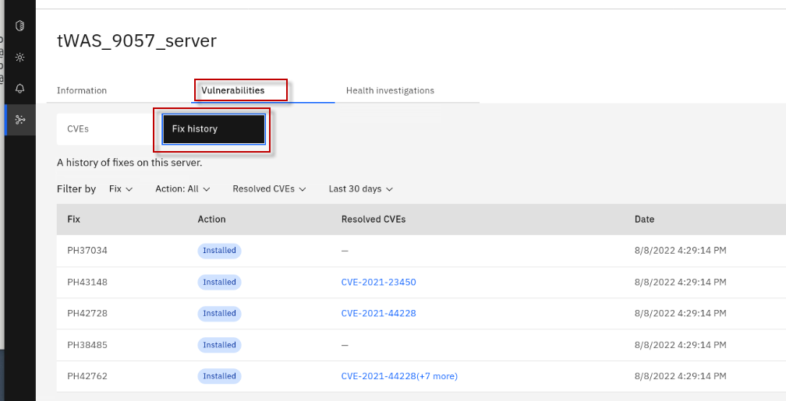

    **Fix history** shows changes to the server. You can see the action that was taken, and in this case, the Fixes were “**Installed**”. Next to each Fix you can view the CVEs that were resolved by that Fix, and very importantly, the date that the Fix was applied that resolved specific vulnerabilities.
 
    Having this record of all detected security vulnerabilities (CVEs) and the resolution status makes it easy to respond to patching SLA inquiries. WebSphere Automation keeps track of when vulnerabilities were detected, when and how they were fixed, and how many days servers were exposed.

5.  You can also monitor the status of common vulnerabilities and exposures (CVEs) that affect your servers
    
    a.  Return to the **Security** view. Then select on the **CVEs** category

    
 
    > Using this view, you can easily determine which servers are affected by specific CVEs.
    >  
    > As an example, let’s focus on CVE-2021-44228. This is one of the CVEs that was fixed in the tWAS_9057_server when you applied the iFix earlier in the lab.
    > 
    > However, you also registered a second WebSphere server that is subject to the same Log4J vulnerabilities in which you did not install the iFix; **tWAS_9056_server**.
    >
    > This CVEs view helps your team quicky identify how many servers have been fixed, and how many remain exposed to specific CVEs.

    b. View the CVE-2021-44228 CVE from the current view. Notice that only one of two servers are patched for this CVE.

    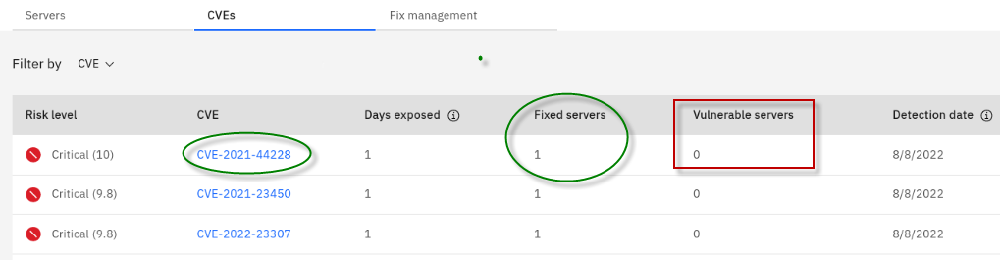

6.  Identify the WebSphere servers that this CVE is still unresolved.
    
    a.  Click on the **CVE-2021-44228** link under the **CVE** column

    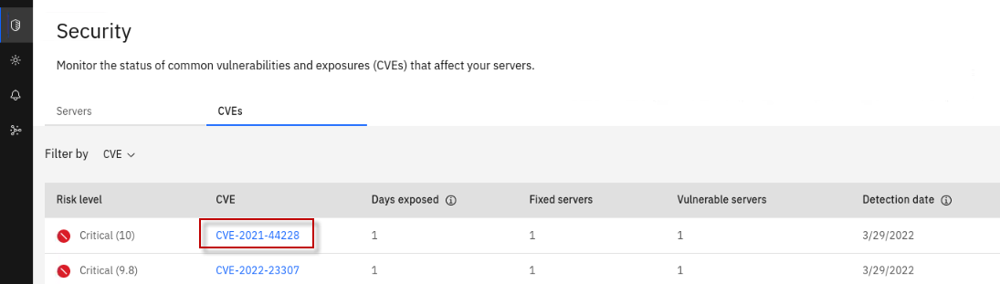

    b.  Note the **tWAS_9056_server** Vulnerability Status is “**Unresolved**” and needs to be patched. You will **not** patch this server in the lab.

    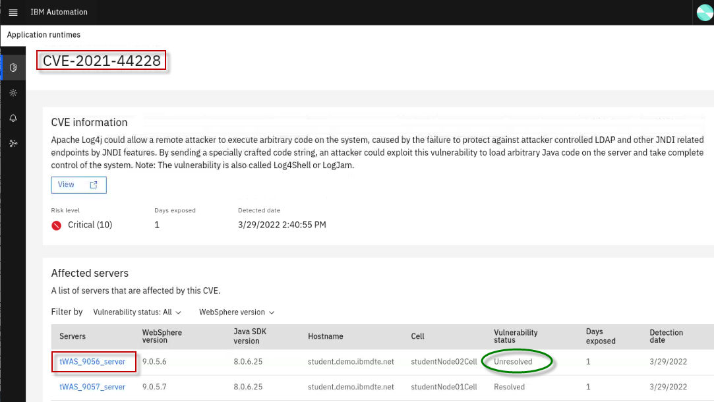

    In this section you have learned how easy IBM Automation makes it for your Information technology operations teams to be responsive to the latest security vulnerabilities, ensuring that there is a record of patching critical CVEs in accordance with your patching service-level agreement (SLA.

    You learned how to demonstrate when the date that a vulnerability was detected, and the date that the fix was applied. WebSphere Automation provides a detailed history of fixes applied to each registered server, including information about when each issue was detected, when and how it was fixed, and how many days servers were exposed.

## 3.6 Update tWAS server v9.0.5.7 to re-introduce the vulnerability and recheck the security posture of the server

You can remove the iFix that was applied to confirm that the CVE-2021-44228 shows up in the unresolved CVE list.

By doing so, IBM WebSphere Automation records this action and tracks when a fix is Uninstalled, and a server becomes vulnerable to a CVE once again. 

1.  Stop the server:

        /opt/IBM/WebSphere/AppServer9057/bin/stopServer.sh tWAS_9057_server

2.  Uninstall the iFix:

        sudo /iFix/PH42762-LOG4J/imcl_ifix_uninstall.sh 9057

    When prompted for the password for the ibmadmin user, enter: **engageibm!**

     

3.  Start the server:

        /opt/IBM/WebSphere/AppServer9057/bin/startServer.sh tWAS_9057_server

4. Go back to the WebSphere Automation Dashboard on your browser. Notice that CVE-2021-44228, CVE-2021-4104, and CVE-2021-45046 are once again listed as unresolved CVEs for the tWAS 9.0.5.7 server.

    

5.  Check the servers now exposed to CVE-2021-44228
    
    a.  Return to the **Security** view. Then click on **CVEs** category. Notice that two servers are now vulnerable this CVE.

    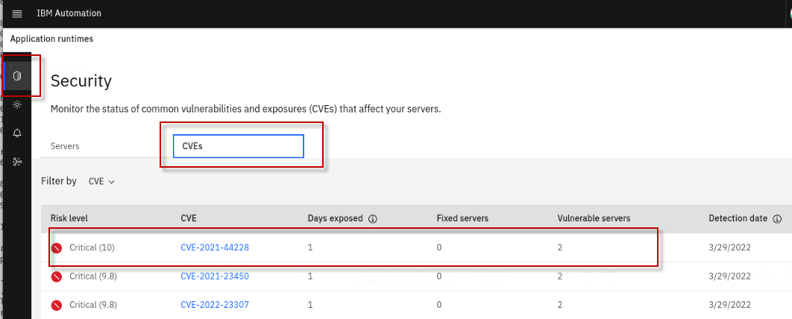

    b. Click on the CVE-221-44228 link under the CVE column to list the vulnerable servers

    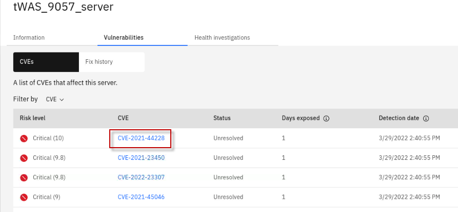

    c. The CVE information for CVE-2021-44228 is displayed, as illustrated below. 

    > With this view, you can easily identify the exact servers that are vulnerable to the unresolved CVE. 

     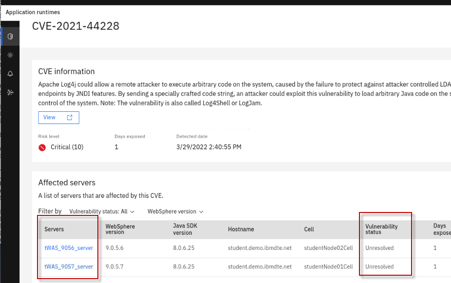

    d.  Click on the **tWAS_9057_server** link under the **Servers** column. Then select Fix History to view the latest actions for that server

    > Note the Action of **Uninstalled** next to the FIXES that have been uninstalled by uninstalling the iFix

    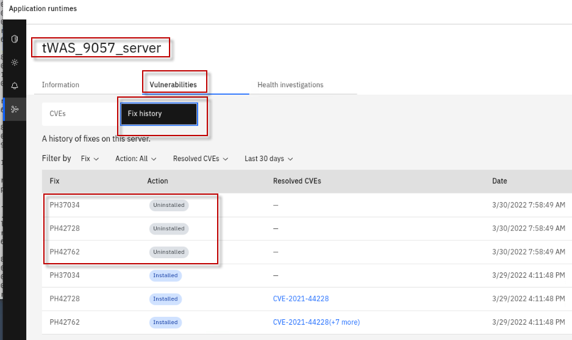
    
     

## Part 4: Working with WebSphere Liberty servers in IBM Automation

Registering WebSphere Liberty servers with IBM automation requires that they also register to the usage metering service as WebSphere traditional application servers. While the requirement is the same, the process in which WebSphere Liberty servers register with the metering service is quite different than WebSphere traditional. 

In Part 4 of the lab, you will perform the following task for WebSphere Liberty servers with IBM Automation. 

1.	**Register a WebSphere Liberty to IBM Automation**, using the URL, API Key, and usage Metering Certificate that you gathered in Part 2 of the lab. 

    Once registered, you will immediately see the list of all unresolved CVEs and applied IFixes for the server. 

2.	**Resolve an identified vulnerabilities in the WebSphere Liberty server**, by applying the appropriate IFix documented in the security bulletin for this vulnerability. 

    Liberty servers on the distributed platform are not vulnerable to the well-known log4J vulnerabilities. However, you will resolve a critical vulnerability in the WebSphere Liberty server. 

    Once the IFix is applied, IBM Automation immediately updates the security information for that Liberty application server, showing that the critical vulnerability has been patched.  

 3.	Review the security posture and Fix History of the WebSphere servers.

     Once you have patched one of the Liberty servers, view the Fix History and security posture as it relates to resolved and unresolved CVEs. Here you see the Risk Level for the servers, how long servers are exposed to vulnerabilities, and when CVEs were resolved.  
   

     

## 4.1 Configuring Liberty server v20.0.0.9

In this section, you configure Liberty Server version 20.0.0.9 to register to WebSphere Automation. Since Liberty servers are easily created, you will first create a new Liberty server and start it.

1. Create a new Liberty server, version 20.0.0.9, using the command below:

        /opt/IBM/WebSphere/Liberty20009/bin/server create Liberty_20009_server

    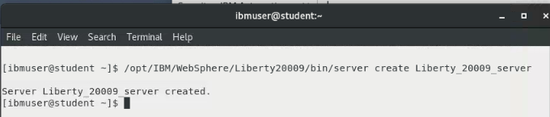

	 

2.  Now you need to configure the server to use TLS/SSL using the provided server_tls.xml file:

        sudo \cp -f /home/ibmuser/Desktop/lab_backup/liberty20009/server_tls.xml /opt/IBM/WebSphere/Liberty20009/usr/servers/Liberty_20009_server/server.xml

    When prompted for the password for ibmuser, enter: **engageibm!**

	 

3.  Start the Liberty server:

        /opt/IBM/WebSphere/Liberty20009/bin/server start Liberty_20009_server

    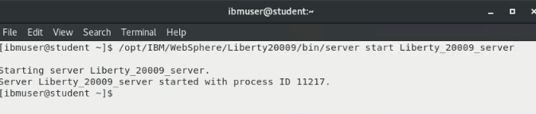

	 

4.  Now, you need to update the DefaultKeyStore with the server certificate to trust the server for https connection:

    The command below will import the “**cacert.pem**” file, that you saved in part 2 of the lab, into the Liberty trust store, thereby trusting the server for secure HTTPS connections from IBM Automation.

  
        keytool -import -trustcacerts -file /opt/IBM/WebSphere/cacert.pem -keystore /opt/IBM/WebSphere/Liberty20009/usr/servers/Liberty_20009_server/resources/security/key.p12 -storetype PKCS12 -storepass th1nkpassword -noprompt

    

     

5.  Configure the usage metering in the new server. This is configured in the Liberty **server.xml** file.
    
    a. Open the server.xml file using the “**gedit**” editor

        gedit /opt/IBM/WebSphere/Liberty20009/usr/servers/Liberty_20009_server/server.xml

    b.  Add the **usageMetering-1.0** feature to the existing features in the <featureManager\> element, as illustrated below:

        <feature>usageMetering-1.0</feature>
		
	
    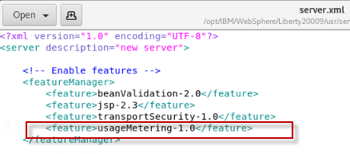
	 

    c.  In the server.xml file, add the **usageMetering** element below:

        <usageMetering url="${metering-url}" apiKey="${api-key}" sslRef="defaultSSL"/>
    	
	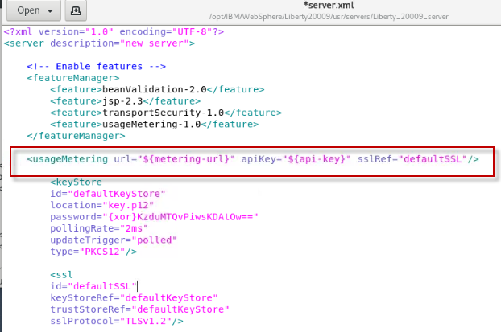

	 

6.  **Save** and **Close** the server.xml file.
   
     

7. Create a **bootstrap.properties** file for the Liberty server that contains the variable values for  **metering_url** and **api_key** that are defined in the server.xml file. Using variables will make it easier to add the configuration to the Liberty server. 

        echo "metering-url=$(cat /opt/IBM/WebSphere/metering-url.txt)" >> /opt/IBM/WebSphere/Liberty20009/usr/servers/Liberty_20009_server/bootstrap.properties

        echo "api-key=$(cat /opt/IBM/WebSphere/api-key.txt)" >> /opt/IBM/WebSphere/Liberty20009/usr/servers/Liberty_20009_server/bootstrap.properties

8.	Use the **cat** command to view the contents of the **bootstrap.properties** file to ensure it has proper values assigned to the variables

        cat /opt/IBM/WebSphere/Liberty20009/usr/servers/Liberty_20009_server/bootstrap.properties

    The **metering-url** and **api-key** variables should have values as illustrated below. 

    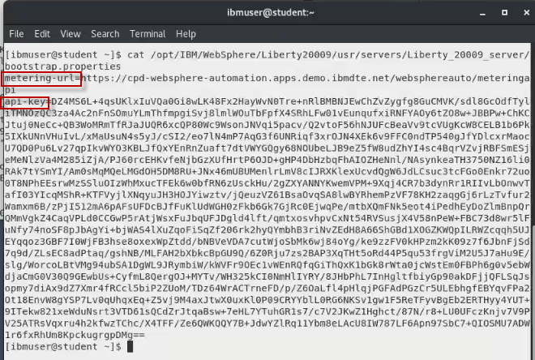

      
	
9.	Restart the Liberty server so that it can be initialized with the bootstrap.properties file. 

    **Note:** Use the **--clean** option when starting the Liberty server, to clear any cached data. 

        /opt/IBM/WebSphere/Liberty20009/bin/server stop Liberty_20009_server

        /opt/IBM/WebSphere/Liberty20009/bin/server start Liberty_20009_server --clean

    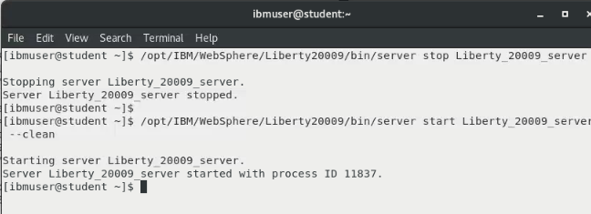

     

10.	View the Liberty server “**messages.log**” file and find the message indicating that the server was registered to the metering service.  

        tail /opt/IBM/WebSphere/Liberty20009/usr/servers/Liberty_20009_server/logs/messages.log

    

      

    The Liberty009 server is now successfully registered with IBM Automation, and should be displayed in the IBM Automation Dashboard under Application runtimes > Security - Servers.

     

11. Go back to the browser, navigate to the **Security -> Servers** dashboard, and confirm that the Liberty_20009_server was registered in IBM Automation
    
   
    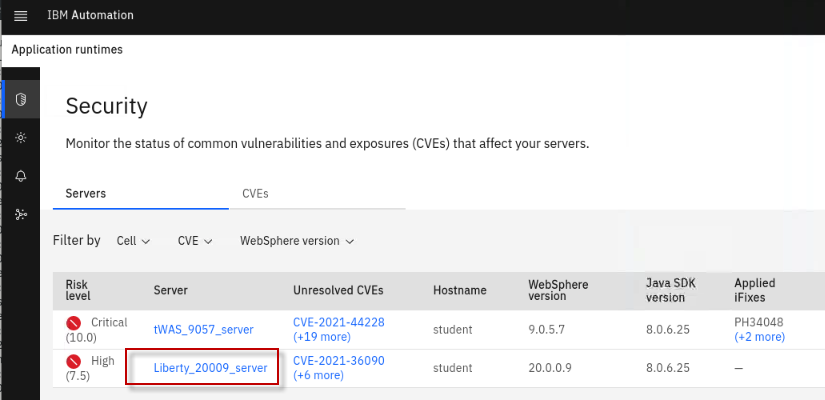
	
	 

    |         |           |  
    | ------------- |:-------------|
    |    | <strong>IMPORTANT:</strong>    If the IBM Automation UI does not automatically detect the Liberty server that you registered, then it is extremely likely that the server.xml file or the bootstrap.properties file has not been configured correctly.    1. Review the <strong>server.xml</strong> configuration.   &nbsp;&nbsp;&nbsp;&nbsp;- Ensure the <strong>usageMetering-1.0</strong> feature is included in the list of features.    2. Review the **bootstrap.properties** file  &nbsp;&nbsp;&nbsp;&nbsp;- Ensure the usageMetering <strong>url</strong> is CORRECT. No additional characters or spaces.   &nbsp;&nbsp;&nbsp;&nbsp;- Ensure the usageMetering <strong>apiKey</strong> is CORRECT. No additional characters or spaces. 

    If the Liberty server was successfully registered, it is displayed in the Application Runtimes in IBM automation UI.

    |         |           |  
    | ------------- |:-------------|
    |    | <strong>TIP:</strong>   <strong>Note:</strong> New vulnerabilities are discovered constantly, so the number of CVEs discovered may be different than illustrated.

    The dashboard shows that this server is vulnerable for some unresolved CVEs.

     

12.	Click on the “**+6 more**” under the Unresolved CVEs for the Liberty_20009_server, to see the list of the unresolved CVEs, including the CVE-2020-10693.

    Note that the +6 could be different if additional CVEs have been discovered since the time of this writing. 

    

     

    a. The list of Unresolved CVEs for Liberty version 20.0.0.9 should include CVE-2020-10693

      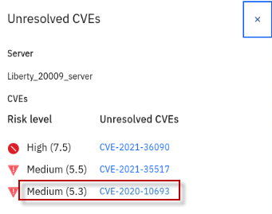

     

13. Check your email that you registered with IBM automation for a notification of new vulnerability. 

      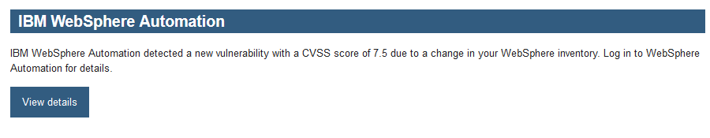

       

## 4.2 Review CVE-2020-10693 to understand the remediation options for the vulnerability

In this section, you will review the details of the critical **CVE-2020-10693** CVE and determine the appropriate remediation options to resolve the CVE.

In this lab, you will apply the iFix that is documented in the IBM security bulletin to resolve the vulnerability in the Liberty 20009 server, as reported in **CVE-2020-10693**.

1.  View the CVE information for CVE-2020-10963
    
    a. Click the **Liberty_2009_server** link under the Server column to see CVE and Fix History for this Liberty server

    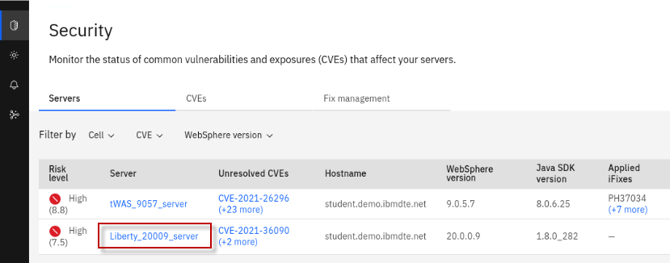

    b. Click on CVE-2020-10693 CVE located in the **Vulnerabilities > CVEs** view

    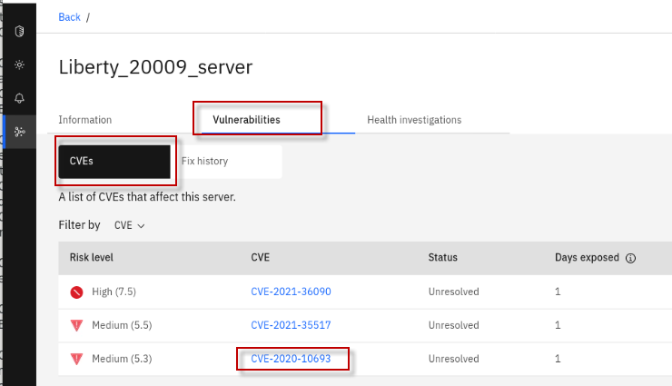

    c.  The **CVE information page** for CVE-2020-10693 is displayed.

    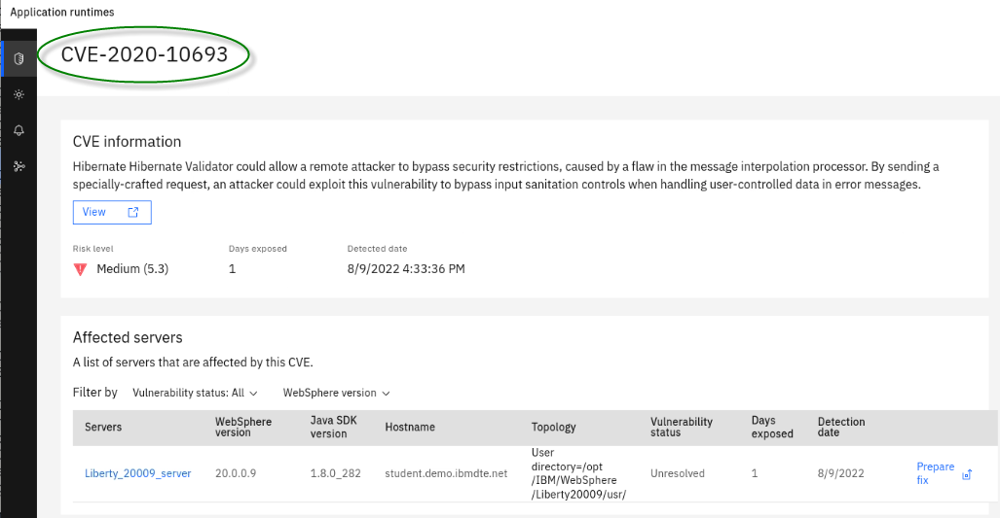

    From the CVE Information page that is displayed, you can see important details about this CVE.

    <u>Here you can see the following details:</u>

    - Risk Level “**Medium (5.3)”**

    - Date the vulnerability was detected in the “**registered**” server

    - Number of days the Liberty server has been “**exposed**” to the vulnerability

    - List of affected servers that are registered with IBM WebSphere Automation.

    - Link to the IBM security bulletin for the CVE

    > **Note:** The **Days Exposed** and **date detected** are expressed from the point of time that the server is registered with IBM WebSphere Automation.

2.  Click on the **View** Link to view the IBM security bulletin for this CVE.

    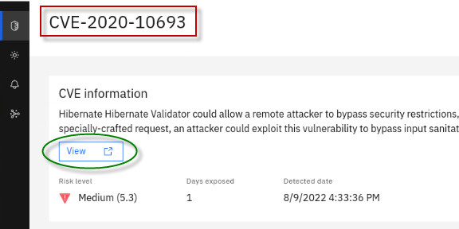
 
    The security bulletin is displayed in a new browser tab.

3.  From the Web Browser, review the security bulletin to learn about the vulnerability, versions of WebSphere affected, and options for remediating the vulnerability.

    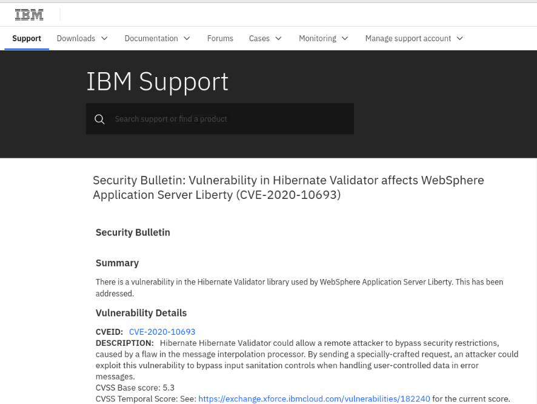

    As you see, IBM WebSphere Automation makes it easy for you to get to the related security bulletins directly from the CVE information within the WebSphere Automation dashboard so you can have all the details and remediation options at your fingertips

    > **Note:** The IBM Security Bulletin associated with this vulnerability documents the options for remediating CVE-2020-10693

    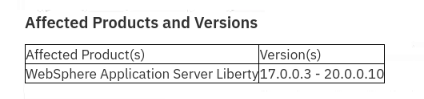

    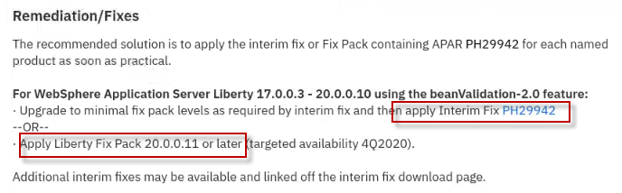

    In the next section of the lab, you will appl the Interim Fix **PH29942** to remediate the unresolved CVE.

4.  When you finish reviewing the security bulletin, return to the Browser tab that contains the IBM WebSphere Automation dashboard. Then return to the “**Security**” view

    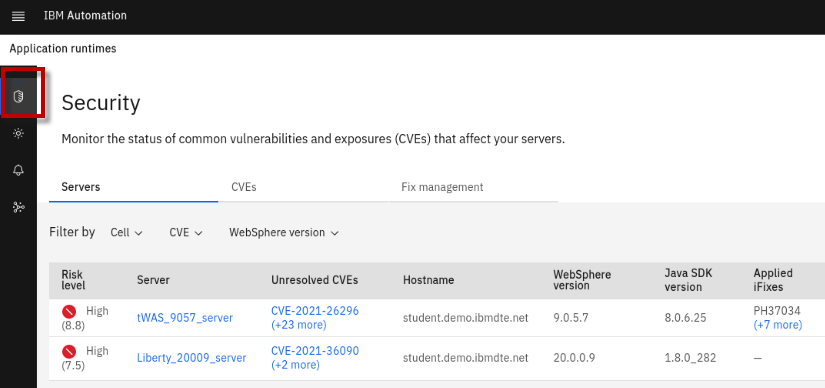

## 4.3 Update Liberty server v20.0.0.9 to fix the vulnerability

In this section, you will fix one vulnerability in our Liberty Server v20.0.0.9 by applying the HP29942 iFix to solve the vulnerability.

### Resolve the issue By Applying an iFix

Liberty 20.0.0.9 is impacted by CVE-2020-10693. This is because it configures the **beanValidation-2.0** feature. See
[CVE-2020-10693](https://www.ibm.com/support/pages/node/6348216) for more info.

Resolve the CVE by applying the recommended iFix **(PH29942)** documented in the security bulletin for this vulnerability

1.  You need to **stop** the server before the iFix can be applied. Return to the terminal window and run the command below to stop the Liberty2009 server.

        /opt/IBM/WebSphere/Liberty20009/bin/server stop Liberty_20009_server

2. Now, apply the iFix, by running the following command.

    > **Note:** We have already downloaded the iFixes used for this lab. They are stored in **/iFix** directory on the **STUDENT** VM.
    
        sudo /iFix/PH29942/imcl_ifix_install.sh 20009

    When prompted for the password for ibmuser, enter: **engageibm!**

     
	
	 

3. Great, the iFix was applied. Now, start the server again:

        /opt/IBM/WebSphere/Liberty20009/bin/server start Liberty_20009_server

4. Return to the **WebSphere Automation Dashboard.** 

    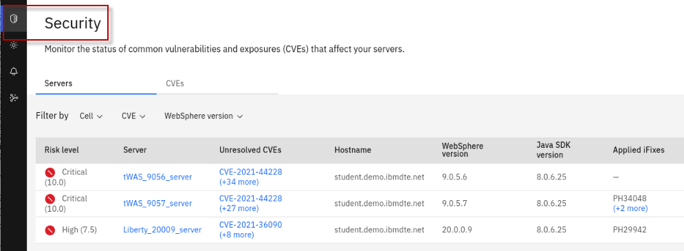
    
       
5.	Note that the IBM Automation dashboard shows the iFIX PH29942 has been applied to the Liberty_20009_server.

    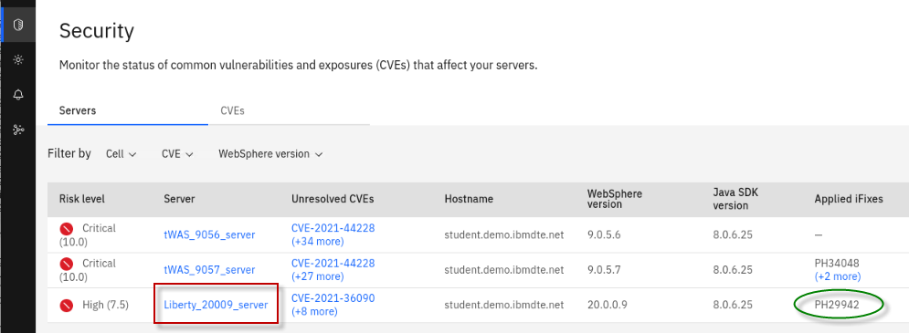

     

## 4.4 View the security posture and Fix History of your Liberty server

#### **Fix history**

Information technology operations teams must be responsive to the latest security vulnerabilities. A patching service-level agreement (SLA) requires that an operations teams fix vulnerabilities within 30, 60 or 90 days (or faster) based on vulnerability severity.

Therefore, it is vital to be able to demonstrate the date that a vulnerability was detected, and the date that the fix was applied. WebSphere Automation provides a detailed history of fixes applied to each registered server, including information about when each issue was detected, when and how it was fixed, and how many days servers were exposed.

A record of all detected security vulnerabilities (CVEs) and the resolution status makes it easy to respond to patching SLA inquiries. WebSphere Automation keeps track of when vulnerabilities were detected, when and how they were fixed, and how many days servers were exposed.

In this section, you will review the security posture and fix history of the two traditional WebSphere servers used in the lab to demonstrate how WebSphere Automation manages the details so you can handle your patching SLAs with ease.

Now that you have applied the PH29942 iFix, let’s examine the updated security posture of the Liberty server.

1.  View the Liberty_20009_server CVE Information
    
    a.  From the **Security** view in the WebSphere Automation dashboard, click on the **Liberty_20009_server** link located under the **Server** column

    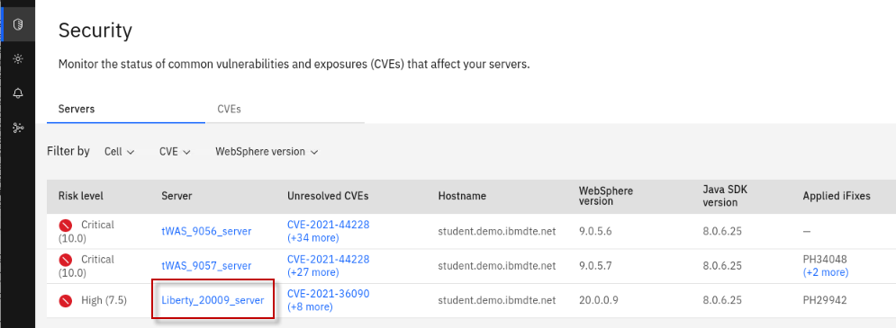

    b.  Select the **Information** tab

    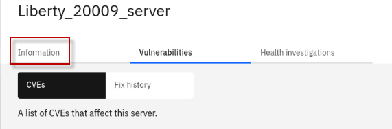

    c. From the **Information** view, you can see the list of Installed iFixes for the Liberty server.

    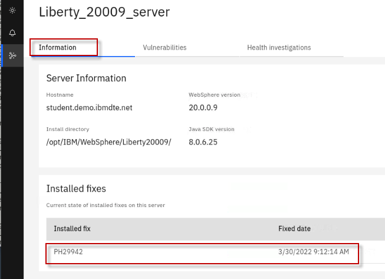
 
    Notice that the **Fixed date** for the iFixes related to the vulnerability show that it was fixed moments ago.

    <table>
    <tbody>
    <tr class="odd">
    <td></td>
    <td>
<strong>Information:</strong>

    
IBM WebSphere Automation reports ALL iFixes that have been applied, regardless of when they were applied. However. It can only determine fix dates, number of days the server was vulnerable, and vulnerability detected date for servers from the time the WebSphere server is registered with IBM WebSphere Automation.

    
If the servers already had iFIxes installed prior to being registered to IBM WebSphere Automation, they would be listed, but the installed date in not known and will be blank.
</td> 
    </tr>
    </tbody>
    </table>

2.  View the Liberty_20009_server CVE Vulnerabilities details
    
    a.  From the Liberty_20009_server view, select the **Vulnerabilities** tab

    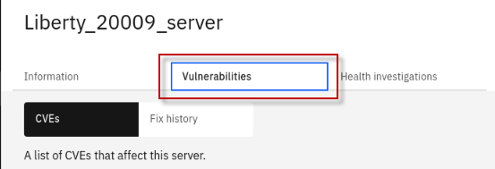

    b.  From the list of CVEs, sort by **Status**, and display the **Resolved CVEs** on top. The **CVE-2020-10693** is now **Resolved**.

    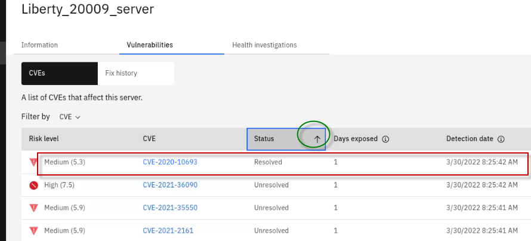
 
    As illustrated above, the **Vulnerabilities view** provides the details about when the vulnerability was detected in this specific server, and how many days the server has been exposed to each vulnerability.

3.  View the Liberty_20009_server Fix History details
    
    a.  From the Liberty_20009_server view, select the **Vulnerabilities** tab
    
    b.  Select **Fix History**, as illustrated below:

    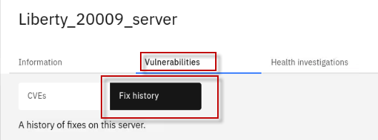

4.  Notice there is now a record that shows that the iFix has been installed, and the date te server was patched.

    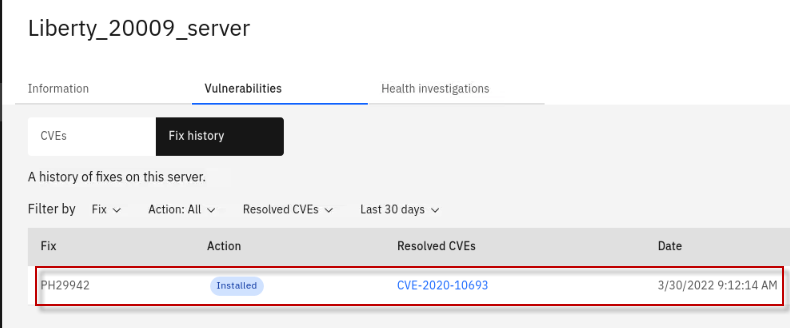
 
    **Fix history** shows changes to the server. You can see the action that was taken, and in this case, the Fixes were “**Installed**”. Next to each Fix you can view the CVEs that were resolved by that Fix, and very importantly, the date that the Fix was applied that resolved specific vulnerabilities.
 
    Having this record of all detected security vulnerabilities (CVEs) and the resolution status makes it easy to respond to patching SLA inquiries. WebSphere Automation keeps track of when vulnerabilities were detected, when and how they were fixed, and how many days servers were exposed.

5.  You can also monitor the status of common vulnerabilities and exposures (CVEs) that affect your servers
    
    a.  Return to the **Security** view. Then select on the **CVEs** category

    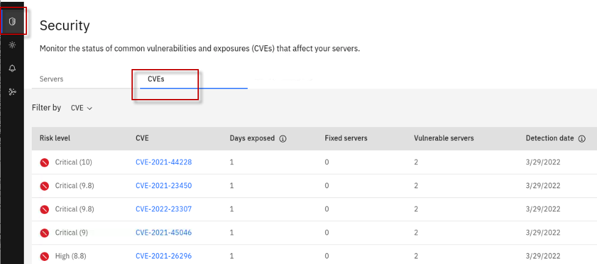
 
    Using this view, you can easily determine which servers are affected by specific CVEs.
 
    As an example, let’s focus on CVE-2020-10693. This is the CVEs that was fixed in the Liberty when you applied the iFix moments ago.
 
    This **CVEs view** helps your team quicky identify how many servers have been fixed, and how many remain exposed to specific CVEs.

    b.  Locate and view the CVE-2020-10693 CVE from the current view. Sort the list of CVEs by Fixed Servers, which will list the CVEs that have been applied to the Liberty server at the top of the list.

    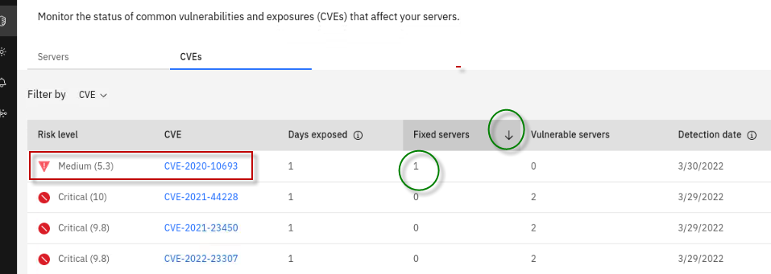

6.  Identify the Liberty servers that this CVE has been resolved, and potentially still unresolved.
    
    a.  Click on the **CVE-2020-10693** link under the **CVE** column

    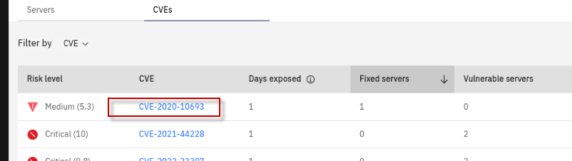

    b.  Note the **Liberty_20009_server** Vulnerability Status is “**Resolved**”.

    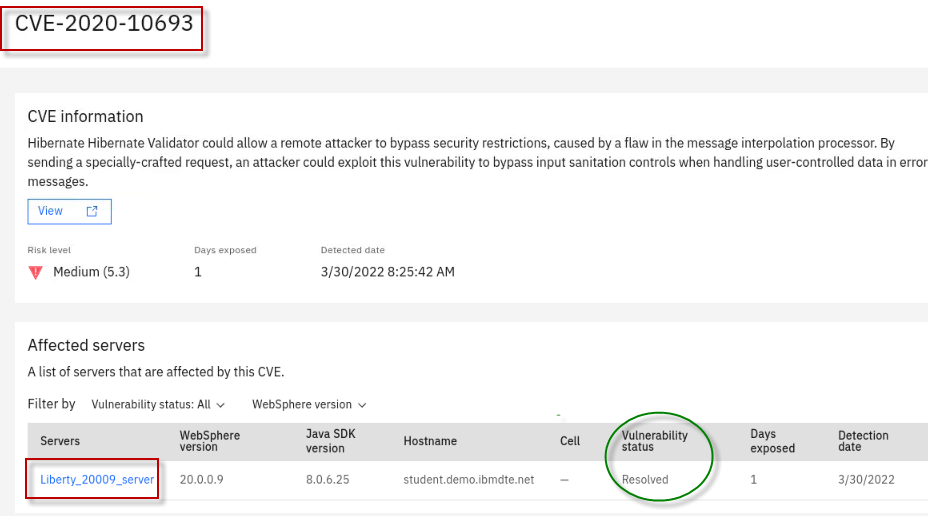

    In this section you have learned how easy IBM Automation makes it for your Information technology operations teams to be responsive to the latest security vulnerabilities, ensuring that there is a record of patching critical CVEs in accordance with your patching service-level agreement (SLA.

    You learned how to demonstrate when the date that a vulnerability was detected, and the date that the fix was applied. WebSphere Automation provides a detailed history of fixes applied to each registered server, including information about when each issue was detected, when and how it was fixed, and how many days servers were exposed.

## Summary

Congratulations! You have completed the WebSphere Automation lab.

With automated tooling and insights, IBM WebSphere Automation enables teams to modernize and secure IT estates, adapt and respond to incidents efficiently, and optimize WebSphere operations. WebSphere system operators and administrators can reduce the cost, effort, and risk of addressing vulnerabilities, automate critical activities, and preserve uptime with early detection, notification, and remediation of incidents.

You have learned how easy IBM Automation makes it for your Information technology operations teams to be responsive to the latest security vulnerabilities, ensuring that there is a record of patching critical CVEs in accordance to your patching service-level agreement (SLA. 

You learned how to demonstrate when the date that a vulnerability was detected, and the date that the fix was applied. WebSphere Automation provides a detailed history of fixes applied to each registered server, including information about when each issue was detected, when and how it was fixed, and how many days servers were exposed.

IBM WebSphere Automation helps teams remove manual toil to work less on maintenance tasks and more on strategic activities, while unlocking new value, extending the life, and increasing ROI of WebSphere investments.

IBM WebSphere Automation is part of IBM Automation, a set of shared automation services that help you get insight into how your processes run, visualize hotspots and bottlenecks, and use financial impact information to prioritize which issues to address first.

To learn more about IBM WebSphere Automation, visit
[ibm.com/cloud/websphere-automation](http://ibm.com/cloud/websphere-automation).

