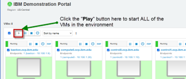
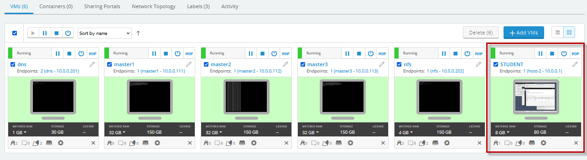
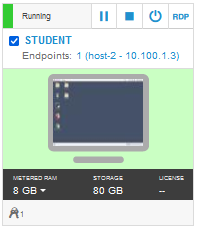

# Detect and Address Application Memory Leak with IBM WebSphere Automation

**Last updated:** August 2022

**Duration:** 60 mins

Need support? Contact **Yi Tang** and **Kevin Postreich**

## Introduction to WebSphere Automation

[IBM WebSphere
Automation](https://www.ibm.com/cloud/websphere-automation) (WSA)
is focused on delivering value into existing WebSphere Application
Server (WAS) environments, helping administrators reduce the cost,
effort, and risk of addressing common vulnerabilities, automating tasks,
and remediating capacity incidents.

It removes manual toil so that your team can spend more time innovating
while minimizing the cost of extending the life and maximizing the ROI
of your WebSphere investments.

In conversations with customers, the same three concerns come up
repeatedly. Organizations need to keep their IT estate secure and
compliant, resilient to disruption and running optimally while reducing
costs and maximizing ROI.

WSA helps organizations gain visibility, operational efficiencies, and
cost savings quickly by extending the life of WebSphere investments and
giving teams time back to focus on unlocking new value and fixing the
imbalance of pure maintenance versus innovation tasks.

  - WebSphere operators and administrators save time and embrace
    DevSecOps by implementing patches more efficiently on virtual and
    container environments to keep operations compliant and secure.

  - Enhance remediation capabilities with insights and recommendations
    to improve the speed and depth of understanding of outages and
    anomalies as they occur.

  - Augment the operational experience with access to simplified and
    consolidated information that enables teams to act.

With WSA, security, business efficiency and resiliency become standard.
IBM can meet you wherever you are in your optimization and automation
journeys to help you quickly deliver value and increase ROI, all while
laying a solid automation foundation to support future growth.

IBM WSA is available as a stand-alone offering or as an addition to IBM
Cloud Pak® for Watson AIOps. As part of IBM Automation platform, IBM
WebSphere Automation includes containerized components and common
software services on top of a common automation layer, to manage
WebSphere’s incidents, hybrid applications, and cost with complete
observability, governance, and compliance.

Deploy virtually anywhere through containers supported by Red Hat®
OpenShift® software, on IBM Cloud®, on essentially any existing
infrastructure on-premises, or through private and public clouds. Use
only the capabilities you need with a fully modular approach that’s
designed to be easy to consume.

One of the WSA capabilities is automating memory leak detection and
analysis in order to speed time to corrective action. With WSA,
operation teams no longer need to gather problem diagnostic information
manually or analyze heap dumps. WSA handles that for you and provides an
analysis report that can be shared with the application development team
or app vendor.

## Business Context

You are a WebSphere Administrator, part of a WebSphere Operations Team
responsible for maintaining health of the WebSphere estate in the
enterprise. A typical “as-is” process for maintaining health for
WebSphere environments is depicted below.

**Today (as-is):**

1.  Manually monitor the application memory usage and take actions when
    seeing the heap usage keeping increasing.

2.  Manually capture heap dumps

3.  Go through heap dumps and try to find the root cause of the memory
    leak.

Currently, this is a very manual, time-consuming process, and you'd like
to automate this process to direct valuable time and resource elsewhere.
This is where **IBM WebSphere Automation will help\!**

**You would like to have:**

  - **Management dashboard:** Consolidated dashboard increases awareness
    and response time to the health of your WebSphere and Liberty
    servers

  - **Automated problem investigation:** Let WebSphere Automation track
    new health issue across your existing traditional WebSphere and
    Liberty environments, on virtual machines or containers.

  - **Contextual notifications:** Receive health bulletin notifications
    only when new health issue affect the environment you manage,
    reducing noise and interruptions to the WebSphere operations team.

  - **Shared, live visibility to key stakeholders:** WebSphere operators
    and development teams can see the real-time health posture of the
    WebSphere estate, accelerating action and minimizing the risk of
    miscommunication.

In this lab, you are going to use a traditional WebSphere Application
Server and a Liberty Server registered with WSA and monitored by Instana
to drive a memory leak investigation.

You are going to use a sample application and a script which is going to
continuously add objects to the heap to create a memory leak event.
Instana will detect such event and will initiate a communication with
WSA to inform that a leak has been detected. Once that is done, WSA will
open an investigation and begin gathering the necessary problem
diagnostic information for that server. You can see the investigation is
opened and the process which it goes through. These processes include:

  - Memory leak detected

  - Identifying server

  - Collecting heap dump

  - Analyzing heap dump

  - Investigation complete

In the end of the investigation, WSA provides an analysis summary which
indicates the likely potential root cause of the memory leak. In this
case it is a vector inside the sample application which is being hosted
by the servlet wrapper. WSA also allow you to simply download all the
files that you need with your application development team or
application vendor so that they could take the action to fix the
application.

At the end of this lab, you will learn how WSA can automatically:

  - detect memory leaks before they cause a crash

  - gather problem determination (PD) information while the leak is in
    progress

  - analyze the PD info and produce a report which can be exported and
    share with app development teams or app vendors

**Accessing and starting
the environment**

If you are doing this lab as part of an instructor led workshop (virtual
or face to face), an environment has already been provisioned for you.
The instructor will provide the details for accessing the lab
environment.

Otherwise, you will need to reserve an environment for the lab. You can
obtain one here. Follow the on-screen instructions for the “**Reserve
now**” option.

> <https://techzone.ibm.com/my/reservations/create/60da2c20e2cb7a001f656575>

<table>
<tbody>
<tr class="odd">
<td></td>
<td>
<strong>TIP:</strong>

If you need additional details, the step-by-step instructions for reserving an environment can be found in <strong>APPENDIX 1</strong> of this lab guide.
</td>
</tr>
</tbody>
</table>

1. When the demo environment is provisioned, use the provided
   username and password to access and start the environment. You
   should see the following screen:

   

WebSphere Automation is pre-installed in the OCP cluster hosted on the
VMs.

2.  If the environment is **NOT** already started, go ahead, and
    **Start** the environment by clicking on the **Play** button. It
    takes about 10-15 minutes for the environment to start and
    stabilize.

    
 
    You will be working on the **STUDENT** VM only.
 
    All the WebSphere images required for the lab are pre-installed:

    - /opt/IBM/WebSphere/Liberty200012/

    - /opt/IBM/WebSphere/AppServer9056/

3.  Click the screen representing the **STUDENT** VM

    

4.  Once you log in to the Student VM you will see the Desktop, which
     contains all the programs that you will be using (browsers,
     terminal, etc.)

    The login credentials for the **STUDENT** image is:
      > 
      > User ID: **ibmuser**
      > 
      > Password: **engageibm\!** 

    

5.  You can resize the virtual desktop with the **Fit to window**
     button, located at the top of the Skytap environment window.

    

# **Part 1: Register WAS/Liberty Servers with WSA**

To use the WSA for health check of WAS and Liberty servers, WAS and
Liberty servers need to be registered with WSA first. 

The detailed WSA registration process is can be find in **Lab1 - Strengthen Operational Security with IBM WebSphere Automation** documentation. However, in this lab, you are going to use a script to register the WAS server and the Liberty server with WSA.

1.  Double-click Firefox icon to launch the web browser

    

2.  Click WebSphere Automation bookmark

    

3.  Click OpenShift authentication

    

4.  Click **htpasswd.**

    

5.  Enter Username and Password as: **ibmadmin**/e**ngageibm** and click **Log in**.

    

6.  Click **menu** icon and select **Application runtimes**.

    

    

    The WSA Security page is displayed, and the server registration list
 is empty.

    

7.  Open a Terminal window, by clicking **Applications** \>
    **Terminal**.

    

8.  If you have not cloned the public repo named
    **WAS-Automation-LabFiles** to your lab environment before, now it
    is timer to do it, otherwise you can skip this step. In the Terminal
    window, clone the Git repository used for this lab with the
    following command:

        cd /home/ibmuser
 
        git clone https://github.com/IBMTechSales/WAS-Automation-LabFiles.git
 
    These commands above clone the public repo named
 **WAS-Automation-LabFiles** to the local directory under
 /**home/ibmuser/WAS-Automation-LabFiles** directory.

9.  Run the script named **register_was_liberty** in the
    **WAS-Automation-LabFiles/ lab2-MemoryLeak** directory to register
    WAS server and Liberty server to WSA.

        chmod +x /home/ibmuser/WAS-Automation-LabFiles/lab2-MemoryLeak/*.sh
 
        /home/ibmuser/WAS-Automation-LabFiles/lab2-MemoryLeak/register_was_liberty.sh

10. Once the script execution is completed, go back to the WSA page and you can see that the WAS server and Liberty server are registered
    with WSA.

    
 
    The WAS and Liberty registration is now completed.

11. Next, you need to configure an email to received notifications from
    WSA. The Email server configuration is pre-configured for this lab.
    You only need to add your personal email to receive WSA
    notifications.
    
    a. Select the **Notifications** menu item from the navigation list
        and click on the **Email addresses** tab, to add your email
        address where WSA notifications will be delivered.

    

    b. Click the **Add** button, enter your **email address** and click
    **Save**.

    
 
     Great! Your email is configured to receive WSA notifications.

# Part 2: Installing and starting Instana agent

In this section, you install an Instana agent to the **STUDENT**
workstation and start it.

1.  From the web browser, open a new window and click the Instana
    bookmark to access Instana page.

    
 
     The login credentials are:
 
     > E-Mail: **admin@instana.local**
 
     > Password: **qJgN6hS6sE**

2.  In the Installing Instana Agent page is displayed. Select **Linux**
    OS, **Dynamic** Agent mode, **Eclipse OpenJ9 11** Agent runtime, and  **Interactive** Installation mode and click **Copy** to copy the scrip for installing the Instana agent.

     

3.  Go back to the Terminal window, right-click and select **Paste** to
    paste the Intana agent installation script.

    

4.  Press **Enter**, type the sudo password as: **engageibm\!** and
    press **Enter** again to start the agent installation.

    The output looks like this:

    <table>
    <tbody>
    <tr class="odd">
    <td><blockquote>
    
[ibmuser@student ~]$ #!/bin/bash

    
[ibmuser@student ~]$

    
[ibmuser@student ~]$ curl -o setup_agent.sh https://setup.instana.io/agent &amp;&amp; chmod 700 ./setup_agent.sh &amp;&amp; sudo ./setup_agent.sh -a qUMhYJxjSv6uZh2SyqTEnw -t dynamic -e techsales.demos.net:1444 -j

    
% Total % Received % Xferd Average Speed Time Time Time Current

    
Dload Upload Total Spent Left Speed

    
100 20470 100 20470 0 0 28156 0 --:--:-- --:--:-- --:--:-- 28156

    
[sudo] password for ibmuser:

    
Setting up the dynamic-j9 Instana agent for GNU/Linux

    
Are you sure? [y/N] y

    
Setting up Instana RPM repository

    
Updating YUM metadata

    
Installing Instana agent

    
warning: /var/cache/dnf/instana-agent-91ace26a4f2bcbd6/packages/instana-agent-dynamic-j9-20220307-0948.x86_64.rpm: Header V4 RSA/SHA256 Signature, key ID 9bad82de: NOKEY

    
Importing GPG key 0x9BAD82DE:

    
Userid : "stan@instana.com &lt;stan@instana.com&gt;"

    
Fingerprint: B878 152E 2F08 4D46 F878 FA20 BED2 D096 9BAD 82DE

    
From : https://packages.instana.io/Instana.gpg

    </blockquote></td>
    </tr>
    </tbody>
    </table>

    Instana agent is installed in **/opt/instana/agent** directory.

5.  Define Instana Infrastructure Zone
    
    a. Open the Instana agent configuration file for editing with the
        command:

        sudo gedit /opt/instana/agent/etc/instana/configuration.yaml

    b. Change the **Hardware & Zone** section as the follows

        # Hardware & Zone
        com.instana.plugin.generic.hardware:
          enabled: true # disabled by default
          availability-zone: 'WebSphere'

    After the changes are made, your file contents should look this
 
    

6.  Click **Save** to save the changes, then click **Close** to close
    the editor.

    

7.  Start Instana agent with the command:

        sudo systemctl start instana-agent.service
 
           Note: If prompted, enter the sudo password as: engageibm!
 
 Instana agent is now started.

8.  Verify the Instana agent installation

    > Note: after the agent is started, it might take a few minutes for the agent to sync with Instana server.

    a. Go back to the Instana page in web browser, scroll to the bottom of the page and click **Go to Instana!** to navigate to Instana administrative console page.

    

    b. In the Instana administrative console page, click the
    **Infrastructure** icon.

    

    c. Click Time Rage dropdown button, select **Last 5 minutes** and click **Live**.

    

    After a few minutes, you see that the infrastructure zone you defined is displayed.

    
 
    The Istana agent is now set to monitor the changes in 5 minutes interval, the agent installation is now completed.

# Part 3: Configure WebSphere Automation integration with Instana and WebSphere/Liberty Servers

WSA is communicating with Instana to receive real-time Instana alerts.
WSA also to access the VMs where registered WebSphere and Liberty
servers are hosted to collect problem diagnostic information. The
following steps walk you through the integration process.

1.  Import the WSA certificate into Instana

    In this part, you create a keystore with the WSA certificate and add it to Instana. This is done by using any current keystore (in the lab you are using the **cacerts** keystore), import the WSA certificate, then copy the keystore to the Instana server and add the keystore to the Instana configuration.

    a. From the Terminal, make copy a current cacerts with the command:
 
        cp /opt/instana/agent/jvm/lib/security/cacerts .
 
    b. Retrieve WebSphere Automation certificate with the command:
 
        echo | openssl s_client -showcerts -servername cpd-websphere-automation.apps.demo.ibmdte.net -connect cpd-websphere-automation.apps.demo.ibmdte.net:443 2>/dev/null | openssl x509 -inform pem > cpd.pem

    c. Import the certificate to the keystore file with the command:
 
        keytool -importcert -file cpd.pem -alias ibm.com -keystore cacerts -storepass changeit -noprompt

    The output is showing like this:

    <table>
    <tbody>
    <tr class="odd">
    <td>
[ibmuser@student ~]$ keytool -importcert -file cpd.pem -alias ibm.com -keystore cacerts -storepass changeit -noprompt

    
Certificate was added to keystore
</td>
    </tr>
    </tbody>
    </table>

    d. Verify that the certificate has been imported

        keytool -list -alias ibm.com -keystore cacerts -storepass changeit

    The output is showing like this:

    <table>
    <tbody>
    <tr class="odd">
    <td>
[ibmuser@student ~]$ keytool -list -alias ibm.com -keystore cacerts -storepass changeit

    
ibm.com, Mar 9, 2022, trustedCertEntry,

    
Certificate fingerprint (SHA1): AD:D6:9A:48:75:C8:99:5A:3F:67:8F:FA:92:7A:42:64:6B:DC:B8:6F
</td>
    </tr>
    </tbody>
    </table>

2. Copy the keystore file to Instana server

        scp cacerts ibmadmin@instana:cacerts
 
    When prompted, type **yes** and enter the ibmadmin user password as: **passw0rd**

    <table>
    <tbody>
    <tr class="odd">
    <td>
[ibmuser@student ~]$ scp cacerts ibmadmin@instana:cacerts

    
The authenticity of host 'instana (10.0.0.2)' can't be established.

    
ECDSA key fingerprint is SHA256:2iiLhGeEpq7CO7VZxNezQp2jCabOWIBXWD+aevSHwYI.

    
Are you sure you want to continue connecting (yes/no/[fingerprint])? yes

    
Warning: Permanently added 'instana,10.0.0.2' (ECDSA) to the list of known hosts.

    
ibmadmin@instana's password:

    
cacerts 100% 150KB 18.2MB/s 00:00
</td>
    </tr>
    </tbody>
    </table>

    a. Access Instana server to adjust Instana settings to use the keystore certificate.

        ssh ibmadmin@instana

    When prompted, type **yes** and enter the **ibmadmin** user password as: **passw0rd**

    b. Edit the **settings.hcl** file.

        sudo vi settings.hcl

    When prompted, enter the **ibmadmin** user password as: **passw0rd**

    c. Add the line **custom\_keystore="/home/ibmadmin/cacerts"** to the beginning of the file and save the change.

    

    d. Update Instana with the command.

        sudo instana update -f /home/ibmadmin/settings.hcl
 
    This will restart the Instana server and it will take a few minutes.

    <table>
    <tbody>
    <tr class="odd">
    <td>
[ibmadmin@instana ~]$ sudo instana update -f /home/ibmadmin/settings.hcl

    
Setup host environment ✓

    
Handle certificates ✓

    
Ensure images ✓

    
Clean docker containers ✓

    
Check data directories ✓

    
Create configurations ✓

    
Migrate data stores ✓

    
Run components ✓

    
Check components ✓

    
Setup environment urls ✓

    
Run nginx ✓

    
Welcome to the World of Automatic Infrastructure and Application Monitoring
</td>
    </tr>
    </tbody>
    </table>

    e. When the Instana server is updated, verify that the custom keystore has been enabled and end the ssh session

        cat /var/log/instana/console.log | grep Keystore
 
        exit

    <table>
    <tbody>
    <tr class="odd">
    <td>
[ibmadmin@instana ~]$ cat /var/log/instana/console.log | grep Keystore

    
2022-03-07T10:09:41.269 INFO ▶ Custom Keystore is enabled: /home/ibmadmin/cacerts

    
….

    
[ibmadmin@instana ~]$ exit

    
logout

    
Connection to instana closed.
</td>
    </tr>
    </tbody>
    </table>

3.  Create a SSH key on the OCP node and copy it over to all WAS
    instances

    In order for WebSphere Automation to be able to collect data for you WAS instances, you need to create a SSH key for their communications.

    
    a. Issue command to create a new SSH key with passphrase. In the lab the passphrase used is: **passw0rd**

        ssh-keygen -f ~/.ssh/wsa

    

    b. Copy the key over to the WAS server to be monitored. In this lab the following command is used:

         ssh-copy-id -i ~/.ssh/wsa ibmuser@student.demo.ibmdte.net
 
    When prompted, type **yes** and enter the **ibmuser** user password
 as: **engageibm!**

    c. Test the login to the WAS server from the WebSphere Automation
    server via ssh key with the key passphrase.

        ssh -i ~/.ssh/wsa ibmuser@student.demo.ibmdte.net
 
        exit

    d. Setting up WebSphere Automation for SSH to Linux or UNIX servers

        oc login -u ibmadmin -p engageibm
 
        oc project websphere-automation
 
        oc create secret generic wsa-ansible \
          --from-literal=ansible_user=ibmuser \
          --from-literal=ansible_port=22 \ 
          --from-file=ssh_private_key_file=/home/ibmuser/.ssh/wsa \
          --from-literal=ssh_private_key_password=passw0rd
 
        ssh-keyscan student.demo.ibmdte.net >> /home/ibmuser/wsa_known_hosts
 
        oc create configmap wsa-ansible-known-hosts \
          --from-file=known_hosts=/home/ibmuser/wsa_known_hosts

4. Test the ssh connection from IBM WebSphere Automation to the WAS environment, using the following commands: 

        MANAGER_POD=$(oc get pod -l app.kubernetes.io/component=runbook-manager -o name | head -n 1)

        oc rsh $MANAGER_POD runcli testConnection student.demo.ibmdte.net linux

    The output is looking like:

    <table>
    <tbody>
    <tr class="odd">
    <td>
[root@dns ~]# oc rsh $MANAGER_POD runcli testConnection student.demo.ibmdte.net linux

    
Mar 09, 2022 6:46:06 PM com.ibm.ws.automation.core.runbook.manager.RunbookManagerCLI clientMode

    
INFO: starting

    
Created job: test-connection-1646851568775

    
To see the job logs run: oc logs --tail=100 -l job-name=test-connection-1646851568775
</td>
    </tr>
    </tbody>
    </table>        

    a. Run the `oc log` command that is outputted from the "**oc rsh**" command

       **Example:**   
       oc logs --tail=100 -l job-name=test-connection-######        

    

    b. A successful connection should look similar to this output: 

    

    

   

# Part 4: Configure Instana for memory leak alert

This section describes the steps to configure Instana for the memory
leak alert to be used by WSA. The actives include creating a custom
payload, an alert channel, a custom event and an alert, which are done
using Instana administrative console.

1.  Create a custom payload.

    You can create a custom payload by using the Instana administrative
console or using the Instana API, in the lab, you are using the Instana administrative console.

    a. From the Instana page, go to **Settings > Team Settings** page,
    under **Events & Alerts**. Then click **Custom Payload**.

    

    b. In the **Key** field, type **PID**, do not use any other value for the key. Set the **Value type** to **Dynamic**. In
    the **Value** field, click **Select Tag** and select **Internal -
    Process ID**, then click **Save**.

    

2.  Gather the WSA information required to set up the Alert Channel.
    
    a. From the Terminal window, run the following **oc** commands to
        get the **Webhook URL** for WebSphere Automation installation.

         oc login --username=ibmadmin --password=engageibm
           --insecure-skip-tls-verify=true
           --server=https://api.demo.ibmdte.net:6443
 
         oc project websphere-automation
 
         oc get route cpd -o jsonpath=https://{.spec.host}/websphereauto/health/webhooks/instana/memleak
 
    Your outputs look like this

    <table>
    <tbody>
    <tr class="odd">
    <td>
[ibmuser@student ~]$ oc login --username=ibmadmin --password=engageibm --insecure-skip-tls-verify=true --server=https://api.demo.ibmdte.net:6443

    
Login successful.

    
You have access to 66 projects, the list has been suppressed. You can list all projects with 'oc projects'

    
Using project "websphere-automation".

    
[ibmuser@student ~]$ oc project websphere-automation

    
Already on project "websphere-automation" on server "https://api.demo.ibmdte.net:6443".

    
[ibmuser@student ~]$ oc get route cpd -o jsonpath=https://{.spec.host}/websphereauto/health/webhooks/instana/memleak

    
https://cpd-websphere-automation.apps.demo.ibmdte.net/websphereauto/health/webhooks/instana/memleak
</td>
    </tr>
    </tbody>
    </table>

    The WebSphere Automation Webhook URL is: **https://cpd-websphere-automation.apps.demo.ibmdte.net/websphereauto/health/webhooks/instana/memleak**, you will use it later.

    b. Run the following oc command to get the token for WebSphere
    Automation installation.

        oc serviceaccounts get-token wsa-health-webhooks-apis-sa
 
    The output is shown below, you will use the token value later.

    <table>
    <tbody>
    <tr class="odd">
    <td>
[ibmuser@student ~]$ oc serviceaccounts get-token wsa-health-webhooks-apis-sa

    
eyJhbGciOiJSUzI1NiIsImtpZCI6InJ1YTJ4VU1JdnRkemdlcFM1M0habGtTcXVuM1hlZlBrY19UUl82QWRWc0kifQ.eyJpc3MiOiJrdWJlcm5ldGVzL3NlcnZpY2VhY2NvdW50Iiwia3ViZXJuZXRlcy5pby9zZXJ2aWNlYWNjb3VudC9uYW1lc3BhY2UiOiJ3ZWJzcGhlcmUtYXV0b21hdGlvbiIsImt1YmVybmV0ZXMuaW8vc2VydmljZWFjY291bnQvc2VjcmV0Lm5hbWUiOiJ3c2EtaGVhbHRoLXdlYmhvb2tzLWFwaXMtc2EtdG9rZW4tc3R3bW4iLCJrdWJlcm5ldGVzLmlvL3NlcnZpY2VhY2NvdW50L3NlcnZpY2UtYWNjb3VudC5uYW1lIjoid3NhLWhlYWx0aC13ZWJob29rcy1hcGlzLXNhIiwia3ViZXJuZXRlcy5pby9zZXJ2aWNlYWNjb3VudC9zZXJ2aWNlLWFjY291bnQudWlkIjoiMzcxNjBjZmYtMTUwNy00MWYyLWFlODgtYjg5MjcxZjJlNzlmIiwic3ViIjoic3lzdGVtOnNlcnZpY2VhY2NvdW50OndlYnNwaGVyZS1hdXRvbWF0aW9uOndzYS1oZWFsdGgtd2ViaG9va3MtYXBpcy1zYSJ9.TVQfRO6E2ZTa4BBSvVgiv-74gbhEG-BVOBu0WaUFG_FBRJsplT6qr_trcsrvyNL9BVrF3kGd4oCqCos8HQGoIO0wEt7DsyePEbIRwL_vn8Jyr_qBr7cHrbWhu4y6EMWCObDWQdZRUsJqtgSLxtTzYqSf6upo_uQczjD5waWLX3gZbeeh5GcyNctFaQPpp_neM6HY-gZJxCSm8o7XmNB1Zcxg-F6ehhdf-0uXDXGYuBKsouWpBatERwBoVL3JgWQTPDUeIJApH9EOlO9LDieb8gaJDbWVB4b1ZsIWdlJg_F5pbWbapRuM8aAlf0HOxCaV84zTifK7J5R2NBf9xxeqrCqMpeSxfR5_Heh9WIl1lviKVn3qeS6aktj6duyu_5lpHw6RQjArcUk5NCxfe7hGS64BaISEbNdfrcYTNqEKeiNmydEuX7PpJaJxHBkmYYbWnZ0BrMaqQ1kUlTcvACs5FsNmbBQ3MOt3hin8dDqC9A1mFA_KlD1Oa1suhuY0DB_8tGwhKsIxFxY9pbKXhmqRl__7oueFxuFxxfvPWanL0WzRsoTJShyhcO6K3oyZPJWC4Cr2I42qo_g_Lth7gBIYRdzFJ63xpNgGUDStTXXcMkfMnm8v-lo5qzsezdgYBb6l152zcS6dA7Ld3502zIpnMx6ZGQadDL8uOSZbK-2CRU0
</td>
    </tr>
    </tbody>
    </table>

3.  Create an alert channel.

    To create an alert channel by using the Instana administrative  console,

    a.  On the Team Settings page, under **Events & Alerts**, click **Alert Channels**.

    

    b. Click **Add Alert Channel** and select **Generic Webhook**.

    

    c. On the Create Generic Webhook Alert Channel page, enter a name of your choice in the **Name** field, in this lab the name is:

        WebSphere Automation Healing Webhook

    d. Enter the **Webhook URL** you have for WebSphere
    Automation installation.

        https://cpd-websphere-automation.apps.demo.ibmdte.net/websphereauto/health/webhooks/instana/memleak
 
    

    e. Under **Custom HTTP Request Headers**, click **Add Header**.

    

    f. Create the following two request headers and then click **Test
    Channel**.

    <table>
    <thead>
    <tr class="header">
    <th><blockquote>
    
<strong>Key</strong>

    </blockquote></th>
    <th><strong>Value</strong></th>
    </tr>
    </thead>
    <tbody>
    <tr class="odd">
    <td>Content-Type</td>
    <td>application/json</td>
    </tr>
    <tr class="even">
    <td>Authorization</td>
    <td>Token value you get with the oc command in previous step</td>
    </tr>
    </tbody>
    </table>

    
 
    You should see the message showing the channel was successfully triggered.

    

4.  After verifying the channel, click **Create** to create it.

    The alert channel is created.
 
    

5.  Create a custom event

    To create a customer event by using the Instana administrative console:

    a. On the Team Settings page, under **Events & Alerts**,
    click **Events**, then click **New Event**.

    

    b. Create a custom “**Memory Usage High**” event and set its parameters     as shown in the screenshot below and click **Create**:

    

6.  Create an alert.

    To create an alert by using the Instana administrative console,

    a. On the Team Settings page, under **Events & Alerts**,
    click **Alerts**, then click **New Alert**.

    

    b. In the **Name** field, type a name for the alert as: **WebSphere
    Automation Healing Memory Leak**.

    

    c. In the **Events** menu, select **Alert on Event(s)**.

    

    d. In the **Events** section, click **Add Event**.

    

    e. In the Add Events window, enter **memory usage h** in the search box and select **Memory Usage High**. You can filter the list by using a keyword (for example, leak) to help find the entry in the list.

    Click **Add 1 Event**.

    

    f. Add two more events: **Garbage collection activity high** (for JVM) and **Memory leak** (for JVM).

    
 
    The event list updated:
 
    

    g.  In the **Scope** menu, select **All available entities**.

    

    h.  Under **Alerting**, click **Add Alert Channel**, select the alert channel that you created previously. Then click **Add 1 Channel**.

    
 
    

    i. Click **Create**.

    
 
    The alert is created.
 
    

**Now the Instana configuration for memory leak alert is completed**

# Part 5: WebSphere memory leak check with WebSphere Automation

In this section, you run a script to create memory leak incident for an
application running in a WebSphere Application server instance which is
already registered in WebSphere Automation. When WebSphere Automation
detects the memory leak, it automatically conducts the analysis to
identify the root cause.

1.  Start the WebSphere application server. From the Terminal window,
    run the command below to start the WebSphere application server:

        /opt/IBM/WebSphere/AppServer9056/bin/startServer.sh tWAS_9056_server

2.  Go back to WSA page in web browser and click **Health** icon.

    
 
    Since all the application are working fine at this time, you do not see anything in the Health page yet.
 
    

3.  In this lab, you can also monitor the WebSphere application server
    memory change in Instana.
    
    a. In Instana page, click **Infrastructure** icon, click
        **Comparison Table**, select **JVMs** from the dropdown, and click **bootstrap WAS90.SERV1.**

    
 
    As you can see, currently there is not any issue with the WAS server.

    

4.  From the Terminal window, run the script to increase application
    heap usage which will create application memory leak event.

        /home/ibmuser/WAS-Automation-LabFiles/lab2-MemoryLeak/curl_MLApp_add_was.sh

    The script output is showing like this:

    <table>
    <tbody>
    <tr class="odd">
    <td>
[ibmuser@student ~]$ /home/ibmuser/WAS-Automation-LabFiles/lab2-MemoryLeak/curl_MLApp_add_was.sh

    
Increased heap usage by 25MB

    
Increased heap usage by 50MB

    
Increased heap usage by 75MB

    
Increased heap usage by 100MB

    
Increased heap usage by 125MB

    
Increased heap usage by 150MB

    
Increased heap usage by 175MB

    
Increased heap usage by 200MB

    
Increased heap usage by 225MB

    
Increased heap usage by 250MB

    
Increased heap usage by 275MB

    
Increased heap usage by 300MB

    
Increased heap usage by 325MB
</td>
    </tr>
    </tbody>
    </table>

5.  In the Instana page, you can see that one issue is detected.

    

6.  Go back to the WSA page. You see that WSA has received the Memory leak alert and activate its investigation on the issue. 

    Initially you might see the Server Not identified yet status and soon you see the server name is identified. 
    
    a. Click the **Investigating** link to view its details.

    

    

7.  The Investigating section lists the problem, status, Server, Host
    and Cell information, why the investigation is started and the
    investigation history. 
    
    a. Click the **View history** dropdown to see current investigation activities

    

    The WSA memory leak investigation activities include:

    - Memory leak detected
    - Identifying server
    - Collecting heap dump
    - Analyzing heap dump
    - Investigation complete

    The screenshot below shows that the investigation is in process.
 
    

8.  If you check your email, you should have received a WSA notification like the following for the issue.

    

9.  After a few minutes, the WSA investigation is completed. You can see the analysis summary which points to the root cause of the issue.
    
    You can also click **Download all files** to get the analysis
    reports, heap dumps and WSA runbooks on your workstation.

    

    

    

    

10. Now WSA has successfully detected and analyzed WAS memory leak
    issue, it has sent you another email to confirm that.

    

11. you can run a script to reduce the heap usage and then stop the WAS
    server with the commands:

        /home/ibmuser/WAS-Automation-LabFiles/lab2-MemoryLeak/curl_MLApp_removeLast.sh

        /opt/IBM/WebSphere/AppServer9056/bin/stopServer.sh tWAS_9056_server

# Part 6: Liberty memory leak check with WebSphere Automation

In this section, you are going to create a Liberty application memory
leak event and use WSA to detect and analyze the problem.

1.  Start the Liberty server with the command:

        /opt/IBM/WebSphere/Liberty200012/bin/server start Liberty_200012_server

    The output is like this:

    <table>
    <tbody>
    <tr class="odd">
    <td><blockquote>
    
[ibmuser@student ~]$ /opt/IBM/WebSphere/Liberty200012/bin/server start Liberty_200012_server

    
Starting server Liberty_200012_server.

    
Server Liberty_200012_server started with process ID 8439.

    </blockquote></td>
    </tr>
    </tbody>
    </table>

2.  Go back to Instana Infrastructure page, select **Comparison Table**
    \> **JVMs** and click the **Liberty_200012_server** link.

    

    You see the JVM dashboard displayed with No Issues status.

    

3.  From the Terminal window, run the script to increase application
    heap usage which will create application memory leak event.

        /home/ibmuser/WAS-Automation-LabFiles/lab2-MemoryLeak/curl_MLApp_add_liberty.sh

    The script output is showing like this:

    <table>
    <tbody>
    <tr class="odd">
    <td>
[ibmuser@student ~]$ /home/ibmuser/WAS-Automation-LabFiles/lab2-MemoryLeak/curl_MLApp_add_liberty.sh

    
Increased heap usage by 25MB

    
Increased heap usage by 50MB
</td>
    </tr>
    </tbody>
    </table>

4.  In the Instana page, you can see that one issue is detected.

    

5.  In the WSA Health page, you see another investigation is started for the Liberty server memory leak issue.

    

    After a few minutes, the investigation is completed.

    

    Since you are using the same application in both WAS and Liberty, you should see the similar WSA Liberty memory leak analysis results as WAS.
 
    

# Summary

**Congratulations!** You have completed the WebSphere Automation Memory
Leak Detection lab.

With automated tooling and insights, IBM WebSphere Automation enables
teams to modernize and secure IT estates, adapt and respond to incidents
efficiently, and optimize WebSphere operations. WebSphere system
operators and administrators can reduce the cost, effort, and risk of
addressing vulnerabilities, automate critical activities, and preserve
uptime with early detection, notification, and remediation of incidents.

IBM WebSphere Automation helps teams remove manual toil to work less on
maintenance tasks and more on strategic activities, while unlocking new
value, extending the life, and increasing ROI of WebSphere investments.

IBM WebSphere Automation is part of IBM Automation, a set of shared
automation services that help you get insight into how your processes
run, visualize hotspots and bottlenecks, and use financial impact
information to prioritize which issues to address first.

To learn more about IBM WebSphere Automation, visit
[ibm.com/cloud/websphere-automation](http://ibm.com/cloud/websphere-automation)

# **Appendix 1: Reserve an environment for the lab**

<table>
<tbody>
<tr class="odd">
<td></td>
<td>
<strong>IMPORTANT!</strong>

Reserving an environment ONLY applies if you are performing this lab as self-paced outside of an instructor led virtual lab.

A Skytap cloud lab environment is required for performing the lab.

In <strong>self-paced mode</strong>, you are required to request an environment using the instructions provided below.

Otherwise, in an <strong>instructor led</strong> lab, the lab instructor will provide access to pre-provisioned lab environment.
</td>
</tr>
</tbody>
</table>

1.  Use the link below to access the WebSphere Foundation Bootcamp

    <https://techzone.ibm.com/my/reservations/create/60da2c20e2cb7a001f656575>

    a.  Use your **IBM ID** to login to the IBM Technology Zone

    b.  The **Create a reservation** page is displayed

    

2.  Select “**Reserve for Now**” Radio button, and then follow the
    on-screen dialog to reserve an environment in a Skytap data center
    in the closest Geography (US-Central, EMEA, Asia Pacific)
    
    a.  The environment **name** should be pre-filled with “**WebSphere
        Automation Environment – Skytap**”
    
    b.  **Purpose**: Practice / Self-Education
    
    c.  **Description**: Enter a description. The field is required.
    
    d.  **End date and time**: Use the calendar widget and select the
        maximum date available (2 weeks from date of reservation)
    
    e.  **Select a time**: Select a time of day for reservation to
        expire
    
    f.  Select a **timezone** nearest to you

    

3.  Preferred Geography: Choose a Skytap datacenter in the closest
    geography (US, EMEA, Asia Pacific)

    

4.  One complete, click on the “**Submit**” Button

5.  The reservation takes a moment to be created. When it is created,
    click on the “**My reservations**” 
    button to see the detail so of the environment reservation.

    > **Note:** The details of your environment reservation are displayed.

6.  Take not of the **Username** and **Password**. Then click the
     icon to navigate to the Launch page.

    

7.  Click the “**Open Your Skytap Environment**” link.

8.  Enter the **Desktop Password** for the VM access, that was generated for your environment. Click **Submit** button.

    

## **The lab environment**

Eight Linux VM has been provided for this lab.

Note: The **STUDENT** VM is the VM you will login to and use in the lab.

  - The login credentials for the **STUDENT”** image is:

> User ID: **ibmuser**
> 
> Password: **engageibm\!**
