# Lab: Getting Started with Mono2Micro – An AI Powered Java Monolith to Microservices Transformer

## 1. Learning Objectives

  - Learn how to perform the end-to-end process of using Mono2Micro to
    analyze a Java EE monolith and transform it to Microservices

  - Learn how to build and run the transformed microservices in
    containers using Docker and Open Liberty

## 2. Prerequisites

The following prerequisites must be completed prior to beginning this
lab if running the lab using your own environment. Refer to **Appendix
C** if you want to run the lab using your own environment, as it details
the minimal changes to the lab instructions.

  - 3 GB free storage for the Mono2Micro Docker images and containerized
    microservices

  - Docker 17.06 CE or higher, which supports multi-stage builds

  - Git CLI (needed to clone the GitHub repo)

  - Java 1.8

  - Maven 3.6.3

  - Internet connectivity with access to dockerhub and maven-central

  - Understanding of command line for your environment

The following symbols appear in this document at places where additional
guidance is available.

| Icon                                               | Purpose             | Explanation                                                                                                                                                |
| -------------------------------------------------- | ------------------- | ---------------------------------------------------------------------------------------------------------------------------------------------------------- |
|          | Important\!         | **This symbol calls attention to a particular step or command. For example, it might alert you to type a command carefully because it is case sensitive.** |
|             | Information         | **This symbol indicates information that might not be necessary to complete a step but is helpful or good to know.**                                       |
|  | **Troubleshooting** | **This symbol indicates that you can fix a specific problem by completing the associated troubleshooting information.**                                    |

## 3. Why Do I need Mono2Micro?

One of the best ways to modernize business applications is to refactor
them into microservices, allowing each microservice to be then
independently enhanced and scaled, providing agility and improved speed
of delivery.

IBM Mono2Micro is an AI-based semi-automated toolset that uses novel
machine learning algorithms and a first-of-its-kind code generation
technology to assist you in that refactoring journey to full or partial
microservices, all **without** **rewriting** **the entire Java
application** and the business logic within.

It analyzes the monolith application in both a static and dynamic fashion, and then **provides recommendations for how the monolith can be partitioned** into groups of classes that can become potential microservices.

Based on the partitioning, Mono2Micro also **generates the microservices foundation code and APIs** which alongside the existing monolith Java classes can be used to implement and deploy running microservices.

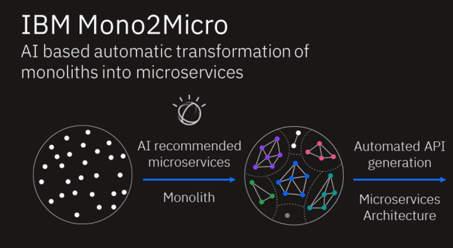

## 3.1 Getting Started with Mono2Micro

Below is a high-level flow diagram of getting started with Mono2Micro in
collecting data on an existing monolith application, and then running
the AI analyzer tool to generate two kinds of recommendations as how to
partition the application into recommended microservices.

1.  The data is collected from static code analysis, capturing **data
    (Class) dependencies,** depicted in **\[1\]**.

2.  Data is dynamically collected through **runtime trace logs** as the
    instrumented monolith application is run through various **use case
    scenarios** to exercise as much of the codebase as possible,
    depicted in **\[2\]** & **\[3\]**.

Based on all three kinds of data, Mono2Micro generates a ***Natural
Seams Partitioning*** recommendation that aims to partition and group
the monolith classes such that there are minimal class containment
dependencies and entanglements (i.e. classes calling methods outside
their partitions) between the partitions.

The “Data Dependency Analysis” in \[1\] refers to this kind of
dependency analysis between the Java classes. In effect, this breaks up
the monolith along its natural seams with the least amount of
disruption.

Based on \[2\] and \[3\] alone, and not taking class containment
dependencies and method call entanglements into account, Mono2Micro also
generates a ***Business Logic Partitioning*** that might present more
entanglements and dependencies between partitions, but ultimately
provides a more useful partitioning of the monolith divided along
functional and business logic capabilities.

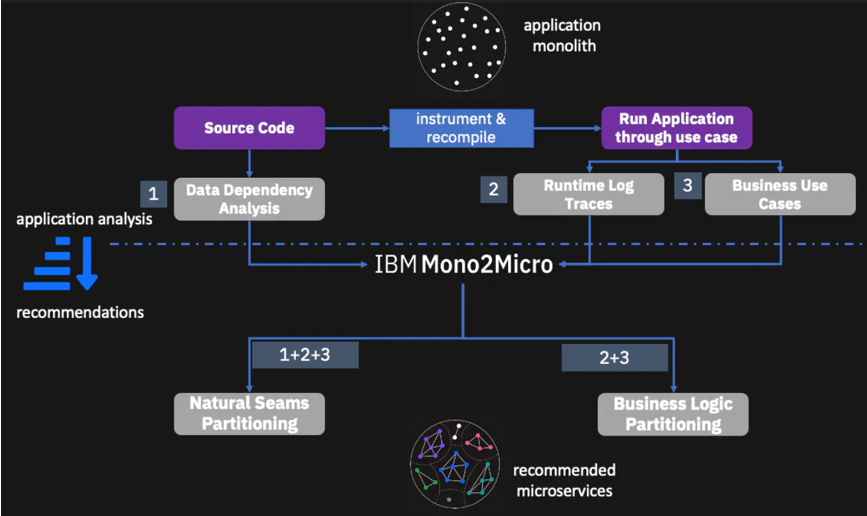

## 3.2 How does Mono2Micro work?

In this lab, you will use a simple JEE monolith application named
DefaultApplication, and step through the entire Mono2Micro toolset, end
to end, starting with the monolith and ending with a deployed and
containerized microservices version of the same application.

Mono2Micro consists of six components, each of them serving a specific
purpose. The component and their uses are listed in the following:

  - **Code analyzer:** Analyzes the Java source code of monoliths.

  - **Binary instrumenter** (minerva-agent-1.0.jar): A Java agent that
instruments a running application deployed on the application server.
The instrumentation captures entry and exit of every Java method in the
application

  - **Use case recorder:** A Java program that is used while running test
cases that gathers runtime analysis data. The use case recorder is used
to align the start and end times of a use case with the timestamps
generated from the instrumented code. This allows for Mono2Micro to
track the code being executed in the monolith to specific use cases.

  - **The AI engine for partition recommendations:** The AI engine of
Mono2Micro which uses machine learning techniques on the user supplied
runtime traces and metadata obtained from the code analyzer and the use
case recorder to generate partition recommendations.

    The AI engine also produces a detailed report for the recommended partitions ~~microservices~~.

  - **IBM Mono2Micro workbench UI:** The results obtained from the AI engine
are stored in user’s local storage. The results can be uploaded to the
workbench UI to display them in a graphical visualizer. The workbench UI
also allows you to modify the AI engine generated partition
recommendations.

  - **Code generator:** The program with deep knowledge of the semantics of
the Java programming language. The code generator uses the
recommendations from the AI engine.

    The code generator performs these important capabilities:

    1.  Provides detailed invocation analyses of the recommended partitions

    2.  Generates a significant portion of the code needed to realize the
    recommended partitions in containers

### **3.2.1 Mono2Micro usage flow**

The illustration below shows how the Mono2Micro components fit into the
end-to-end process.

|                                         |                                                                                                                                        |
| --------------------------------------- | -------------------------------------------------------------------------------------------------------------------------------------- |
|  | At this point, do not get bogged down with the details in the diagram. You will explore these details as you progress through the lab. |

1.  Use the **code analyzer** to analyze the monolith application

2.  Use the **binary instrumenter** to collect the runtime traces while
    running business use cases, eliminating the need to rebuild and
    redeploy the Java monolithic application.

3.  Use the **use case recorder** and run test cases to capture runtime
    execution Trace data in the server logs, based on the analyzed
    source code.

4.  Use the **AI engine** to analyze the data and produce recommended
    partitions based on Natural Seams and/or Business logic.

5.  Use the **workbench UI** to visualize the partition recommendations,
    and tweak the recommendations as needed to meet your objectives.

6.  Use the **code generator** to generate the plumbing and service code
    needed to realize the recommended and potential microservices.

    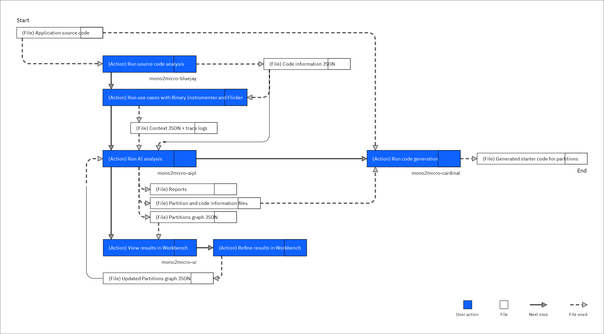

## 4 The lab environment

One (1) Linux VM has been provided for this lab.

  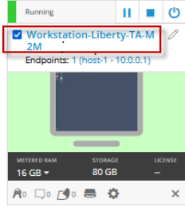
 
  - The **Workstation** VM has the following software installed:
  
    - Docker 19.03.13
    - Git 2.24.1
    - Maven 3.6.3java
    - OpenJDK 1.8.0

  - The **Workstation** is a Linux VM

  - The login credentials for the **Workstation** VM are:

    - User ID: **ibmdemo**
 
    -  Password: **passw0rd (That is a numeric zero in passw0rd)**
 
    **Note:** Use the Password above in the **Workstation** VM Terminal for ***sudo*** in the Lab

###  4.1 **Login to the Workstation VM and Get Started**

1.  If the VM is **not** already started,
    start it by clicking the **Play** button.

    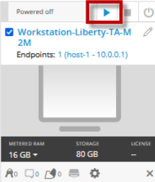

2.  After the VM is started, click the **Workstation** VM icon to access
    it.

    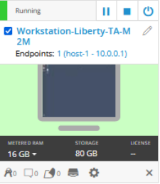

3.  Login with **ibmdemo** ID.

    a. Click on the “**ibmdemo**” icon on the Ubuntu screen.

    

    b. When prompted for the password for “**ibmdemo**” user, enter   "**passw0rd**” as the password

    Password: **passw0rd** (lowercase with a zero instead of the o)
 
    

     

###  4.2 **Resize the Skytap lab environment window to fit to size**

From the Skytap menu bar, click on the “**Fit to Size**”
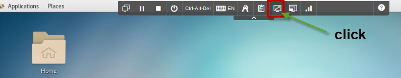 icon. This will enlarge the viewing area
to fit the size of your browser window.

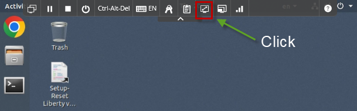

 

# **PART 1 Introduction to the Application and resources used for this lab**

## 1.1 Introduction to the Default Application used in this lab 

In this lab, you will use Mono2Micro to transform WebSphere Application
Server’s **Default Application** into microservices.

The Default application contains a web module called
***DefaultWebApplication*** and an enterprise Java bean (EJB) called
***Increment***.

The Default Application provides two servlets that are invoked from an
HTML page in the application

  - SnoopServlet
  - HitCount

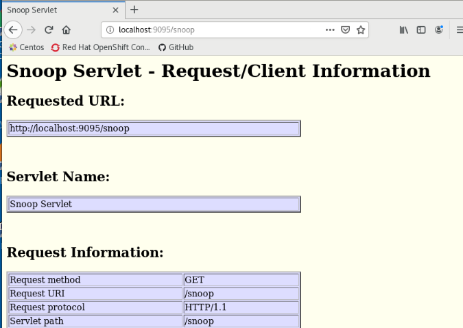

**Snoop servlet** retrieves information about a servlet request. This
servlet returns the following information:

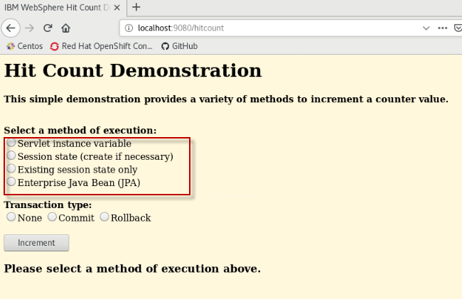

**Hit Count** demonstrates how to increment a counter using a variety of
methods, including:

  - A servlet instance variable
  - An HTTP session
  - An enterprise bean

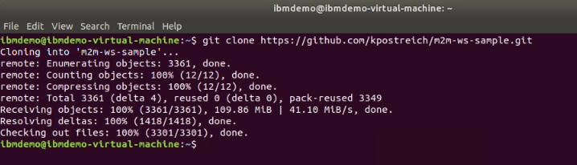

You can instruct the servlet to execute any of these methods within a
transaction that you can commit or roll back. If the transaction is
committed, the counter is incremented.

The enterprise bean method uses a container-managed persistence
enterprise bean that persists the counter value to an Apache Derby
database.

## 1.2 Clone the GitHub repository used for this Mono2Micro lab 

The basic steps in this section include:

  - Introduce the structure of the GitHub repository resources used in
    the lab

  - Clone the **GitHub repository** that contains the resources required
    for the lab

The **GitHub repository** contains all the source code and files needed
to perform all the steps for using Mono2micro to transform the monolith
application used in this lab, to microservices.

Structure of the m2m-ws-sample GitHub repository: (details in the README
within the GitHub repo):

  - **Monolith source code:** ./defaultapplication/monolith

  -  **Monolith application data:** ./defaultapplication/application-data/

  - **Mono2Micro analysis (initial recommendations):**
./defaultapplication/mono2micro-analysis

  - **Mono2Micro analysis (further customized):**
./defaultapplication/mono2micro-analysis-custom

  - **Deployable Microservices:** ./defaultapplication/microservices

The GitHub repo includes all the artifacts needed to complete this lab
on your local workstation.

  - The DefaultApplication Source Code
  - The newly constructed dockerfiles to build and run the microservices
    in containers
  - The updated POM files that have been reduced to contain only the
    resources needed for the individual microservice

<table>
<tbody>
<tr class="odd">
<td></td>
<td>
<strong>TIP: How to Copy / Paste text from the lab guide to the lab environment?</strong>

Refer to the <strong>Appendix</strong> at the end of this lab guide for simple to follow instructions for using copy / paste using the provided lab environment<strong>.</strong>
</td>
</tr>
</tbody>
</table>

1.  Clone the GitHub repository.
    
    a.  Open a Terminal window and run the following commands:

        cd /home/ibmdemo
        
        git clone https://github.com/kpostreich/m2m-ws-sample

    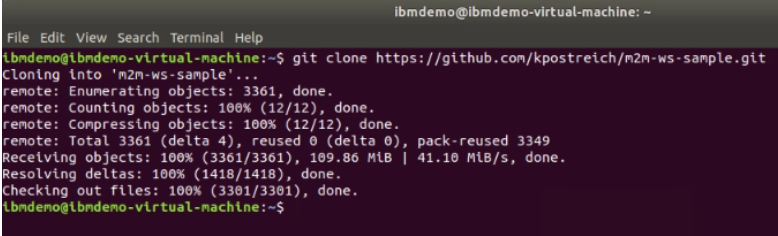

2.  Change to the workshop directory that contains the cloned repository
    artifacts. Then list the directory contents.

        cd /home/ibmdemo/m2m-ws-sample

        ls -l

# **PART 2 Use Mono2Micro to analyze the Java EE monolith application and recommend partitions**

**Objectives**

  - Learn how to use the AI-driven Mono2Micro tools to analyze a Java EE
    monolith and recommend the different ways it can be partitioned into
    partitions ~~microservices~~

  - Learn how to use Mono2Micro tools to further customize the
    partitioning recommendations

In Part 2 of the lab, you will first install the Mono2Micro tools. Then you will follow the steps illustrated in the image below, that is:

1.  Run Mono2Micro’s **code analyzer** to analyze the Java source code
    and produce the analysis files that will be used as input to the
    Mono2Micro’s AI engine.

2.  Use the **binary instrumenter** to collect the runtime traces while
    running business use cases, eliminating the need to rebuild and
    redeploy the Java monolithic application.

3.  Use Mono2Micro’s **use case recorder** to gather time stamps and use
    case data as you run **test cases** against the deployed monolith
    application.

4.  Use the **AI engine** to produce the initial partition
    recommendations.

5.  Use the **workbench UI** to visualize the microservice
    recommendations and modify the initial recommendations to further
    customize the microservice recommendations.

## 2.1 Installing Mono2Micro tools

In this section of the lab, you will download and install the mono2micro
command line tool.

1.  Download the Mono2Micro-CLI.zip and unzip it in the user directory
    folder:

        cd /home/ibmdemo

        curl https://public.dhe.ibm.com/ibmdl/export/pub/software/websphere/wasdev/mono2micro/Mono2Micro-CLI.zip --output Mono2Micro-CLI.zip

        unzip Mono2Micro-CLI.zip -d /home/ibmdemo/Mono2Micro-CLI

        cd /home/ibmdemo/Mono2Micro-CLI

2.  Run the Mono2Micro CLI version and help commands:

        ./mono2micro -v

        ./mono2micro -h

    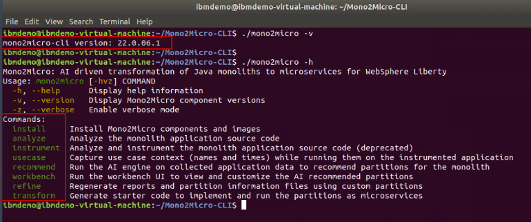

3.  Check the install possibilities by using the help option within
    install command:

        ./mono2micro install -h

    

4.  Run the Mono2Micro **install command,** selecting Docker as the
    container engine:

        ./mono2micro install -c docker

5.  You need to choose option “**2**” for trial to proceed:

    <table>
    <tbody>
    <tr class="odd">
    <td>
License not accepted. Choose from the following options:

    
1. IBM WebSphere Hybrid Edition 5.1 (L-AMIK-C92MN6)

    
2. IBM Mono2Micro 22.0.06 trial (L-DCHS-CF6HDE)

    
3. IBM WebSphere Application Server for z/OS V9.0.5.12 (L-CTUR-CDXJNV)

    
4. IBM WebSphere Application Server for z/OS V8.5.5.21 (L-CTUR-C7K3YZ)

    
Select [1/2/3/4]: 2
</td>
    </tr>
    </tbody>
    </table>

6.  The license will be presented, and you need to accept it. Type “**Y**” to proceed:

    |                           |
    | ------------------------- |
    | Accept license \[Y/N\]: Y |

7.  The **next steps** message will be displayed when the Mono2Micro-CLI
    is successfully installed:

    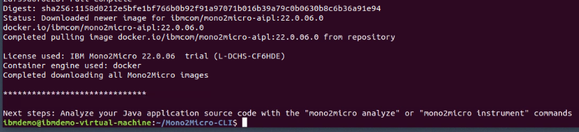

8.  Now Mono2Micro is successfully installed. As a result of the
    installation, two new files were created under the user home
    directory. Use the commands below to check the content of the files:

        cat ~/.mono2micro_license

        cat ~/.mono2micro_config

    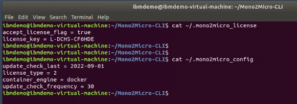

## Use Mono2Micro’s code analyzer for collecting data on the monolith application 

The first step in using Mono2Micro is to prepare the monolith’s Java
source code for static and dynamic analysis.

Mono2Micro’s **code analyzer** is used to analyze the application source
code and produce the analysis in two .json files.

For the **DefaultApplication** used in this lab, the complete set of
source code for the monolith application is already available in a
single directory structure cloned from GitHub.

For this lab, the monolith source files tree can then be found in
/home/ibmdemo/m2m-ws-sample/defaultapplication/monolith directory.

Let’s begin with the static data collection phase by running
Mono2Micro’s **code analyzer** tool to analyze the Java source code
and produce the analysis in two .json files.

1.  Run the code analyzer with help option to verify the possibilities
    available:

        ./mono2micro analyze -h

    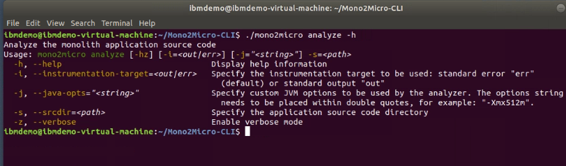

2.  Run the code analyzer using the following command:

    a. Use the "**-s**" option to specify the application source code directory
    of the Default Application

        ./mono2micro analyze -s /home/ibmdemo/m2m-ws-sample/defaultapplication/monolith -i out

3.  The following output will be displayed:

    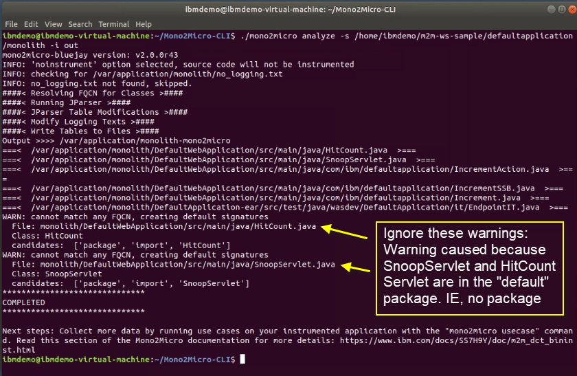
 
    The instrumented code is in the following directory:
 
     > /home/ibmdemo/m2m-ws-sample/defaultapplication/**mono2micro**

4.  Review the output from the code analyzer:

        ls -g /home/ibmdemo/m2m-ws-sample/defaultapplication/monolith-mono2micro

    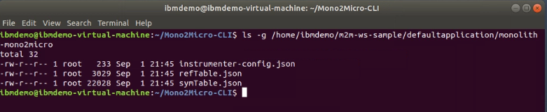
 
    The code analyzer creates a directory with a “monolith-mono2micro” extension. The directory contains 3 .json files.

    The three **.json** files in the **monolith-mono2micro** directory are:
    - refTable.json
    - symTable.json
    - instrumenter-config.json

    The **refTable.json** and **symTable.json** file capture various details and metadata about each Java class such as:

    - method signatures
    - class variables and types
    -  class containment dependencies (when one classes uses another class as a instance variable type, or method return/argument type)
    -  class inheritance
    -  package dependencies
    -  source file locationsetc.

    The **instrumenter-config.json** file is used with the binary instrumenter to produce runtime traces.

    |                                         |                                                                                                                                                                                                                                                                            |
    | --------------------------------------- | -------------------------------------------------------------------------------------------------------------------------------------------------------------------------------------------------------------------------------------------------------------------------- |
    |  | The code analyzer instrumentation never prints the value of any variables of your application. The purpose of the instrumentation is to record the temporal flows through various methods and constructors of classes, and not the values of any variables during run time |

    This static analysis therefore gathers a detailed overview of the Java code in the monolith, for use by Mono2Micro’s AI analyzer tool to come  up with recommendations on how to partition the monolith application.
 
    Furthermore, this information is also used by Mono2Micro’s code  generation tool to generate the foundation and plumbing code for  implementing each partition as potential microservices.

    The next step is to run test cases against the monolith application using the binary instrumenter to capture runtime data for analysis.
    

## 2.3 Run test cases using the binary instrumenter with the monolith for Runtime data analysis

Now you are ready to proceed to the next phase of data collection from
the monolith application. This is a crucial phase where both the
quantity and quality of the data gathered will impact the quality and
usefulness of the partitioning recommendations from Mono2Micro’s AI
analyzer tool.

The key concept here is to run as much user scenarios as possible in the
running the binary instrumenter with the monolith application,
exercising as much of the codebase as possible.

These user scenarios (or business use cases if you will), should be
typical user threads through the application, related to various
functionality that the application provides. More akin to functional
verification testcases or larger green thread testcases, and less so
unit testcases.

In the DefaultApplication’s case, these scenarios are very simple, which
is partially why we selected this application for the lab. For real
applications, your test cases could be quite extensive to achieve
maximum code coverage in the tests.

Test cases for DefaultApplication

  - Run the Snoop action

  - Run the HitCount action

## 2.3.1 Configure Liberty to use the binary instrumenter within your application

The test cases (use cases) that you will run must be executed on the
code base using the binary instrumenter and the files generated in the
“**monolith-mono2micro**” directory.

The DefaultApplication is a Maven based project. The application can
easily be rebuilt using Maven CLI. Maven version 3.6.3 has been verified
to work in this lab.

1.  Build the original version of the DefaultApplication

    a. Change to the directory location of the application code, and run the maven build.

        cd /home/ibmdemo/m2m-ws-sample/defaultapplication/monolith

        mvn clean install

    Maven should have successfully built the application and generated the  binary artifacts (EAR, WAR), and placed them in the Liberty Server “apps” folder.

    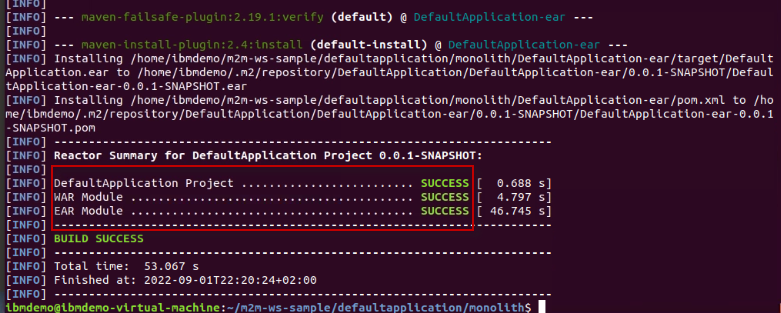

    Next, you will configure the Liberty server to load the Binary instrumenter (minerva-agent-1.0.jar), which is a Java agent that instruments a running application deployed on the application server.

    The instrumentation captures entry and exit of every Java method in the application

2.  Configure the Liberty server to load the Binary instrumenter agent.
    
    a.  Create a jvm.options that will be used by liberty server

        gedit ./DefaultApplication-ear/target/liberty/wlp/usr/servers/DefaultApplicationServer/jvm.options

    The **jvm.options** file in Liberty is used to set Java Virtl Machine  arguments. For Mono2micro, you need to configure the the java agent  for the binary instrumenter

    b.  Edit the **jvm.options** to point to the files under monolith-mono2micro folder and the binary instrumenter (minerva-agent.jar) under Mono2Micro-CLI/instrumenter folder.

    Copy / Paste the following content into the jvm.options file:

        -javaagent:/home/ibmdemo/Mono2Micro-CLI/instrumenter/minerva-agent-1.0.jar=/home/ibmdemo/m2m-ws-sample/defaultapplication/monolith-mono2micro/instrumenter-config.json

    c.  **Save** the “jvm.options” file and **Close** the editor

3.  Run the scripts below to Start the Liberty server and check that the server is in the running state

    As a convenience, we have provided simple scripts for you to use to start and stop the Liberty server, as well as check the status of the server.

        /home/ibmdemo/m2m-ws-sample/defaultapplication/scripts/startServer.sh

        /home/ibmdemo/m2m-ws-sample/defaultapplication/scripts/serverStatus.sh

    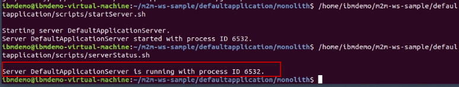

    <table>
    <tbody>
    <tr class="odd">
    <td></td>
    <td>
<strong>Tip:</strong> The Liberty server is in the folder:

    
/home/ibmdemo/m2m-ws-sample/defaultapplication/monolith/DefaultApplication-ear/target/liberty/wlp/usr/servers/DefaultApplicationServer
</td>
    </tr>
    </tbody>
    </table>

4.  Open a Web Browser and launch the DefaultApplication. The main HTML page will be displayed.

        http://localhost:9080

    Notice the application only has two main features:

  - Snoop
  - Hit Count

    

5.  Open the console.log file to check that the binary instrumenter was initiated:

        head -25 /home/ibmdemo/m2m-ws-sample/defaultapplication/monolith/DefaultApplication-ear/target/liberty/wlp/usr/servers/DefaultApplicationServer/logs/console.log

    The console.log should include the following messages, as illustrated below. This is an indication that the application is ready to run the test cases.

    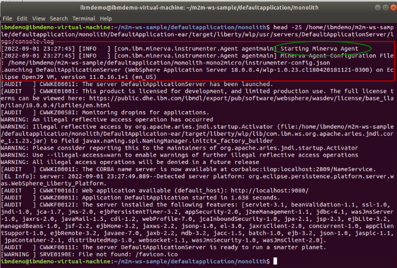

## 2.3.2 Run the test cases for the DefaultApplication

Since this is a simple application, you will run the test cases manually
using the applications web UI. There are only two use cases for this
simple application.: **Snoop** and **Hit Count**.

As these use cases are run on the monolith application using the binary
instrumenter, you will use Mono2Micro’s **use case recorder** to record
use case labels and the start and stop times of when that use case or
scenario was run.

The **use case recorder** essentially acts like a stopwatch to record
use cases.

The labels provided to the **use case recorder** for each use case
should be meaningful as this will come into play later when viewing
Mono2Micro’s AI analysis where the classes and flow within the code is
associated with the use case labels.

The **use case recorder** is part of the mono2micro cli tool and when
launched it prompts the user for **a use case label**, and then records
the start time.

Then prompts again for the “**stop**” command after the user finishes
running that scenario on the monolith.

1.  First, start the **use case recorder** tool, using the command
    below:
    
    a.  Open a new Terminal window Go to the Mono2Micro-CLI folder:

        cd /home/ibmdemo/Mono2Micro-CLI

    b.  Check the possible options to run the use case recorder

        ./mono2micro usecase -h

    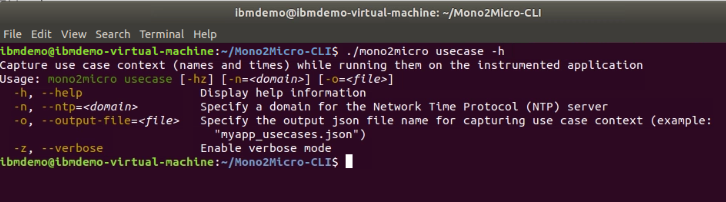

    c.  Run the **use case recorder**

        ./mono2micro usecase

    Notice that the **use case recorder** is just waiting for you to provide a “**Label**” or name of the test case to run. You will do that in the next step.

    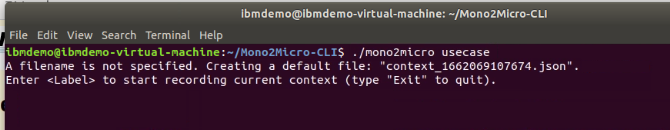

2.  Run the **Snoop** test case

    Follow the steps below to run the Snoop test case

    a. In the web browser, go to **http://localhost:9080/**

    b. From the **use case recorder**, provide the label named **snoop** and press **ENTER**. 
    
    This starts the **use case recorder** stopwatch for the snoop test case.

    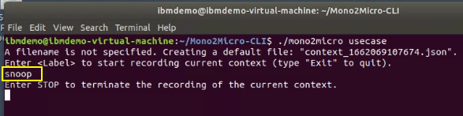

    c.  From the Web Browser, click on the **Snoop Servlet** link in the DefaultApplication HTML page. Snoop requires basic authentication.
    
    If prompted for credentials, enter the following username and password:

    > Username: **user1**
    > 
    > Password: **change1me** (that is the number 1 in the password).
    > 

    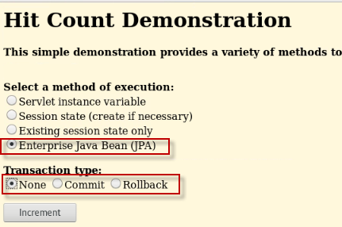

    d.  Run snoop multiple times: Just click the Browsers “Reload Page” 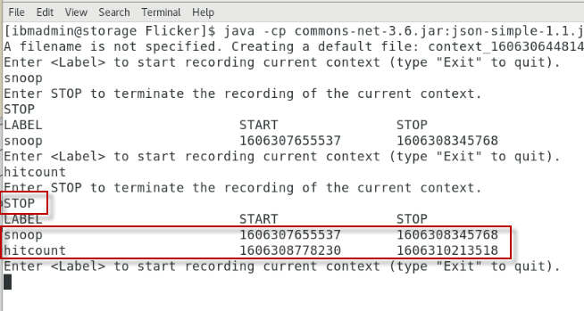 button.

    e. When finished, click on the Browsers “**back**” button 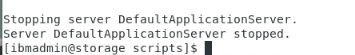 to return to the applications main   > HTML page.

    f.  In the **use case recorder**, enter **STOP**, to stop the stopwatch for the test case

    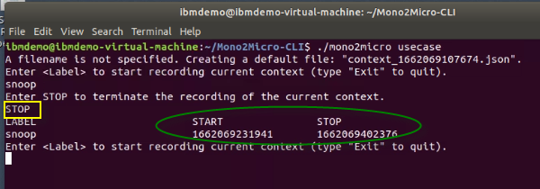
 
    Notice the **use case recorder** has recorded the **START** and **STOP** times for the “snoop” test case. These timestamps correspond with the timestamps in the Liberty log file, from the instrumented version of the DefaultApplication running in Liberty.

3.  Run the **Hit Count** test case

    Running the Hit Count test case requires the same basic step as Snoop, but has a few more options to test in the application:

    a.  In the **use case recorder**, provide the label named **hitcount** which will start the stopwatch for the snoop test case.

    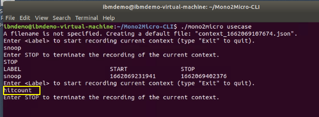

    b. From the Web Browser, click on the **Hit Count** link in the DefaultApplication HTML page.

    Hit count displays a JSP page with several options that demonstrate a variety of methods to increment a counter, while maintaining state.

    c. Run **hitcount**, choosing each of the following options from the  application in the web browser:

    - Servlet instance variable
    - Session state (create if necessary)
    - Existing session state only

    d.  Run **hitcount**, choosing the following option from the application in the web browser:

       - Enterprise Java Bean (JPA)

    When choosing the **EJB** option, you also must select one of the following **Transaction Types**, radio buttons:
      
      -  None
      - Commit
      - Rollback

    This action invokes an EJB and uses JPA to persist the increment state to a Derby database.

    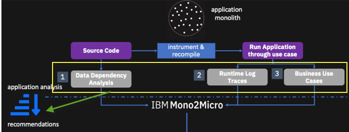

    e.  You can run **HitCount** multiple times, choosing different
    “**Transaction Type**” options.

    f. In the **use case recorder**, enter **STOP**, to stop the **use case recorder** stopwatch for the test case

    The **use case recorder** has now captured the START and STOP timestamps for the use cases, which corresponds to the timestamps  recorded in the Liberty log file from the  instrumented version of the DefaultApplication.
 
    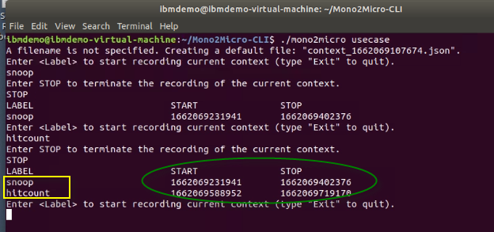

    g.  In the **use case recorder**, enter **Exit**, to quit

    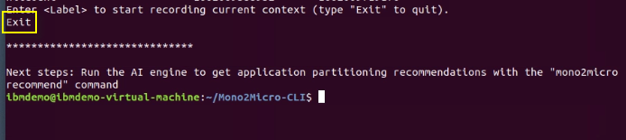

4.  Run the script below to **Stop** the Liberty server

    As a convenience, we have provided simple scripts for you to use to  start and stop the Liberty server, as well as check the status of the server.

        /home/ibmdemo/m2m-ws-sample/defaultapplication/scripts/stopServer.sh

    

## 2.4 Review the output from the use case recorder and the Liberty Log file based on the test cases

After exiting the **use case recorder**, it produces a **context json
file** that captures the use case labels and their start/stop times. The
context json files are generated in the same directory where the
mono2micro ran.

This context json file will be used as input to the AI engine in
Mono2Micro for shaping the recommendations for microservices
partitioning.

## 2.4.1 Review the output from the use case recorder and Liberty log file based on the test cases you executed

Take a quick look at the context file that the use case recorder
generated for the snoop and hit count test cases

1.  View the context json file.

    The name of the context json file contains timestamp in its name. So view the files in the current working directory, and then view the “context\*.json” file.

        cd /home/ibmdemo/Mono2Micro-CLI

        ls *.json

        cat context*.json

    Notice the two test cases were recorded, along wit the start and stop timestamps for each testcase.
 
    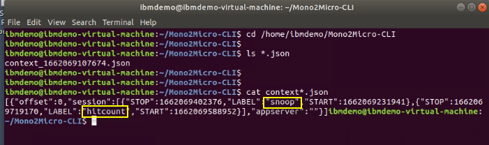

2.  View the Liberty log file to ensure the log contains the trace
    statements from the application.

        cat /home/ibmdemo/m2m-ws-sample/defaultapplication/monolith/DefaultApplication-ear/target/liberty/wlp/usr/servers/DefaultApplicationServer/logs/messages.log | grep '\<Entering\>\|Exiting'

    As illustrated in the screenshot below, the Liberty server log file (messages.log) will include trace data that captures the entry and exit of each Java method called, along with the timestamp of the  invocation
 
    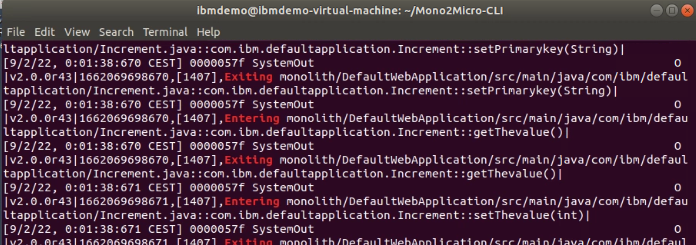
 
    As illustrated in the screenshot below, the Liberty server log file (messages.log) will include trace data that captures the entry and exit of each Java method called, along with the timestamp of the invocation.

    <table>
    <tbody>
    <tr class="odd">
    <td></td>
    <td>
If the log file does <strong>NOT</strong> contain trace statements for Snoop and Hit count as illustrated below, it is likely that the binary instrumenter or the jvm.options were not correct set up in the Liberty server.

    
Do not worry, we have captured a known good log file and context json file that can be used to continue the lab, without having to go back and redo previous steps.
</td>
    </tr>
    </tbody>
    </table>

    <table>
    <tbody>
    <tr class="odd">
    <td></td>
    <td>
<strong>Tip:</strong> It is critical that the server log files DO NOT get overwritten during the execution of the test cases.

    
System Administrators configure limits for how much data is logged and kept.

    
They do this by configuring a MAX size for the log files, and the MAX number of log files to keep. If or when these maximum thresholds are reached, Liberty will write over the messages.log file, resulting in the timestamps from our test cases to be out of whack.

    
Therefore, it is critical to ensure proper sizing of these logging thresholds to ensure log files are not overwritten when running the test cases.

    
Since the tests in this lab are short and simple, there will not be an issue. But something to look out for when running larger test suites.
</td>
    </tr>
    </tbody>
    </table>

## 2.5 Recap of the data has been collected for the monolith 

Let’s review the data that has been collected on the monolith:

1.  **The code analyzer** generated three json files, where two were
    table json files containing specific information about the java
    classes and their relationships via static analysis of the code:

    - refTable.json
    - symTable.json
    - The instrumenter-config.json file was generated and it is used with the binary instrumenter to produce runtime traces.

2.  The **use case recorder** generated one or more context json files
    that contains use case names/labels and their start and stop times

3. All the standard console output/error **log files** captured on the
    application server side as the use cases were being run on the
    application

With these **three** sets of data, Mono2Micro can now correlate what
exact Java classes and methods were executed during the start and stop
times of each use case, and thereby associate the observed flow of code
within the application to a use case.

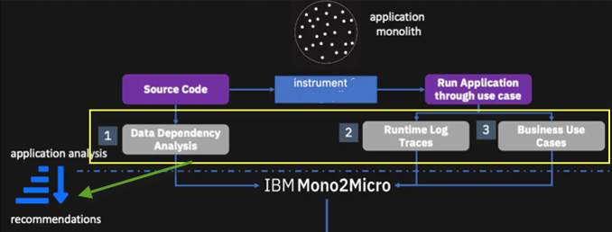

Let’s proceed to the next phase of using Mono2Micro, which is to run the AI analyzer tool against this data.

## 2.6 Running Mono2Micro’s AI Analyzer for Application Partitioning Recommendations

Mono2Micro’s AI engine for partition recommendations is the analyzer
that uses unsupervised machine learning AI techniques to analyze the
three sets of data collected on a monolith applicated as done in the
previous section.

Once you have completed the executing all the test scenarios, you should have the following categories of data collected:

  - symTable.json
 
   - refTable.json
 
   - one or more json files generated by the use case recorder, and
 
   - one or more log files containing the runtime traces

## 2.6.1 Prepare the input directories for running the AI engine 

To prepare for the analysis, the **input directories** and an optional
**config.ini** file need to be gathered and placed (copied) into a
common folder structure before running the AI engine.

For this lab, the input directories have been placed into the following
directory structure for you.

The **/home/ibmdemo/m2m-ws-sample/defaultapplication/application-data/** directory contains the subdirectories within which the data files are placed:

  - **contexts/** One or more **context .json** files generated while running the **use case recorder** alongside the use case runs

  - **logs/** One or more **console logs** from the application server as the analyzed monolith was run through the various use cases

  - **tables/** The two table **.json** files generated by the **code**
 **analyzer**
 
  - **config.ini** Optional file to configure various parameters for the analysis tool. If one doesn’t exist, AI engine generates one for you with default values.
 
    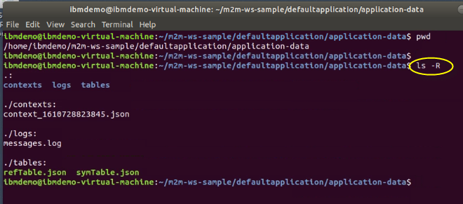

## 2.6.2 Run the AI engine to generate the partition recommendations 

Once you have completed the data collection process for the Java
monolith under consideration, you can feed the data to the AI engine to
generate partition recommendations.

1.  Change directory to the Mono2Micro-CLI directory

        cd /home/ibmdemo/Mono2Micro-CLI

2.  Check the options available to run the AI engine:

        ./mono2micro recommend -h

    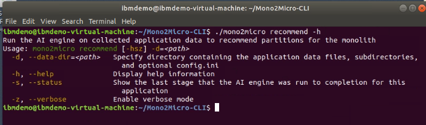

3.  Run the AI engine using the following command:

        ./mono2micro recommend -d /home/ibmdemo/m2m-ws-sample/defaultapplication/application-data

    Which will produce an output similar to this:
 
    
 
    When the AI engine finishes its analysis, it will generate an application partitioning recommendations **graph .json** file, various reports, and other output files in the **application-data/mono2micro/mono2micro-output/** subdirectory within the parent directory of the input subdirectories.

    |                                         |                                                                                                                                                                                                                                                                                  |
    | --------------------------------------- | -------------------------------------------------------------------------------------------------------------------------------------------------------------------------------------------------------------------------------------------------------------------------------- |
    |  | For the lab, you will reference a saved version of the data collection when running the AI engine. This is just to ensure a known good collection is used for the recommendation generation. (You could also use your own collected data and feed it into the folder structure). |

    Next. Explore some of the notable files and reports generated by Mono2Micro.

4.  **REFERENCE ONLY\!** Listed here are some of the notable files that
    were generated from the AI engine

    - **Cardinal-Report**.html is a detailed report of all the application partitions, their member classes, outward facing classes, etc
 
          /home/ibmdemo/m2m-ws-sample/defaultapplication/application-data/mono2micro/mono2micro-output/**Cardinal-Report.html**
 
    - **Oriole-Report.html** is a summary report of all the application
 partitions and their associated business use cases
 
          /home/ibmdemo/m2m-ws-sample/defaultapplication/application-data/mono2micro/mono2micro-output/**Oriole-Report.html**
 
    - **final_graph.json** is the full set of application partition  recommendations (natural seams and business logic) and associated  details, viewable in the Mono2Micro UI
 
          /home/ibmdemo/m2m-ws-sample/defaultapplication/application-data/mono2micro/mono2micro-output/oriole/**final\_graph.json**
 
    - **cardinal/\*** is a folder that contains a complete set of input files (based on the partitioning) for the next and last stage of the Mono2Micro pipeline, running the code generator
 
          /home/ibmdemo/m2m-ws-sample/defaultapplication/application-data/mono2micro/mono2micro-output/cardinal/\*

5.  Continue to the next section. You will explore the generated reports later in the lab.

## 2.6.3 Use the Mono2Micro workbench UI to view and manipulate the partitioning recommendations generated from the AI engine 

Let’s now take a look at the partitioning recommendations Mono2Micro
generated by loading the **final\_graph.json** in the workbench UI.

1.  Use the following command to check the options available to use the
    workbench UI:

        ./mono2micro workbench -h

    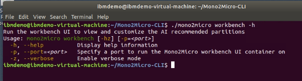

2.  Launch the workbench UI using the following command:

        ./mono2micro workbench

    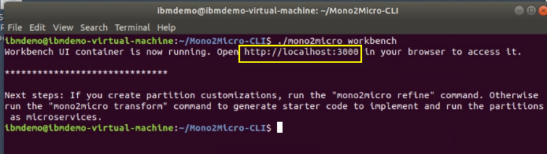

3.  From a web browser, navigate to
    [**http://localhost:3000/**](http://localhost:3000/)

    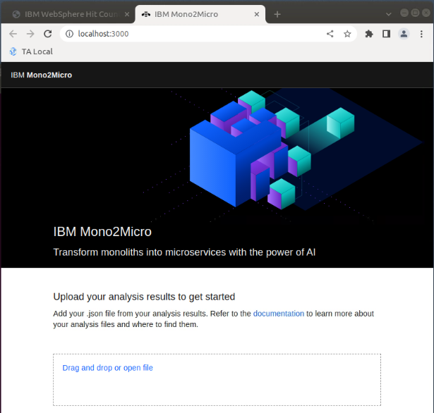

4.  Load the **final\_graph.json** file in the mono2micro UI
    
    a.  From the UI, click the “**Drop or Add File**” link
    
    b.  From the “**File Upload**” dialog window, navigate to the
        following **final\_graph.json** file

    > Home \> ibmdemo \> m2m-ws-sample \> defaultapplication \>  mono2micro-analysis \> oriole \> final\_graph.json

    c.  Click the “**Open**” button on the **File Upload** dialog, to load the file into the UI

    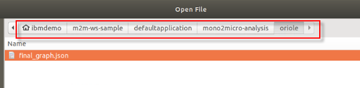

    d.  From the UI, click the “**Maybe Later**” button to SKIP the tour, and proceed to the results

    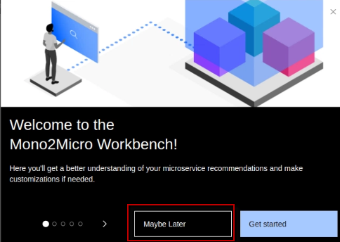

    e.  As illustrated below, the UI displays the initial recommendations for partitioning the application into microservices.

     **Note:** You can use the mouse to **drag** the **partition** circles to position them where you like on the canvas, as illustrated below.
 
     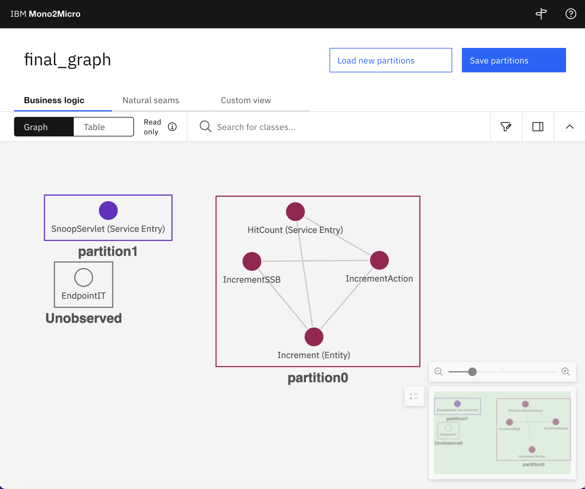

### **2.6.3.1 From the workbench UI, explore the partition recommendations** 

<table>
<tbody>
<tr class="odd">
<td></td>
<td>
The initial partitioning recommendations is a starting point and generated taking into consideration based on the business logic and natural seams that were discovered during the analysis.
  

In the lab, you will slightly customize the partition recommendations to suit our goals.

This will provide an opportunity to see how easy it is to customize the recommendations to tailor them to exactly suit your desired end state.
</td>
</tr>
</tbody>
</table>

The Default Application contains two major Java components in the  application.

  > - Snoop Servlet
  > - HitCount application

In addition to the Java components, the application also contains  HTML, JSP, and other web resources.
 
The goal of this lab is to split the Default Application monolith into separate microservices, such that the (Front-end) Web components run  as a microservice, and the (back-end) EJB and  data layer run as a separate microservice.
 
In this exercise, we will ensure that the Web components(Servlets,
 HTML, JSP, etc) will be in the (front-end) web partition, and the (back-end) HitCount’s increment action Java / EJB components run in a separate partition.

1.  Ensure the view in the workbench UI to display partitioning
    recommendations are set to “**Business Logic”** and it is in
    **“Graph” mode.**

    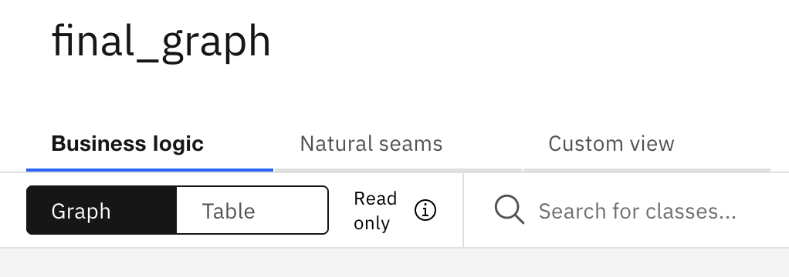

    Alternatively, you can use the tab selector to view the recommendations based on “Natural Seems” or “Custom View”.

    - **Business logic** partitioning is based on the runtime calls from the test cases

    - **Natural Seems** partitioning is based on the runtime calls and
    class dependencies. For example, an Object of class A holds a
    reference to an object of class B as a variable

       For natural seams-based partitioning, Mono2Micro creates partitions while avoiding inter-partition containment data dependencies –  containment data dependencies between classes belonging to different partitions

    - **Custom:** Customize how your classes are grouped. Start from
    either the Business logic view or the Natural seams view.

    Also, you can later explore by yourself the workbench UI in the  “Table” mode, which provides the equivalent configuration ability,  but using a table perspective, instead of a graph.
 
    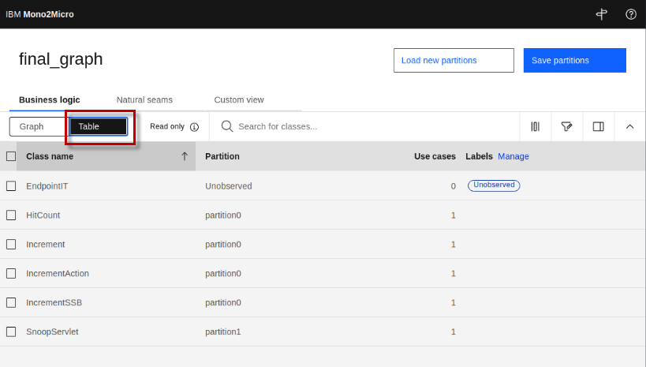

2.  If you explored other views, return to the “**Business Logic”** view in “**Graph**” Mode

    

3.  From the Business Logic view, notice that there are three
    **partitions** created, one of which is a special partition for
    “**Unobserved**” classes.

    - The **Lines between partitions** indicates where classes from one
    partition make calls to classes in a different partition

    - The **Unobserved** partition is a group of classes that were
    analyzed but were not found to be included in any of the use case
    test that were executed earlier. This could be due to dead code, or
    incomplete set of test cases for adequate code coverage.

4.  Explore the Java classes in partition0 and partition1
    
    a.  **Double-click** on each of the **partition**s to display the
        number of Java classes in each partition

    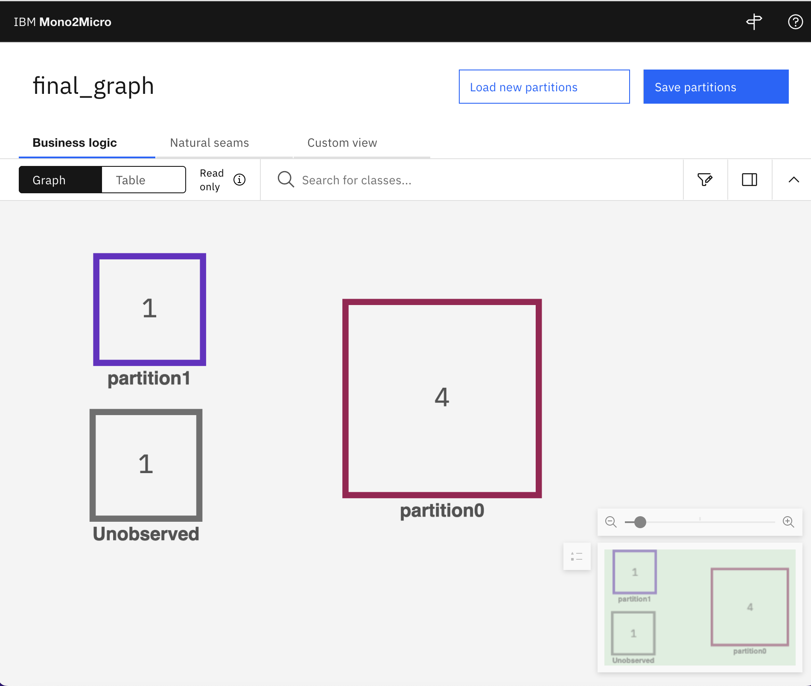

    - **Partiton0** contains four classes (HitCount, IncrementAction,
    Increment and IncrementSSB) which the classes that were identified
    as part of the “**hitcount”** use case from our test cases.
    
      - Within partition0, you can see that mono2micro observed
        intra-partition communication, as indicated by the lines between
        the classes**.**

    - **Partiton1** contains one class (SnoopServlet) which is the only
    class that was observed in the “snoop” test case

    - As you can see, there are **no lines** between these partitions,
    indicating that there is no partition to partition
    (inter-partitioning) communication observed between the classes in
    partition 0 and partition1.
    
      - This is because the initial partition recommendations placed all the classes that communicate in the **hitcount** use case into a single partition.

5.  Explore the Java classes in the “**Unobserved**” group
    
    a.  Double-click again on the **Unobserved group** to display the classes. This is a group of classes that Mono2Micro analyzed but were not included in any of the test cases.

    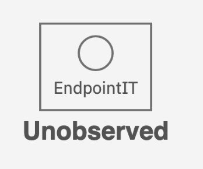

      - **EndpointIT** is a class that exists in the Junit Tests in the Java  project. We did not run the Junit tests as part of the test cases. Therefore, it is expected that this class is not included in any of the partitions.

    The initial partitioning recommendations are a starting point and generated taking into consideration based on the business logic and natural seams that were discovered during the analysis.

    In this lab, you will slightly customize the partition recommenations to suit our desired goals while providing an opportunity to see how easy it is to customize the recommendations to tailor them to exactly suit your desired end state.

## 2.7 Customizing & Adjusting Partitions

To refine the recommended business logic partitions, let’s consider the
classes in partition0 and partiton1. In these partitions, the classes
were servlet classes, as well as a POJO and EJB classes.

Given that the DefaultApplication monolith has a web based front-end and
UI, let’s use one single partition to house all the front-end code for
the application, which then would include all html/jsp/etc files, and
the Java servlet classes which are referred to by the html file.

|                                            |                                                                                                                                                                                           |
| ------------------------------------------ | ----------------------------------------------------------------------------------------------------------------------------------------------------------------------------------------- |
|  | The important point to note here is that **Java servlets** need to be running on the \***same**\* application server instance that serves up the **html** files referring to the servlets |

The goal of this lab is to split the Default Application monolith into
separate microservices such that:

  - The **(Front-end**) Web components run as a microservice

  - The (**back-end**) EJB and data layer run as a separate microservice

The partition recommendation~~s~~ from Mono2Micro are a good first step
toward partitioning the application for microservices.

The illustration below shows our desired final state of the
partitioning, which will then be used as the basis for the microservice
code generation later in the lab.

In this section of the lab, you will use the Mono2Micro workbench UI and
tweak the graph to the desired state.

Tweaking the business logic recommendations is straight forward using
the UI, and includes these basic steps, which you will do next:

-  **Rename partition1 to web**. This is not required but illustrates
    the capability to create partitions with names that make sense. This
    is useful during the code generation phase.

-  **Move HitCount Servlet (Service Entry) class to the web     partition**. All the Servlets and other front-end components should     be here.

### **2.7.1 Customize the graph**

1.  Create a custom view for editing the partitioning recommendations
    
    a. To create a custom view, first select **Custom View** from the
        **Graph view** tab menu

    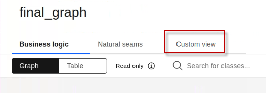

    b.   Select **Business logic** view as the starting point for the custom view. The click the **Create view** button.

    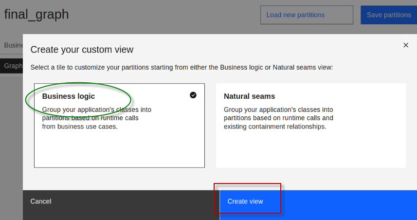

    c.  Make sure to set the toggle of “**Lock partitions**” to “**off**” position to allow editing of the graph

    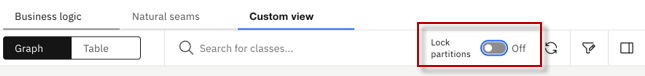

    d.  **NOTE:** You may use the mouse to drag the partitions to re-position them on the canvas, if you like.

2.  Double-click on each of the partitions to alternate between the view
    the classes within the partitions and Unobserved group or to view
    the number of Java classes in each partition.

    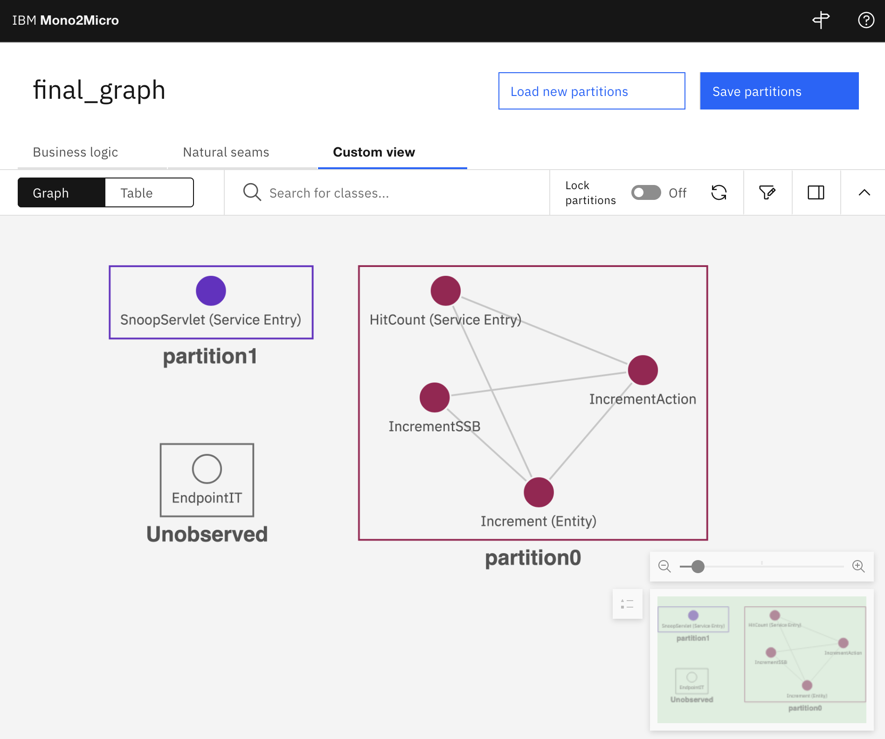

3.  Rename “partition1” to “web”
    
    a.  Click on **partition1** that includes the SnoopServlet class and
        then on the “**Details**” button

    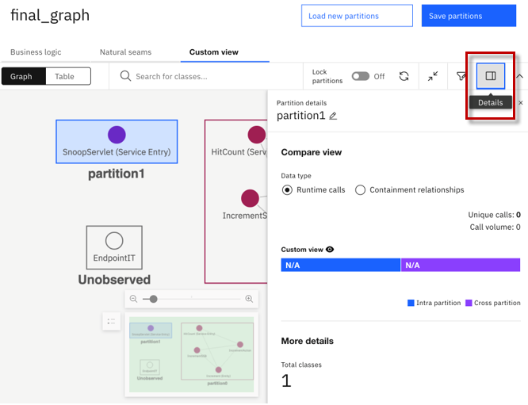

    b. After that, the details section will open. Then, click on the  pencil icon 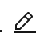 to rename the partition.

    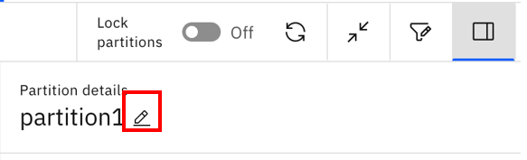

    c.  Type **web** as the new partition name. Then press **ENTER** key to finalize the name change

    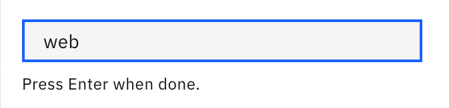

    d.  Click the “**details**” button to close the detail section.

    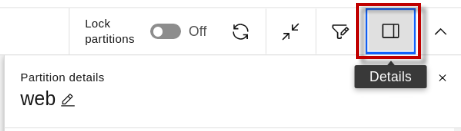

    e.  The partition has been renamed to “**web”**

    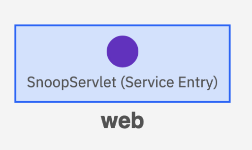

4.  Move the **HitCount** (Service Entry) class to the “**web**”
    partition
    
    a.  Drag and Drop the **HitCount** class from **partition0** to the
        **web** partition

    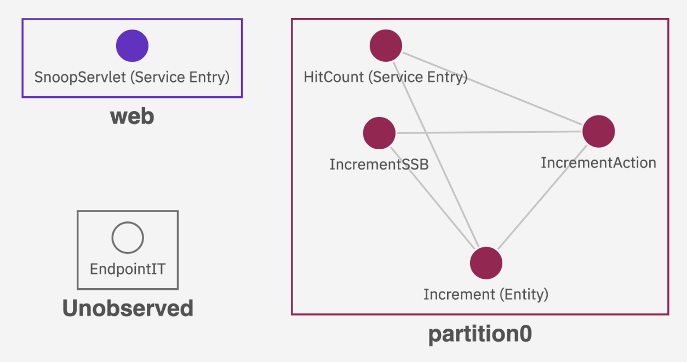

    b.  The **HitCount** class is now located in the web partition.

    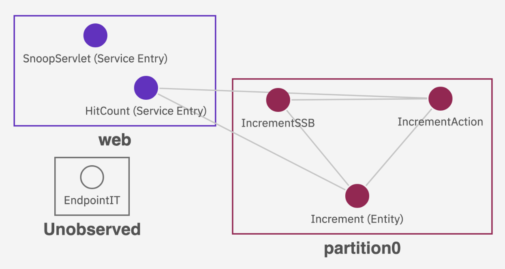

5.  Click on the “**Save partitions**” button to save the updated custom
    view. The customized **final\_graph.json** file is saved to the
    **“/home/ibmdemo/Downloads”** folder.

    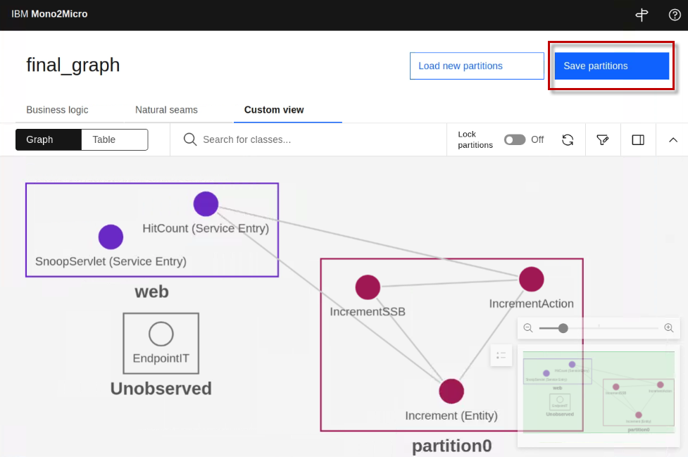

### **2.7.2 Regenerate the partition recommendations by rerunning the AI engine against the customized graph**

To generate the new microservice recommendations and the relevant
reports for a modified graph you must execute the AI engine with the
refine command.

Additionally, the AI engine must reference the customized version of the
final\_graph.json file. To prepare to run the AI engine again, you must
first do a couple of manual steps:

  - Move the customized final\_graph.json file from “**Downloads”**
    folder to a known location by Mono2Micro.

  - Rename the customized “**final\_graph.json”** file to a name that
    makes it obvious this is our customized graph and not the original

  - Modify the Mono2Micro “**config.ini**” file to reference the name
    and location of the customized graph file.

Lets get started\!

1.  Copy the customized **final_graph.json** file from users
    “Downloads” folder to a known location by Mono2Micro’s AI
    engine, and name it as **custom_graph.json**

     By default, the AI engine will look in the root directory of the  **application-data** folder where the contexts, logs, and tables are  located.
 
     This is the directory structure that was setup for the initial run of  the AI engine earlier in the lab.
 
     All you will do now is copy the final_graph.json file to this folder location where it will be discovered by the AI engine.

    a.  Run the following commands to copy the file, change to the target directory, and list the files and ensure the **custom_graph.json** has been copied to the desired directory

        cp /home/ibmdemo/Downloads/final_graph.json /home/ibmdemo/m2m-ws-sample/defaultapplication/application-data/custom_graph.json

        cd /home/ibmdemo/m2m-ws-sample/defaultapplication/application-data

        ls -l

    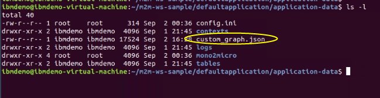

2.  From the same folder as the **custom-graph.json** file**,** modify
    the permissions for **config.ini** so that we have write permissions

        sudo chmod 777 ./config.ini

            When prompted, enter the sudo password for ibmdemo user: passw0rd

3.  Edit the **config.ini** file to reference the new
    **custom_graph.json** file to be used for regenerating the
    partition recommendations. (Use any editor available)

        gedit ./config.ini

            *** Modify the config.ini as described and illustrated below.

    a.   Modify the value for the “***UserModifiedGraph***” property to **custom_graph.json**

    b.  **Save** and **Close** the config.ini file

    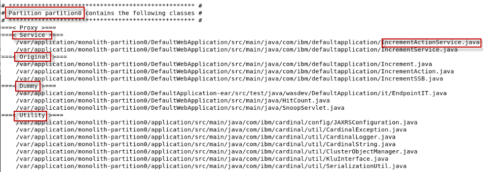

4.  Go to the Mono2Micro-CLI directory and then rerun the AI engine with
    the “**refine”** command to generate the partitioning
    recommendations based on the updated graph file.

        cd /home/ibmdemo/Mono2Micro-CLI
 
        ./mono2micro refine -d /home/ibmdemo/m2m-ws-sample/defaultapplication/application-data

    That will display the following output:
 
    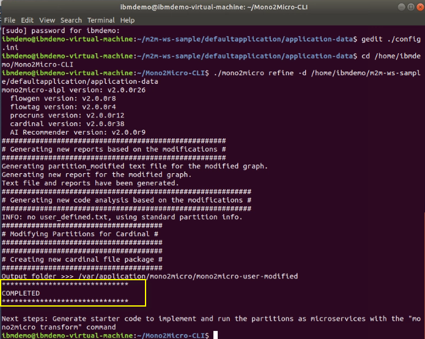

### **2.7.3 Explore the generated Cardinal report based on the customized graph and regenerated recommendations from the AI engine**

1.  The AI engine created a new folder based on the user modified graph
    in the following directory:

    > */home/ibmdemo/m2m-ws-sample/defaultapplication/application-data/mono2micro/mono2micro-user-modified*

    a.  List the files / folders of the generated directory

        ls -l /home/ibmdemo/m2m-ws-sample/defaultapplication/application-data/mono2micro/mono2micro-user-modified

    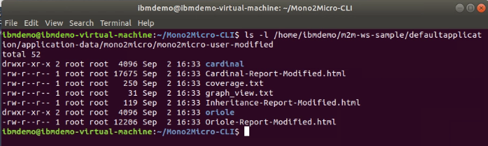

2.  View the generated Cardinal report to verify the partitions and
    exposed services are defined as expected.

        cd /home/ibmdemo/m2m-ws-sample/defaultapplication/application-data/mono2micro/mono2micro-user-modified

        google-chrome ./Cardinal-Report-Modified.html

    The Cardinal-Report provides a deep analysis of all the  inter-partition invocations, the types of all the non-primitive  parameters passed to partitions during their invocations, and oreign class references within a partition.
 
     Classes are foreign to a partition if they are defined in another  partition.
 
    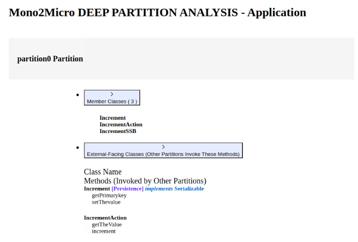 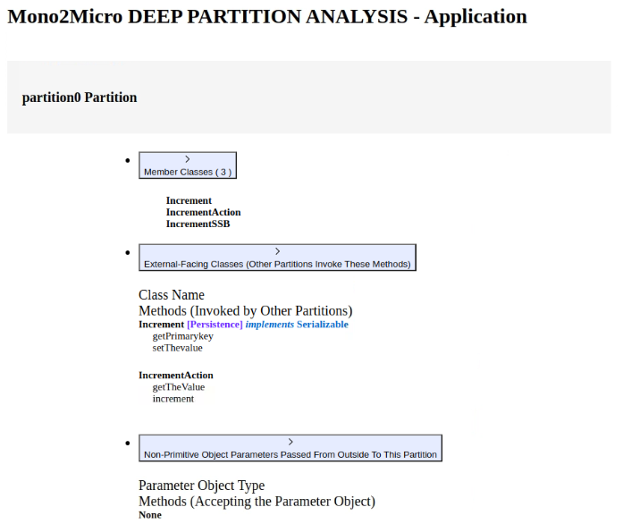
 
    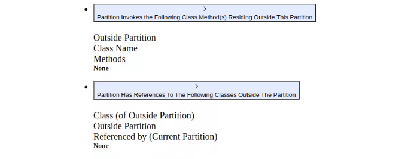
 
    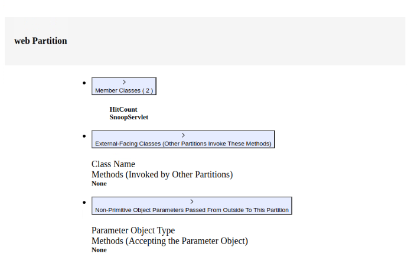
 
    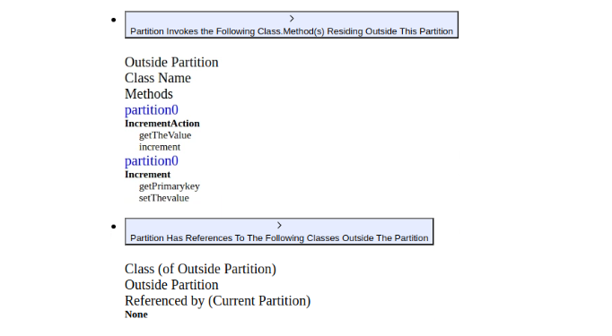

3.  Review the **partition0** Partition
    
    a.  Partition0 should include three **Member classes:**

    - Increment
    - IncrementAction
    - IncrementSSB
    
    b.  Partition0 should have two **External Facing** **classes**:

    - **IncrementAction**
    - **Increment:**

    **Note:** this class is not actually used as an external facing class  based on our application flow. Mono2Micro discovered an **indirect**  call to the increment class, after exiting the HitCount Servlet. So,  it created this class as external facing, in the event it was needed  by the new microservices. In a future release of Mono2Micro, we expect  to see these types of “indirect” or inferred calls to be distinguished  between the known direct  calls in the application business logic flow.
 
    **This results in a service class being generated by the code  generator. However, no harm, as it simply will not get called by the  HitCount application logic.**
 
    Mono2Micro detected that there are classes outside of partition0 that  call methods on the IncrementAction Class.
 
    During the code generation phase of Mono2Micro, the code generator  will generate a REST service interface for the **IncrementAction**  class and the **Increment** class so that other microservices can  make  the remote method calls in a loosely coupled Microservices  architecture.
 
    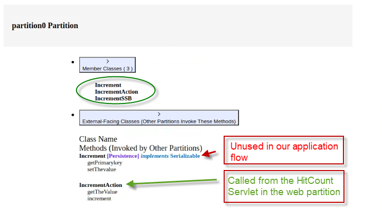

4.  Review the **web** Partition
    
    a.  The web partition should include two **Member classes:**

    - HitCount
    - SnoopServlet
    
    b.  The web partition invokes one class method residing outside of  this partition:

    - Outside partition: **partition0**
    - Class Name **IncrementAction**
    - Methods: **getTheValue** and **increment**

    Mono2Micro detected classes in the web partition that call methods in  partition0.
 
    During the code generation phase of Mono2Micro, the code generator  will generate a **Proxy** for the class to call the REST service  interface in partition0.
 
    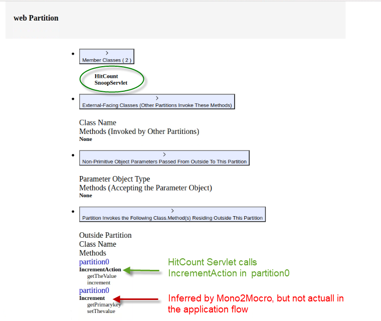

# **PART 3 Generating Initial Microservices Foundation Code**

**Objectives**

  - Learn how to use Mono2Micro tools to generate the bulk of the
    foundation microservices code, while allowing the monolith Java
    classes to stay completely as-is.

In Part 3 of the lab, you will:

1.  Use the **code generator** to generate the microservices plumbing
    code for the two microservices (front-end and back-end)

2.  From the generated starter code, refactor the transformed
    Microservices
    
    a.  Move the static and non-Java artifacts from the monolith
        application into the individual microservices
    
    b.  Refactor the minimal set of artifacts so that the transformed
        microservices will compile and run in OpenLiberty server in
        Docker containers.

    

After going through the partition recommendations generated by the AI
engine, you can use Mono2Micro to automatically generate API services
and related code to realize the potential microservice recommendations.

This is accomplished by executing the **code generator**.

Code generator automatically performs three crucial tasks for the
architects and developers in the

refactoring endeavor of realizing partitions (partitions
recommendations) as microservices.

**The tasks performed by the code generator can be listed as follows:**

  - It creates transformational wrappings to turn partition methods into
    microservices APIs

  - It provides an optimized distributed object management, garbage
    collection, and remote local reference translations like the Java
    remote method invocation mechanism.

  - It provides pin-pointed guidance on what the developers should check
    and manually readjust or tweak code in the generated partitions.

## 3.1 Run the code generator

Now, let’s run the code generator to generate the plumbing code for the
microservices.

The code generator requires the following input artifacts and is
referenced in the code generator command for proper execution:

  - The parent folder of the **original DefaultApplication monolith**
    application.

    > /home/ibmdemo/m2m-ws-sample/defaultapplication/monolith

  - The **cardinal** folder from the mono2micro-user-modified directory
    that was generated by the AI engine using the “**refine”** command.

    > /home/ibmdemo/m2m-ws-sample/defaultapplication/mono2micro-analysis-custom/cardinal

<table>
<tbody>
<tr class="odd">
<td></td>
<td>
For the lab, you will reference a saved version of the cardinal folder when running the code generator. This is just to ensure a known good dataset is used for the code generation.

/home/ibmdemo/m2m-ws-sample/defaultapplication/<strong>mono2micro-analysis-custom/cardinal</strong>

If you would rather use the cardinal folder that was generated during the lab, use:

/home/ibmdemo/m2m-ws-sample/defaultapplication/application-data/mono2micro/<strong>mono2micro-user-modified/cardinal</strong>
</td>
</tr>
</tbody>
</table>

1.  Explore the available options to run the code generator by using the
    following command:

        cd /home/ibmdemo/Mono2Micro-CLI

        ./mono2micro transform -h

    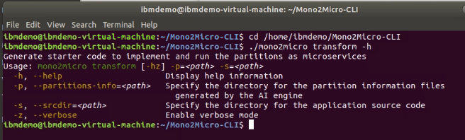

2.  Run the code generator using the following command:

        ./mono2micro transform -p /home/ibmdemo/m2m-ws-sample/defaultapplication/mono2micro-analysis-custom/cardinal -s /home/ibmdemo/m2m-ws-sample/defaultapplication/monolith

    The output will be similar to this:
 
    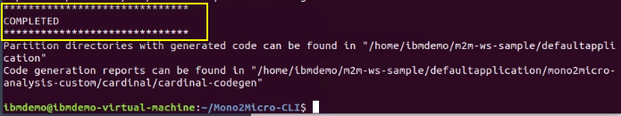
 
    Note that as part of the partitions created with the Java files, the code generator also creates, for each partition:

    - a starter Dockerfile
  
    - a Liberty Maven plugin enabled POM configuration file (pom.xml)
  
    - a server configuration file (server.xml) as part of code generation
    to accelerate the implementing and running of partitions on
    WebSphere® Liberty

    - a READ\_THIS\_FIRST.MD file, where user can read for more details.

## 3.2 Examine the Cardinal Summary report to understand what the code generator did for each partition

Upon completion of running the code generator, the plumbing code for
microservices are generated, along with several reports that provide
summary and details of the Java source files that were generated.

1.  Examine the **CardinalFileSummary.txt** file.

    This file provides a summary of all the files that were generated or  modified during the code generation.
 
    The location of the cardinal reports is indicated in the end of the  code generator log, after the “COMPLETED” status.
 
    In this case, the **cardinal-codegen** folder and **associated  reports** are generated here:
 
    > /home/ibmdemo/m2m-ws-sample/defaultapplication/application-data/mono2micro/mono2micro-user-modified/cardinal

    a.  Open the CardinalFileSummary.txt file using an available editor

        cd /home/ibmdemo/m2m-ws-sample/defaultapplication/mono2micro-analysis-custom/cardinal/cardinal-codegen

        gedit CardinalFileSummary.txt

    b.  Examine the **web partition** summary in the **CardinalFileSummary.txt** file

    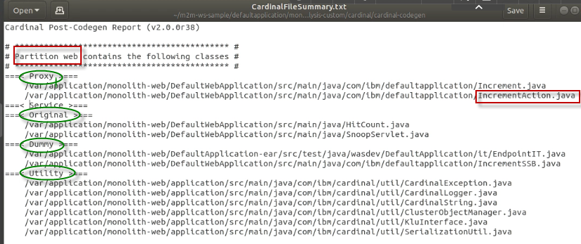
 
    This section of the report shows the classes contained in the **web** partition. The report further denotes the types of classes  that are in  the partition.

    - **Proxy** classes are created for calling out to a class to an
    outside partition via REST API. In this case, the HitCount Servlet
    in the web partition calls the IncrementAction REST Service class in
    partition0. It also generated a proxy for the “indirect/ inferred”
    call to Increment, which is not used in our case.

    <table>
    <tbody>
    <tr class="odd">
    <td></td>
    <td>
<strong>Note:</strong> When Mono2Micro identifies a monolith class as a service class in one partition, it generates a proxy class for it in all other partitions that has the same method signatures as the original monolith class.

    
Now if these monolith classes happened to have annotations at the class or method level that can make the application server treat the class in a special way (i.e. the @Entity annotation can make a simple java class into a JPA entity with respect to the app server), then Mono2Micro will remove these kinds of Java EE annotations on the proxy class.
</td>
    </tr>
    </tbody>
    </table>

    - **Service** classes are generated REST Service interface classes. A service class is generated for each Java class that is receiving  proxied requests from one partition to another via REST API.

    - **Original** classes are the classes that already existed in the  monolith and will remain in the web partition. In this case, the    SnoopServlet and HitCount servlet are kept as original.

    - **Dummy** classes are classes that were in the monolith but will now  exist in a different partition. The Dummy classes throw an exception  that is defined in the Utility classes that are created in every  partition.

    - **Utility** classes are created to handle the plumbing such as     serialization, exceptions, logging, and interfaces for the new     microservices.

2.  Scroll down and examine the **partition0** **partition** summary in
    the CardinalFileSummary.txt file

    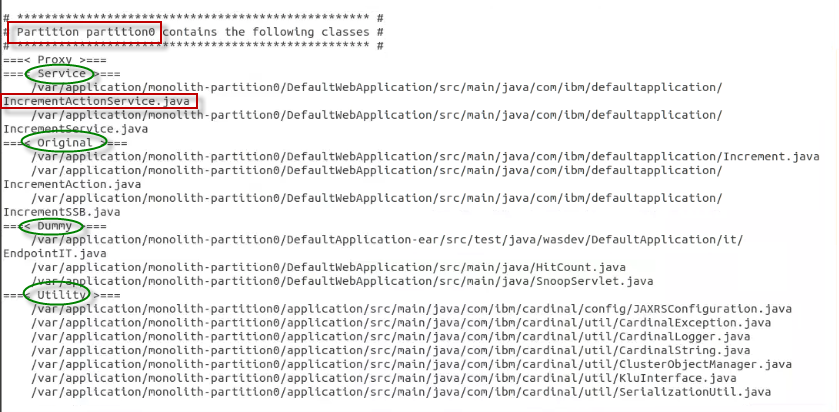
 
    This section of the report shows the classes contained in the  **partition0** partition. The report further denotes the types of  classes that are in the partition.

    -  **Proxy** classes are created for calling out to a class to an outside partition via REST API.

    - **Service** class, IncrementActionService is created based on the  web partition calling to the IncrementAction class in partition0 via REST API.
    
      - Mono2Micro code generator also generated a Service Class for the
        “Increment” class. However, as mentioned earlier, this service
        class is not actually used in our case.

    -  **Original** classes are the classes that already existed in the
     monolith and will remain in the web partition. In this case, the
     Increment, IncrementAction, and IncrementSSB classes will remain
     in the partition0.

    -  **Dummy** classes are classes that were in the monolith but will
     now exist in a different partition. The Dummy classes throw an
     exception that is defined in the Utility classes that are created
     in every partition. The SnoopServlet and HitCount Servlet will be
     in the web partition.

    -  **Utility** classes are created to handle the plumbing such as
     serialization, exceptions, logging, and interfaces for the new
     microservices.

3.  **Close** the editor for the CardinalFileSummary.txt file

## 3.3 Examine the Java code that was generated by the code generator

The code generator produces the Java source files in separate folders
for each partition and are named according to their respective
partitions.

The location of the Java source files is in a folder named
**“\*-partiton0**” and **“\*-web**”.

The actual folder name is dependent upon the input paths specified on
when running the code generator.

In our case, the actual folder names are:

  - monolith-web

  - monolith-partition0

The root folder for the generated source files is also dependent on the
input paths specified when running the code generator.

In this case, the monolith-web and monolith-partitio0 folders are
generated here:

> /home/ibmdemo/m2m-ws-sample/defaultapplication

<table>
<tbody>
<tr class="odd">
<td></td>
<td>
For the purpose of this lab, it is not necessary to understand the details of all the code that code generator produces. However, we strongly recommend learning this before using Mono2Micro with a production application. 

<strong>APPENDIX A: Examine the Java Code generated by Mono2Micro</strong> provides a detailed look at these generated files.
</td>
</tr>
</tbody>
</table>

## 3.4 Refactoring Non-Java Parts of Monolith, Further Code Changes, and Deploying Final Partitions as Microservices

After Mono2Micro generates the initial microservices plumbing code and
places that along with the monolith classes into each partition, the
foundations of the microservices are now there.

That is, each partition is meant to run as a microservice, deployed on
an application server (such as WebSphere Liberty) where the monolith
classes’ public methods are served up as REST API. Each partition is
effectively then a mini version of the original monolith, its folder
structure mirroring the original monolith folder and module structure.

To build and run each partition, more than just the Java code is needed
of course. And here is when a key question is usually raised: *What
exactly does one do with the non-Java parts of the monolith with respect
to each partition, and how, to facilitate the final goal of running all
partitions as microservices*?

**One Approach:**

One approach that you will follow for the DefaultApplication example and
highly recommend for most Java applications is as follows:

1.  Copy \*all\* the non-Java files in the monolith (i.e. the build
    config files such maven’s pom.xml or gradle files, server config
    files such as WebSphere’s server.xml, Java EE meta-data and
    deployment descriptors such as application.xml, web.xml,
    ejb-jar.xml, persistence.xml etc) to \*every\* partition, following
    the same directory structure which will partially already exist in
    each partition.

    At this point it is important to mention that the code generator also creates a starter Dockerfile, a Liberty Maven plugin enabled POM configuration file (pom.xml), and a server configuration file  (server.xml) as part of code generation to accelerate the mplementing  and running of partitions on WebSphere® Liberty. However, just as a rough simplification for this workshop, we will just copy and paste  all existing files from the original monolith.

2.  Starting with that as a base, the aim then is to pare down and
    incrementally reduce the content of all these files (based on
    knowledge of what functionality each partition entails, and/or
    through an iterative compile-run-debug process), ending up with just
    the needed content in each partition.

3.  After this is done, each partition will indeed be a mini subset of
    the original monolith and working together with all the other
    running partitions and finally become microservices that provide the
    exact same functionality as the original monolith.

As each partition is now becoming a separate microservice project and
will be developed and deployed independent of the other microservices,
ideally, you would create Java projects in your favorite IDE and follow
these basic steps for new microservice projects:

1.  Create a Java EE web project for each partition and set the runtime
    target a WebSphere Liberty installation

2.  Import the partition from the filesystem into the project

3.  Ensure all partitions module folders containing Java source files
    are correctly configured as source folders within the Eclipse tools,
    rooted where the package directories are (this includes the monolith
    module folders as well as the application utility code folder
    generated by the code generator. (See previous section)

4.  Build the project and observe any compilation errors

In this lab, you will make the minimal set of changes for the **web**
and **partition0** partitions that are required to **compile** and
**run** the front-end microservice (web) and the back-end microservice
(back-end) in **Liberty** Server in **containers**.

It is beyond the scope of this lab to take each microservice through the
iterative development process in an IDE. But you will get the point, if
you spend a little time reviewing the updates that are done via the
provided scripts. It’s not that extensive for this simple application.
 

### **3.4.1 Move the original non-Java resources from the monolith to the two new partitions**

As described in item \#1 above, the first step is to Copy “**all**”
non-Java files to “**every**” partition, following the same directory
structure which will partially already exist in each of the generated
partitions.

For this lab, a shell script has been provided for you, which will copy
all the resources to the partitions.

This is the first step to refactoring the partitions. Further
refactoring of these artifacts is unique to the microservice
functionality in each partition.

**The script performs the following tasks:**

  - Copies the various **pom.xml** files to both partitions

  - Copies all the **webapp** artifacts (html, jsp, xml) files to both
    partitions

  - Copies the **application EAR** resources to both partitions

  - Copies the **Liberty** server configuration file to both partitions

  - Copies the **database** configuration files to the back-end
    partition

1.  Review the **moveResourcesToPartitions.sh** shell script.

        cd /home/ibmdemo/m2m-ws-sample/defaultapplication/scripts

        gedit moveResourcesToPartitions.sh

    a.  The script defines a bunch of variables referencing various
    directories for copying files

    b.   The script uses sudo to change directory permissions to allow
     write access to the partitions that mono2 micro generated

    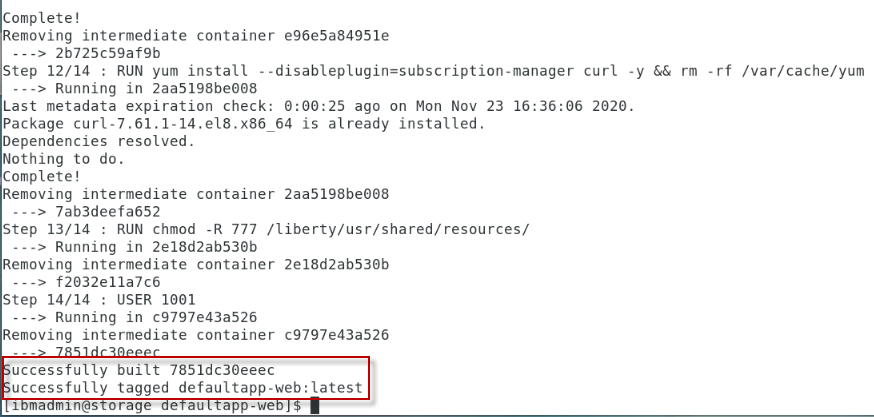

    c.  The script copies non-java resources from the monolith application
    to the (front-end) web partition

    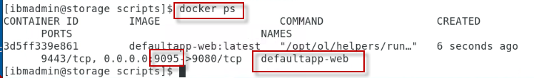

    d.  The script copies non-java resources from the monolith application to the (back-end) partition0 partition

    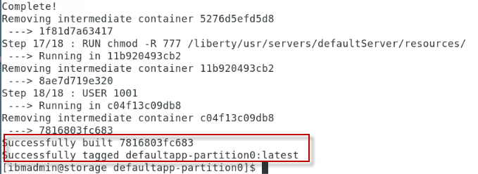

2.  **Close** the editor

    To speed up copying files, run the moveResourcesToPartitions.sh script to do it for you.

3.  Run the script to copy the non-java resources to the partitions

        cd /home/ibmdemo/m2m-ws-sample/defaultapplication/scripts

        ./moveResourcesToPartitions.sh

            When prompted for a password, enter: passw0rd

            Note: That is a numeric zero in passw0rd

4.  Use a graphical **File Explorer** 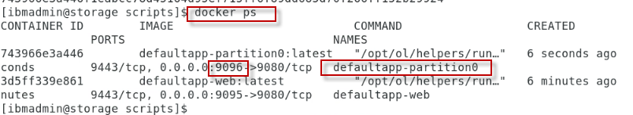 or
    **Terminal** window to see the non-Java files now in each of the
    partitions, and in the same directory structure as the original
    monolith.
    
    a.  Navigate to the following directories to explore the newly added **non-Java** resources. Refer to the shell script to see what exactly was copied.

    - /home/ibmdemo/m2m-ws-sample/defaultapplication/monolith-web

    - /home/ibmdemo/m2m-ws-sample/defaultapplication/monolith-partition0

### **3.4.2 Refactor the original non-Java resources as required for the front-end and back-end partitions**

At this point, every partition contains all the Java and non-Java files
necessary for the application.

Starting with that as a base, the next step is to pare down and
incrementally reduce the content of all these files, ending up with just
the needed content in each partition to build and run the microservice.

In this lab, you will focus only on the refactoring that is required for
the partitions to compile and run in Docker containers. An iterative for
further paring down the content is beyond the scope of this lab.

To simplify the refactoring activities for this lab, a shell script has
been provided that performs the refactoring required such that each
partition (microservice) will compile and run on their own Liberty
Server in separate Docker containers.

**The script performs the following tasks for the web partition:**

  - Create a new **pom.xml** file to build the Cardinal Utility classes
    generated by Mono2Micro

  - Updates the top level **pom.xml** file to include the Cardinal
    Utilities module to be built with the app

  - Updates the DefaultWebApplication **pom.xml** file to remove Java
    persistence dependency

  - Update the DefaultApplication-ear **pom.xml** file to remove the
    database config

  - Update the DefaultApplication-ear **pom.xml** file to add Dependency
    for Cardinal Utility classes

  - Update Liberty **server.xml** file to remove database / datasource
    configuration

  - Add a **dockerfile** to build the Microservice and Docker image
    running on Liberty

**The script performs the following tasks for the partition0 partition:**

  - Create a new **pom.xml** file to build the Cardinal Utility classes
    generated by Mono2Micro

  - Updates the top level **pom.xml** file to include the Cardinal
    Utilities module to be built

  - Updates the DefaultWebApplication **pom.xml** file to remove Java
    persistence dependency

  - Update the DefaultApplication-ear **pom.xml** file to remove the
    database config

  - Update the DefaultApplication-ear **pom.xml** file to add Dependency
    for Cardinal Utility classes

  - Update and move the **JAXRSConfiguration.java** file to
    DefaultWebApplication class path.
    
      - Update the package in the Java file to match source location in
        the module.
    
      - This Java file is generated by Mono2Micro

  - Update the **IncrementActionService.java** file
    
      - This Java file is generated by Mono2Micro.
    
      - This works around a known issue with conflicting import
        statements in the Java file

  - Add a **dockerfile** to build the Microservice and Docker image
    running on Liberty

       

1.  Run the **refactorPartitions.sh** shell script to perform the
    partition refactoring

        cd /home/ibmdemo/m2m-ws-sample/defaultapplication/scripts

        ./refactorPartitions.sh

            If prompted for a password, enter: passw0rd

            Note: That is a numeric zero in passw0rd

    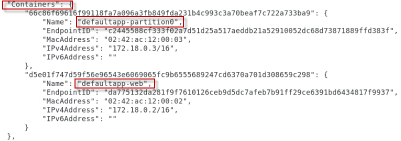
 
    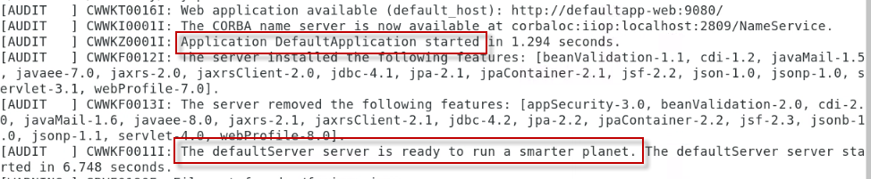
 
    In a production application, refactoring the resources within each  Microservice could take significant time.
 
    The aim is to pare down and incrementally reduce the content of all these files (based on knowledge of what functionality each  microservice entails) and through an iterative “compile-run-debug”  process, ending up with just the needed content for each microservice.
 
    If you are interested in the details of the refactored files that were pared down for this lab, refer to **APPENDIX B** in this lab guide.

|                                            |                                                                                                                            |
| ------------------------------------------ | -------------------------------------------------------------------------------------------------------------------------- |
|  | **APPENDIX B: Examine the Refactored resources after code generation** provides a detailed look at these refactored files. |

 

**3.4.3 Deploy Partitions as Containerized Microservices**

To portably run the builds of all the partitions, and at the same time
prepare them for containerization, you can use Docker based builds right
from the start.

Let’s create a multi-stage dockerfile for each partition:

  - Stage 1: Performs the Maven build and packaging of the deployable
    artifacts (WAR, EAR, JAR)

  - Stage 2: Creates the Docker image from OpenLiberty, and adds the
    application, server configuration, and other configurations required
    for the partitions (Derby DB config)

    The dockerfile is slightly different for each partition since each partition will require unique configurations for its Microservice.

     

1.  Navigate to the **Dockerfile** in the **web** **partition** to view
    this update.

        gedit /home/ibmdemo/m2m-ws-sample/defaultapplication/monolith-web/Dockerfile

    
 
    **Build Image stage:**

    - Performs the Maven Build and package of the application based on the  pom.xml files in the project.

    **Production Image stage:**

    - Pulls the Universal base Image (UBI) of Open-Liberty Docker image
    from Dockerhub. The Universal Base Image is the supported images
    when deploying to RedHat OpenShift.

    - Copy the EAR to the Liberty apps directory, where Liberty will
    automatically start when the container is started.

    - Copy the Liberty server configuration file to Liberty config
    directory, which is used to configure the Liberty runtime.

    - As root user, curl is installed as a tool for helping to debug
    connectivity between Docker containers. This is not required.

    - As root user, update the permissions on the shared resources folder
    in Liberty

    **ENV Variables required by Mono2Micro**
 
    Additionally, each partition is passed environment variables  specifying the end point URLs for JAX-RS web services in other  partitions.

    -  The generated code uses these environment variables in the proxy
     code to call the JAX-RS services

    -  It is important to note that for JAX-RS, URLs cannot contain
     underscores.

    **Example ENV Variable for the web partition:**

    > ENV  APPLICATION\_PARTITION0\_REST\_URL=http://defaultapp-partition0:9080/rest/

    - When running in Docker, a docker network must be set up so that  all partitions can communicate with each other. Yu did this in the  lab.

    -  All partitions in this lab use port 9080 internally within the
     Docker environment, but expose themselves on separate ports
     externally to the host machine

    -  Using this scheme as a base, a Kubernetes deployment can be set up
     on a cluster where each container acts a **Kubernetes service**

    When running in Docker, the **hostname** must match the “**Name**” of  the container as known in the Docker Network.

    -  Use command: “**docker network list”** to see the list of docker networks
    
    -  Use command: “**docker network inspect \<NETWORKNAME\>”** to     see the container names in the Docker network.

     > Where \<NETWORKNAME\> is the name of the Docker network to  inspect
 
    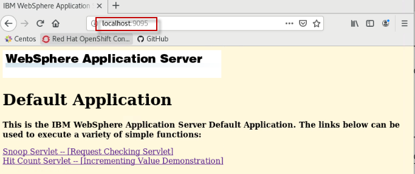

2.  Navigate to the **Dockerfile** in the **partition0 partition** to
    view this update.

        gedit /home/ibmdemo/m2m-ws-sample/defaultapplication/monolith-partition0/Dockerfile

    **Build Image stage:**

    - Performs the Maven Build and package of the application based on the pom.xml files in the project.

    **Production Image stage:**
 
    In addition to the steps that were performed in the web partition, these additional steps are required for the partition0 Microservice  deployment.

    - Copies the Derby DB zip file to the shared resources folder for
    Liberty. The Maven build has a step to unzip the Database contents.

    - Copies the Derby database JDBC library to Liberty’s shared resources
    folder

    **Note:** The partition0 partition does not require any Mono2Micro ENV variables to be set since this partition does not make any REST API calls to other partitions.
 
    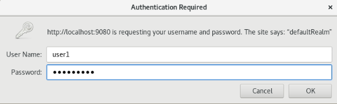

## 3.5 Build (Compile) the transformed Microservices using Maven

In the previous sections of the lab, you used the Mono2Micro tools to
transform the original monolith application into two microservices.

Then, using the convenience scripts we provided, you started to refactor
the microservices by moving the non-java resources and Liberty
configuration into the microservices projects.

You further refactored the microservices by paring down the non-java
configuration files, Liberty configuration, and Maven build artifacts to
include only the configuration required to build and run each of the
microservices in their own Liberty runtime in containers.

At this point, it would be a good idea to do a quick compilation of the
microservices to see if there are any compilation or build errors. Then,
iterate on the refactoring of each microservice, as needed.

Ideally, developers would do try doing a quick compilation of the
generated code by using an IDE tailored to support Java EE and the
application server.

Using an IDE for development is beyond the scope of this lab. Instead,
you will simply use Maven to test the compilations of the microservices
and observe any compilation errors.

1.  Compile the **monolith-web** microservice via command line
    
    a.  Change to the **monolith-web** directory, which contains the top-level pom.xml for building the monolith-web microservice

        cd /home/ibmdemo/m2m-ws-sample/defaultapplication/monolith-web

    b.  Run the Maven Build to compile and package the microservice

        mvn clean install

    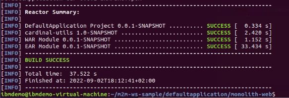

2.  Compile the **monolith-partition0** microservice via command line
    
    a.   Change to the **monolith-partition0** directory, which         contains the top-level pom.xml for building the monolith-web         microservice

        cd /home/ibmdemo/m2m-ws-sample/defaultapplication/monolith-partition0

    b.  Run the Maven Build to compile and package the microservice

        mvn clean install

    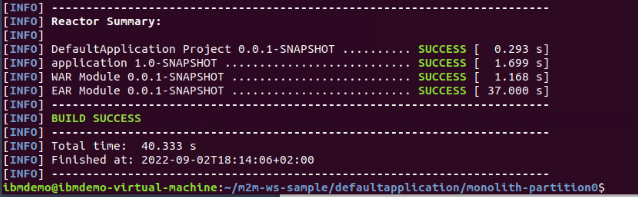

At this point in the lab. you are ready to build and run the
DefaultApplication as microservices in containers using Docker. The
microservices were transformed using Mono2Micro, using resources we
provided in the Git Repo.

# **PART 4 (OPTIONAL) Build and run the Transformed Java Microservices Using Docker**

The goal of this section is to let you build and deploy the transformed
Microservices to Docker containers and see the working state of the
transformation process yourself.

**Objectives**

  - See the transformed monolith application running as independent
    microservices on OpenLiberty in separate Docker containers, before
    you use Mono2Micro to transform the monolith in this lab.

  - Learn how to build and run the transformed microservices with Docker
    and OpenLiberty

**The basic steps in this section of the lab include:**

  - Using Docker, build the two transformed microservices for the
    application

  - Setup a local Docker Network for the local docker containers to
    communicate

  - Start the docker containers and run the microservices based
    application

  - View the microservices logs to see the communication and data
    flowing between the services as you test the application from a web
    browser

1.  Let’s do a basic review of the two **microservices** that form the
    **DefaultApplication** used in this lab

    First, notice that there are two services. Mono2Micro places these services into logical partitions.

    - The “**web**” partition is the UI front-end microservice. It
    includes the HTML, JSPs, and Servlets, all needed to run within the
    same Web Container, according to JEE specifications.

    - The “**partition0**” partition (which I should rename) is the
    backend service for the **IncrementAction** service. It contains an
    EJB and JPA component that is responsible for persisting the data to
    the embedded Derby database used by the microservice.

    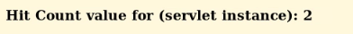
 
    Web partition (front-end microservice) invokes partition0 (back-end),  when the **HitCount Service** via **EJB** is executed by the user.
 
    What happens is the HitCount Servlet in the “**Web partition**”  invokes a Rest Service interface in “**partition0**” through a local  HitCount proxy, both generated by Mono2Micro as plumbing code for  invoking the RESTful Microservices.
 
    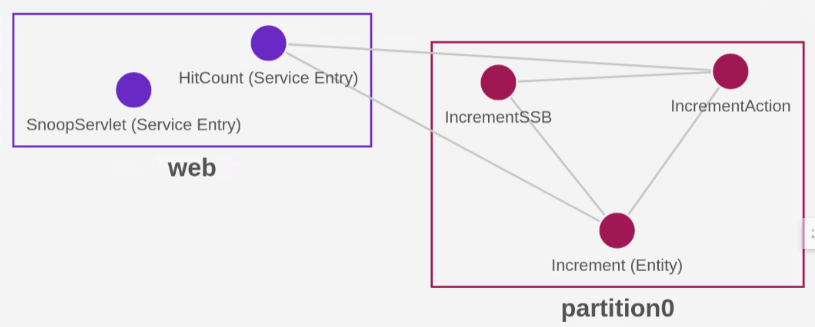

2.  Create a **Docker Network** for the two containers to communicate

    You will use Docker to build and run the microservices based  application. For the Docker containers to communicate, a local Docker  network is required.
 
    **Tip:** Later, when you launch the Docker containers, you will  specify the network for the containers to join, as command line  options.

        docker network create defaultappNetwork

        docker network list

    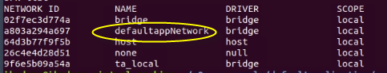

    |                                         |                                                                                                                                                                              |
    | --------------------------------------- | ---------------------------------------------------------------------------------------------------------------------------------------------------------------------------- |
    |  | **Note:** When using a Kubernetes based platform like RedHat OpenShift, the service-to-service communication is automatically handled by the underlying Kubernetes platform. |

3.  Build the **defaultapplication-web** **(front-end)** container

    This container is the web front end service. It contains the html,  jsp, and servlets.
 
    The **defaultapp-web** folder contains the Dockerfile used to build  the front-end microservice.

        cd /home/ibmdemo/m2m-ws-sample/defaultapplication/microservices/defaultapp-web

        docker build -t defaultapp-web . | tee web.out

    The dockerfile performs these basic tasks:

    - Uses the projects pom.xml file to do a Maven build, which produces
    the deployable EAR.

    - Copies the EAR file and OpenLiberty Server configuration file to the appropriate location in the Docker container for the microservice to start once the container is started.

    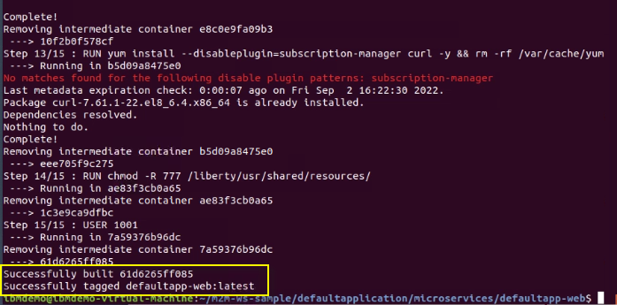

4.  Start the **partition-web (front-end)** docker container

    Notice the command line options that are required for the microservice to run properly.

    - The partition-web container needs to expose port 9095 for the
    application to be invoked from a web browser. The OpenLiberty sever
    is configured to use HTTP port 9080 internally.

    - The container must be included in the **defaultappNetwork** that you defined earlier. The back-end microservice will also join this
    network allowing the services to communicate with one another.

          docker run --name=defaultapp-web --hostname=defaultapp-web --network=defaultappNetwork -d -p 9095:9080 defaultapp-web:latest

          docker ps | grep defaultapp

    **Note:** The application is exposed on port **9095** and running on port 9080 in the container.

    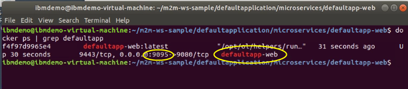

5.  Build the **defaultapplication-partition0 (back-end)** container

    This container is the back-end service. It contains EJB and JPA  components that persists data to the Derby database, when the user  executes the HitCount service with the EJB option.
 
    **Tip:** Ensure you are in the following directory before running the build:

    > /home/ibmdemo/m2m-ws-sample/defaultapplication/microservices/defaultapp-partition0

 
    The **default-partition0** folder contains the dockerfile used to  build the back-end microservice.

        cd /home/ibmdemo/m2m-ws-sample/defaultapplication/microservices/defaultapp-partition0

        docker build -t defaultapp-partition0 . | tee partition0.out

    **The dockerfile performs these basic tasks:**

    - Uses the projects pom.xml file to do a Maven build, which produces
    the deployable EAR.

    - Copies the EAR file and OpenLiberty Server configuration file to the
    appropriate location in the Docker container for the microservice to
    start once the container is started.

    - Copies the Derby Database library and database files to the
    container

    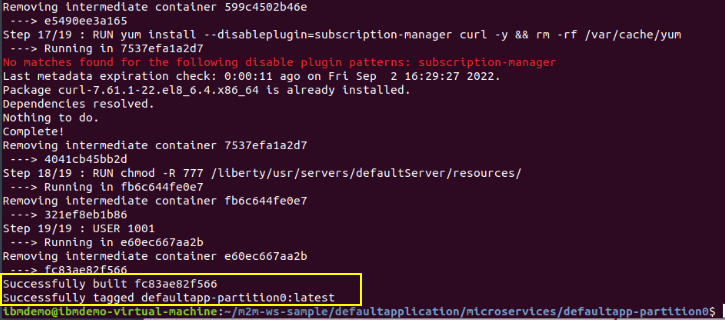

6.  Start the **partition-partition0 (back-end)** docker container

    Notice the command line options that are required for the microservice to run properly.

    - The partition-partition0 container exposes port 9096.This is only
    necessary if we want to hit the Service interface directly while
    testing.

    - The container must be included in the **defaultappNetwork** that you defined earlier.

          docker run --name=defaultapp-partition0 --hostname=defaultapp-partition0 --network=defaultappNetwork -d -p 9096:9080 defaultapp-partition0:latest

          docker ps | grep defaultapp-partition0

    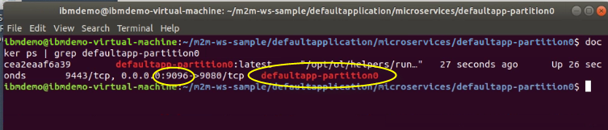
 
    **Note:** The application is exposed on port **9096** and running on port 9080 in the container

7.  Inspect Docker’s **defaultappNetwork** and ensure both microservices
    are joined in the network

        docker inspect defaultappNetwork

    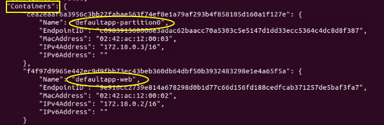
 
    The microservices are now running on separate OpenLiberty servers in the local Docker environment.
 
    In the next section, you will test the microservices application from a web browser.

## 4.1 (OPTIONAL) View the OpenLiberty Server logs for the microservices

At this point, the microservices should be up and running inside of
 their respective docker containers.
 
First, you will look at the OpenLiberty server logs for both
 microservices to ensure the server and application started
 successfully.

1.  View the server log in the **partition-web (front-end)** docker
    container
    
    a.  Open a new Terminal window
    
    b.  Run the following command to view the OpenLiberty Server log in the defaultapp-web container

        docker logs defaultapp-web

    You should see messages indicating the DefaultApplication and the  defaultServer have been successfully started and is running.

    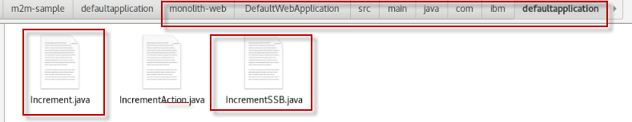

2.  View the server log in the **partition-partition0 (back-end)**
    docker container
    
    a.  Open a new Terminal window
    
    b.  Run the following command to view the OpenLiberty Server log  in the defaultapp-partition0 container

        docker logs defaultapp-partition0

    You should see messages indicating the DefaultApplication and the  defaultServer have been successfully started and is running.

    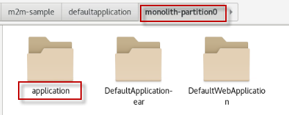

## 4.2 Test the microservices from your local Docker environment

Once all the containers have started successfully, the  DefaultApplication can be opened at <http://localhost:9095/>
 
In this section, you will run the microservices based application,  using the variety of options in the application user interface.

1.  Launch a web browser and go to
    [**http://localhost:9095/**](http://localhost:9095/)

    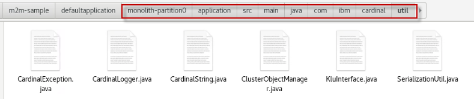

2.  Invoke the “**Snoop Servlet**”, which is running in the
    defaultapp-web (front-end) Microservice

    The Snoop Servlet requires authentication, as defined in the  OpenLiberty server configuration. The credentials to access the Snoop servlet is:
 
    > Username: **user1**
 
    > Password: **change1me**
 
    
 
    

3.  Click the Browser back button 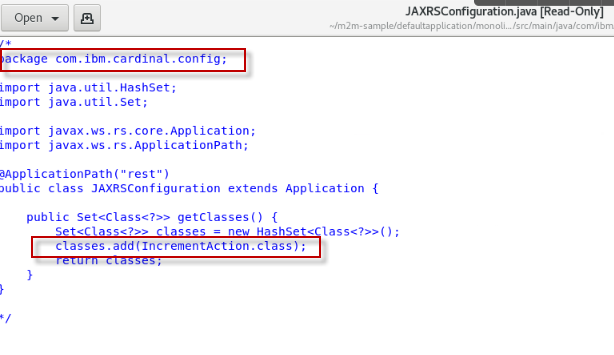 to
    return to the DefaultApplication main HTML page

    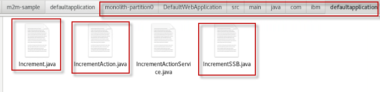
 
    Next, you will run the **HitCount** service. The HitCount service can  be run using a variety of options that illustrate different mechanisms  of handling application state in JEE applications.
 
    You will learn a little about the application that pertains to the  microservice based application that now makes distributed REST API  calls between services.

<table>
<tbody>
<tr class="odd">
<td></td>
<td>
When using Mono2Micro for application analysis and microservice recommendations, we chose to separate the WEB UI components into a microservice and place the EJB components that interact with the back-end database into its own microservice.

This approach provides separation of the front-end from the back-end as a first pass for adopting a microservices architecture for the DefaultApplication.

This was not the only option, and we understand that further refactoring might be necessary. But this is a good first step to illustrate the capabilities of Mono2Micro.
</td>
</tr>
</tbody>
</table>

4.  Here is a brief introduction to the multiple methods of running the
    HitCount Service

    - As illustrated below, selecting any of these three (3) options from
    the application UI, the HitCount service runs using the local Web
    Container session / state and runs the defaultapp-web (front-end)
    microservice.

      -  Servlet instance variable
      -  Session state (create if necessary)
      - Existing session state only

    - Selecting **the Enterprise Java Bean (JPA)** option from the
    application, the Web front-end microservice calls out to the
    back-end microservice.

      - Enterprise Java Bean (JPA)
 
    It calls the IncrementAction REST service in the efaultapp-container0
 container. The REST endpoint invokes an EJB which uses JPA to persist  to the Derby database. Using this option also requires a selection for  **Transaction Type**.
 
    

5.  Run the HitCount service, choosing each of the three options below.

    - Servlet instance variable
    - Session state (create if necessary)
    - Existing session state only

    You should see a message in the HTML page indicating the Hit Count value: An ERROR message is displayed in the event of an error.

    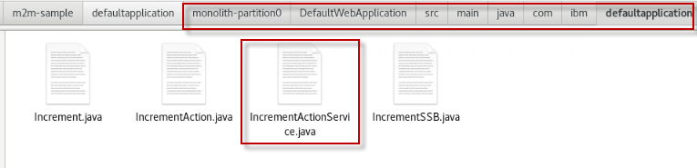

<table>
<tbody>
<tr class="odd">
<td></td>
<td>
<strong>TIP:</strong> The logging level in the Mono2Micro generated code has been set to “INFO” in the source code.

This means that logging statements will be generated in the server log file for all inter-partition calls.

In the defaultapp-web partition, the logs will show calling the IncrementAction Rest service running in defaultapp-partition0 (back-end) service

In the defaultapp-partition0 (back-end) partition, the logs will show the response being sent back to the caller.
</td>
</tr>
</tbody>
</table>

Since using any of these options above run ONLY in the defaultapp-web
(front-end) container, you will not see anything of significance logged
in the server log files. This is expected behavior.

6.  Run the HitCount service, choosing the **Enterprise Java Bean
    (JPA)** option:
    
    a.  Invoke the HitCount service multiple times, selecting different options for “**Transaction Type**”

7.  View the server logs from both microservices

    In this case, the front-end microservice does call the back-end microservice, and you will see relevant messages in their corresponding log files.

        docker logs defaultapp-web

        docker logs defaultapp-partition0

        
    **Output from defaultapp-web container**
 
    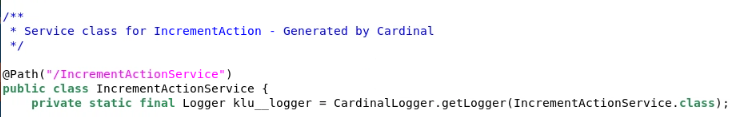
 
    **Output from defaultapp-partition0 container**
 
    

8.  **Close** the Web Browser window

    **You have successfully built run the DefaultApplication that was  transformed using the IBM Mono2Micro.**
 
    The converted application has also been deployed locally in Docker  containers running OpenLiberty Server, which is ideally suited for  Java based microservices and cloud deployments.
 
    Now that you have seen the transformed application in action, it is  time to use Mono2Micro and perform the steps that produced the  transformed microservices.

**That completes the end-to-end lab: Using Mono2Micro to transform a
Java monolith application to Microservices.**

# **Conclusion**

In this lab, you gained significant hands-on experience using Mono2Micro
in a full end-to-end flow.

You started by building and running the final transformed microservices
based application in Docker containers running on Liberty server.

Then, you started from the beginning with a Java EE monolith
application, using the AI-driven Mono2Micro tools to analyze it and
recommend the different ways it can be partitioned for potential
microservices.

Using Mono2Micro’s workbench UI, you further customized the partitioning
to suit our specific requirements.

You then used the unique code generation tool to generate a bulk of the
foundation microservices code, while allowing the monolith Java classes
to stay completely as-is without any rewriting.

And then with further manual refactoring of the non-Java aspects of the
monolith, a set of microservices are deployed in containers that
provides the exact same functionality as the monolith application.

# **APPENDIX A: Examine the Java Code generated by Mono2Micro**

## A.1 Explore some notable Java resources generated in the web partition

> Fully exploring all the resources in detail is beyond the scope of
> this lab. You will explore a few of the key resources in the
> partitions. Feel free to explore in more detail if you desire.

1.  Using the File Explorer, navigate to the **monolith-web** directory

    > Home \> m2m-ws-sample \> defaultapplication \> monolith-web

2.  First, let’s look at the **UTILITY** classes in the **application**
    subdirectory of the monolith-web folder.

    Notice the folder named “**application**”. This folder contains the
 **Utility** classes that handles the plumbing for the microservices.
 It has classes for handling serialization, exceptions, logging, etc.
 These classes are generated for ALL partitions.
 
    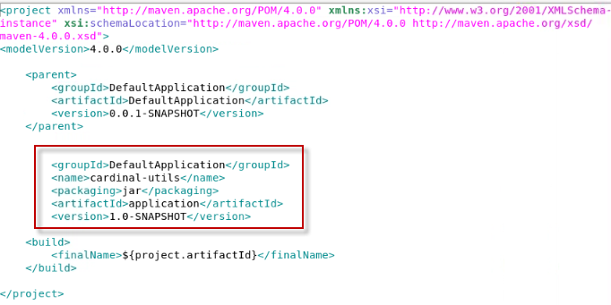
 
    
 
    **Tip:** The default name for the Utility classes is “application”.
 However, this is configurable in the **app\_config.txt** file that is
 generated by the AI engine.
 
    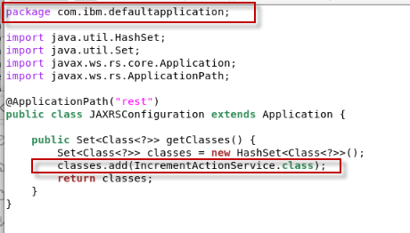
 
    The **app\_config.txt** file is located here:
 
    > /home/ibmdemo/m2m-ws-sample/defaultapplication/mono2micro-analysis-custom/cardinal

3.  Explore the **DefaultWebAplication** subdirectory in the
    **monolith-web** folder.
    
    a. **Original** classes: The original **HitCount**.java and
        > **SnoopServlet** classes are copied directly from the original
        > monolith application

    

    b  **Proxy class:** The **code generator** generated a proxy class for **IncrementAction.** The proxy invokes the IncrementActionService URL in partition0.

    

    c. **Dummy classes:** The **code generator** generated Dummy classes
     for classes that are present in the original monolith but are
     moved to a different partition. The Dummy classes simply throw
     custom exceptions in the event these classes are
     unexpectedlyinvoked.

    Dummy classes for **Increment.java** and **IncrementSSB.java** were generated.

    

## A.2 Explore some notable Java resources generated in the partition0 partition

> Fully exploring all the resources in detail is beyond the scope of
> this lab. You will explore a few of the key resources in the
> partitions. Feel free to explore in more detail if you desire.

1.  Using the File Explorer, navigate to the **monolith-partition0**
    directory

    > Home \> m2m-ws-sample \> defaultapplication \> monolith-partition0 |

2.  The **UTILITY** classes in the **application** subdirectory of the
    **monolith-partition0** partition are the same as those generated in
    the web partition. These utility classes are required from each
    microservice.

    Notice the folder named “**application**”. This folder contains the
 **Utility** classes that handles the plumbing for the microservices.
 It has classes for handling serialization, exceptions, logging, etc.
 These classes are generated for ALL partitions.
 
    
 
    

3.  The **code generator** produced a Java resource named
    **JAXRSConfiguration.java**. This file is in the “**config**”
    sub-directory under the **application** subdirectory of the
    monolith-partition0 partition.

    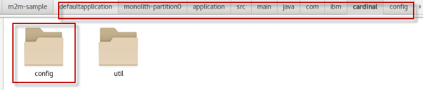
 
    As part of the utility code that the **code generator** produces, a
 **JAXRSConfiguration** class is generated per partition.
 
    For now, it is important to know this class sets up the JAX-RS config
 where all **service classes** are registered and is meant to be copied
 over and placed in one Java EE module of your preference within each
 partition.
 
    You will work with this file later in the lab as you do final
 preparation of the microservices for deployment to Liberty Servers in
 Containers.
 
    
 
    **user_defined.txt**
 
    A related file that you might notice is the presence of a
 user_defined.txt file in
 /home/ibmdemo/m2m-ws-sample/defaultapplication/mono2micro-analysis-custom/cardinal
 which the **code generator** reads on start-up**, if one exists**.
 
    This is a way to provide a list of one or more monolith classes that
 are to be treated as “external facing”, where classes outside its
 partition might call into it. These external facing classes are also
 called “service classes” in Mono2Micro nomenclature.
 
    Recall that the deep partition analysis report Cardinal-Report.html
 generated by the AI engine lists all external facing classes per
 partition that the AI analysis deemed necessary… but there could
 always be cases where some classes were not called out as such
 (typically due to insufficient use cases being run that allows
 Mono2Micro to observe this external facing behavior).
 
    The **user_defined.txt** file provides the ability to define  additional Java classes as external facing “service classes”, if  needed.

4.  Explore the **DefaultWebApplication** subdirectory in the
    **monolith-partition0** folder.
    
    a.  **Original** classes: The original classes are copied directly
        from the original monolith application:

    - Increment.java
    - IncrementAction.java
    - IncrementSSB.java

    

    b.   **Service class:** The **code generator** produced a Service class names **IncrementActionService.** The service class is the REST Service interface to the IncrementAction service.

    

    

    c. **Dummy classes:** The **code generator** produced Dummy classes
     for classes that are present in the original monolith but are
     moved to a different partition. The Dummy classes simply throw
     custom exceptions in the event these classes are
     unexpectedlyinvoked.

    Dummy classes for **HitCount.java** and **SnoopServlet.java** were  generated. 

    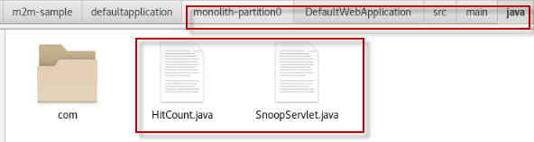

# **Appendix B:** **Examine the Refactored resources after code generation** 

In this appendix, you will explore a variety of refactored resources
that are representative of the types of refactoring required from many
Java application. We will not explore every refactored file. However.
You may explore deeper, if desired.

## B.1 Code Generator Utility Code Module

Firstly, to build the generated utility code in each partition, It kept
the generated application/ folder, but could have chosen to rename it to
something like to cardinal-utils/ to better identify the modules
purpose.

Then, It can be put together a pom.xml fashioned after the monolith’s
web module’s pom files, to build it as a utility .jar (with the aim of
then including it as an additional module in the partition .ear file):

1.  Navigate to the new “Utilities” **pom.xml** file to view its
    contents in the web partition. This file was created in ALL
    partitions.

        gedit /home/ibmdemo/m2m-ws-sample/defaultapplication/monolith-web/application/pom.xml

    This pom.xml file will build a **Utilities jar** file and be included
 in the partition. The top level pom.xml file was also refactored to
 include this module for Maven to build
 
    

## B.2 Partitions Build Config

Next, for each partition, the root pom.xml that was copied from the
monolith was modified to include the new cardinal-utils module.

1.  Navigate to the top-level **pom.xml** file in the **web partition**
    to view this update. This update was made to all the top-level
    pom.xml in each partition.

        gedit /home/ibmdemo/m2m-ws-sample/defaultapplication/monolith-web/pom.xml

    The included module to build the Utilities must match the
 “**artifactID**” in the Utils **pom.xml** that you explored above.
 
     In this case, it is “**application**”. It might have been better to
 rename the module to something like cardinal-utils. But that could be
 done in another round of refactoring.
 
    

## B.3 JAX-RS Configuration

Next look at how to facilitate the JAX-RS code generated by Mono2Micro
as these partitions are run on the app server.

First, as part of the utility code that the **code generator** produces,
a **JAXRSConfiguration** class is generated for each partition that has
one or more service classes. A service class is class generated by the
code generator that handle incoming REST API calls from outside of the
partition.

This JAXRSConfiguration class sets up the JAX-RS config where all
service classes are registered and is meant to be copied over and placed
in one Java EE module of your preference within each partition so that
it is in the server’s class path.

For this DefaultApplication example, partition0 partition is the only
partition that has a service class. I chose to place the java file in
the web module in partitton0, in the same source location as the
IncrementActionService class.

1.  Navigate to the **JAXRSConfiguration** java file in the
    **partition0** **partition** to view this update.

        gedit /home/ibmdemo/m2m-ws-sample/defaultapplication/monolith-partition0/DefaultWebApplication/src/main/java/com/ibm/defaultapplication/JAXRSConfiguration.java

    You must specify the package for the class based on where you place
 the file in the project.
 
    Notice that this class registered the IncrementActionService class
 that code generator produced.
 
    

## B.4 Application Server Config Per Partition

For this DefaultApplication example, the Liberty server config
(server.xml) that originally came in the monolith was copied to each
partitions ear module.

  - The contents of the monolith’s server.xml were “as-is” for parttion0
    partition.
  - The Datasource configuration was removed from the server.xml in the
    web partition
  
Usually, the Liberty **server.xml** can be further customized and
reduced to pull in only applicable server features to each partition.

<table>
<tbody>
<tr class="odd">
<td></td>
<td>
If the original monolith was running on a traditional WebSphere server, and you wish to run the partitions on Liberty, a server.xml can either be handcrafted, or created with the assistance of IBM’s other migration and modernization tools.

Of course, this would only be possible if the monolith uses functionality that WebSphere Liberty supports.

.
</td>
</tr>
</tbody>
</table>

Additionally, each partition’s server.xml also needs to add **JAX-RS**
related features if they already don’t exist, to facilitate the
generated code’s JAX-RS webservice service and client code:

    \<feature\>jaxrs-2.0\</feature\>
    \<feature\>mpConfig-1.2\</feature\>
    \<feature\>mpOpenAPI-1.0\</feature\>

1.  Navigate to the server.xml file in the **web** **partition** to view
    this update.

        gedit /home/ibmdemo/m2m-ws-sample/defaultapplication/monolith-web/DefaultApplication-ear/src/main/liberty/config/server.xml

    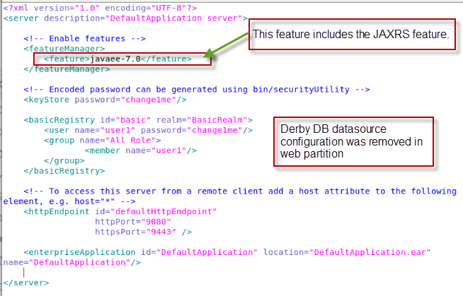

# **Appendix C:** **How can I do this lab using my own environment**? 

It is possible to do this lab using your own environment instead of the
Skytap environment provided.

**NOTE**: The **prerequisite software** listed in the prerequisites
section of the lab MUST be installed on your local environment.

There were only 3 changes that we had to do, in addition to the
obviously issuing commands using my own path instead of /home/ibmdemo:

 

## Section \# 2.3 - Run test cases using the instrumented monolith for Runtime data analysis

  - Edit the scripts
    **m2m-ws-sample/defaultapplication/scripts/startServer.sh** and
    **m2m-ws-sample/defaultapplication/scripts/serverStatus.sh** to
    adjust the path to your own environment

> **OR** run the commands manually
> 
> $LAB\_HOME/m2m-ws-sample/defaultapplication/monolith/DefaultApplication-ear/target/liberty/wlp/bin/server
> start DefaultApplicationServer
> 
> $LAB\_HOME/m2m-ws-sample/defaultapplication/monolith/DefaultApplication-ear/target/liberty/wlp/bin/server
> status DefaultApplicationServer

 

## Section \# 3.4.1 - Move the original non-Java resources from the monolith to the two new partitions

  - Edit **moveResourcesToPartitions.sh** to adjust the path to your own
    environment, here: WORKDIR="$LAB\_HOME/m2m-ws-sample")

 

## Section \# 3.4.2 - Refactor the original non-Java resources as required for the front-end and back-end partitions**

  - Edit **\$LAB\_HOME/m2m-ws-sample/defaultapplication/scripts/refactorPartitions.sh** to adjust the path to your own environment, here:
    WORKDIR="$LAB\_HOME/m2m-ws-sample"

# Appendix: *How to us Copy / Paste between local desktop and Skytap VMs

**How to use Copy / Paste between local desktop and Skytap VM?***

Using copy / Paste capabilities between the lab document (PDF) on your
 local workstation to the VM is a good approach to work through a lab
 more efficiently, while reducing the typing errors that often occur
 when manually entering data.

1.  In SkyTap, you will find that any text copied to the clipboard on
    your local workstation is not available to be pasted into the VM on
    SkyTap. So how can you easily accomplish this?
    
    a.  First copy the text you intend to paste, from the lab document
         to the clipboard on your local workstation, as you always have
         (CTRL-C)
    
    b.   Return to the SkyTap environment and click on the Clipboard at
         the top of the SkyTap session window.

    

    c.   Use **CTRL-V** to paste the content into the Copy/paste VM
     clipboard. Or use the **paste** menu item that is available in the
     dialog, when you right mouse click in the clipboard text area.

    

    d.  Once the text is pasted, just navigate away to the VM window where
     you want to paste the content. Then, use **CTRL-C**, or right
     mouse click & us the **paste menu item** to paste the content.

    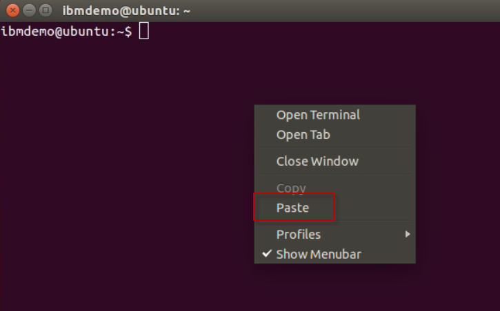

    e.  The text is pasted into the VM

    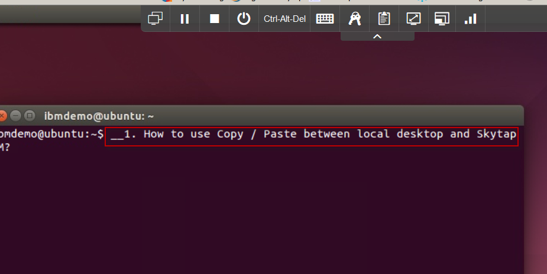

    **Note:** The very first time you do this, if the text does not paste,
you may have to paste the contents into the Skytap clipboard twice. This
is a known Skytap issue. It only happens on the 1st attempt
to copy / paste into Skytap.
