# Explore IBM Transformation Advisor data collection, app assessments, and deployment accelerators

### Hands-on scenario using TA’s WebSphere Data collector, Java application assessment, and deployment accelerators for modernization to Liberty and containers

## Explore IBM Transformation Advisor

This lab provides fundamental hands-on experience of the evaluation
process of WebSphere application for their modernization journey to
Liberty and container-based clouds. It shows the value of using
Transformation Advisor (TA) to evaluate on-premises Java applications
and identify a migration candidate for moving to the cloud.

You will also learn how to use the deployment accelerators that TA
generates to help deploy and run Java applications on Liberty and in
containers.

Upon completion of this lab, you will have gained experience using TA to
quickly analyze on-premises Java applications without accessing their
source code, estimate the effort in moving to container-based clouds,
and using TA’s deployment accelerators to accelerate your application
modernization journey to Liberty and containers.

**IBM Cloud Transformation Advisor** (Transformation Advisor) is an
application modernization tool that is entitled through IBM WebSphere
Hybrid Edition. Transformation Advisor helps you quickly evaluate
on-premises Java EE applications for deployment to the cloud. The
Transformation Advisor tool provides the following value:

  - identify the Java EE programming models in the app.

  - determine the complexity of apps by listing a high-level inventory
    of the content and structure of each app.

  - highlight Java EE programming model and WebSphere API differences
    between the WebSphere profile types

  - identify Java EE specification implementation differences that might
    affect the app

  - generate accelerators for deploying the application to Liberty and
    containers in a target environment.

Additionally, the tool provides a recommendation for the right-fit IBM
WebSphere Application Server edition and offers advice, best practices,
and potential solutions to assess the ease of moving apps to Liberty or
newer versions of WebSphere traditional. It accelerates application
migrating to cloud process, minimize errors and risks and reduce time to
market.

## 1. Introduction

As shown in the image below, your company has several web applications
deployed to WebSphere Application Server (WAS) environment.

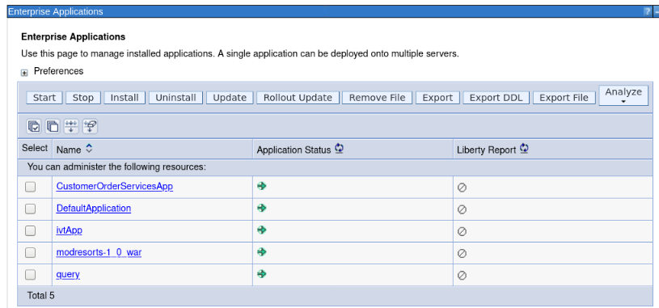

Your company wants to move these applications to the modern WebSphere
Liberty server on a container-based cloud. However, you are not sure how
much effort the migration process might take.

You decide to use the IBM Transformation Advisor to do a quick
evaluation of these applications without their source code to identify a
good candidate application to move to Liberty and container-based cloud.

After determining a candidate application for modernization to WebSphere
Liberty, you use the accelerators generated by TA to deploy and run the
application to WebSphere Liberty on your local developer machine and in
containers to validate the solution.

## 2. Objective

The objectives of this lab are to:

  - Learn how to collect Java application and configuration data using
    the Transformation Advisor Data Collector tool.

  - Learn how to use the Transformation Advisor to evaluate the effort
    involved to modernize to Liberty and container-based clouds and
    identify good application candidates for modernization.

  - Learn how to use the accelerators generated by Transformation
    Advisor to deploy a candidate application to WebSphere Liberty and
    containers.

## 3. Prerequisites

The following prerequisites must be completed prior to beginning this
lab:

  - Familiarity with basic Linux commands

  - Have internet access

  - Have a SkyTap lab environment ready

## 4. The lab environment

One Linux VM is included in the environment and has been provided for
this lab.

  - The **Workstation-Liberty-TA-M2m VM** will be referred as the
    “**workstation**” VM throughout the lab.

  - The login credentials for the **workstation VM** are:
    
      - User ID: **ibmdemo**
    
      - Password: **passw0rd**

<!-- end list -->

  - Transformation Advisor (TA) has already been installed on the
    Workstation VM. TA local runs in Docker containers.

  - Get started using Transformation Adviser for yourself:
    <http://ibm.biz/cloudta>

## 5. Lab Tasks

In this lab, you will use the Transformation Advisor to identify a good
candidate application for moving to WebSphere Liberty and containers.

To identify which Java EE programming models are on the server, you
would typically run the Transformation Advisor **Data Collector tool**
against a WebSphere server or cell.

For this lab, you will simulate the process of running the data
collector which generates a “data collection” which is a zip file
containing the inventory of the application, structure of each
application, the WebSphere server configuration required for the
application, and various analysis reports.

For this lab environment, the data collection zip archive file has
already been generated. You will import that zip file into the
Transformation Advisor UI for application analysis.

Using Transformation Advisor, you will gain insights into potential
migration issues that may need to be remediated if you move the
application to Liberty and containers. Reviewing the analysis reports,
you will determine the complexity of the development effort required and
select a candidate application to migrate to Liberty in a
container-based cloud.

Here are the activities involved in this process:

  - Simulate running the Transformation Advisor Data Collector tool
    against the WebSphere Application Server to get application data

  - Upload the data collection zip archive file that was generated by
    the data collector, into Transformation Advisor UI for analysis.

  - Review the analysis and reports that Transformation Advisor
    generates to identify the right candidate application for a rapid
    and cost-effective migration to Liberty and container-based cloud.

## 6. Execute Lab Tasks

### 6.1 Log in to the workstation VM and Get Started

1.  If the VM is not already started, start it by clicking the play
    button for the whole group.

    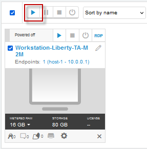

2.  After the VMs are started, click the **Workstation VM** icon to
    access it.

    

3.  If you see a screen displaying only “**ibmdemo**”. Click on the
    screen to get to the password prompt to login.

    

4.  Login with **ibmdemo** ID.
    
      - Click on the **ibmdemo** icon on the screen.
    
      - When prompted for the password for **ibmdemo**, enter
        "**passw0rd**" as the password:

    

5.  Resize the Skytap environment window for a larger viewing area while
    doing the lab. From the Skytap menu bar, click on the "**Fit to
    Size**" icon. This will enlarge the viewing area to fit the size of
    your browser window.

    

### 6.2 The WebSphere applications to be assessed 

The illustration below shows the WebSphere applications that are
deployed to the WebSphere Application Server (WAS) environment. We
already ran the Transformation Advisor Data Collection tool against the
WebSphere server and provided the resulting data collection zip archive
file on the Workstation VM to be used in the lab.

You will simulate the data collection process. However, not actually run
the data collector since this lab environment does not have access to
the WebSphere environment.

As illustrated below, Transformation Advisor will collect the
application data for the following five applications. During the
analysis of these applications, you will gain important insights
regarding these applications, their JEE technologies used, relative
complexity of each application, and detailed analysis of the overall
effort and complexity of moving each application to Liberty and
container-based cloud environments.

> In the Enterprise Applications list above, you can see the
> applications that deployed to the WebSphere Application Server
> environment. Next, you use Transformation Advisor to analyze these
> applications to identify a good candidate to be moved to Liberty.

### 6.3 Launch Transformation Advisor (local)

The Transformation Advisor can evaluate any Java based applications. In
this lab, you are going to use it to evaluate whether the on-premises
WebSphere application, **Mod Resorts**, is suitable to move to Liberty
and what the effort might be to get it there.

The Transformation Advisor is installed locally on the **Workstation**
VM. Launch the Transformation Advisor tool using the steps below.

1.  From **Workstation** VM Desktop Tool Bar, click the Terminal icon to
    open a Terminal window.

    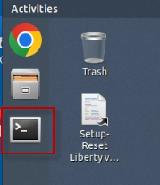

2.  Clone the GitHub repo that includes artifacts required for this lab

        cd /home/ibmdemo

        git clone https://github.com/IBMTechSales/openshift-workshop-was.git

    Once completed, the local lab artifacts repo is cloned at the following directory on the desktop VM. 
    
    > **/home/ibmdemo/openshift-workshop-was/labs/Liberty/TA-labs** directory on the  **Workstation** desktop.

3.  Launch the **Transformation Advisor** with commands:

        cd /home/ibmdemo/TA_LOCAL/transformationAdvisor/transformation-advisor-local-3.2.1

        ./launchTransformationAdvisor.sh

    Wait for Transformation Advisor to initialize and display the action
    menu list.

4.  Type **5** and press **Enter** to start the **Transformation
    Advisor**.

    

5.  The **Transformation Advisor** application is started, right-click
    the application URL link and select **Open Link** to launch it in a
    web browser window. 

    Th URL is displayed in the output from the TA command: **http://10.0.0.1:3000**

    
 
    This **Transformation Advisor** Home page is displayed in the Web  Browser.
 
    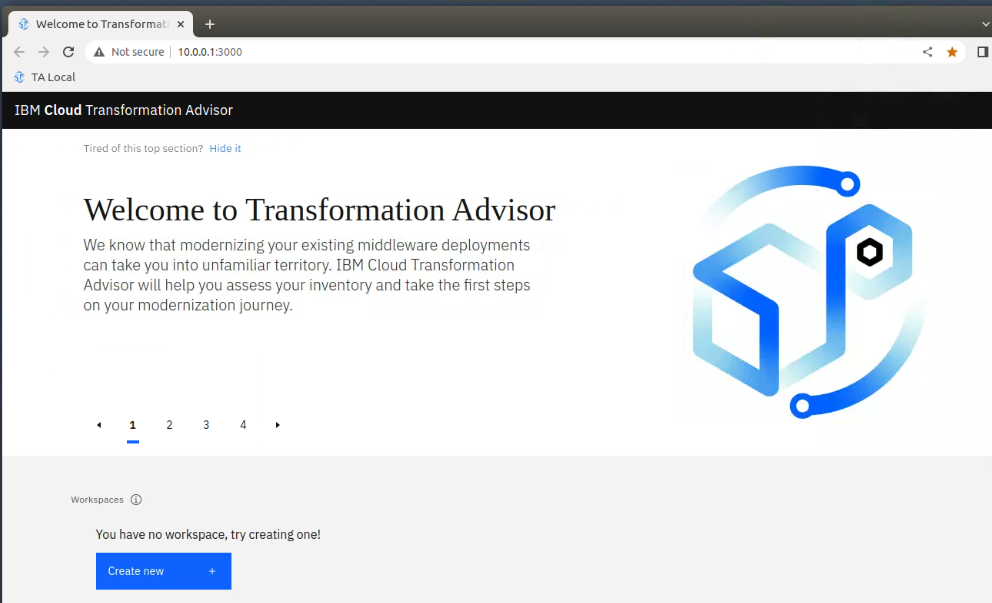
 
    In the next section, you will use the Transformation Advisor UI to  download the **data collector utility** for the environment that the  WebSphere Application Server would be running, such as Windows or  Linux.

### 6.4 Download Transformation Advisor Data Collector utility

Now the Transformation Advisor is running, you will download its Data
Collector utility that would run on a WebSphere Application Server.

To evaluate on-premises Java applications, you need to run
**Transformation Advisor Data Collector utility** against the
Application server environment. It will extract application information
from the environment. The utility can be downloaded from the
Transformation Advisor UI.

1.  From the Transformation Advisor Home page, create a **new
    workspace**
    
    a.  Click the **Create New** button
    
    b.  Enter the workspace name as **Evaluation, then** click the
        **Create** button

    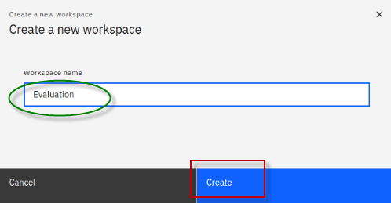

    |                                          |                                                                                                                                                                                                                                                                            |
    | ---------------------------------------- | -------------------------------------------------------------------------------------------------------------------------------------------------------------------------------------------------------------------------------------------------------------------------- |
    |  | A workspace is a designated area that will house the migration recommendations provided by **Transformation Advisor** from your application server environment. You can name and organize these however you want, whether it’s by business application, location, or teams |

    Once the Workspace is created, you will have options to either  **download** the Data Collector utility or **upload** existing data  file.
 
    
 
    In this lab, we are going to perform the following steps:

    - Download the Data Collector utility for the Linux environment

    - **Simulate** running the data collector

    - Upload an existing data collection zip file into Transformation
    Advisor for analysis

    - Use the accelerators generated by Transformation Advisor to deploy
    the Mod Resorts application to Liberty, and to containers.

2.  Click the **Download** button to download the data collector for     Linux

    

3.  In the Download page, you can download data collector utility based
    on your source operating system for your WebSphere environment. It
    also shows how to use the command line utility to collect
    application and configuration data from WebSphere, WebLogic, and
    Tomcat servers.
    
    a.  Since the lab VM is a Linux OS, click **Download Linux** to get
        the utility.

    

    b.  In the Chrome browser window, when the download is complete, you
    will see the file shown in the bottom banner of the browser window.

     
 
    The zipped Data Collector utility file will be saved in  /**home/ibmdemo/Downloads** directory of the **Workstation** VM.
 
    Continue to the next section of the lab to simulate running the data  collector utility.

### 6.5 Simulate running the Transformation Advisor Data Collector utility

After downloading the zipped Data Collector utility, it needs to be
unpacked and run against a WebSphere Application server (WAS) to collect
all the data of deployed applications and their configuration from the
WAS server.

Now, let’s simulate the steps to run the data collector.

1.  Go back to the terminal window and navigate the
    **/home/ibmdemo/Downloads** directory and view its contents with
    commands:

        cd /home/ibmdemo/Downloads/

        ls -l | grep transformationadvisor

    You can see the downloaded data collector utility file named  “**transformationadvisor-Linux\_Evaluation.tgz**”
 
    

2.  Extract the data collector utility using the following command:

        tar xvfz transformationadvisor-Linux_Evaluation.tgz

    The data collector utility will be extracted to ***/home/ibmdemo/Downloads*/transformationadvisor-3.2.1** directory.

    **Note:** At this point, the data collector is ready to execute  against a WebSphere environment.

3.  Return to the Transformation Advisor UI in the Web browser to view
    the section on “**Run the Tool**”, which shows the command to run on
    the WebSphere environment.
    
    a.  From the **Data Collector** page, scroll down to the “**Run
        Tool**” section.

    The data collector command that would be executed is based on the  **domain** and **analysis type** selections you make in this section.
 
    

4.  Choose the **IBM WebSphere** Domain. Other domains include other
    JAVA EE runtimes.

    **Note:** The data collector tool command changes based on this selection.
 
    

5.  Select the Analysis type of “**Apps and Configuration**”

    Selecting **Apps & Configuration** ensures that the application data  and server configuration data is collected.
 
    The server configuration data is extremely helpful in Transformation Advisor to generate deployment artifacts in the migration bundle, which we will explore later in the lab.
 
    

6.  Review, but **DO NOT EXECUTE** the data collector command shown below, which is based on the selected options.

    **Note: There’s no tWAS server in this lab environment, so you cannot run the data collector.** 

    

    **IMPORTANT!**
    
    >For this lab, we have already executed the the collector on a WebSphere Application Server. And the resulting data collection archive (zip file) named AppSrv01.zip is provided for you to upload into Transformation Advisor UI. 
   

### **6.5.1 FOR ILLUSTRATIVE PURPOSES ONLY: Simulation of running the Transformation Advisor Data Collector utility**

<table>
<tbody>
<tr class="odd">
<td></td>
<td>
<strong>Important:</strong>

This section is for illustrative purposes only.

DO NOT RUN THE COMMANDS shown!
</td>
</tr>
</tbody>
</table>

If the WebSphere Application Server and Transformation Advisor has
connectivity, the data collector could be run as follows.

1.  Example of the **Data Collector** utility command to start collect
    the deployed applications information on the WebSphere Application
    server.

    **Again, DO NOT EXECUTE the following command**

        ./bin/transformationadvisor -w <WEBSPHERE_HOME_DIR> -p <PROFILE_NAME>

2.  Type **1** to accept the license agreement and press **Enter**, as
    illustrated below. 

    **Again, for reference only, DO NOT EXECUTE the commands**

    
 
  
    This is an example of the output from the data collector, showing the progress of the analysis of the WebSphere profiles. 

    **Again, for reference only!**
 
    

    **NOTE: The following details are for reference only!**
    
    **NOTE: You will NOT run the data collector in this lab.**
 
    This process takes time to complete, depending on how many applications are deployed on the WebSphere Application server.
 
    When the collection utility completes, the following message is displayed; 
    
    “**Thank you for uploading your data. You can proceed to the application UI for  doing further analysis.”**
 
    Your application data is collected, it is saved as a zip file.   
 
    In general, if your application server and the **Transformation  Advisor** are in the same network infrastructure, the collected data  will be automatically uploaded to **Transformation Advisor** for you  to view the analysis results.
 
    Otherwise, you must manually upload the data to **Transformation  Advisor** before you can view the results.

### 6.6 Upload the data collection into Transformation Advisor

In this section, you will upload the data collection zip file
“**AppSrv01.zip**” from the WebSphere environment for analysis.

Typically, before you can upload the data collector zip files, you will
need to download the appropriate data collector for your target
environments operation environment, such as Linux, Windows, etc.

Additionally, you would run the data collector in the target environment
to collect the data for your applications. Then, you can import the
collection data into Transformation Advisor for analysis.

**Tip:** As noted in the previous section, the data collection steps
have already been done, and the resulting **AppSrv01.zip** file is
provided for you in the lab environment.

1.  Go back to the Transformation Advisor page in the web browser, click
    the “**Workload type**” link to go to the Recommendations page.

    

2.  From the **Evaluation** workspace, upload the “**AppSrv01.zip**”
    data collection file

    a.  Click the **Upload** button to upload a data collection file

    

    b.  From the Upload Data page, click the **Drop or add file** link

    

    c.  Navigate to the location of the data collection file and add the
    **AppSrv01.zip** file. Then click the **Open** button on the
    Download page.

    > Home \> ibmdemo \> openshift-workshop-was \> labs \> Liberty \>
    > TA-labs \> AppSrv01.zip
    > 
    

    d.  The **AppSrv01.zip** data collection file is now ready to be
    uploaded. Click the **Upload** button to continue.

    
 
    Once the data collection has been uploaded to Transformation Advisor, you are redirected back to the TA Recommendations screen.
 
    Notice that the page shows “**All Java applications**” from the  WebSphere Application Server profile named **AppSrv01**.
 
    

    The following details are included in the workspace summary:

    - **Total Applications**: The total number of applications in the    workspace.

    - **Avg. cost per application**: The average number of days of development effort required to migrate an application.

    - **Common Code**: The total cost to migrate all the common code in the workspace to the target platform.

    - **Unique app code**: The total cost to migrate all the unique app  code (code that is not shared between applications) in the workspace to the target platform.

    - **Total cost**: The total cost to migrate all the applications and
    common code in the workspace to the target platform.

    In the next section, you will use Transformation Advisor to view the application data analysis that was collected.

### 6.7 Evaluate On-Premises Java Applications

In this section, you are going to use the Transformation Advisor UI to
view the application data analysis results that was collected in the
previous section.

1.  From the “**All Java applications”** page, you can see there was a
    total of 5 applications analyzed from the WAS server.

    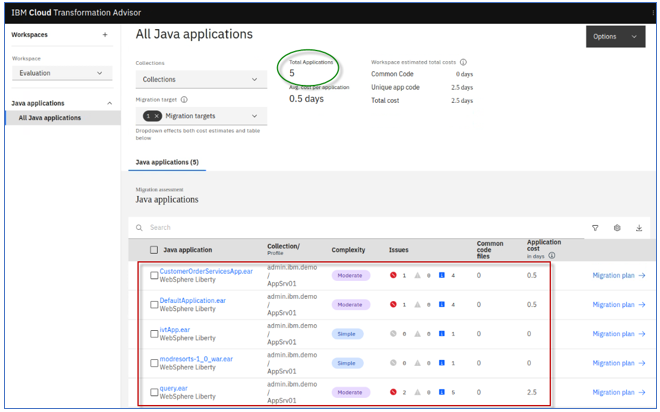
 
    When data is uploaded, Transformation Advisor automatically detects the **host machine** the data came from, meaning, where the WebSphere
 application server apps were running. TA creates a corresponding **collection** and adds the applications there.
 
    The collection name can be overridden when running the data collector  or edited in the transformation Advisor UI after the data is uploaded.
 
    In this example, the default collection name is used: **admin.ibm.demo**, which is the host machine where the data came  from.

2.  Click on the “**Collections**” drop-down icon and view the
    collection name: “**admin.ibm.demo**”

    
 
    Transformation advisor analyzes all the **application code** and  **common code** that is shared across applications and provides an  estimated total cost for migrating the apps and common code in the  workspace.
 
    Total cost is the number of days of **development cost** to migrate  that code to run on the selected **migration target**. In this  example, **WebSphere Liberty** is the selected migration target.
 
    **The Migration targets include:**

    - Open Liberty
    - WebSphere Liberty
    - WebSphere Traditional

    
 
    You can choose multiple migration targets and Transformation Advisor  will provide the workspace total cost effort for each of the selected targets.
 
    This provides a high-level view of the scope of work to migrate all  the applications in the collection to specific migration targets.

    |                                          |                                                                                                                                                                                                                                                                           |
    | ---------------------------------------- | ------------------------------------------------------------------------------------------------------------------------------------------------------------------------------------------------------------------------------------------------------------------------- |
    |  | Depending on the applications, you may find that the effort to migrate to Open Liberty requires more effort that migrating to WebSphere Liberty. This is because Open Liberty does not include all the Java EE API specifications that are included in WebSphere Liberty. |

3.  Click on the **Migration targets** drop-down and select all
    **three** migration targets and notice the different development
    costs associated with migration all 5 applications in the workspace
    to the various migration target environments.

    Here you can see that moving the applications in the collection to  **WebSphere traditional** requires **0 days** of development costs, meaning there is no code changes necessary.
 
    However, moving to **"WebSphere Liberty"** may require **2.5 days** and "**Open Liberty"** may take **10.5 days** of development time.
 
    
 
    The “**All Java applications”** page also shows **the application**  **summary** analysis results for all the apps from the AppSrv01  profile for each of the selected migration targets.
 
    For each app / migration target combination, you can see these  results:

    - Java application
    - Collection / Profile name
    - Complexity
    - Issues
    - Common code files
    - Application cost (in days)
    - Migration plan

    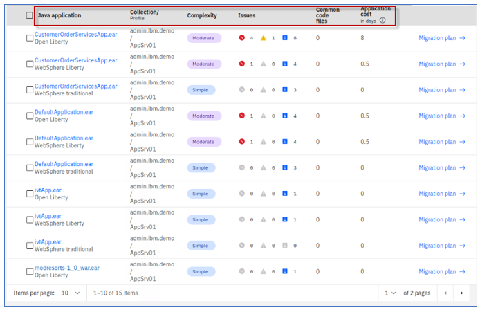

    The following details are included in the summary table (this is the per-application view):

    - **Application Name**: The name of the EAR/WAR file found on the     application server.

    - **Collection/Profile**: Collection represents the hostname of the  machine where the application resides. The profile represents the     profile name in the application server where the application is     installed.

    - **Complexity**: Indicates how complex Transformation Advisor     considers this application to be if you were to migrate it to the     cloud.

    - **Issues**: The number and severity of potential issues with the migration of the application.

    - **Common code files**: The number of common code files this  aplication uses. A file is considered common if it is from a Shared  Library or is used by at least one other application.

    - **Application cost in days**: Provides an estimate in days for the  development effort to perform the migration for just this application. Cost estimates calculated by Transformation Advisor are high-level estimates only and may vary widely based on skills and     other factors not considered by the tool.

    - **Migration plan**: accelerator files generated by Transformation  advisor to aide in building and deploying the selected application   to the target runtime.

### 6.7.1 Evaluate Customer Order Service application

In this section of the lab, you will explore assessment details for the Customer Order Service application. 

You will learn how TA provides insights about an application regarding modernization to different target runtimes such as WebSphere traditional, WebSphere Liberty, and Open Liberty. 

You will learn why the different target environments result in varying degrees of development cost and potential issues. 

1.	From TA’s “**All Java Applications**” page, filter on **CustomerOrderServicesApp.ear** for all three migration targets, by using the Search field searching for ‘**Customer**” 

    This filters the list of applications to only “CustomerOrderServicesApp.ear” on Open Liberty, WebSphere Liberty, and WebSphere Traditional. 

    

2.	The first thing to notice is the number of issues and the Application Cost associated for the application for each of the three target environments 

    At a high level, we can see the following: 

    - Moving the application from WebSphere traditional on VMs to **WebSphere traditional in containers** has a **SIMPLE** level of complexity, requires zero development cost, and there are no issues reported. 

    - Moving the application to **WebSphere Liberty** has a **MODERTATE** level of complexity. Requires ½ day of development costs to resolve the 1 sever and 4 informational issues reported. 

    - Moving the application to **Open Liberty** has a **MODERTATE** level of complexity. Requires 8 days of development costs to resolve the 4 sever and 8 informational issues reported.

    

### 6.7.1.2 Examine CustomerOrderServicesApp.ear on WebSphere Liberty

Next, let’s examine why the development costs and number of issues are higher when moving to Open Liberty instead of WebSphere Liberty. 

To do that, we need to drill into some of the details and reports. 

1.	Review the details for the CustomerOrderSrvicesApp.ear for **WebSphere Liberty**

    a.	Click on CustomerOrderSrvicesApp.ear for “**WebSphere Liberty**” to open its detail view

    

    b.	Expand the **Complexity Rules** for moving the application to WebSphere Liberty. 

    From this view, you get insights into the related issues that may require code changes or configuration changes. 

    *In this example, there is 1 critical issue reported:*

    - **The use of system provided Apache Wink APIs requires configuration.**  

    There are some minor issues that require configuration to external resources, configuring security, minor behavior changes to EJB lookups. 

    These **minor issues** are well known and documented how to resolve by the migration tools.

    

    To dig deeper into the CRITIAL issue, let’s examine the **Analysis report** generated by Transformation Advisor. 

    c.	Scroll down to the bottom of the application detail page to locate the available reports. 

    d.	Click on the **Analysis report**, which will open the report in a new browser tab. 

    

    e.	On the **Detailed Migration Analysis Report**, click on the “**Critical**” link under the LABEL column. This will take you directly to the critical issues in the report. 

    

    f.	Click on “**Show rule help**” link to expand the help section for this issue. 

    

    g.	Read the “**rule help**”. It explains that for WebSphere Liberty, the 3rd party APIs need to be configured in the app. In WebSphere traditional, the APIs are available without configuration.  

    

    h.	To find out where in the application code these issues are flagged, click on the “**show results**” link next to the critical issue. 

    You will see the modules, classes, method names, and line numbers that are impacted by the issue. 
 
    

    

   

2.	Return to the browser tab that displays the “**Application Details Page**” and view the **Technology report**. 

    

    The Technology report provides the details on which IBM platforms support the Java EE technologies used by the applications.

    **Tip:** If checks are omitted for specific editions of Liberty, this means the application code will have to be rewritten to run on that specific target environment. That adds application and developer costs to the project. 

    **Tip:** WebSphere Liberty includes more Java EE technologies than open Liberty. This is a common reason why it may be more costly to move to Open Liberty that to WebSphere Liberty. 

    

### 6.7.1.3 Examine CustomerOrderServicesApp.ear on Open Liberty

In this section, we examine the application details for moving to "**Open Liberty"**. 

Let’s understand why the effort to move the application top Open Liberty requires more effort than moving to WebSphere Liberty. 

1.	Return to the “**All Java Applications**” page in TA

    **Note** that the number of development days to move the application to Open Liberty is 8 days, while moving to WebSphere Liberty is only ½ day. Let’s find out why. 

2.	Click on the CustomerOrderServicesApp.ear for **Open Liberty** to open its detail view. 

    **Tip:** You may type “Customer” in the search field to filer on just the Customer Order Services app

    

3.	Expand the **Complexity rules** to see the details of the issues

    We can see that moving to Open Liberty flags issues related JPA and Wink Client APIs that were not flagged for WebSphere Liberty.  

    

 4.	We can see that moving to Open Liberty flags issues related JPA and Wink Client APIs that were not flagged for WebSphere Liberty.  

5.	Scroll down to the **“Unique Code Issues”** section of the details view. 

    You see a break-down of the effort required to resolve each of the issues that were flagged. 

    > **Note** that the time-consuming effort is handing the **JPA** and **Apache Wink** technology issues.  

    > These issues are not present when moving to WebSphere Liberty, as the APIs are included with WebSphere Liberty. 
 

    

6.	Scroll down to the available reports. Open the **"Analysis report"**

    

7.	Go to the **Critical rules** flagged for the application moving to Open Liberty. 

    

8.	Expand the Apache Wink Client APIs section

    Here you find that the **org.apache.wink.client** packages are not available in Open Liberty. To continue to use the APIs, you would need to package the Apache Wink jar file in the application. 

    

9.	Expand the **Open JPA and WebSphere JPA configuration** issue
Here you find that JPA 2.0 was discovered in the application. 

    For **Open Liberty**, you must manually migrate from JPA 2.0 to standardized or EclipseLink. JPA 2.0 is an older Java EE 6 specification. Java EE 6 specification. 

    **Open Liberty** does not support that old specification. However, **WebSphere Liberty** does support many of the Java EE 6 API specifications, including JPA 2.0. 

    

In this examination of the Customer Order Services application for **WebSphere Liberty** and **Open Liberty**, you gained insights into why the scope of effort moving to Open Liberty may be HIGHER compared to moving to WebSphere Liberty. 

Mainly, WebSphere Liberty includes additional JAVA APIs and libraries that Open Liberty does not include. 

### 6.7.1.4  Examine the Liberty server configuration file (server.xml) generated by TA

Transformation Advisor not only provides great insights about your applications that you consider modernizing to WebSphere Liberty or Open Liberty, it also generates deployment accelerators for building and deploying the application on Liberty, containers, and Kubernetes based clouds. 

In this section, we take a quick peak at the **Liberty server configuration** (server.xml) that TA generates, based on the analysis of the WebSphere configuration when the Transformation Advisor data collector was run against the WebSphere server on the VM.  

Simply put, Transformation Advisor creates the server.xml file that contains the Liberty server configuration required to run the application on Liberty.  

1.	Return to the **“All Java applications”** page in Transformation Advisor which displays the Java application summary list 

    

2.	Ensure only the **WebSphere Liberty** migration target is selected

    

3.	Click on the "**Migration plan"** link located next to the **CustomerOrderServicesApp.ear** for **WebSphere Liberty**, which will display migration plan for the WebSphere Liberty target. 

    
    
4.	The **Migration plan** displays the list of files generated by Transformation advisor to assist in the migration of the application.

    - **server.xml:** the configuration for the Liberty server
    - **pom.xml:** Build the application using Maven
    - **Application CR:** Custom Resource for the application to be deployed to OpenShift via the Open Liberty Operator
    - **Dockerfile:** Create the Docker image for the application

    

5.	Download the **server.xml** file to view its contents

    

6.	At the bottom of the screen, click on the **server.xml** file, which will open the file in a new browser tab

    

7.	Notice that Transformation Advisor generated the **server.xml** file that includes the Liberty server configuration that has been mapped from the original WebSphere traditional application server. 

    When the Transformation Advisors data collector was run against the WebSphere Application server, it analyzed the applications and the WebSphere server configuration. The server configuration data was used to generate an appropriate serer.ml file to configure the application on Liberty. 

    a.	The **Liberty features** that the application uses are configured. 

    

    b.	The **application endpoints** and **enterprise application module configuration** are configured. Notice that **variables ${ }** are used to simplify external configuration overrides and default values. 

    

    c.	**Security roles** used by the application are configured

    

    d.	**Database configuration** and **authentication aliases** are configured. Again, notice variables used. 

    

    e.	**Variables**, and default values, where it makes sense are configured.

    These variables are used to extract data that is likely going to be different between environments such as TEST, QA, PROD environments. 

    The variables are easily overridden by environment variables or configMaps and secrets in Kubernetes environments. 

    

8.	Transformation Advisor generated additional build and deployment accelerator files that are used to Build a container image for the application and deploy the container to Kubernetes (OpenShift) using the Open Liberty Operator Customer Resources (Application CR). 

    - **server.xml:** the configuration for the Liberty server
    - **pom.xml:** Build the application using Maven
    - **Application CR:** Custom Resource for the application to be deployed to OpenShift via the Open Liberty Operator
    - **Dockerfile:** Create the Docker image for the application

    

###  6.7.2 Evaluate Mod Resorts application

**Mod Resorts is one of the applications that we want to consider  migration to Liberty.**
 
In this section you will review the analysis results for the **modresorts-1_0_war.ear** application and determine if it is a good candidate for migration to Open Liberty or WebSphere liberty.

1.	Return to the “All Java Applications” page in Transformation Advisor.

    

2.	Select all three Migration targets from the menu

    

3.	In the **"search"** field, type **modresorts** which will narrow the application list to only the Mod Resorts application for all three migration target. 

    

    In this example, if you want to move the **modresorts-1_0_war.ear** application to **Open Liberty**, the complexity level is **Simple**, which indicates that the application code does not need to be changed before it can be moved to Open Liberty. 

    The application has no dependency, does not have any common code or shared library files. It has one minor (informational level) issue. 

    The estimated development effort is zero day because no code change is required.

    

    Notice that the modresorts application is also simple to migrate to the WebSphere Liberty and WebSphere traditional migration targets. 

    

    For this lab, you will focus on the modernization of moderesorts-1.0_war.ear to Open Liberty. 

    Next, you will look at the analysis results for**moderesorts-1.0_war**.ear application in detail.

4.  Click the **modresorts-1_0_war.ear** link targeting **Open Liberty** to expand its analysis results.

    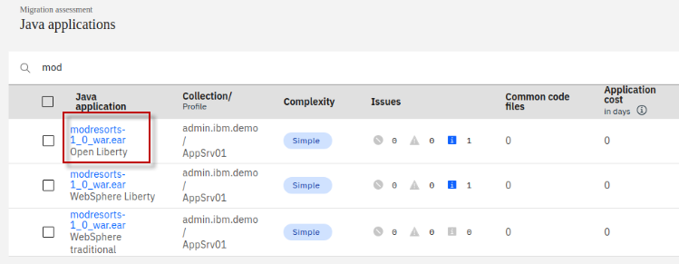
 

    The first section in the detail analysis summary page is the  **Complexity rules section**. The overall complexity for the  application is **simple**, indicating that the application can be  directly moved to Open Liberty without any code change.
 
    

5.  Scroll down to **Complexity Rules** section. You can see there is no
    code change required and no development cost, the estimate migration
    over all develop cost is **0 days**.

    This estimate is based on data from IBM Services engagements, which  includes migrating the application code, but does not encompass the  full scope of a migration project that would include server  configuration, testing, etc.
 
    

6.  Expand the **Issues and details** section. You can see the only minor potential issue listed is for configuring CDI (Context Dependency Injection beans).

    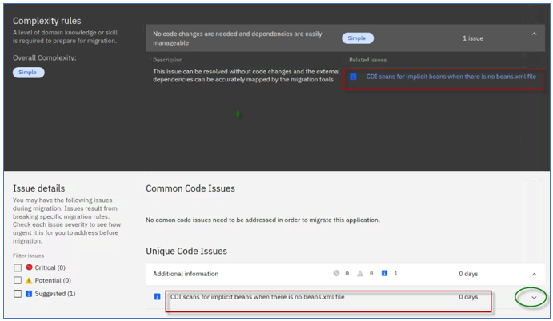

7.  Next, scroll down to the bottom of the page and click the
    **Technology Report** link, this opens a new browser window to show
    the application Evaluation Report.

    
 
    The **Technology report** lists all java technologies the application  used and whether these technologies are supported by a specific  WebSphere platform from Liberty for Java on IBM Cloud to WebSphere  traditional for z/OS.
 
    It is used to determine whether a particular WebSphere product is  suitable for an application.

    <table>
    <tbody>
    <tr class="odd">
    <td></td>
    <td>
<strong>TIP:</strong>

    
If the complexity of migrating to the target environment is “<strong>Complex</strong>” , it means that some APIs are not available in the target runtime and application will have to be rewritten to use different APIs.
</td>
    </tr>
    </tbody>
    </table>

    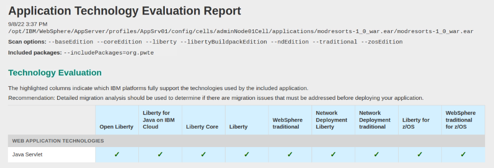
 
    As you can see from the report, the Mod Resorts application only uses  **Java Servlet** which is supported by all WebSphere editions.

8. Go back to the Transformation Advisor page and click the **Inventory
    Report** link.

    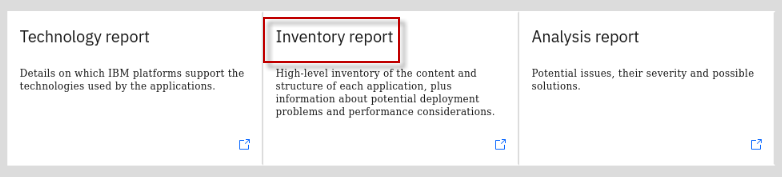
 
    The **Inventory Report** helps you examine what is in your application, including the number of modules, their relationships, and the technologies in those modules.
 
    It also gives you a view of all the utility JAR files in the application, and the **Java package names** in the jar files, which will help identify if the classes are the customers application code  or 3rd party code. Potential deployment problems and  performance considerations are also included.
 
    

    a.  Scroll down to view this report which serves as good decision-making tool to info you what is inside your application runtime, and to help you to have a better understanding of the application runtime, the components it has and the relationships among them.

    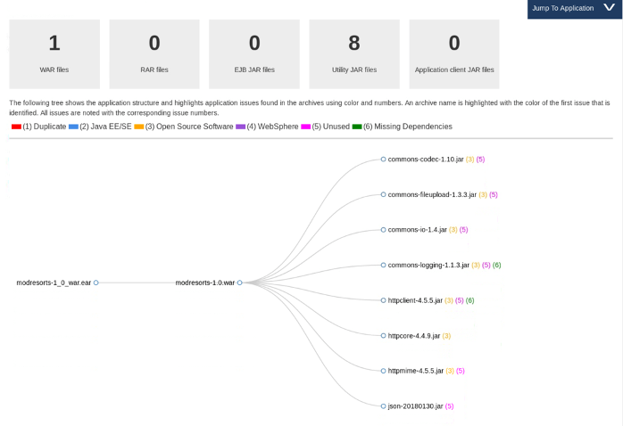

9. In the Inventory report, view the package names of the classes in
    the utility Jars
    
    a.  Scroll down to view the **Contained Archives** section and click
        on the “**show details**” link next to **modresorts-1.0.war**
    
    b.  Then scroll down to the **Utility JAR files** and click on the
        “**show details**” link next to Utility JAR files
    
    c.  View the **Archive names** of the jar files and the **packages**
        used in the JAR files.

    This is a good way to determine if the code in the utility JARS  include customer code or if they are 3rd party jars like
 (org.pache\*).
 
    Additionally, if the application migration complexity is SIMPLE, you  may want to verify if the utility jars include any company packages  that begin with org or other package names that are IGNORED by default in the Transformation Advisor data collector.
 
    It could be possible that application code was not analyzed due to  package names that are ignored by the data collector
 
    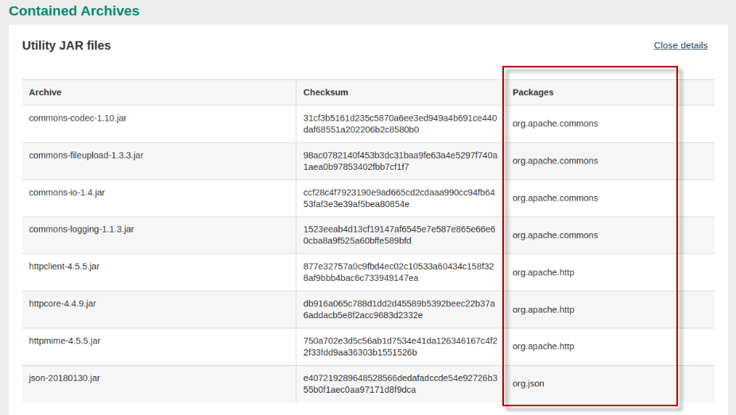
 
    From the analysis reports you reviewed above, you know that the Mod  Resorts application is supported by Open Liberty, and the issue that  the tool identified would not affect the application migration.
 
    You can confidently select the application as a good candidate for  migrating to Open Liberty with minimal effort.

### 6.8 Overview of the Mod Resorts application

From the insights gained from Transformation Advisor, you learned that
the Mod Resorts is a simple EE application and is a good candidate for
moving to Open Liberty and container-based clouds.

For illustration purposes, in this short section, a few screen shots are
captured to illustrate the Mod Resorts application.

The Mod Resorts application home page is illustrated here:

The user would select the destination of their travel

Perhaps the user wants to go to **PARIS, FRANCE. Mod Resorts shows the**
weather of the city.

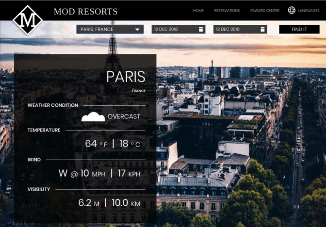

Continue to the next section of the lab where you are briefly introduced
to Transformation Advisor’s migration plan.

The migration plan includes a migration bundle of generated deployment
artifact that accelerate the deployment of the application to Liberty
and container-based cloud deployment.

## 7. Explore the migration bundle for the Mod Resorts application

Transformation Advisor display details about the **migration bundle**
that it generated to accelerate the modernization of applications to
Liberty or traditional WebSphere in containers and to OpenShift. The
migration bundle includes diverse artifacts, depending on the needs of
the application to accelerate the build and deployment of an application
Docker image into OpenShift platform.

The user can choose to create a migration bundle for either:

  - **binary** project of an application (uploading a WAR/EAR file and
    its dependent libraries)

  - **source code** project of an application, so that the application
    source files can be modernized and maintained

Now, let’s quickly explore the **Migration Plan** for the Mod Resorts
application to see the artifacts that Transformation Advisor creates to
expedite the app deployment to OpenShift Platform.

1.  Return to the “**All Java applications**” page in Transformation
    Advisor which displays the Java application summary list

    

2.  Ensure only the **Open Liberty** migration target is selected

    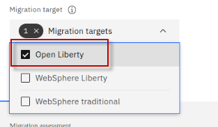

3.  Click on the **Migration plan** link located next to the Mod Resorts
    application analysis for Open Liberty, which will display
    **migration plan** for modresorts for the Open Liberty target

    

4.  Select the **Binary** option in the migration plan.

    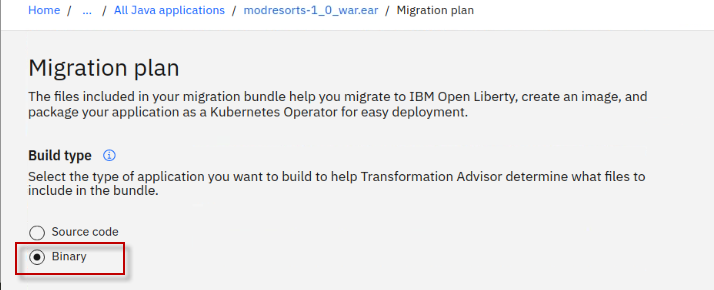

5.  Using the **Binary** option requires that you upload the Mod Resorts
    application binary (WAR or EAR), which will be included in the
    migration bundle along with the deployment artifacts that
    Transformation Advisor generated.

    a.  Select **Manual upload** option under the Application dependencies section. Here you will manually upload the Mod Resorts WAR file to the migration bundle.

    b.  Click the “**Drag or add file”** link to add the md resorts WAR file to the migration bundle

    c.  Navigate to: 
    
    > Home \> ibmdemo \> openshift-workshop-was \> labs \>
    Liberty \> TA-labs \> modresorts-1.0.war

    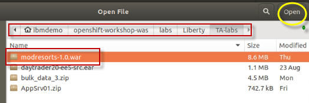
 
    

6.  Scroll down to the **Migration Files** section of the migration
    plan. Notice the files that were generated by Transformation Advisor
    to accelerate build and deployment of the application to Liberty,
    containers, and OpenShift.

    To accelerate the application modernization, the artifacts produced by Transformation Advisor include:

    - **server.xml**: the configuration for the Liberty server

    - **pom.xml**: Build the application using Maven

    - **Application CR**: Custom Resource for the application to be
    deployed to OpenShift via the Open Liberty Operator

    - **Dockerfile**: Create the Docker image for the application

    The user will be able to choose to **download** the artifacts as a migration bundle or **send** the bundle contents into a **Git repository**.

7.  Click the **Download bundle** link to download the bundle of
    artifacts to the local filesystem on the Workstation VM.

    The **modresorts10war_migrationBundle.zip** file will be downloaded  to the **/home/ibmdemo/Downloads** directory
 
     

8.  Unzip the migration bundle artifacts to a new folder on the
    Workstation VM

    a.  From a terminal window, run the following commands to unzip the migration bundle to a new directory named "**modresorts-bundle**":

        mkdir /home/ibmdemo/modresorts-bundle
        
        cd /home/ibmdemo/modresorts-bundle
        
        cp ~/Downloads/modresorts10war_migrationBundle.zip ~/modresorts-bundle
        
        unzip ~/modresorts-bundle/modresorts10war_migrationBundle.zip
        
        ls

    

9.  View the **server.xml** file. DO NOT CHANGE THE FILE CONTENTS.

    The server.xml file in the migration bundle is the Liberty server  configuration file generated by Transformation Advisor, configured for the modresorts application.

        gedit ~/modresorts-bundle/src/main/liberty/config/server.xml

    

    - The Liberty features list include features that the application requires.

    - **mpMetrics** feature is included, which provides a /metrics endpoint from which you can access all metrics that are emitted by the Open Liberty server and deployed applications.

    - Variables are used so that the values that are likely to be     different between environments can easily be overridden by external    configurations like environment variables or configMaps and Secrets    in Kubernetes.

10. **Close** the editor when you finish reviewing the file. **DO NOT
    SAVE any changes** to the contents.

11. View the **Dockerfile** file. Do not change the file contents.

    The Dockerfile file in the migration bundle is used to build the container image for running the modresorts application on a Liberty runtime in a containerized environment such ads Docker, Kubernetes, or Red Hat OpenShift. The Dockerfile was generated by Transformation Advisor, configured for the building the modresorts application.

        gedit ~/modresorts-bundle/Dockerfile

    - The Dockerfile is a two-stage Dockerfile.
    
      - The first phase is the “**build-stage**” that creates a docker
        image for the modresorts application.
    
      - The second stage uses the **Open Liberty kernel** container
        image and the build artifacts produced from the “build-stage” to
        build the modresorts container image with the modresorts
        application and configuration files for deploying to a container
        environment.

    
 
    

12. **Close** the editor when you finish reviewing the file. **DO NOT
    SAVE** any changes to the contents.

## 8. Use Transformation Advisor deployment accelerators to deploy and run the Mod Resorts application on Open Liberty

In this section, you will install Open Liberty, create a new Liberty
server, and leverage the artifacts generated by Transformation Advisor
to configure and run the Mod Resorts application on your new Open
Liberty server.

> **Tip:** Open Liberty is installed from a zip archive file.

For the lab, the Open Liberty zip archive has already been downloaded to
the lab environment.

To get started, you will create a new directory where you would like to
install Open Liberty. Then unzip the archive. That’s it, Open Liberty is
installed.

1.  Install Open Liberty on the VM

    a.   From a Terminal window, run the following commands to perform an     archive installation of Open Liberty

        mkdir ~/Liberty

        cd ~/Liberty

        unzip ~/Student/labs/TA-labs/openliberty-javaee8-21.0.0.12.zip -d ~/Liberty

    b.  Open Liberty is installed to the **\~/Liberty/wlp** directory.    Change to Open Liberty “**bin**” directory, which is where the    Open Liberty binaries are located.

        cd wlp/bin

2.  Use the **server** command to create a new Open Liberty server named
    **modresorts_server**

        ./server create modresorts_server

    

3.  Use the **server** command to start the Open Liberty server named
    **modresorts_server**

        ./server start modresorts_server

    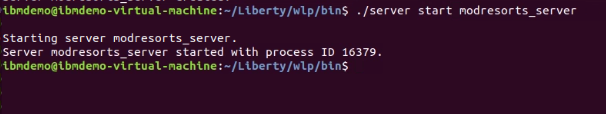

4.  Open a **new Terminal window** and view the Open Liberty server log
    file named “messages.log”

         tail -f ~/Liberty/wlp/usr/servers/modresorts_server/logs/messages.log 

    a.  Look for the message that the modresorts server started     successfully

    

    At this point you have an Open Liberty Server running with a defaultserver configuration. However, there are no applications installed(deployed).

    Next, you will copy the Mod Resorts binary (WAR) to the Open Liberty server, in which case the application will be deployed and started. Then copy the Open Liberty server configuration file that TA generated for the Mod Resorts application. The Liberty server will automatically detect and apply these changes in the running server. 
   

5.	Install the modresorts application to the Open Liberty server, using
    the WAR file that is included in the Transformation Advisor
    migration bundle.

        cp ~/modresorts-bundle/target/modresorts-1.0.war ~/Liberty/wlp/usr/servers/modresorts_server/apps

    The command above copied the modresorts application WAR file to the  Open Liberty “**apps**” folder, which where the server.xml file is  configured to run the application.

6.  Copy the **server.xml** file that Transformation Advisor, which
    includes the Open Liberty server configuration for the modresorts
    application

    a.   Return to the Terminal window where you started the Open Liberty Server.

    b.   Run the following command to copy the **server.xml** file to the  **modresorts_server** configuration directory.

        cp ~/modresorts-bundle/src/main/liberty/config/server.xml ~/Liberty/wlp/usr/servers/modresorts_server

    c.  In the Terminal window running the “**tail**” command on the Open Liberty log file, notice that the server is being updated to reflect the updates in the new server.xml file that we copied into the Liberty runtime configuration.

     > Note: You will see a message stating the modresorts application is started.  

       

7.  Run the modresorts application from the Chrome browser on the VM.
    The context root for the application is “/resorts” and is defined in
    the Open Liberty server.xml file.

        http://localhost:9080/resorts

     

    a.  You may click the drop-down menu for “**WHERE TO**?” and select a destination

    <table>
    <tbody>
    <tr class="odd">
    <td></td>
    <td>
<strong>Tip!</strong>

    
If the application does not respond when clicking on the “WHERE TO?” menu, increase the window size of the Chrome browser.

    
This appears to be a glitch with the application or Chrome browser
</td>
    </tr>
    </tbody>
    </table>

    

8.  Stop the Open Liberty server

    a.  Return to the Terminal window where you started the Open Liberty  Server

    b.  Run the following command to **stop** the server named **modresorts_server**

        ./server stop modresorts_server

    

9.  Use **CTL-C** to Stop the “**tail**” command in the 2nd
    Terminal window

## 9. Use Transformation Advisor accelerators to run the Mod Resorts application on Open Liberty in containers

In this section, you will use the Dockerfile to build a docker image and run the modresorts application in a local Docker container.

The Dockerfile is a two-stage Dockerfile:
  - The first phase is the “**build-stage**” that creates a docker
     image for the modresorts application.
  -  The second stage uses the **Open Liberty kernel** container image
     and the build artifacts produced from the “build-stage” to build
     the modresorts container image with the modresorts application and
     configuration files for deploying to a container environment.
      
      - **RUN features.sh** downloads the Open Liberty features that are defined
    in the server.xml file
      - **RUN configure.sh** installs the Open Liberty features into the Docker image.

1.  Build the Docker image that includes the modresorts application on
    Open Liberty

    a.  From a Terminal window, change to the directory where the     Transformation Advisor migration bundle is located. 
    
    b.  Run the Docker build command to build the image

    - The name of the docker image will be **modresorts:1.0,** as
    specified by the -t (tag) parameter.

    - The Dockerfile used is in the current directory, as specified by the
    training **dot** on the command

          cd ~/modresorts-bundle

          docker build --no-cache -t modresorts:1.0 .

    When complete, you will see that the Docker image was created and tagged as “**modresorts:1.0**”

    

    c.  List the Docker image and its tag. The name of the image is
    “**modresorts**” and is tagged as “**1.0**”

        docker images | grep modresorts

    

2.  Run the Docker image

    - **-d** runs the docker command in detached mode

    - **-p** maps the internal pot 9080 to an external port 9081

    - **--name** specifies the name for the docker container that gets
    spun up

    - **Modresorts:1.0** is the name of the **docker image** to use to
    spin up the new container

          docker run -d -p 9081:9080 --name modresorts modresorts:1.0

3.  Verify the docker container is running

        docker ps | grep modresorts

    The “**docker ps**” command lists docker containers that are “running”.
 
    Running “**docker ps -a**” lists all docker containers, including  containers that are stopped.
 
    

4.  View the Open Liberty log in the “**modresorts**” container to
    verify the modresorts application was installed and is running

        docker logs modresorts

    

5.  Run the modresorts application from the Web Browser.

  - The application is exposed on port: **9081**

  - The application context root is: **/resorts**

        http://localhost:9081/resorts

    

    a.  You may click the drop-down menu for “**WHERE TO**?” and select a   destination

    <table> 
    <tbody>
    <tr class="odd">
    <td></td>
    <td>
<strong>Tip!</strong>

    
If the application does not respond when clicking on the “WHERE TO?” menu, increase the window size of the Chrome browser.

    
This appears to be a glitch with the application in Chrome browser
</td>
    </tr>
    </tbody>
    </table>

    

6.  **Stop** and **remove** the docker container. Then check that the
    container has been removed, by using the “**docker ps -a”** command

        docker stop modresorts
        
        docker rm modresorts
        
        docker ps -a | grep modresorts

7.  **Remove** the modresorts docker image. Then use the “**docker
    images**” command to verify the image has been removed

        docker rmi modresorts:1.0

        docker images | grep modresorts

## Summary

In this lab, you learned how to evaluate the existing Java application
using IBM Cloud Transformation Advisor.

You learned how to use Transformation Advisors generated deployment
accelerators from the migration bundle to build and run an application
in Open Liberty in stand-alone mode on a VM and in containers.

As a part of IBM Application Modernization solutions, the Transformation
Advisor tool provides a recommendation for the right-fit IBM WebSphere
Application Server edition and offers advice, best practices, and
potential solutions to assess the ease of moving apps to Liberty or to
WAS container, or to newer versions of WebSphere traditional.

Transformation Advisor accelerates application migrating to Liberty and
containers and helps minimize errors and risks and reduce time to
market.

 

**Congratulations!**

**You have successfully completed the lab “Exploring IBM Transformation
Advisor data collection, app assessments, and deployment accelerators”**
