# Evaluate Java Applications with Transformation Advisor

## Summary

**Evaluate Java Applications with Transformation Advisor**

This lab provides fundamental hands-on experience of the evaluation
process of WebSphere application for their modernization journey to
Liberty and container-based clouds. It shows the value of using
Transformation Advisor to evaluate on-premises Java applications and
identify a migration candidate for moving to the cloud. When you
complete this lab, you learn how to use this tool to quickly analyze
on-premises Java applications without accessing their source code and to
estimate the move to cloud efforts.

**IBM Cloud Transformation Advisor** (Transformation Advisor) is an
application modernization tool that is entitled through IBM WebSphere
Hybrid Edition. Transformation Advisor helps you quickly evaluate
on-premises Java EE applications for deployment to the cloud. The
Transformation Advisor tool can

  - identify the Java EE programming models in the app.

  - determine the complexity of apps by listing a high-level inventory
    of the content and structure of each app.

  - highlight Java EE programming model and WebSphere API differences
    between the WebSphere profile types

  - identify Java EE specification implementation differences that might
    affect the app

Additionally, the tool provides a recommendation for the right-fit IBM
WebSphere Application Server edition and offers advice, best practices,
and potential solutions to assess the ease of moving apps to Liberty or
newer versions of WebSphere traditional. It accelerates application
migrating to cloud process, minimize errors and risks and reduce time to
market.

## Business Scenario

As shown in the image below, your company has several web applications
deployed to WebSphere Application Server (WAS) environment.

Your company wants to move these applications to a lightweight WebSphere
Liberty server on cloud, but you are not sure how much effort the
migration process might take.

You decide to use the IBM Transformation Advisor to do a quick
evaluation of these applications without their source code to identify a
good candidate application to move to cloud based on the analysis
result.

## Objective

The objectives of this lab are to:

  - learn how to collect Java application and configuration data using
    the Transformation Advisor Data Collector tool.

  - learn how to use the Transformation Advisor to evaluate the move to
    cloud efforts and to identify the good candidate for migration.

## The lab environment

One Linux VM is included in the environment and has been provided for this lab.

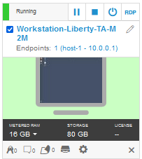

  - The **Workstation-Liberty-TA-M2m VM** will be referred as the
    “**workstation**” VM throughout the lab.

  - The login credentials for the **workstation VM** are:
    
      - User ID: **ibmdemo**
    
      - Password: **passw0rd**

<!-- end list -->

  - Transformation Advisor (TA) has already been installed on the
    Workstation VM. TA local runs in Docker containers.

  - Get started using Transformation Adviser for yourself:
    <http://ibm.biz/cloudta>

## Lab Tasks

In this lab, you will use the Transformation Advisor to identify a good
candidate application for moving to cloud.

To identify which Java EE programming models are on the server, you
would typically run the Transformation Advisor **Data Collector tool**
against a WebSphere server or cell. For this lab, you will simulate the
process of running the data collector which generates a zip file
containing the inventory of the content and structure of each
application.

For this lab environment, the data collection zip archive file has
already been generated. You will import that zip file into the
Transformation Advisor UI for application analysis.

Using Transformation Advisor, you will gain insights into potential
migration issues that may need to be remediated if you move the
application to cloud. Reviewing the analysis reports, you will determine
the complexity of the move-to-cloud efforts and select a candidate
application to migrate to Liberty in a container-based cloud.

Here are the activities involved in this process:

  - Simulate running the Transformation Advisor Data Collector tool
    against the WebSphere Application Server to get application data

  - Load the zip archive file that was generated by the data collector,
    into Transformation Advisor UI for analysis.

  - Review the analysis and reports that Transformation Advisor
    generates to identify the right candidate application for a rapid
    and cost-effective migration to cloud

## 1: Execute Lab Tasks

### 1.1 Log in to the workstation VM and Get Started

1.  If the VM is not already started, start it by clicking the play
    button for the whole group.

    

2.  After the VMs are started, click the **Workstation VM** icon to
    access it.

    

3.  If you see a screen displaying only “**ibmdemo**”. Click on the
    screen to get to the password prompt to login.

    

4.  Login with **ibmdemo** ID.
    
      - Click on the **ibmdemo** icon on the screen.
    
      - When prompted for the password for **ibmdemo**, enter
        "**password**" as the password:

    

5.  Resize the Skytap environment window for a larger viewing area while
    doing the lab. From the Skytap menu bar, click on the "**Fit to
    Size**" icon. This will enlarge the viewing area to fit the size of
    your browser window.

    

     

### 1.2 The WebSphere applications to be assessed 

The illustration below shows the WebSphere applications that are
deployed to the WebSphere Application Server (WAS) environment. We
already ran the Transformation Advisor Data Collection tool against the
WebSphere server, and provided the resulting data collection zip archive
file on the Workstation VM to be used in the lab.

You will simulate the data collection process. However, not actually run
the data collector since this lab environment does not have access to
the WebSphere environment.

As illustrated below, Transformation Advisor will collect the
application data for the following five applications. During the
analysis of these applications, you will gain important insights
regarding these applications, their JEE technologies used, relative
complexity of each application, and detailed analysis of the overall
effort and complexity of moving each application to Liberty and
container-based cloud environments.

> In the Enterprise Applications list above, you can see the
> applications that deployed to the WebSphere Application Server
> environment. Next, you use Transformation Advisor to analyze these
> applications to identify a good candidate to be moved to the cloud.

### 1.3 Launch Transformation Advisor (local)

The Transformation Advisor can evaluate any Java based applications. In
this lab, you are going to use it to evaluate whether the on-premises
WebSphere application, **Mod Resorts**, is suitable to move to cloud and
what the effort might be to get it there.

The Transformation Advisor is installed locally on the **Workstation**
VM. Launch the Transformation Advisor tool using the steps below.

1.  From **Workstation** VM Desktop Tool Bar, click the Terminal icon to
    open a Terminal window.

    

2.  Launch the **Transformation Advisor** with commands:

        cd /home/ibmdemo/TA_LOCAL/transformation-advisor-local-2.5.0

        ./launchTransformationAdvisor.sh

    Wait for Transformation Advisor to initialize and display the action menu list.

3.  Type **5** and press **Enter** to start the **Transformation
    Advisor**.

    

  
4.  The **Transformation Advisor** application is started, right-click the application URL link and select **Open Link** to launch it in a web browser window

    
 
    This **Transformation Advisor** Home page is displayed in the Web Browser.

    
 
    In the next section, you will use the Transformation Advisor UI to download the **data collector utility** for the environment that the WebSphere Application Server would be running, such as Windows, Linux.

     

### 1.4 Download Transformation Advisor Data Collector utility

Now the Transformation Advisor is running, you will download its Data
Collector utility that would run on a WebSphere Application Server.

To evaluate on-premises Java applications, you need to run
**Transformation Advisor Data Collector utility** against the
Application server environment. It will extract application information
from the environment. The utility can be downloaded from the
Transformation Advisor web page.

1.  From the Transformation Advisor Home page, add a **new workspace**
    by entering the workspace name as **Evaluation** and then clicking
    **Next**.

    

    |                                          |                                                                                                                                                                                                                                                                            |
    | ---------------------------------------- | -------------------------------------------------------------------------------------------------------------------------------------------------------------------------------------------------------------------------------------------------------------------------- |
    |  | A workspace is a designated area that will house the migration recommendations provided by **Transformation Advisor** from your application server environment. You can name and organize these however you want, whether it’s by business application, location, or teams |

2.  Enter the collection name as **Server1** and click **Create**

    

    |                                          |                                                                                                                                                                      |
    | ---------------------------------------- | -------------------------------------------------------------------------------------------------------------------------------------------------------------------- |
    |  | Each workspace can be divided into collections for more focused assessment and planning. Like workspaces, collections can be named and organized in whatever way you |

    Once the Workspace and Collection are created, you will have options to either **download** the Data Collector utility or **upload** existing data file.

    
 
    In this lab, we are going to perform the following steps:

    - download the Data Collector utility for the Linux environment
    - Simulate running the data collector
    - Upload an existing data file into Transformation Advisor for analysis

     

3.  Click the **Download** button to download the data collector for Linux

    

     

4.  In the Download page, you can download different versions of the utility based on your source operating system. It also shows how to use the command line utility to collect application data from WebSphere, WebLogic, and Tomcat servers.
    
    a.  Since the lab VM is a Linux OS, click **Download Linux** to get the utility.

    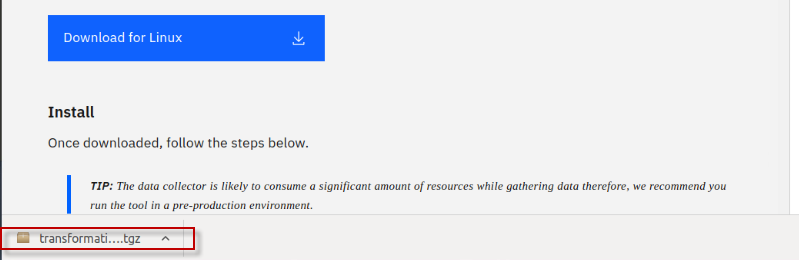

     

    b.  In the Download dialog window, select the **Save File** option and click **OK**.

    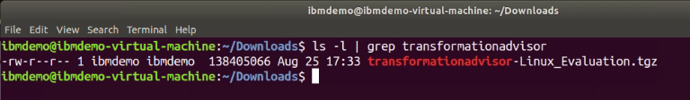
 
    The zipped Data Collector utility file will be saved in **/home/ibmdemo/Downloads** directory of **Workstation** VM.

    Continue to the next section of the lab to simulate running the data collector utility.

     

## 1.5 Simulate running the Transformation Advisor Data Collector utility

After downloading the zipped Data Collector utility, its needs to be
unpacked it and run against a WebSphere Application server (WAS) to
collect all the data of deployed applications and their configuration
from the WAS server.

Now, let’s simulate the steps to run the data collector.

1.  Go back to the terminal window and navigate the
    **/home/ibmdemo/Downloads** directory and view its contents with commands:

        cd /home/ibmdemo/Downloads/

        ls -l | grep transformationadvisor

    You can see the downloaded data collector utility file named “**transformationadvisor-Linux_Evaluation_Server1.tgz**”

    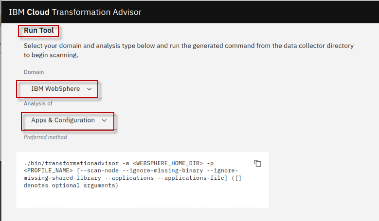

2.  Extract the data collector utility using the following command:

        tar xvfz transformationadvisor-Linux_Evaluation_Server1.tgz

    The data collector utility will be extracted to ***/home/ibmdemo/Downloads*/transformationadvisor-2.5.0** directory.

    > **Note:** At this point, the data collector is ready to execute against a WebSphere environment.

3.  Return to the Transformation Advisor UI in the Web browser to view the section on “**Run the Tool**”, which shows the command to run on the WebSphere environment.
    
    a.  From the **Data Collector** page, scroll down to the “**Run Tool**” section.

    The data collector command that would be executed is based on the  **domain** and **analysis type** selections you make in this section.

    

4.  Choose the **IBM WebSphere** Domain. Other domains include other JAVA EE runtimes IBM MQ. The data collector tool command changes based on this selection.

    

5.  Select the Analysis type of “**Apps and Configuration**”

    Selecting **Apps & Configuration** ensures that the application data and server configuration data is  collected. The server configuration data is extremely helpful in Transformation Advisor to generate deployment artifacts in the migration bundle, which we will explore later in the lab.

    

6.  Review the data collector command that is shown based on your selections.

    

    If you were going to run the command, there are a few additional things that need to happen.

    - Replace the <WEBSPHERE\_HOME\_DIR\> and <PROFILE\_NAME\> variables with the values from the WebSphere environment

    - If the WebSphere environment is not connected to the VM where Transformation Advisor is running, then the data collector utility that was downloaded must be copied and unpacked to the WebSphere environment.

### 1.5.1 FOR ILLUSTRATIVE PURPOSES ONLY: Simulation of running the Transformation Advisor Data Collector utility

<table>
<tbody>
<tr class="odd">
<td></td>
<td>
<strong>Important:</strong>

This section is for illustrative purposes only.

DO NOT RUN THE COMMANDS shown!
</td>
</tr>
</tbody>
</table>

If the WebSphere Application Server and Transformation Advisor has
connectivity, the data collector could be run as follows.

1.  Example of the **Data Collector** utility command to start collect the deployed applications information on the WebSphere Application server.

        sudo ./bin/transformationadvisor -w /opt/IBM/WebSphere/AppServer -p AppSrv01
   

2.  Type **1** to accept the license agreement and press **Enter**, as illustrated below

    

    The utility will start to collect application data.

    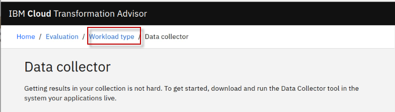
 
    This process takes time to complete, depending on how many applications are deployed on the WebSphere Application erver.

    When the collection utility competes, you will see a essage “**Thank you for uploading your data. You can proceed to the application UI for doing further analysis.”**

    Your application data is collected, it is saved as a zip file “**AppSrv01.zip”**, as shown below.

    
 
    In general, if your application server and the **Transformation  Advisor** are in the same network infrastructure, the collected data will be automatically uploaded to **Transformation Advisor** for you to view the analysis results.

    Otherwise, you must manually upload the data to **Transformation Advisor** before you can view the results.

### 1.6 Upload the data collection into Transformation Advisor

In this section, you will upload the data collection zip file
“**AppSrv01.zip**” from the WebSphere environment for analysis.

Typically, before you can upload the data collector zip files, you will
need to download the appropriate data collector for your target
environments operation environment, such as Linux, Windows, etc.

Additionally, you would run the data collector in the target environment
to collect the data for your applications. Then, you can import the
collection data into Transformation Advisor for analysis.

**Tip:** As noted in the previous section, the data collection steps
have already been done, and the resulting AppSrv01.zip file is provided
for you in the lab environment.

1.  Go back to Transformation Advisor page in web browser, click the **Server1** link to go to the Recommendations page.

    

2.  From the Evaluation / Server1 workspace, upload the
    “**AppSrv01.zip**” data collection file

    a.  Click the **Upload** button to upload a data collection file 
    
    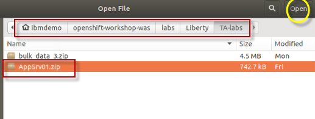

    b.  From the Upload Data page, click the **Drop or add file** link

    

    c.  Navigate to the location of the data collection file and add the **AppSrv01.zip** file. Then click the **Open** button on the Download page.

        Home \> ibmdemo \> Student \> labs \> TA-lab \> AppSrv01.zip
 
    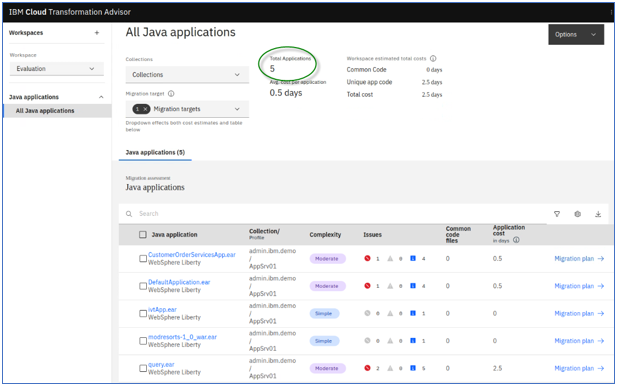

    d.  The **AppSrv01.zip** data collection file is now ready to be uploaded. Click the **Upload** button to continue.

    
 
    Once the data collection has been uploaded to Transformation Advisor, you are redirected back to the TA Recommendations screen. 
    
    > Notice that the **Profile** shown is for the **AppSrv01** profile from the WebSphere Application Server.

    
 
    In the next section, you will use Transformation Advisor to view the application data analysis that was collected.

### 1.7 Evaluate On-Premises Java Applications

In this section, you are going to use the Transformation Advisor UI to view the application data analysis results that was collected in the previous section.

1.  From the **Recommendations page**, you can see all applications
    analyzed from the WAS server are listed.

    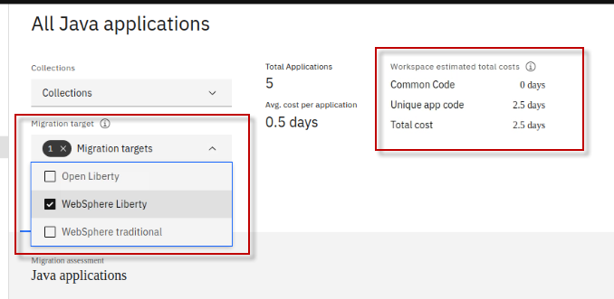
 
    On the Recommendations page, the identified migration **source environment** is shown in the **Profile** section, and the **target  environment** is shown in the **Preferred migration** section.

    The data collector tool detects that the source environment is your WebSphere Application Server profile.

    The target environment is **Liberty Runtimes**, which is the default target environment.
 
    The Recommendations page also shows the summary analysis results for all the apps in the AppSrv01 environment to be moved to a Liberty on OpenShift environment. For each app, you can see these results:

    - Name

    - Migration Target

    - Complexity

    - Issues

    - Estimated development cost (in days)

    For example, if you want to move the **modresorts-1\_0\_war.ear** application to Open Liberty, the complexity level is Simple, which indicates that the application code does not need to be changed before it can be moved to cloud. The application has no dependency, has two minor level issue and the estimated development effort is zero day because no code change is required.

    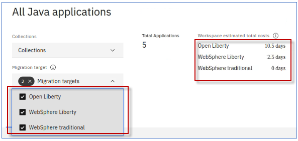
 
    As you can see the default move to cloud environment is **Liberty Runtimes**, however Transformation Advisor can also provide migration options if you want to migrate your application to different target environments as shown below:
 
    
 
    In this lab you are focusing on identifying a good candidate application for moving to Open Liberty on  OpenShift environment.

2.  Switch to the **Compatible Runtimes** view, which will show
    additional target runtime options, and their respective complexity
    of moving the application t that target environment.

    
 
    For this lab, you will focus on the modernization of **moderesorts-1.0_war.ear** to Open Liberty. Next, you will look at the analysis results for **moderesorts-1.0_war.ear** application in detail.

3.  Click the **modresorts-1_0_war.ear** link targeting **Open
    Liberty** to expand its analysis results.

    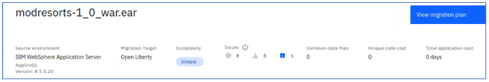
 
    The first section in the detail analysis summary page is the **Complexity section**. The overall complexity for the application is  **simple**, indicating that the application can be directly moved to cloud without any code change.

    

4.  Scroll down to **Complexity Rules** section. You can see although there is no code change required and no development cost, the estimate migration over all develop cost is **0 days**. This estimate is based on data from IBM Services engagements, which includes migrating management, server configuration, and testing.

    

5.  Expand the **Issues and issues details** section. You can see the only minor potential issue listed is on configuring the application in Docker container.

    
 
    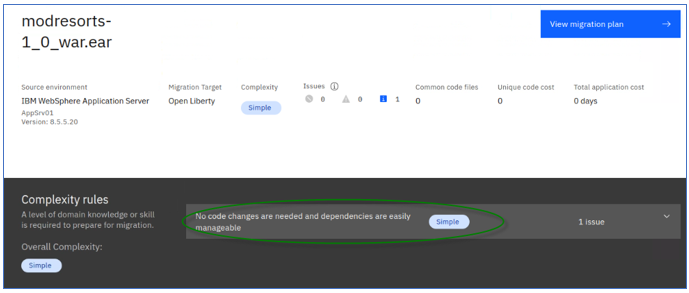

6.  Next, scroll down to the bottom of the page and click the
    **Technology Report** link, this opens a new browser window to show the application Evaluation Report.

    
 
    The **Technology report** lists all java technologies the application used and whether these technologies are supported by a specific WebSphere platform from Liberty for Java on IBM Cloud to WebSphere traditional for z/OS. It is used to determine whether a particular WebSphere product is suitable for an application.

    

    As you can see from the report, the Mod Resorts application only uses **Java Servlet** which is supported by all WebSphere editions.

7.  Go back to the Transformation Advisor page and click the **Analysis Report** link.

    

    a.  Click **OK** to continue.

    
 
    Now you see the Detailed Migration Analysis Report opened in a new browser window.

    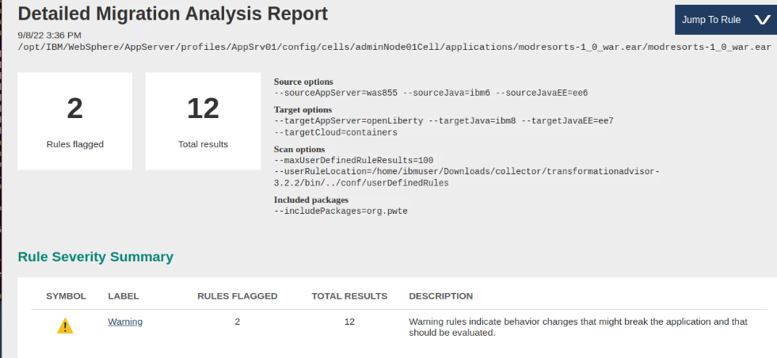

    This is the deep-dive report which shows all issue found at the code level.

    b.  Scroll down to **Detailed Results by Rule** section, you can see all the java technology issues identified based on different migration rules.

    
 
    For the Mod Resorts application, there are two warning rule regarding the application configuration in Docker containers.

    c.  Click the **Show results** link next to the warning rules.

    You can see the detail analysis of the issue at code level, in a specific class file and specific line. This helps developers to pinpoint where the issue is, or potential issue may be.
 
    

    d.  Click the **Show rule help** link.

    
 
    This expands the Rule Help section which provides recommended solutions on how to fix the issue.

    
 
    For the Docker container configuration issue, the utility provides best practice suggestion to externalize the configuration for the container.

8.  Go back to the Transformation Advisor page and click the **Inventory Report** link.

    
 
    The **Inventory Report** shows up. This report helps you examine what is in your application, including the number of modules, their relationships, and the technologies in those modules. It also gives you a view of all the utility JAR files in the application that tend to accumulate over time. Potential deployment problems and performance considerations are also included.

    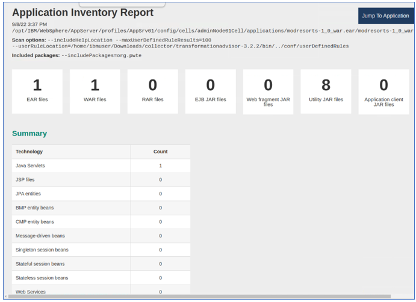

    a.  Scroll down to view this report which serves as good decision-making tool to info you what is inside your application runtime, and to help you to have a better understanding of the application runtime, the components it has and the relationships among them.

    
 
    From the analysis reports you looked at above, you know that the Mod Resorts application is supported by Open Liberty which is the target environment, and the issue that the tool identified would not affect the application migration. You can confidently select the application as a good candidate for moving to Open Liberty in containers in the repackage process with minimum effort.

9.  Now you know that the Mod Resorts application can be moved to Liberty, you want to know if it is also a good candidate for
    re-platform with traditional WebSphere in containers. To do that switch the target environment from **Compatible Liberty Runtime** to **WebSphere traditional**.

    
 
    As you can see from the TA recommendation that the Mod Resorts application is also a good candidate for re-hosting in WAS Base container on cloud. If you want to review the recommendation details, you can follow the same steps you did before to go over them.
 
    

10. **OPTIONAL:** Evaluate the CustomerOrderServicesApp.ear Application

    You can follow the same procedure you did for the Mod Resorts application to view the analysis results for any of the other applications that was analyzed, such as **CustomerOrderServicesApp.ear** application.

    As you can see from the Summary list, the recommendations for the application to move to cloud are as follows:

    - The complexity level is Simple, for WebSphere Liberty and WebSphere Traditional, which means that the application code can be deployed to Liberty on OpenShift without any changes.

    - The estimated development effort is 0 day because no code changes are needed.

    

## 6.8 Overview of the Mod Resorts application

From the insights gained from Transformation Advisor, you learned that
the Mod Resorts is a simple EE application and is a good candidate for
moving to Open Liberty and container-based clouds.

For illustration purposes, in this short section, a few screen shots are
captured to illustrate the Mod Resorts application.

The Mod Resorts application home page is illustrated here:

The user would select the destination of their travel

Perhaps the user wants to go to **PARIS, FRANCE. Mod Resorts shows the**
weather of the city.

Continue to the last section of the lab where you are briefly introduced
to Transformation Advisor’s migration plan.

The migration plan includes a migration bundle of generated deployment
artifact that accelerate the deployment of the application to Liberty in
a container-based cloud deployment.

**7. Explore the migration
bundle for the Mod Resorts application**

Transformation Advisor will display details about the **migration
bundle** that it generated to accelerate the modernization of
applications to containers in OpenShift. The migration bundle includes
diverse artifacts, depending on the needs of the application to
accelerate the build and deployment of an application Docker image into
OpenShift platform.

The user can choose to create a migration bundle for either

  - **binary** project of an application (uploading a WAR/EAR file and
    its dependent libraries)

  - **source code** project of an application, so that the application
    source files can be modernized and maintained

Now, let’s quickly explore a Migration Plan for the Mod Resorts
application to see the artifacts that Transformation Advisor creates to
expedite the app deployment to OpenShift Platform.

1.  Click on the menu with the **hamburger icon** next to the ModResorts
    application analysis to display the menu choices and choose **View
    migration plan**:

> 

2.  Notice the contents of the migration bundle for the **Source code**
    option.

> To accelerate the application modernization, the artifacts produced by
> Transformation Advisor include:

  - **server.xml**: the configuration for the Liberty server

  - **pom.xml**: Build the application using Maven

  - **Application CR**: Custom Resource for the application to be
    deployed to OpenShift via the Open Liberty Operator

  - **Dockerfile**: Create the Docker image for the application

> The user will be able to choose to **download** the artifacts as a
> migration bundle or **push** the bundle contents into a GitHub
> repository.
> 
> 

**8. Summary**

In this lab, you learned how to evaluate the existing Java application
using IBM Cloud Transformation Advisor. As a part of IBM Application
Modernization solutions, the Transformation Advisor tool provides a
recommendation for the right-fit IBM WebSphere Application Server
edition and offers advice, best practices, and potential solutions to
assess the ease of moving apps to Liberty or to WAS container, or to
newer versions of WebSphere traditional.

Transformation Advisor accelerates application migrating to Liberty and
containers and helps minimize errors and risks and reduce time to
market. To learn more about Application Modernization solutions, please
continue with the rest of the lab series.

**Congratulations\! You have successfully completed the lab “Evaluate
On-Premises Java Apps with Transformation Advisor”.**
