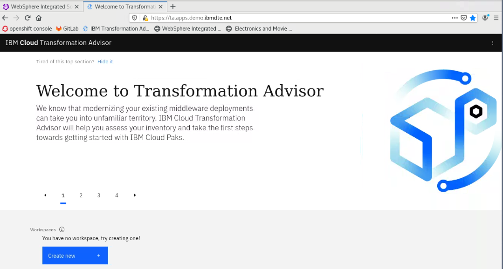
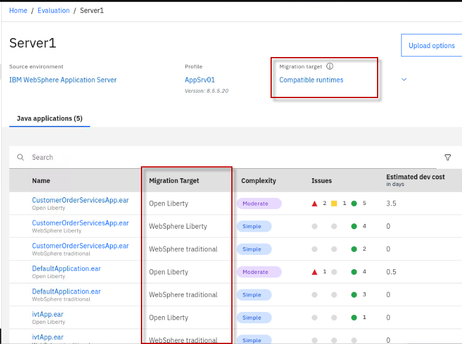
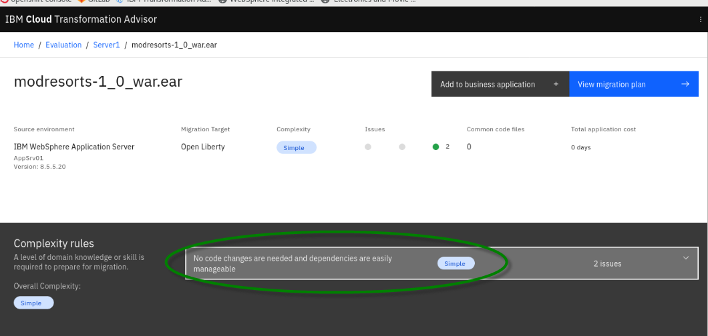
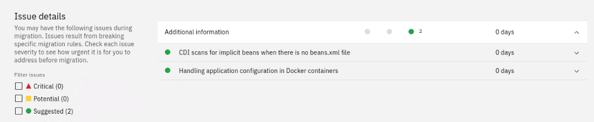
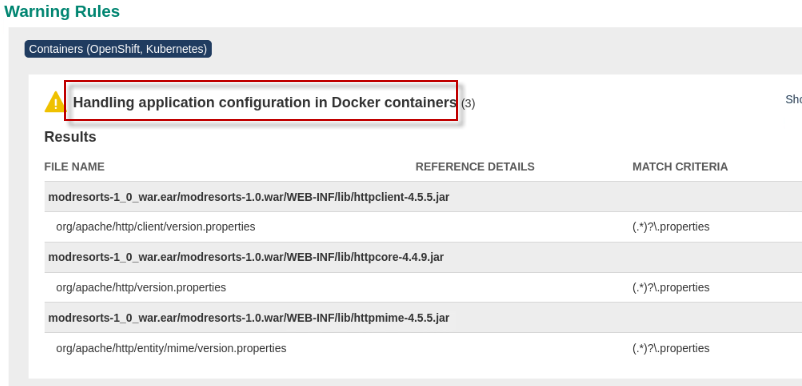
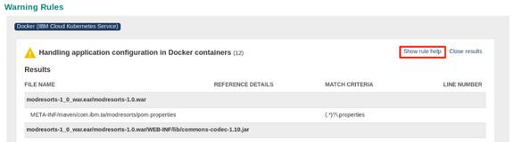
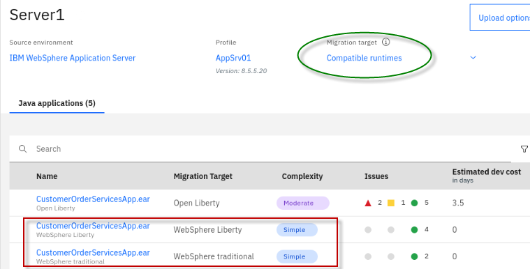
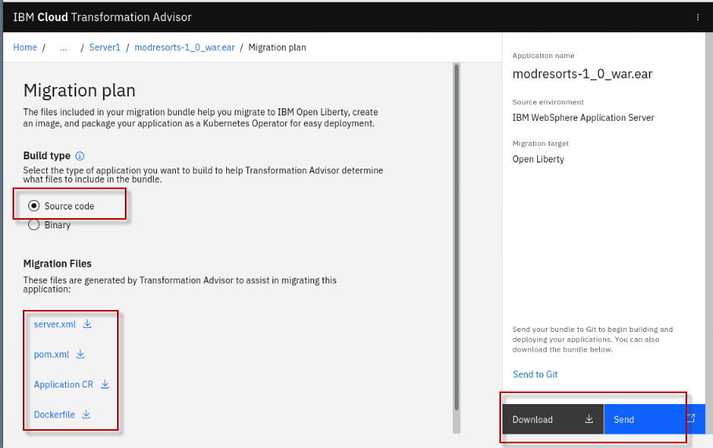

# Evaluate Java Applications with Transformation Advisor

This lab provides fundamental hands-on experience of Java application evaluation process as an initial step of an application modernization project. 

It shows the value of using Transformation Advisor to evaluate on-premises Java applications and identify a migration candidate for moving to the cloud. 

In this lab, you learn how to use this tool to quickly analyze
on-premises Java applications without accessing their source code and to
estimate the effort and scope of moving a candidate application to Liberty and containers.

**IBM Cloud Transformation Advisor** (Transformation Advisor) is an
application modernization tool that is entitled through IBM WebSphere
Hybrid Edition. Transformation Advisor helps you quickly evaluate
on-premises Java EE applications for deployment to the cloud. 

The Transformation Advisor tool can:

  - identify the Java EE programming models in the app.

  - determine the complexity of apps by listing a high-level inventory
    of the content and structure of each app.

  - highlight Java EE programming model and WebSphere API differences
    between the WebSphere profile types

  - identify Java and Java EE specification implementation differences that might
    affect the app

Additionally, the tool provides a recommendation for the right-fit IBM
WebSphere Application Server edition and offers advice, best practices,
and potential solutions to assess the ease of moving apps to Liberty or
newer versions of WebSphere traditional. It accelerates application
migrating to cloud process, minimize errors and risks, while reducing time to market.

## 1. Business Scenario

As shown in the image below, your company has several web applications
deployed to WebSphere Application Server (WAS) environment.

Your company wants to move these applications to a lightweight WebSphere
Liberty server on a Kubernetes container-based platform. However, you are not sure how much effort the migration process might take. You decide to use the IBM Transformation Advisor to do a quick evaluation of these applications without their source code to identify good candidate application to move to your target OpenShift container-based platform.

## 2. Objective

The objectives of this lab are to:

  - learn how to collect Java application and configuration data using
    the Transformation Advisor Data Collector tool.

  - learn how to use the Transformation Advisor to evaluate and scope the application modernization for candidate Java applications.

## 3. Prerequisites

The following prerequisites must be completed prior to beginning this
lab:

  - Familiarity with basic Linux commands

## 4. The Lab Environment

An App Mod Lab environment has been provided for this lab. It contains six VMs. 

  - The Red Hat OpenShift Container Platform (OCP) v4.6, is installed in
    6 VMs with 3 master nodes / compute nodes (the master nodes are
    serving as computer nodes as well).
    
      - master1 VM
    
      - master2 VM
    
      - master3 VM,
    
      - dns VM
    
      - nfs VM
      
 -  **Note:** The 3 master nodes are also serving as compute nodes in the lab environment 

  - The **desktop VM** is the VM you will use to access and work with
    OpenShift (OCP) cluster in this lab.

  - The login credentials for the **desktop VM** are:
    -  User ID: **ibmuser** 
    -  Password: **engageibm**

## 5. Lab Tasks

In this lab, you access WebSphere Application Server to review the
deployment of the JEE applications. Then you are going to use
Transformation Advisor to identify a good candidate application for
moving to WebSphere Liberty runing in containers. To identify which Java EE programming models are on the server, you could run the Transformation Advisor Data Collector tool against the server.

The Transformation Advisor creates an inventory of the content and
structure of each application and learn about problems that might occur
if you move the application to cloud. Finally, you review the analysis
reports to determine the complexity of the move-to-cloud efforts and
select the migration candidate app.

Here are the activities involved in this process:

  - Log in to WebSphere Application Server to review the deployed JEE
    applications

  - Run the Transformation Advisor Data Collector tool against the
    WebSphere Application Server to get application data

  - Review the analysis reports that Transformation Advisor generates to
    identify the right candidate application for a rapid and
    cost-effective migration to cloud

## 6. Execute Lab Tasks

### 6.1 Log in to the desktop VM and Get Started

1.  If the VMs are not already started, start them by clicking the play
    button for the whole group.

    
 
     

2.  After the VMs are started, click the **desktop VM** icon to access
    it.

    
     
    The Desktop Linux Desktop is displayed. You execute all the lab tasks
    on this desktop VM.

     

3.  Login with **ibmuser** ID.
    
      - Click on the **ibmuser** icon on the screen.
    
      - When prompted for the password for **ibmuser**, enter
        "**engageibm**" as the password:

       

    

     

4.  Resize the Skytap environment window for a larger viewing area while
    doing the lab. From the Skytap menu bar, click on the "**Fit to
    Size**" icon. This will enlarge the viewing area to fit the size of
    your browser window.

    

     

5.  Open a terminal window by clicking its icon from the Desktop.

    

     

6.  If you have not yet cloned the GitHub repo that contains the lab artifacts, in a previous lab, run the following command on your terminal. Otherwise, you can skip this step.

    a. In the terminal window, run the following command to clone the GitHub repository for this workshop.
 
        cd /home/ibmuser
        
        git clone https://github.com/IBMTechSales/openshift-workshop-was.git
 
    **Sample output**
 
    
	
	 

7.  The lab materials are downloaded to the
    **/home/ibmuser/openshift-workshop-was** directory.

### 6.2 Review the on-prem WebSphere apps

In this task, you look at the sample applications deployed to the local
WebSphere Application Server (WAS) environment. Through the application
assessment phase, you are going to identify which applications would be
the good candidate to modernize and potentially re-platform to WebSphere Liberty and containers.

1.  Start WebSphere Application Server

    In the desktop VM, you have a local WebSphere Application Server which
    hosts several sample applications. To start the WAS server:
 
    a. In the terminal window, issue the command below to start the WAS server.

        /home/ibmuser/startWAS.sh

    b. If prompted for **sudo** password, enter the password as: **passw0rd**.

    > Within a couple of minutes, the WAS server is ready.

    > 
 
    c. Access the WAS Admin Console to view the application deployed by clicking the Firefox icon on the Desktop.

    > 
 
    d. From the web browser window and click **WebSphere Integrated Solution Console** bookmark to launch the WAS console. Or launch the
       WAS admin console using the URL: <https://localhost:9043/ibm/console/>

    > 
 
    e. If you see the **Warning: Potential Security Risk Ahead** message,
       click **Advanced**\>**Accept the Risk and continue**.
 
    f. In the WAS Admin Console login page, enter the WebSphere Admin User
       ID and Password as: **wsadmin**/**passw0rd** and click **Login**.
 
    > 
 
    g. On the WAS Console page, click **Applications** -> **Application > Types** -> **WebSphere enterprise applications** to view the deployed applications.

    > 
 
    In the Enterprise Applications list, you can see all applications
    deployed. Next, you use Transformation Advisor to analyze these
    applications to identify a good candidate to be moved to the cloud.

### 6.3 Access Transformation Advisor

The Transformation Advisor is installed in the OpenShift cluster. In
this lab, you use the following steps to access the Transformation
Advisor tool.

1.  From web browser window, open a new Browser tab

2.  Then click the **IBM Cloud Transformation Advisor** bookmark and login
    with the OpenShift account credentials.

    
	
	 

3.  If prompted to log in to Red Hat OpenShift Container Platform, click
    **htpasswd** field. Then log in with **ibmadmin**/**engageibm** as
    the username and password.

    
 
    
 
    The Transformation Advisor Home page is displayed.
 
     
 
 
### 6.4 Download Transformation Advisor Data Collector utility

The Transformation Advisor can evaluate any Java based applications. In
this lab, you are going to use it to evaluate whether the on-premises
WebSphere application, **Mod Resorts**, is suitable to move to WebSphere Liberty and containers, and gain insights into the effort and scope to get it there.

You can use Transformation Advisor Data Collector utility to get the
application data and server configuration from the WebSphere Application
Server running on the desktop VM. The utility can be downloaded from the
Transformation Advisor web page and is illustrated in the following
steps.

1.  In the Transformation Advisor page, you first create a new workspace
    by clicking on the **Create New** button.

    

     

2.  On the **Create a new workspace** page, enter the workspace name as
    **Evaluation** and then click **Next**.

    
 
    **Note**: A workspace is a designated area that houses the migration
    recommendations provided by Transformation Advisor against your
    application server environment. You can name and organize these
    however you want, whether it’s by business application, location, or teams.

     

3.  Enter the collection name as **Server1** and click **Create**

    
	
	 
 
    **Note:** Each workspace can be divided into collections for more
    focused assessment and planning. Like workspaces, collections can be
    named and organized in whatever way you want.
 
    Once the **Workspace** and **Collection** are created, you have
    options to either download the Data Collector utility or upload
    existing data file. In this lab, you are going to first use the Data
    Collector utility to collect the application and configuration from
    the WebSphere environment. Once you have the data collected from
    WebSphere, then it is possible to choose to Upload the collected data
    to Transformation Advisor for analysis.

     

4.  Click **Download** to go to the data collector tool download page.

    

     

5.  In the **Download** page, you can download different version of the
    utility based on your source operating system. It also shows how to
    use the utility in command line to collect application data from
    WebSphere, WebLogic, and Tomcat servers. Since the lab VM is a Linux
    OS, click **Download for Linux** to get the utility.

    

     

6.  In the Download dialog window, select the **Save File** option and
    click **OK**.

    
 
    The zipped Data Collector utility file is saved in **/home/ibmuser/Downloads** directory of the lab desktop VM.

### 6.5 Run Transformation Advisor Data Collector utility

After downloading the zipped Data Collector utility, you need to unpack
it and run the utility against the WAS server to collect all deployed
applications and their configuration data from WAS server.

1.  Go back to the terminal window.

2.  In the terminal window, navigate the **/home/ibmuser/Downloads**
    directory and view its contents with commands:

        cd /home/ibmuser/Downloads/
 
        ls -l

    - You see the downloaded data collector utility file saved in the
    directory.
	
	 

3. Extract the data collector utility using the following command:

        tar xvfz transformationadvisor-Linux_Evaluation_Server1.tgz

    - The data collector utility is extracted to  **/home/ibmuser/Downloads/transformationadvisor-X.Y.Z** directory, where X.Y.Z is the version of the tool downloaded.

     

4. Run the Data Collector utility with the commands below to start collecting the deployed applications information on the WAS server.

        cd /home/ibmuser/Downloads/transformationadvisor-X.Y.Z
 
           Note: Substitute X.Y.Z with the version number of the Transformation Advisor tool that was downloaded
 
 
        ./bin/transformationadvisor -w /opt/IBM/WebSphere/AppServer -p AppSrv01 wsadmin passw0rd
 
    a. Type **1** to accept the license agreement and press **Enter**.

    > The utility starts to collect application data. This process takes
    > some time to complete depending on how many applications deployed on
    > the WAS server. In this lab, it might be a few minutes. When it is
    > done, you see output like this:
 
    > 

    > Your application data is collected, it is saved as a **zip file** under the collector tool directory.

5. View the tool directory with command, you see the **AppSrv01.zip** file is created.

        ls -l

    **Sample Output:**

    
     
    In general, if your application server and the Transformation Advisor
    are in the same network infrastructure, the collected data is
    automatically uploaded to Transformation Advisor for you to view the
    analysis results. Otherwise, you must manually upload the data to
    Transformation Advisor before you can view them.

     In this lab, WebSphere Applicatin Server and Transformation Advisor are on the same network, so the analysis results from the scan will automatically be uploaded to the Transformation Advisor UI. 
    

### 6.6 Evaluate On-Premises Java Applications

In this section, you are going to use the Transformation Advisor UI to
view the application data analysis results that was collected in the
previous section.

1.  Go back to Transformation Advisor page in the web browser, click the
    **Server1** link to go to the Recommendations page.

    

     
 
2. From the **Recommendations page**, you can see all applications that were analyzed on the WebSphere Application Server, and are listed in the  Transformation Advisor collection view.  
 
    
 
    On the Recommendations page, the identified migration **source
    environment** is shown in the **Profile** section, and the **target    environment** is shown in the **Preferred migration** section.
 
    The data collector tool detects that the source environment is your
    WebSphere Application Server AppSrv01 profile.
 
    The target environment is **Liberty Runtimes**, which is the default
    target environment.
 
    The Recommendations page also shows the summary analysis results for
    all the apps in the **AppSrv01** profile to be moved to a Liberty on OpenShift environment. 
    
    For each app, you can see these results:

    - Name

    - Migration Target

    - Complexity

    - Issues

    - Estimated development cost (in days)

     

    For example, if you want to move the **modresorts-1\_0\_war.ear**
    application to Open Liberty, the complexity level is **Simple**, which
    indicates that the application code does not need to be changed before
    it can be moved to Open Liberty. The application has no dependency, has two minor level issue and the estimated development effort is zero day because no code change is required.
 
    As you can see the default target environment is **Liberty    Runtimes**, however Transformation Advisor can also provide migration
    options if you want to migrate your application to different target
    environments as shown below:
 
    

      

    In this lab you are focusing on identifying a good candidate for
    moving to the Open Liberty on OpenShift environment.

     
	
3. Switch to the **Compatible Runtimes** view, which will show additional
   target runtime options, and their respective complexity of moving
   the application t that target environment.

    
 
     
   
    For this lab, you will focus on the modernization of
    **modresorts-1.0\_war.ear** to Open Liberty. Next, you will look at
    the analysis results for **modresorts-1.0\_war.ear** application in
    detail.
	
	 

4.  Click the **modresorts-1\_0\_war.ear** link targeting **Open
    Liberty** to expand its analysis results.

    
 
     
 
    The first section in the detail analysis summary page is the
    **Complexity section**. The overall complexity for the application is
    **simple**, indicating that the application can be directly moved to Open Liberty without any code change.
 
    

     

5.  Scroll down to **Complexity Rules** section. 
 
    You can see there is no code change required, so there is **0 days** for the migration development cost. This estimate is based on data from IBM Services engagements, which includes application code migration, but does not include many additional migration project costs such as testing, Runtime Server configuration, etc. 

    
 
     

8.  Expand the **Issues and issues details** section. You can see the
    only minor potential issue listed is on configuring the application
    in Docker container.

    
 
    

     

9.  Next, scroll down to the bottom of the page and click the
    **Technology Report** link, this opens a new browser window to show
    the application Evaluation Report.

    
 
     
 
    The **Technology report** lists all Java EE technologies the application used and whether these technologies are supported by a specific WebSphere platform from Liberty for Java on IBM Cloud to WebSphere traditional for z/OS. It is used to determine whether a particular WebSphere product is suitable for an application.
 
    
 
      
 
    As you can see from the report, the Mod Resorts application only uses
    **Java Servlet** which is supported by all WebSphere editions.
	
	 

8.  Go back to the Transformation Advisor page and click the **Analysis
    Report** link.

    
 
    a. Click **OK** to continue.
 
    >
 
    > Now you see the Detailed Migration Analysis Report opened in a new
    > browser window.
 
    > 
 
    > This is the deep-dive report which shows all issue found in the java application binary (WAR).
 
    b. Scroll down to **Detailed Results by Rule** section, you can see
    all the java technology issues identified based on different migration
    rules.
 
    > 
 
    > For the Mod Resorts application, there are two warning rule regarding
    > the application configuration in Docker containers.
 
    c. Click the **Show results** link next to the warning rules.
 
    >You can see the detail analysis of the issue at code level, in a
    >specific class file and specific line. This helps developers to
    >pinpoint where the issue is, or potential issue may be.
 
    > 
 
    d. Click the **Show rule help** link.
 
    > 
 
    > This expands the Rule Help section which provides recommended
    > solutions on how to fix the issue.
 
    > 
 
    > For the Docker container configuration issue, the utility provides
    > best practice suggestion to externalize the configuration for the
    > container.

9.  Go back to the Transformation Advisor page and click the **Inventory
    Report** link.

    
 
    The **Inventory Report** shows up. This report helps you examine what
    is in your application, including the number of modules, their
    relationships, and the technologies in those modules. It also gives
    you a view of all the utility JAR files, and the classes in the jar files. 
 
    
 
    a. Scroll down to view this report which serves as good
       decision-making tool to info you what is inside your Java application deployment binaries, and to help you to have a better understanding of the application components and the relationships among them.
 
    > 
 
    > From the analysis reports you looked at above, you know that the Mod
    > Resorts application is supported by Open Liberty which is the target
    > environment, and the issue that the tool identified would not affect
    > the application migration. You can confidently select the application
    > as a good candidate for moving (re-platfoming) to Open Liberty in containers with minimum effort.

10. Now you know that the Mod Resorts application can be moved to
    Liberty, you want to know if it is also a good candidate for
    modernization to traditional WebSphere in containers. To do that
    switch the target environment from **Compatible Liberty Runtime** to
    **WebSphere traditional**.

    
 
      
 
    As you can see from the TA recommendation that the Mod Resorts
    application is also a good candidate for re-hosting in WAS Base
    container in containers. 
    
    If you want to review the recommendation details, you can follow the same steps you did before to go over them.
 
    

     

11. **OPTIONAL:** Evaluate the CustomerOrderServicesApp.ear Application

    You can follow the same procedure you did for the Mod Resorts
    application to view the analysis results for any of the other
    applications that was analyzed, such as
    **CustomerOrderServicesApp.ear** application.
 
    As you can see from the Summary list, the recommendations for the
    application to modernize this application to containers are as follows:

    - The complexity level is Simple, for WebSphere Liberty and WebSphere
      Traditional, which means that the application code can be deployed
      to Liberty on OpenShift without any changes.

    - The estimated development effort is 0 day because no code changes are needed.

     

    

### 6.7 View the Mod Resorts application

From the analysis you did above, you know that the Mod Resorts
application is a good candidate for moving to cloud, you can view how
the application looks like, as it is currently running in the WebSphere
Traditional server on the desktop VM.

1.  From the web browser window, click new Tab to open a new browser
    window. Type the Mod Resorts application URL:
    **http://localhost:9080/resorts/** and press **Enter**.

    The Mod Resorts application home page is displayed.
 
    

     

2.  Click **WHERE TO?** dropdown menu to see the city list.

    

     

3.  Click **PARIS, FRANCE** from the list, it shows the weather of the
    city.

    

     

## 7. Explore the migration bundle for the Mod Resorts application

Transformation Advisor will display details about the **migration
bundle** that it generated to accelerate the modernization of
applications to containers in OpenShift. The migration bundle includes
diverse artifacts, depending on the needs of the application to
accelerate the build and deployment of an application Docker image into
OpenShift platform.  
  
The user can choose to create a migration bundle for either

1.  **binary** project of an application (uploading a WAR/EAR file and
    its dependent libraries)

2.  **source code** project of an application, so that the application
    source files can be modernized and maintained

Now, let’s quickly explore a Migration Plan for the Mod Resorts
application to see the artifacts that Transformation Advisor creates to
expedite the app deployment to OpenShift Platform.

1.  Set the **Migration targets** back to **Liberty Runtimes**

2. Click on the menu with the **hamburger icon** next to the ModResorts
    application analysis to display the menu choices and choose **View    migration plan**:  
      
    

     

3.  Notice the contents of the migration bundle for the **Source code**
    option.  
      
    To accelerate the application modernization, the artifacts produced
    by Transformation Advisor include:

    - **server.xml**: the configuration for the Liberty server

    - **pom.xml**: Build the application using Maven

    - **Application CR**: Custom Resource for the application to be
    deployed to OpenShift via the Open Liberty Operator

    - **Dockerfile**: Create the Docker image for the application

     
	
	The user will be able to choose to **download** the artifacts as a
    migration bundle or **push** the bundle contents into a GitHub
    repository.  
   
    

     

## 8. Summary

In this lab, you learned how to evaluate the existing Java application
using IBM Cloud Transformation Advisor. As a part of IBM Application
Modernization solutions, the Transformation Advisor tool provides a
recommendation for the right-fit IBM WebSphere Application Server
edition and offers advice, best practices, and potential solutions to
assess the ease of moving apps to Liberty or to WAS container, or to
newer versions of WebSphere traditional.

Transformation Advisor accelerates application migrating to Liberty and
containers and helps minimize errors and risks and reduce time to
market. To learn more about Application Modernization solutions, please
continue with the rest of the lab series.

**Congratulations\! You have successfully completed the lab “Evaluate
On-Premises Java Apps with Transformation Advisor”.**

