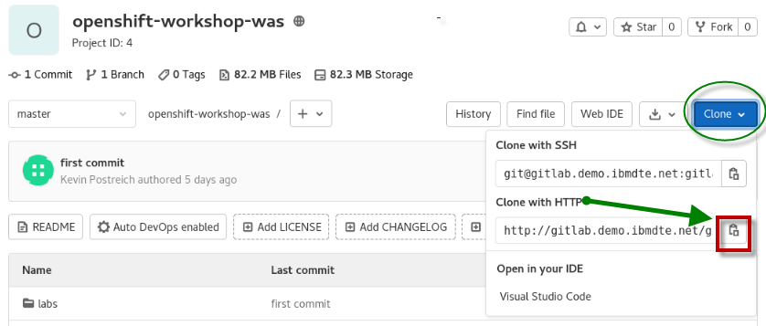
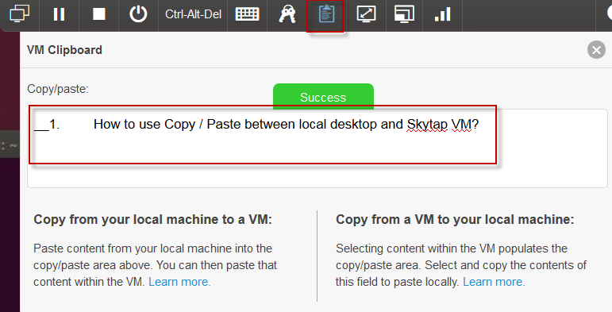

# Devops Management - GitOps with Argo CD

## 1.1 ARGO CD Introduction 

In this lab exercise, you will gain hands-on experience with Argo CD as a declarative GitOps continuous delivery tool for Kubernetes.
 
This guide will walk you through an example of how to build, deploy, and continuously manage an application following important GitOps practices.
 
We will be using the GitOps continuous delivery tool **Argo CD** in
this lab. This controller enables developers to automate application
deployment and lifecycle management.

Continuous Integration, Delivery, and Deployment are important devOps
practices. These processes are valuable and ensures that the software is
up to date timely.

  - **Continuous Integration** is an automation process which allows
    developers to integrate their work into a repository. When a
    developer pushes his work into the source code repository, it
    ensures that the software continues to work properly. It helps to
    enable collaborative development across the teams and also helps to
    identify the integration bugs sooner.
  
  - **Continuous Delivery** comes after Continuous Integration. It
    prepares the code for release. It automates the steps that are
    needed to deploy a build.

  - **Continuous Deployment** is the final step which succeeds
    Continuous Delivery. It automatically deploys the code whenever a
    code change is done. Entire process of deployment is automated.

**GitOps** in short is a set of practices to use Git pull requests to
manage infrastructure and application configurations. Git repository in
GitOps is considered the only source of truth and contains the entire
state of the system so that the trail of changes to the system state are
visible and auditable.

  - **Traceability of changes** in GitOps is no novelty in itself as this
    approach is almost universally employed for the application source
    code. However GitOps advocates applying the same principles
    (reviews, pull requests, tagging, etc) to infrastructure and
    application configuration so that teams can benefit from the same
    assurance as they do for the application source code.

**Argo CD** is a declarative, GitOps continuous delivery tool for
Kubernetes. Applications, application definitions, configurations, and
environments should be declarative and version controlled. Also
application deployment and lifecycle management should be automated,
auditable, and easy to understand. All this can be done using Argo.

Check these guides out if you want to know more about Argo - [Argo CD -
Declarative GitOps CD for
Kubernetes](https://argoproj.github.io/argo-cd/).

You can read more about Argo CD here:
<https://argoproj.github.io/argo-cd/>

**Argo CD architecture diagram**

The Argo CD component are described below the diagram.

## **Argo CD Components**

**API Server**

The API server is a gRPC/REST server which exposes the API consumed by
the Web UI, CLI, and CI/CD systems. It has the following
responsibilities:

  - application management and status reporting

  - invoking of application operations (e.g. sync, rollback,
    user-defined actions)

  - repository and cluster credential management (stored as K8s secrets)

  - authentication and auth delegation to external identity providers

  - RBAC enforcement

  - listener/forwarder for Git webhook events

**Repository Server**

The repository server is an internal service which maintains a local
cache of the Git repository holding the application manifests. It is
responsible for generating and returning the Kubernetes manifests when
provided the following inputs:

  - repository URL

  - revision (commit, tag, branch)

  - application path

  - template specific settings: parameters, helm values.yaml, and more

**Application Controller**

The application controller is a Kubernetes controller which continuously
monitors running applications and compares the current, live state
against the desired target state (as specified in the repo). It detects
OutOfSync application state and optionally takes corrective action. It
is responsible for invoking any user-defined hooks for lifecycle events
(PreSync, Sync, PostSync)

## 1.3 What exactly are we building here?

This Argo CD lab complements the OpenShift Pipelines lab that is
included in this workshop.

In the OpenShift pipelines lab, you used Tekton tasks and pipelines to
build and deploy the sample application to a “**dev**” namespace in an
OpenShift Cluster.

OpenShift pipelines (Tekton) allow for orchestration of tasks to be
executed as part of the continuous Integration (CI) Devops lifecycle.
While the pipeline used in this workshop is simple, and only performs
basic build and deploy tasks, it is common for pipelines to include
tasks that scan images for vulnerabilities, validate security policies,
run tests, perform additional validation, deploy to a DEV, or TEST
environment, and run custom tasks based on corporate requirements or
industry compliance.

For those reasons, OpenShift Pipelines (Tekton) shines when it comes to
executing continuous integration (CI) of the development lifecycle.

However, Argo CD is uniquely capable as a continuous delivery (CD)
solution for automating deployments of applications to specified
environments, tracking and synching the deployments, checking the status
of the deployments, and automated drift detection and visualization.

In this lab, you will see how Argo CD complements OpenShift Pipelines to
provide automated deployments to additional Kubernetes environments,
such as STAGING, or PROD.

**The overall Devops use case scenario in this workshop is:**

  - Use **OpenShift Pipelines** for continuous integration (CI) in the
    application development lifecycle, which builds the application
    image, pushes to an image repository, and deploys the application to
    the DEV environment in OpenShift.

  - Use **Argo CD** for continuous deployment (CD) of the application,
    promoting the application to additional shared environments for
    testing or production.

In this lab, you will:

1.  Clone the application's Git repo locally.

2.  Build a Docker image for the application and push it to an OpenShift
    image registry.

3.  Deploy the application with Argo CD and synch it to its Git repo

4.  Push locally-made changes to the Git repo and view how Argo CD
    automatically synchronizes environment to match the desired state
    that is in the Git Repo, which is the system of truth for this
    GitOps solution.

# 1.4 Lab Tasks

## **1.4.1 Let’s get started** 

First, launch the lab environment and login to the VM.

1.  If the VM is not already started, start it by clicking the Play
    button.
    
    

     

2.  After the VM is running (this may take several minutes), click the
    **desktop** VM to access it.
    
    

     

3.  Login with the **ibmuser** user using the password **engageibm**.
    
    

     

4.  Resize the Skytap environment window for a larger viewing area while
    doing the lab. From the Skytap menu bar, click on the **Fit to
    Size** icon. This will enlarge the viewing area to fit the size of
    your browser window.
    
    

     

5.  Open a new Firefox browser window from the VM desktop.
    
    

     

## **1.4.2 Clone the Git repository used for this lab from GitLab**

All of the files and artifacts required for this lab are available in a
public GitHub repository. You need to clone the GitHub repository to a
local repo on VM used in the lab environment.

<table>
<tbody>
<tr class="odd">
<td></td>
<td>
You will be using a local installation of <strong>GitLab</strong> on the VM as the local repository.

Argo CD follows the <strong>GitOps</strong> pattern of using <strong>Git repositories</strong> as the source of truth for defining the desired application state. In order to execute this lab, a GitHub or GitLab account is required. Therefore, to eliminate the requirement of your own personal GitHub account, we installed GitLab locally, and provide a GitLab account for you.
</td>
</tr>
</tbody>
</table>

1.  Launch the GitLab UI and login
    
    a.  Open a **Firefox** browser window on the Desktop VM
    
    b.  Open GitLab from the **GitLab** bookmark menu.
    
    c.  This will prompt you to login. Login with username
        **gitlabUser@mail.com** and password **passw0rd**. Then, click
        **Sign in**.
        
    

    <!-- end list -->

2.  Import the **openshift-workshop-was** GitHub repository to GitLab on
    the local VM.
    
    a.  From the GitLab UI, click **Create a project** link.
    
    b.  Click on **Import project** to import this lab's repository from
        GitHub
        
    
    
    c.  Under the import project from section, select the **Repo by
        URL** option
        
    
    
    d.  In the resulting page, enter the following values for each
        field:

    <!-- end list -->

       - > Git repository URL:
      **https://github.com/IBMTechSales/openshift-workshop-was.git**
    
        > This is the GitHub repository that contains the resources for this lab

     
       - > Project name: **openshift-workshop-was**
    
        > This is the GitHub repository that contains the resources for this lab

    
       - > Project slug: **openshift-workshop-was**

       - > Visibility Level: **Public** (Select the radio button for “Public” visibility

       - > Leave the **Username** and **Password** filed blank. You do not need credentials to access the public repository
    

	
    The form should look like the following filled-out form. When
    finished.
    
    
    
    
    
    e.  Click the **Create project** button, which will create the new
        project and populate it with the imported files from the
        specified GitHub repository.

    <!-- end list -->

     

3.  Clone the **openshift-workshop-was** GitLab repository onto the VM.

    a. From GitLab UI, click on the **Clone** button from the page displaying the imported repository.

    b. Under the **Clone with HTTP** section, click on the **copy icon** to copy the repo link to clipboard.
    
    

    c. From the Desktop VM, open a new **terminal window**.
    
    

    d. From the terminal window, ensure that you are in the home directory of the user "ibmuser"
    
        cd /home/ibmuser

    e.  Run the following command to clone the repo with the GitHub using the URL you copied in the previous step. Enter username **gitlabUser** and password **passw0rd** if prompted to login.
    
        git clone http://gitlab.demo.ibmdte.net/gitlabUser/openshift-workshop-was.git
    
	
	
    These commands above clone the repo **openshift-workshop-was** to
    the local directory under **/home/ibmuser/openshift-workshop-was**
    directory.

    <!-- end list -->

     

4.  Change to the directory in which this lab is located.
    
        cd  /home/ibmuser/openshift-workshop-was/labs/Openshift/DevopsManagement
		
	

5.  List the directory contents using the `ls` command
    
    You will find the following key resources:

    - > **Dockerfile** - Used to build the application on the Liberty
    > runtime

    - > **Dockerfile1** - Used to build a new image for the application

    - > **app** - The Customer Order Services application

    - > **deploy** - Used to handle deployment of the application

    - > **argocd-basic.yaml** - Used to create new Argo CD resource for
    > operator

    

     

## **1.4.3 Login to OpenShift and create a new project for this lab**

1.  Type `oc login` to login to OpenShift. Use **ibmadmin** for the
    username and **engageibm** for the password.

    

     

2. Type `oc new-project staging` which will create a new project named
    **staging**, and switch your context to that project

    <table>
    <tbody>
    <tr class="odd">
    <td></td>
    <td>
<strong>Note:</strong> Ensure you create the new project with the name “<strong>staging</strong>”.

    
Otherwise, you will be required to review and modify all YAML files that reference this OpenShift project (Namespace), prior to running the YAML files to create the pipeline resources.
</td>
    </tr>
    </tbody>
    </table>

    

     

## **1.4.4 Build the Docker image & push the image to OpenShift Image Registry**

You will now build the “**cos**” application container image using the
Dockerfile that has been provided in the lab resources. This is the same
application used in all labs in this workshop. 

The **cos** application is a Java EE Application and runs on Open Liberty in this lab.

1.  Run the following command to start building the image. Make sure to
    copy the entire command including the **"."** at the end (indicates
    the location as current directory). The image may a few minutes to complete building.
    
        docker build --tag default-route-openshift-image-registry.apps.demo.ibmdte.net/staging/cos  -f Dockerfile .
    
	
	
    About the docker build command:

    - Instructs Docker to build the image following the instructions in
    the **Dockerfile** in the current directory

    - Specifies a name to tag the built image after **--tag**

    - Includes the value **default-route-openshift-image-registry.apps.demo.ibmdte.net** as
    the default address of the internal image registry provided by
    OpenShift

     

2.  Validate that the image is in the repository by running the command:
    
        docker images
    
	
	
    Notice that the **openliberty/open-liberty** base image is also
    listed. It was pulled during the first step of building the
    application image.

     

3.  Login to the **internal OpenShift image registry**, where you will push
    the docker image.
    
        docker login -u openshift -p $(oc whoami -t) default-route-openshift-image-registry.apps.demo.ibmdte.net

    

     

4.  Push the image to OpenShift's internal image registry. (This could
    take a few minutes).
    
        docker push default-route-openshift-image-registry.apps.demo.ibmdte.net/staging/cos

    

     

5.  Verify that the image is in the image registry.
    
        oc get images | grep staging/cos

    

    This command will get all images in the registry, but we can use **grep** to filter through the results to get only the image you pushed.

> The hash of the image is stored alongside the SHA-256 value. Take note
> of this value so that you can identify the original image used to
> deploy the application. 

> In this example, the hash value is **531aabe0aa2a4d542b311cab1cdc874ca3cfbe09ecbc5c39d9f3c6d810c7a4c2** but yours will be different.

 

## **1.4.5 Get Argo CD login info from the OCP cluster**

In this lab environment, Argo CD has already been installed to the OCP
cluster using the Argo CD OpenShift operator. Additionally, all
configurations have already been made so that Argo CD is ready for
deployment and management of our application. 

#### ----------------------------------------------------------------------------------------

This setup involved the following, and is here for your reference:

**Step 1.**  Deployed a basic Argo CD cluster by creating a new Argo CD resource
    in the namespace (**argocd**) where the operator is installed
    
  > - **argocd-basic.yaml** contains the YAML for this resource. You
        can review the contents of this file with the following command
        (make sure you are in the **DevopsManagement** directory):

       cat argocd-basic.yaml

**Step 2.**  Enabled full cluster admin access to
    **example-argocd-argocd-application-controller** service account
    (this service account was automatically created by the Argo CD
    resource in the previous step)

You can learn more about the install and setup of the Argo CD operator
by reading its full documentation here:
<https://argocd-operator.readthedocs.io/en/latest/usage/basics/>

#### ----------------------------------------------------------------------------------------

In order to access the Argo CD UI, you will first need to obtain login
credentials information from the OCP cluster. The credentials are stored
in a Kubernetes secret in the argocd namespace.

3.  Get Argo CD password info.
    
    a.  Return to your terminal window.
    
    b.  Run the following commands to export the Argo CD admin account's
        password and display it. 
        
          export ARGOCD_PASSWORD=$(oc -n argocd get secret example-argocd-cluster -o jsonpath='{.data.admin\.password}' | base64 -d)
        
          echo $ARGOCD_PASSWORD
		  
	
	  
    
      > - The Argo CD operator is installed in namespace **argocd** as
        specified with the **-n** option.
    
      > - The **example-argocd-cluster** secret was automatically created
        by the Argo CD resource and contains login credentials.

	c. Copy the **password** value outputted by the **echo command** (you will need this later for login to the UI)
 
     
    
## **1.4.6 Access the Argo CD UI and login**

The Argo CD server component exposes the API and UI which is then made
accessible by a service and OpenShift **route** created by the operator.
This allows you to access the UI through your local VM.

1.  Get the Argo CD route
    
        oc -n argocd get routes

    

     	

2.  Based on the Argo CD the route information, the Argo CD UI URL is:
    
    <https://example-argocd-server-argocd.apps.demo.ibmdte.net>
    
    a.  Open this URL in a new tab from your Firefox browser in the desktop VM

     

3.  A login page will be displayed. Login with username **admin** and
    enter the Argo CD password value we copied previously as the
    password. Click **Sign In**.
    
    

     

## **1.4.7 Create an Argo CD project in the UI**

Now that the UI is accessible and ready to go, we can create a new Argo
CD project **staging** to host the Argo CD application.

1.  Create a new Argo Cd project
    
    a.  From the Argo CD UI home page, navigate to the **Settings** page
        by clicking on the gears icon from the menu on the left. Then,
        click on **Projects.**

    

    b.  Click on the **New Project** button in the upper left corner of the
    page.
    
    

    c.  In the window that pop ups from the right, enter Name **staging**
    and Description **staging**. Then, click on **Create**.
    
    

    d.  The **staging** project summary details page is now shown.

    > A **Project** in Argo CD provide a logical grouping of applications, which is useful when Argo CD is used by multiple teams. Projects provide the following features:

    > - **Source Repositories:** Reference to the repositories that
    applications within the project can pull manifests from

    > - **Destinations:** Reference to clusters and namespaces that
    applications within the project can deploy into

    > - **Cluster Resources**: The Kubernetes cluster resources that are
    allowed or denied to be deployed

2.  Edit the **SOURCE REPOSITORY** properties of the staging project to
    define source repositories
    
    a.  In the **Source Repositories** section, click on the **Edit**
        button
        
    
    
    b.  Click on **Add Source**
        
    
    
    c.  This will show an asterisk (*). Click on the **Save button.**

    > - Adding this source repository will allow our **staging** project to
    retrieve data from any Git repository where our application lies.
    
    

     
 
3.  Edit the **DESTINATIONS** properties of the staging project to
    define destination cluster / namespaces that the projects
    applications can be deployed.
    
    a.  In the **Source Repositories** section, click on the **Edit**
        button
        
    
    
    b.  Click on **Add Destination**
        
    
    
    c.  This will show an asterisk (\*). Click on the **Save button.**

    > - Adding this destination allows the project to deploy our application
    to a cluster and namespace.
    
    

     

4.  Edit the **CLUSTER RESOURCE ALLOW LIST** properties of the staging
    project to define Kubernetes resources that are allowed to be
    deployed in the cluster
    
    a.  In the **CLUSTER RESOURCE ALLOW LIST** section, click on the
        **Edit** button
        
    
    
    b.  Click on **Add Resource** under the **CLUSTER RESOURCE ALLOW
        LIST** section
        
    
    
    c.  This will show an asterisk (\*). Click on the **Save button.**

    > - Adding this resource allow list source permits deployment of
    Kubernetes API groups and kinds to the Kubernetes cluster.
    
    

     

5. When you are done, the project page should look like the following:
    
    
    
    The staging project is now configured to permit deployment of
    applications to the OpenShift Cluster. You likely noticed that we
    simply used wildcards to specify the permitted source repos,
    destinations, and cluster resources.
    
    In a real environment, you would take special care to restrict these
    permissions to known trusted resources and limit the destinations
    and resources based on the business and application requirements.

     

## **1.4.8 Deploy application through Argo CD UI**

Now that the project has been properly set up, you are ready to deploy
the Customer Order Services application using Argo CD.

1.  Navigate to the **Applications** tab in the Argo CD UI by clicking
    on the top icon in the left menu. This will bring you to a page
    displaying all applications currently being run by Argo CD.

    

     

2.  Click on **New App** in the upper left of the page to create a new
    deployment of our application.

    

     

3.  Return to the GitLab page displaying the **openshift-workshop-was**
    project. Click on **Clone** and copy the link under the **Clone with
    HTTP** section. You will need this URL to create the application in
    the Argo CD UI.

    

     

4.  Enter the following details to create the application. Click
    **Create** to finish, after completing the form.

    > **GENERAL settings:**

     > - Application Name: `cos`

     > - Project: `staging`

     > - Sync Policy: `Manual`
   
     
      

    > **SOURCE settings:**

     > - Repository URL: `http://gitlab.demo.ibmdte.net/gitlabUser/openshift-workshop-was.git`
    
     >> **Note:** This is the URL that you copied from GitLab in the previous step.
     
    > - Revision: `HEAD`

    > - Path: `labs/Openshift/DevopsManagement/deploy/overlays/staging`
    
    >> **Note:** This is the path within the repository to the YAML files that handle the application's deployment for the staging project.

    

    > **DESTINATION settings**

     > - Cluster: `https://kubernetes.default.svc`

     > - Namespace: `staging`
    
     >> **Note**: This corresponds to the new **staging** OpenShift project we created previously.

     

      

5. Click the **Create** Button to create the app

6.  This new application will now be listed among available apps, but it
    will initially be out of sync. Because we set a **Manual** sync
    policy, you will need to sync it for deployment.

     

      

7.  In order to sync the application with your Git repository, click on
    **Sync** within the **cos** application's panel and then click
    **Synchronize** in the resulting pop-up window.

    

    Do not check off any of the various options available for you (prune,
    dry run, etc.) but a brief description of what each of these do is
    given below for a better understanding of how Argo CD works.

    > - **Prune:** allow unexpected resources to be automatically deleted

    > - **Dry Run**: preview of changes without affecting the
    cluster yet

    > - **Apply Only**: only run the apply for application resources

    > - **Force**: force sync the application

8.  Once the sync is complete, Argo CD will begin the deployment process
    of the application. When it is done, the STATUS should be
    **Healthy** and **Synched** as illustrated below

    

     

9. Click on the **cos** application to view additional details. Hover
    over the **cos** pod block to see the image used for deployment. We
    know this is the same image as the one we built before because of
    the corresponding hash value.

    

     

## **1.4.9 Verify the application's deployment**

You will now access the Customer Order Services application to verify
that it has been correctly deployed by Argo CD.

1.  Return to your Terminal window and run the following command to list
    the **cos-staging** route in our **staging** namespace.

        oc get route -n staging
		
		

     

2.  Run the following command to get the URL of your application, from
    the route

        echo http://$(oc get route cos --template='{{ .spec.host > }}')/CustomerOrderServicesWeb
 
    
 
    The resulting URL is where we can access our deployed application.

     

3.  Return to your **Firefox** browser window, open a new Browser tab; then
    open the URL outputted by the previous command in a new tab.
	
	    http://cos-staging.apps.demo.ibmdte.net/CustomerOrderServicesWeb

     

4.  You will be prompted to login in order to access the application.
    Enter username **skywalker** and password **force**. Then, click
    **OK**.

    

     

5.  After login, the page titled **Electronic and Movie Depot** will be
    displayed. Drag and drop a few movies into the shopping cart to
    ensure that the application is functioning correctly.

    

     

6.  As items are added, they'll be shown under **Current Shopping Cart**
    (on the upper right) with the updated **Order Total**.

   

    

## **1.4.10 Update the deployment through Git and view changes in Argo CD**

The application is now synced with your GitHub repository by Argo CD,
making it simple to apply any latest changes and update deployment. You
will see how this works by pushing changes to your GitHub repo and
checking to see how this is reflected in Argo CD. Let's simulate an
updated application version release by building and tagging a new image.

1. Build a new image using **Dockerfile1** instead of **Dockerfile** in
    the current directory and tag it with **v2.0** to indicate a new
    version of the image:
    
        docker build --tag default-route-openshift-image-registry.apps.demo.ibmdte.net/staging/cos:v2.0 -f Dockerfile1 .
		
	
	
	 

2. Verify that a new Docker image has been built with the updated **v2.0** tag:
    
        docker images
		
	

     	

3. Push this new image (v2.0) to OpenShift's internal image registry.
    
        docker push default-route-openshift-image-registry.apps.demo.ibmdte.net/staging/cos:v2.0
		
		
	
	    
    Take note of your new image's hash value (shown alongside sha256) so
    that you can identify the updated image in the Argo CD UI. 
	
	In this example, the image's hash value is
    **2df354e72b89c7726d0e707cfd9e98a91f207bd3b9d048d3b81ce9a89918883f** but
    yours will be different.

     

4. Update the application's deployment in your GitHub repository so
    that the newly created version of the image is used instead and push
    these changes.
    
    You will do this by updating the Kustomize **staging** overlay, to
    point to v2.0 of the application for deployment to the staging
    environment.
    
    a.  Open the **applicationImage.yaml** file in an editor:
        
          gedit deploy/overlays/staging/applicationImage.yaml
        
    
    
    b.  Change the value for **applicationImage** so that the new image
        with **v2.0** tag is used. The file should look like the image
        above. Then, click **Save**.
    
    c.  Return to your Terminal window and run the following commands to
        push these changes to your GitLab repository. Enter username
        **gitlabUser** and password **passw0rd** when prompted to login.
        
        git add .
        
        git commit -m "new image version"
        
        git push -u origin master
		
		
	
	  

5. Check that the updated version of the image has been applied to the
    application in Argo CD.
    
    a.  Return to the Argo CD UI from your Firefox web browser and open
        the **cos** application details page if not open already.
    
    b.  Upon **refresh** of the page, the application's status is now
        shown as **OutOfSync** because of the changes you made to the
        GitLab repo.
        
    
    
    c.  Because we set up manual sync for this application, you will
        need to resync it to see applied changes. To do so, click on the
        **Sync** button and then **Synchronize.**
        
    
    
    d.  Once the **manual synch** is complete, hover your cursor over
        the new pod with name starting with **cos** to view additional
        details. 
		
	> Notice how the value for image now corresponds to the new hash of the updated image version that you took note of earlier.
        
    
        
    As you can see, the new image version has been updated by Argo CD! Version **2.0** of the cos application was automatically deployed to the staging environment.

     

 
## **1.4.11 Using the Argo CD CLI**

Argo CD also has a Command Line Interface, which has already been
installed on your environment. This allows you to perform important Argo
CD functions such as login, create projects, applications, and sync
applications through command line instead of the UI. Let's see some
examples of these functions:

1.  Login using the CLI
    
    a.  Export the Argo CD admin account's password again for login.
        
        export ARGOCD_PASSWORD=$(oc -n argocd get secret example-argocd-cluster -o jsonpath='{.data.admin\.password}' | base64 -d)
        
        echo $ARGOCD\_PASSWORD
		
		
	
	    
    b.  Enter the following command to login to the Argo CD server as
        the “**admin**” user. When asked if you want to proceed
        insecurely, type in **y** and press enter to continue.
        
        argocd login --username admin --password $ARGOCD_PASSWORD example-argocd-server-argocd.apps.demo.ibmdte.net

		
	
	 
	
2.  List all Argo CD applications with the following command. You will
    see the **cos** application we just created listed along with some
    of its details.
    
        argocd app list
		
		
	
	 		

3.  You can view additional details of an application with the **argocd
    app get** command. Let's do this for our application **cos**.
    
        argocd app get cos
		
		
	
	 		

4.  You can also sync applications through the Argo CD CLI.
    
        argocd app sync cos
		
		
	
	 

5.  Now, let's logout of Argo CD.
    
        argocd logout example-argocd-server-argocd.apps.demo.ibmdte.net
    
		
	
	 	
	
There are many other Argo CD CLI commands that can be run. For a
full list of these functions and further reading on the Argo CD
command line tool, you can take a look at:

<https://argoproj.github.io/argo-cd/user-guide/commands/argocd/>

 

# 1.5 Conclusion

Congratulations\! You have completed the lab and are on your way to
using Argo CD and GItHub for continuous integration, delivery and
deployment of your application with the RedHat OpenShift Container
Platform.

In this lab, you learned how to deploy and automate management of an
application using Argo CD following GitOps practices.

## End of Lab: GitOps with Argo CD

#### ----------------------------------------------------------------

  

# Appendix: SkyTap Tips for labs

## How to use Copy / Paste between local desktop and Skytap VM 

Using copy / Paste capabilities between the lab document (PDF) on your local workstation to the VM is a good approach to more efficiently work through a lab, while reducing the typing errors that often occur when manually entering data.

1.  In SkyTap, you will find that any text copied to the clipboard on your local workstation is not available to be pasted into the VM on SkyTap. So how can you easily accomplish this?
    
    a.  First copy the text you intend to paste, from the lab document, to the clipboard on your local workstation, as you always have (CTRL-C)
    
    b.  Return to the SkyTap environment and click on the Clipboard at the top of the SkyTap session window.

    

     

    c.  Use **CTRL-V** to paste the content into the Copy/paste VM clipboard. Or use the **paste** menu item that is available in the dialog, when you right mouse click in the clipboard text area.

    
   
     

    d.  Once the text is pasted, just navigate away to the VM window where you want to paste the content. Then, use **CTRL-C**, or right mouse click & us the **paste menu item** to paste the content.

    

    e.  The text is pasted into the VM

    

**Note:** The very first time you do this, if the text does not paste, you may have to paste the contents into the Skytap clipboard twice. This is a known Skytap issue. It only happens on the 1st attempt to copy / paste into Skytap.
