# Lab: Using Open Liberty Tools with VS Code

## Objectives

In this exercise, you will learn how developers can use Liberty in “dev” mode with VS Code Integrated Development Environment for achieving efficient iterative develop, test, debug cycle when developing Java based applications and microservices.

At the end of this lab you should be able to:

  - Experience using the Open Liberty Tools extension available in VS
    Code to efficiently develop, test, and debug Java cloud native
    applications.

  - Experience hot reloading of application code and configuration
    changes using dev mode

You will need an estimated **60 to 90 minutes** to complete this lab.

## Lab requirements

  - Use the lab environment that we prepared for this lab. It already has the prerequisite software installed and configured.
    
  

## Introduction – Open Liberty Tools extension for VS Code

In a separate lab, you learned how Open Liberty dev mode can be run from a command line while allowing you to edit your code with any text editor or IDE.

In this lab, you will use the “**Open Liberty Tools”** **VS Code
extension** to start Open Liberty in development mode, make changes to
your application while the server is up, run tests and view results, and
even debug the application without leaving the editor.

Your code is automatically compiled and deployed to your running server,
making it easy to iterate on your changes.

The Open Liberty Tools for VS Code contains the following key Features

  - View **liberty-maven-plugin projects** in the workspace (version 3.1
    or higher)

  - View **liberty-gradle-plugin projects** in the workspace (version
    3.0 or higher)

  - Start/Stop Open Liberty Server in dev mode

  - Start Open Liberty Server dev mode with custom parameters

  - Run Unit and Integration tests

  - View unit and integration test reports

The Open Liberty Tools for VS Code has a dependency on the **Tools for
MicroProfile** VS Code extension to support the development of MicroProfile based microservices.

The **Tools for MicroProfile** VS Code extension has dependencies on the following:

  - Java JDK (or JRE) 11 or more recent

  - Language Support for Java by Red Hat VS Code extension.

### **Liberty Maven Plugin**

The **Liberty Maven Plugin** provides several goals for managing a
Liberty server and applications.

Maven 3.5.0 or later is recommended to use the Liberty Maven Plugin.

Enabling the Liberty Maven Plugin in your project, simply add the
following XML Stanza to your **pom.xml** file.

For detailed infromation about the Maven goals supported by the Liberty
Maven Plugin, visit:

<https://github.com/OpenLiberty/ci.maven>

### **Interacting with dev mode**

Once the **Liberty Maven Plugin** is specified in your **pom.xml** file,
your project name is then listed under the **Liberty Dev Dashboard** in
the side panel in VS Code, as illustrated below.

You can interact with dev mode by right-clicking on your project name
and selecting one of the commands supported by the Open Liberty Tools
extension.

> 

### **Liberty dev mode Commands**

The following commands can be selected from the drop-down menu after
right-clicking on your project name in the Liberty Dev Dashboard.

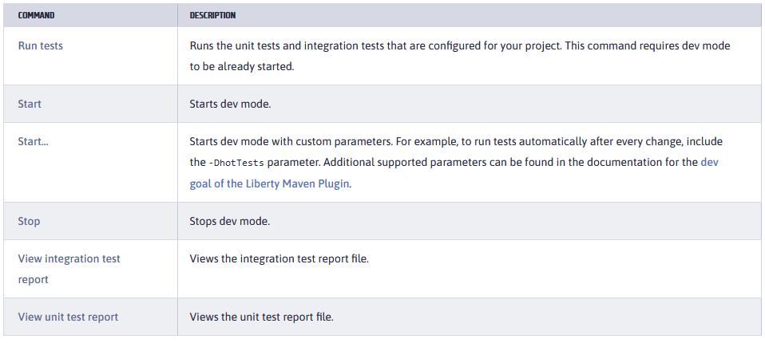

## The lab environment

One (1) Linux VM has been provided for this lab.

The **“Workstation”** VM has the following software available:

- Application Project with Liberty

- Maven 3.6.0

The login credentials for the **Workstation”** VM are:

  > User ID: **ibmdemo**
 
  > Password: **passw0rd** (That is a numeric zero in passw0rd)

|         |           |  
| ------------- |:-------------|
|    | 
<strong>IMPORTANT:</strong>

Using the lab environment provided, all the required VS code extensions and dependencies have been installed for you.

This allows you to focus on the value of using the capabilities of the tools for fast, efficient inner-loop development, test, debug, of Java based applications and Microservices using Open Liberty in dev mode.

 |

###  **Login to the "Workstation" VM and Get Started**

1.  If the VM is **not** already started, start it by clicking the **Play** button.

    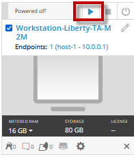

     

2.  After the VM is started, click the **“Workstation”** VM
    icon to access it.

     

      

3.  Login with **ibmdemo** ID.
    
    a.  Click on the “**ibmdemo**” icon on the Ubuntu screen.

    

    b. When prompted for the password for “ibmdemo” user, enter
    “**passw0rd**” as the password:

    Password: **passw0rd** (lowercase with a zero instead of the o)
 
    

     

4.  Resize the Skytap environment window for a larger viewing area while doing the lab.

    From the Skytap menu bar, click on the “**Fit to Size**”
     icon. This will enlarge the
    viewing area to fit the size of your browser window.
     
    

### If, at aytime during the lab, you ar asked to install updates, click CANCEL!

|         |           |  
| ------------- |:-------------|
|    | 
<strong>Important:</strong> 
<strong>Click CANCEL</strong>…. If, at any time during the lab, you get a pop-up asking to install updated software onto the Ubuntu VM.
 
The one we experience is an update available for VS Code.

<strong>CLICK CANCEL!</strong>

 |

## Getting Started with Open Liberty Tools in VS Code

**Liberty Dev mode** allows you, as the developer, to focus on your
code. When Open Liberty is running in dev mode, your code is
automatically compiled and deployed to the running server, making it
easy to iterate on your changes.

In this lab, as a developer, you will experience using the **Open
Liberty Tools** extension in **VS Code** to work with your code, run
tests on demand, so that you can get immediate feedback on your changes.

You will also work with integrated debugging tools and attach a Java
debugger to debug your running application.

From a developer perspective, this is a huge gain in efficiency, as all
these iterative inner-loop development activities occur without ever
leaving the integrated development environment (IDE).

 

### **Review the VS Code extensions and projects pom.xm file used for this project**

The sample application used in this lab is configured to be built with
Maven. Every Maven-configured project contains a pom.xml file, which
defines the project configuration, dependencies, plug-ins, and so on.

Your pom.xml file is in the root directory of the project and is
configured to include the **liberty-maven-plugin**, which allows you to
install applications into Open Liberty and manage the server instances.

To begin, navigate to the project directory and review the IDE
extensions and pom.xml file that is used for the “**system”**
microservice that is provided in the lab.

First, add the project folder to a VS Code Workspace

1.  **Close** all **Terminal** windows and **Brower** Tabs used in any previous lab.

2.  Navigate to the project directory and launch VS Code from the **start**” folder of the project.
    
    a.  Open a terminal window and change to the following directory:

        cd /home/ibmdemo/Student/labs/devmode/guide-getting-started/start

    

3.  Launch VS Code using the current directory as the root folder for
    the workspace

        code .

    When the VS Code UI launches, the Explorer view is shown. The “START” folder contains the source code for the project.

    

     

4.  Review the installed extensions in VS Code that are used for this lab.
    
    a.  Click on the **Extensions** icon in the left navigation bar in
        VS Code.
        
    
    
    b.  Expand the “INSTALLED” extensions section to list the extensions that are currently installed in this environment. The notable extensions used in this lab are:
        
    -  Open Liberty Tools
    -  Tools for MicroProfile
    -  Language Support for Java
    -  Debugger for Java
    
     

    c.  Click on the “**open Liberty Tools**” extension to view its details.
    
    d.  Notice the list of commands that are supported by the Open
        Liberty Tools extension.
        
    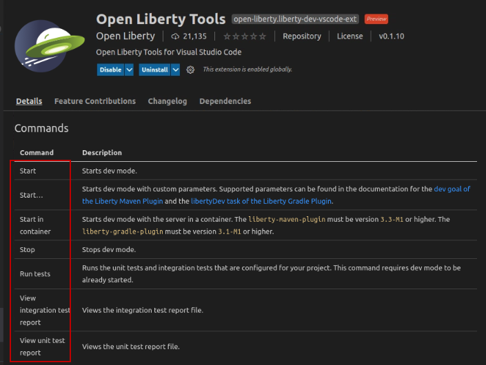
    
    e.  Scroll down to the “**Requirements**” section of the Open
        Liberty Tools details page.
        
    Notice the requirement for “Tools for MicroProfile” to support development of Microservices that use MicroProfile APIs with   Open Liberty.
        
    

    |         |           |  
    | ------------- |:-------------|
    |    | 
<strong>Information:</strong>

The <strong>Tools for MicroProfile</strong> extension requires the components to be installed in the environment:

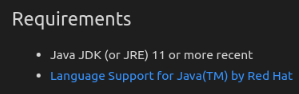
 |

    f.  **Close** the Open Liberty Tools Extension details page.

     

5.  Review the **pom.xml** file used to configure and build the "system” microservice.
    
    a.  Click on the **Explorer** icon  located on the left navigation bar in VS Code.
    
    b.  Expand the **START** folder if it is not already expanded
        
    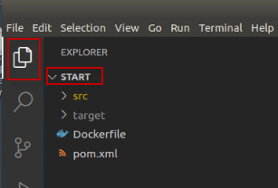
    
    c.  Click on the **pom.xml** file to open it in the editor pane
    
    d.  Close any Pop-up boxes asking if you want to install extensions
        or switch views.
        
    **Note:** You may see additional pop-ups, just close them, or    ignore them.
        
    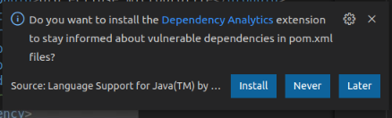
    
    e.  Note the binary packaging of the Java application war file that
        is produced from the Maven Build. The WAR file produced will be
        named **guide-getting-started** version 1.0-SNAPSHOT.
        
    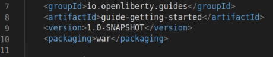
    
    f.  Default HTTP and HTTPS Ports are defined, and substituted into
        the server.xml file
        
    
    
    g.  The Open Liberty Tools Plugin is enabled, with a supported   version of 3.3.4
        
    
    
    h.  Plugin for running Tests is also added to the Maven       configuration, that leverage the testing dependencies also        defined in the pom.xml file.
        
    
    
    i.  **Close** the pom.xml file

     

    |         |           |  
    | ------------- |:-------------|
    |    | 
<strong>Information:</strong>

<strong>Tip:</strong> Additional information on the liberty-maven-plugin can be found here:

<a href="https://github.com/OpenLiberty/ci.maven">https://github.com/OpenLiberty/ci.maven</a>
 |

     

## Using Open Liberty Tools in VS Code 

In this section of the lab, you will use the **Open Liberty Tools i**n
**VS Code** to work with your code and run tests on demand, so that you
can get immediate feedback on your changes.

|         |           |  
| ------------- |:-------------|
|    | 
<strong>Important:</strong>

<strong>For Open Liberty Tools</strong> (LIBERTY DEV DASHBOARD)

VS Code provides extensions for Java to support the Java language features.

VS Code for Java supports two modes.
<ul><li>
Lightweight mode
</li><li>
Standard mode
</li></ul>
VS Code has a default configuration called “hybrid mode” where a workspace is opened in Lightweight mode, but as needed, you are prompted to switch to Standard mode.

The <strong>Tools for MicroProfile</strong> Extension, which is required for the <strong>Open Liberty Tools</strong> extension, requires the Java workspace to be opened in “<strong>STANDARD</strong>” mode. Otherwise the LIBERTY DEV DASHBOARD will not function properly.

<strong>Tip:</strong> In this lab environment, the workspace is already configured to use Standard mode.

For more details on VS Code for Java is available here: <a href="https://code.visualstudio.com/docs/java/java-project">https://code.visualstudio.com/docs/java/java-project</a>
 |

1.  Use the Liberty Dev Dashboard to **start** the Liberty Server in dev mode
    
    a.  In VS Code, expand the LIBERTY DEV DASHBOARD section
    
    b.  Right-mouse click on the **guide-getting-started** Liberty
        Server
    
    c.  Select **Start** from the menu to start the server
        
    
    
    d.  The Terminal view opens, and you see the server log messages as
        the server starts. When the following message appears in the Terminal, the Liberty server is started.
        
    

     

2.  Run the system Properties sample application from a web browser
    
    a.  Open the Web Browser from inside of the VM
    
    b.  Go to <http://localhost:9080> to verify the application is     running.
        
    

     

### **Developer experience Using Open Liberty Tools in VS Code** 

The System Properties Sample application is up and running in the
Liberty server.

Next, as a developer, you want to implement a health check for the
application.

The developer experience is frictionless, as all code and configuration
change the developer introduces, are automatically detected and the
server and application are dynamically updated in the running server to
reflect the updated code and configuration.

Let’s explore a couple of examples of the very efficient developer
experience by implementing some new capability into our service.

In this example, you will leverage the **mpHealth-2.2** feature in Open
Liberty, which implements the MicroProfile mpHealth-2.2 API, to
implement the new health checks for the application.

The **mpHealth-2.2** feature provides a **/health** endpoint that
represents a binary status, either UP or DOWN, of the microservices that
are installed.

To learn more about the MicroProfile mpHealth feature, visit:
<https://www.openliberty.io/docs/21.0.0.4/health-check-microservices.html>

1.  Update the Liberty server configuration file (server.xml) to include the mpHealth-2.2 feature to begin implementing the health checks for the application.
    
    a.  In the VS Code Explorer view, navigate to **START** -> **src** -> **main** -> **liberty / config**
    
    b.  Click on **server.xml** to open the file in the editor pane
        
    
    
    c.  Add the **mpHealth-2.2** feature to the server.xml file using the text below:

        <feature>mpHealth-2.2</feature>

    
 
     

    d.  **Save** and **Close** the server.xml file
    
    When the server.xml file is saved, the configuration changes are
    detected, and the server is dynamically updated, installing the new
    feature and updating the application in the running server.

     

2.  View the messages in the **Terminal** view, showing the feature being installed and the application being updated.
    
    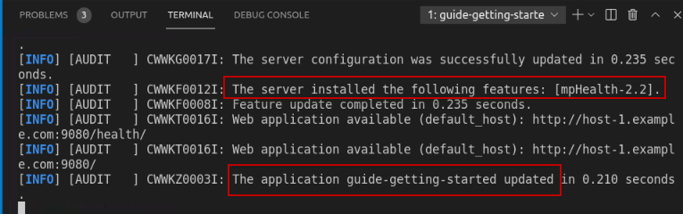
    
    Once the changes are saved, and the server is automatically updated,
    the new /**health** endpoint is available.

     

3.  From the Web browser in the VM access the **/health** endpoint to view the health status of the application.

        http://localhost:9080/health

    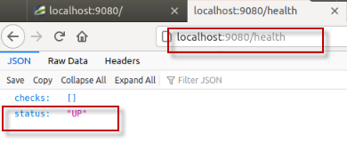

     

    Currently, the basic health check provides a simple status indicating if the service is running, but not if it is healthy.

    In the next steps, you will implement a **liveness** check that implements logic that gathers memory and cpu usage information and reports the service DOWN in the health check if the system resources exceed a certain threshold.

    You will also implement a **readiness** check that checks external property configuration in the server.xml file, that is used to place the service in maintenance mode. And if the service is in maintenance mode, the service is marked DOWN from the health check.

     

4.  Copy an implementation of the **SystemReadinessCheck.java** to the project
    
    a.  Open a Terminal window  on      the VM
    
    b.  Run the following command to copy the **SystemReadinessCheck.java** to the project

        cp /home/ibmdemo/Student/labs/devmode/guide-getting-started/finish/src/main/java/io/openliberty/sample/system/SystemReadinessCheck.java /home/ibmdemo/Student/labs/devmode/guide-getting-started/start/src/main/java/io/openliberty/sample/system/SystemReadinessCheck.java

    |         |           |  
    | ------------- |:-------------|
    |    | 
<strong>Information:</strong>

For the purposes of the lab, the copy command above copies a fully implemented Readiness check from the “finished” project, into the current working project.
 |

5.  Review the **SystemReadinessCheck.java i**mplementation
    
    a.  Return to the VS Code Explorer view
    
    b.  Navigate to **START \> main \> java / io / openliberty / sample
        / system**
    
    c.  Click on the **SystemReadinessCheck.java** file to open it in
        the editor pane
        
    
        
    The SystemReadinessCheck simply evaluates the **“inMaintenance**” ConfigProperty, which is implemented via the mpConfig MicroProfile feature, and configured in the Liberty Server’s server.xml file.
    
    - If the “inMaintenance” property is set to “**false**” the
        readiness check sets the Health Status to **UP**.
    
    - If the inMaintenance property is set to “**true**” the status is
        set to **DOWN**.

     

6.  From the Web Browser in the VM, rerun the **/health** endpoint to view the health status of the application.

        http://localhost:9080/health

    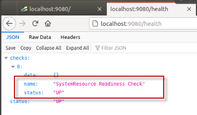

    |         |           |  
    | ------------- |:-------------|
    |    | 
<strong>Information:</strong>

Did you notice that while implementing the new readiness check code in the application, that you did not have to restart the application or Liberty Server?

The Open Liberty Tools detected the code changes in the project, and dynamically updated the application in the running server.

 |

7.  Copy an implementation of the **SystemLivenessCheck.java** to the project
    
    a  Open a Terminal window  on        the VM
    
    b.  Run the following command to copy the **SystemLivenessCheck.java** to the project

        cp /home/ibmdemo/Student/labs/devmode/guide-getting-started/finish/src/main/java/io/openliberty/sample/system/SystemLivenessCheck.java /home/ibmdemo/Student/labs/devmode/guide-getting-started/start/src/main/java/io/openliberty/sample/system/SystemLivenessCheck.java

    |         |           |  
    | ------------- |:-------------|
    |    | 
<strong>Information:</strong>

For the purposes of the lab, the copy command above copies a fully implemented Liveness check from the “finished” project, into the current working project.
 |

8.  Review the **SystemLivenessCheck.java i**mplementation
    
    a.  Return to the VS Code Explorer view
    
    b.  Navigate to **START** -> **main** -> **java / io / openliberty / sample / system**
    
    c.  Click on the **SystemLivenessCheck.java** file to open it in the
        editor pane
        
    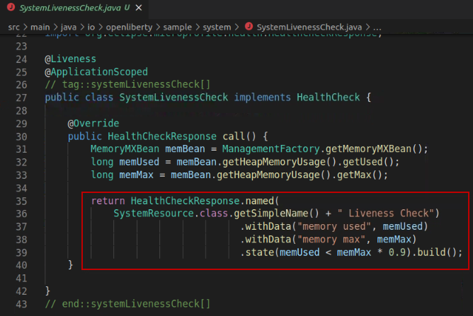
        
    The SystemLivenessCheck evaluates the **“memory”** and **“cpu”**    resources used.
        
      - If the “memory” used is less than 90%, the liveness probe sets
        the status to UP.
    
      - If the “memory” used is greater than 90%, the liveness probe
        sets the status to DOWN.

     

9.  From the Web Browser in the VM, rerun the **/health** endpoint to view the health status of the application.

        http://localhost:9080/health

    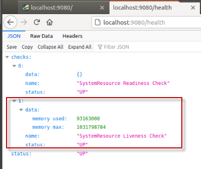

    **Note:** in the case where there are multiple health checks being performed, as in our example, ALL the health checks must have the UP status for the service to be marked UP.

    **So, what happens when we change the inMaintenance property to“true”?**

    Let’s modify the external configuration to set the service in maintenance mode and see the results of the health checks.

     

10. Modify the inMaintenance property in the server.xml file
    
    a.  Return to the VS Code console and navigate to **START** -> **src** -> **main -> liberty / config**
    
    b.  Click on **server.xml** to open the file in the editor
    
    c.  Modify the inMaintenance variable value to “**true**” as
        illustrated below
    
    d.  **Save** the server.xml file. The server configuration is
        dynamically updated to reflect the update.
        
    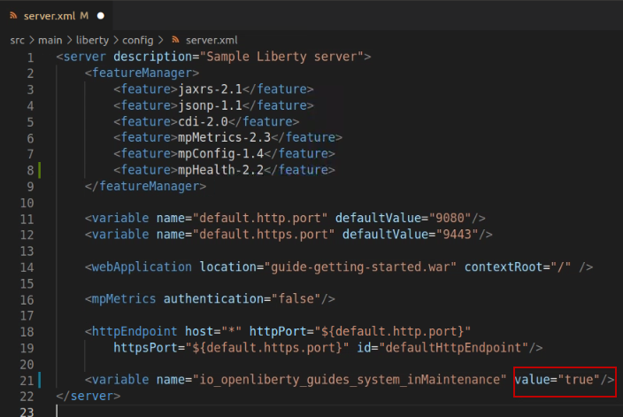

     

11. From the Web Browser in the VM, rerun the **/health** endpoint to view the health status of the application.

        http://localhost:9080/health

    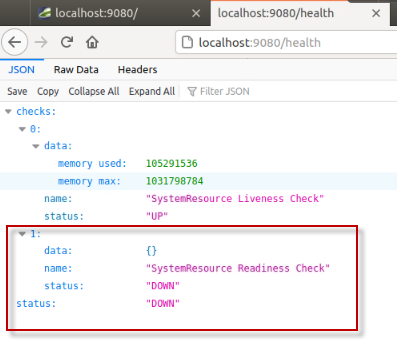

     

12. In the server.xml file, change the inMaintenance variable back to false”
    
    a.  **Save** the server.xml file
    
    b.  **Close** the server.xml editor view
        
    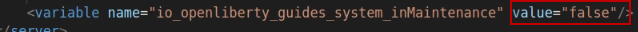

      

13. Rerun the **/health** endpoint to verify the service is now marked UP again.
    

 

### **Running Tests using the Open Liberty Tools in VS Code** 

In this section of the lab, you will make some simple changes to the
sample application code and run test cases directly from the VS Code IDE
using the built-in capabilities in the Open Liberty tools.

To simulate a breaking change in the application code, you will modify
the path to the service endpoint from **/properties** to
**/all-properties**.

Because the test case attempts to run the system service using the
**/properties** path, the test case will fail and return an HTTP Code of
404, rather than the expected response code of 200.

Since the developer is purposely introducing this change, the test case
needs to be updated to reflect the new path to the service for the tests
to pass.

1.  Use the Liberty Dev Dashboard to **Run Tests** against the System Properties Sample service.
    
    a.  In VS Code, expand the LIBERTY DEV DASHBOARD section
    
    b.  Right-mouse click on the **guide-getting-started** Liberty
        Server
    
    c.  Select **Run Test** from the menu to run the tests
        
    
    
    d.  In the Terminal view, you will see the results of the tests. One
        test was executed, and one test PASSED.
        
    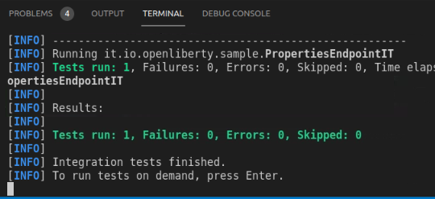
        
     

    Next, as a developer on the project, you have been asked to change the code to specify a different path to the “properties” service. Doing so, has an impact on the tests. In the next few steps, you will make the code change, and update the tests to match the NEW expected results.

     

2.  Open the **sytemResources.java** in VS Code editor
    
    a.  In VS Code Explorer view, expand **START** -> **src** -> **main -> java / io / openliberty / sample / system**
    
    b.  Click on **SystemResource.java** to open it in the editor
        
    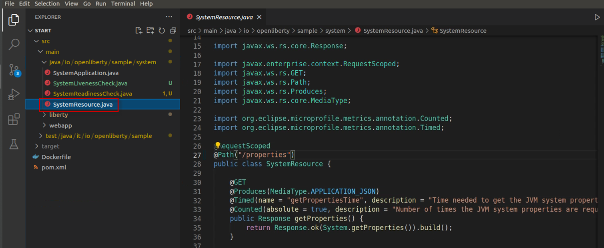

     

3.  Update the **@Path** to the system properties service to specify a different service path
    
    a.  From the editor, make the following change to the **systemResource.java** file:

    **Change the highlighted line:**
 
    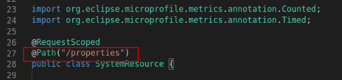
 
    **Updated to read:** @Path("/all-properties")
 
    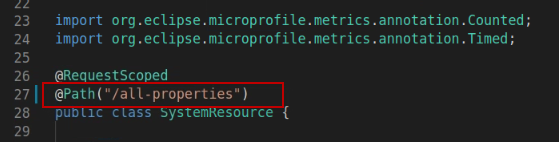

    b.  **SAVE** the file. The Liberty server and application are
    dynamically updated.

    c.  **Close** the editor view for the **SystemResource.java** file

     

4.  From the Web browser, run the service using the NEW endpoint URL

    **http://localhost:9080/system/all-properties**

    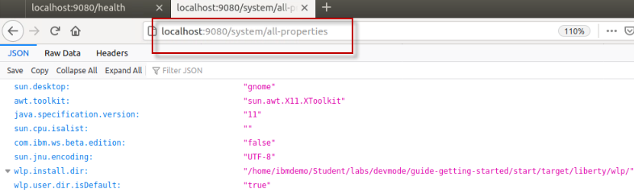

     

5.  Use the Liberty Dev Dashboard to **Run Tests** against the System Properties Sample service.
    
    a.  In VS Code, expand the LIBERTY DEV DASHBOARD section
    
    b.  Right-mouse click on the **guide-getting-started** Liberty
        Server
    
    c.  Select **Run Test** from the menu to start the server
        
    
    
    d.  Alternatively, you can run the tests by simply pressing the
        **ENTER** key in the Terminal window. Give it a try. **The tests
        now FAIL**.
        
    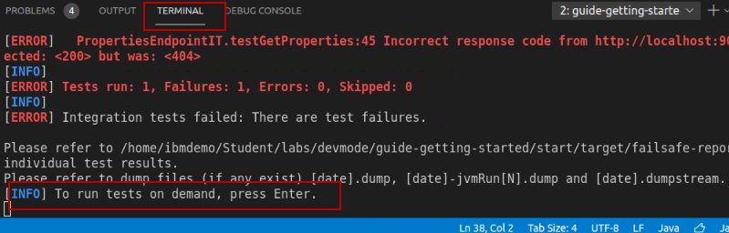

     

6. Use the Liberty Dev Dashboard to **View integration test report**.
    
    a.  In VS Code, expand the LIBERTY DEV DASHBOARD section
    
    b.  Right-mouse click on the **guide-getting-started** Liberty
        Server
    
    c.  Select **View integration test report** from the menu
        
    

     

7.  View the test results details in the “**guide-getting-started Failsafe report**” that is now displayed the editor pane
    
    a.  Notice that the test case failed
        
    
    
    b.  Scroll to the bottom of the report to see the ERROR message that
        was produced from the failing test.
        
    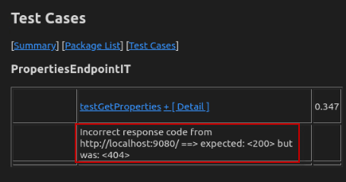
    
    c.  The issue is obvious. Since we changed the endpoint path, the
        test case assertion failed because it got a HTTP response code
        of 404 (Not Found) when attempting to run the service using the
        original path of /properties.
    
    d.  **Close** the Failsafe Report in the Editor pane
        
    **NOTE:** In this case, we expected the test case to fail. And as the developer, you must update the test case to match the      expected results based on to your code change.

     

8.  Modify the test case that is included in the application project to invoke the updated path to the service.
    
    a.  From the Explorer view in VS Code, navigate to **START** -> **src** -> **test / java / it /io /openliberty / sample**
    
    b.  Click on **PropertiesEndpointIT.java** to open it in an editor
        pane
    
    c.  From the editor, make the following change to the
        **PropertiesEndpointIT.java** file:

    **Change the highlighted line:** “system/properties”
 
    
 
    **Updated to read:** “system/all-properties”
 
    

    d.  **SAVE** and **CLOSE** the file. The Liberty server and application are dynamically updated.

     

9.  Rerun the tests by Pressing the **ENTER** key in the Terminal view. The test PASS.
    
    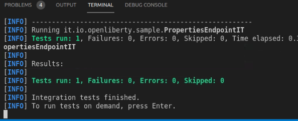
    
    At this point, you have explored using the Liberty Developer Tools
    to develop code, make server configuration changes, and run test
    cases to get immediate feedback on the updates.
    
    Using the Open Liberty Tools in VS Code provides an integrated
    development environment where your updates were automatically
    detected and dynamically applied to the running server. This
    provides a rapid inner-loop development cycle for development and
    testing.
    
    In the next section of the lab, you will explore how simple it is to
    integrate application debugging in the same development environment
    without having to restart the Liberty server.

     

## OPTIONAL: Integrated debugging using the Open Liberty Tools in VS Code 

Application debugging is an important part of application development.
Developers expect to easily and quickly iterate through **dev – test –
debug** without having to leave the development environment or having to
restart servers and applications for debugging.

In this section of the lab, you will explore how easy it is for
developers to debug their Java application using the integrated
development environment and Open Liberty.

**Here are the basics steps for
debugging**

  - Set a breakpoint in the source code

  - Add a “Java Attach” in the launch configuration and set the debug
    port

  - Go to Debug view and select the “Attach” configuration

  - Click the Start debugging icon

  - Run the application in the Browser

  - The application stops at the breakpoint

  - Step through the app in debug mode to explore the variables and code
    to resolve issues
    
  One of the key features of Visual Studio Code is its great debugging
    support.
    
  In this section of the lab, you will use VS Code debigger to debug   the Java application running on Liberty server.
    
  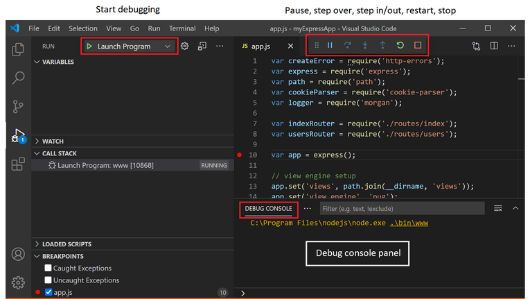
    
  In this scenario, you will set a breakpoint and debug the SystemLivenessCheck.java code that is executed when running the /health endpoint in the application.

1.  Open the **SystemLivenessCheck.java** in VS Code editor
    
    a.  In VS Code Explorer view, expand **START** -> **src** -> **main** -> **java / io / openliberty / sample / system**
    
    b.  Click on **SystemLivenessCheck.java** to open it in the editor
        
    

     

2.  Set a breakpoint in the code where the **MemoryMaxBean** variable is set
    
    a.  Locate the line with the text:
        
    **MemoryMXBean memBean = ManagementFactory.getMemoryMXBean();**
    
    b.  **Left-mouse click** on the left side of the Line Number (31 in
        the screen shot) to set a breakpoint. A red dot will appear, indicating the breakpoint is set
        
    

     

3.  Create a new **Java Attach configuration** and specify the debug port **7777**
    
    a.  Select **Run > Add Configuration…** from the main menu in VS
        Code
        
    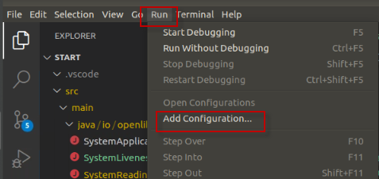
        
    A new file named **launch.json** file was created in the **.vscode** directory. You can see the new file in the explorer       view.
    
    b.  In the **launch.json** file that opened in the Editor view,
        click on the “**Add Configuration**” button located on the lower
        right corner of the screen.
        
    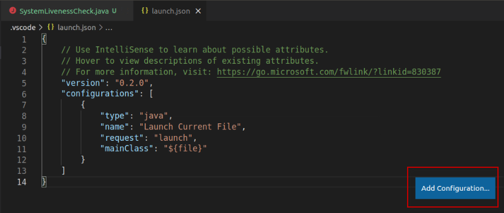
    
 
    c.  Select **Java: Attach** from the menu.
        
    
    
    d.  A new configuration is added to the launch.json file, that includes a “**port”** parameter to attach the debugger for Open    Liberty.
        
    **Note:** Open Liberty is configured to use debug port 7777 by
        default.
        
    

     

4.  Change the “port” parameter to 7777
    
    a.  From the editor, make the following change to the **lauch.json**
        file:

    **Change the highlighted line:** "port": "<debug port of the debugger>"

    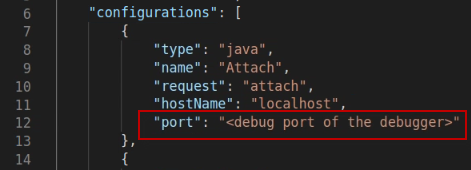
 
    **Updated to read:** “port”: 7777
 
    **Note”** Be sure to REMOVE the double quotes around 7777, as illustrated below.

    

    b.  **SAVE and CLOSE** the file. The Liberty server and application are dynamically updated.

     

5.  Now, attach the new Java Attach configuration

    a.  Switch to the **Debug** perspective in VS Code, by selecting the
    **Debug Icon** on the left side navigation menu
    
    

    b.  Using the launch Drop-down menu in the Debug perspective, set the **Launch action** to the “**Attach**” configuration that you
    created.
    
    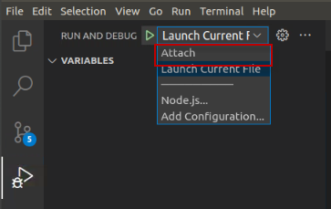

    
    c.  The “Attach” configuration is now selected. You are ready to debug.
    
    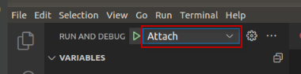

     

6.  Click on the **Start** Icon to start the debugger.
    
    
    
    The debugger is now attached, and the CALL STACK and BREAKPOINTS are
    displayed in the Debug perspective, as illustrated below:
    
    

     

7.  From the Web Browser in the VM, run the **/health** endpoint to view the health status of the application. The application will stop at the breakpoint in the SystemLivenessCheck.java code.

        http://localhost:9080/health

    In VS Code’s Debugger perspective, the application stopped at the breakpoint you set in the SystemLivenessCheck.java, as illustrated below.

    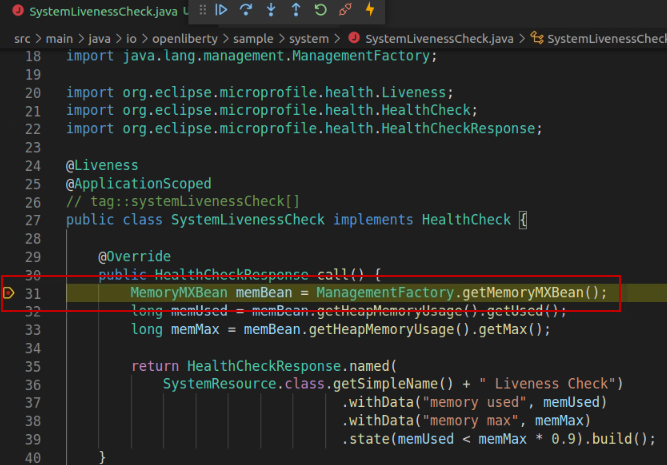

     

8.  Now you can use the “step Over”, “Step In” “Step Out”,” Run” or “Disconnect” actions.

    a.  Click the “**Step Over**” to execute the existing line of code and step to the next line of code in the application.
    
    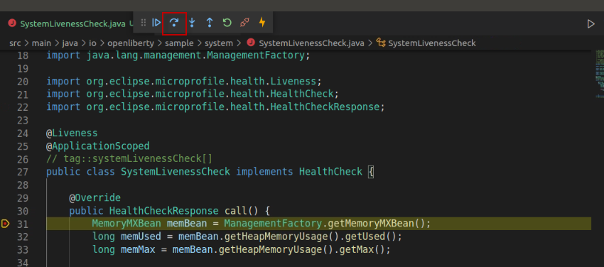

     

9.  When you are finished stepping through the debugger and exploring the local variables, click the **Disconnect**” icon to disconnect the debugger
    
    

     

10. Use the Liberty Dev Dashboard to **STOP** the Liberty Server in dev mode
    
    a. In VS Code, switch back to the **Explorer** view
    
    b.  Expand the LIBERTY DEV DASHBOARD section
    
    c.  Right-mouse click on the **guide-getting-started** Liberty
        Server
    
    d.  Select **Stop** from the menu to stop the server
        
    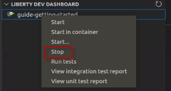

     

11. **Exit** the VS Code UI
    
    a.  Select **File \> Exit** from the main menu in VS Code to Exit  the UI

     

12. **Close** all opened **Terminal** Windows and **Browser** tabs

Congratulations! You have successfully used the **Liberty Dev VS Code
extension** to start Open Liberty in development mode, make changes to
your application and Liberty server configuration while the server is
up, run tests and view results, and even debug the application without
leaving the editor.

As you explored the fast and efficient inner-loop development experience
using the Open Liberty tools and VS Code IDE, your code was
automatically compiled and deployed to your running server, making it
easy to iterate on your changes.

**===== END OF LAB =====**
