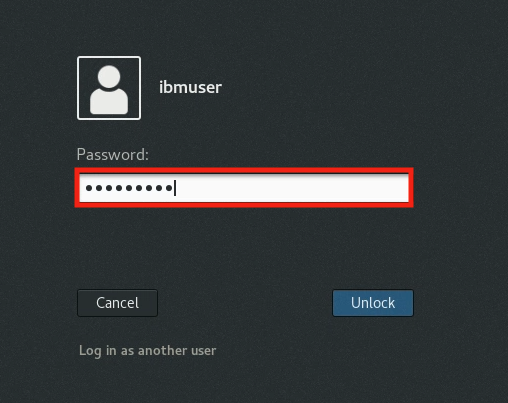

# Introduction to Containerization

## Table of Contents

- [Introduction to Containerization](#introduction-to-containerization)
  - [Table of Contents](#table-of-contents)
  - [Background](#background)
  - [Prerequisites](#prerequisites)
  - [What is a Container](#what-is-a-container)
  - [Login to the VM](#login-to-the-vm)
  - [Check your environment and clone the workshop GitHub project](#check-your-environment-and-clone-the-workshop-github-project)
  - [Run a pre-built image](#run-a-pre-built-image)
  - [Build and Run Your Own Image](#build-and-run-your-own-image)
  - [Managing Image Versions](#managing-image-versions)

<a name="Background"> </a>
## Background

If you are expecting a lab about `docker`, you are at the right place.
This lab will introduce you to the basic concepts of containerization, including:

- What are containers and container images
- How to start, stop, and remove containers.
- How to create container images
- How to version container images

<a name="Prerequisites"> </a>
## Prerequisites

- You have `podman` or `docker` installed.  Only `docker` is installed for this lab.
- You have access to the internet.


<a name="What_is_Container"> </a>
## What is a Container

Compared to virtual machines, containers supports virtualization at the process level. 
Think of them as virtual processes.
The isolation abstraction provided by the operating system makes the process think that it's running in its own virtual machine.
As processes, containers may be created, started, and stopped much more quickly than virtual machines.

Everything you need to run your application, from the operating system and up, is stored in a special file called a container image.  
Container images are self contained and portable. 
You may run one or more instances anywhere. 
And you don't have to worry about missing prerequisites, because all prerequisites are stored in the image.

Container images are created via tools such as `docker` or `podman`. 
Existing images are hosted in container registries. 
For example, docker hub, or registry.access.redhat.com, or your own internal registry. 


If you need more background on containers: https://www.docker.com/resources/what-container

<a name="Login_VM"> </a>
## Login to the VM

1. If the VM is not already started, start it by clicking the Play button.
 
     
   
2. After the VM is started, click the **desktop** VM to access it.
   
     
   
3. Login with **ibmuser** ID.

    * Click on the **ibmuser** icon on the Ubuntu screen.
    * When prompted for the password for **ibmuser**, enter "**engageibm**" as the password.
	
	  <br>
     
      
	  
	  <br>
     
4. Resize the Skytap environment window for a larger viewing area while doing the lab. From the Skytap menu bar, click on the "**Fit to Size**" icon. This will enlarge the viewing area to fit the size of your browser window. 

      

<a name="Check_Environment"> </a>
## Check your environment and clone the workshop GitHub project 

1. Open a terminal window from within your VM.

    
  
    <br>
	
2. List version of docker: 

     ```
     docker --version
     ```  
   
    Example output:
    
        Docker version 20.10.7, build f0df350
    
   
    - For more background on docker command line: [https://docs.docker.com/engine/reference/commandline/cli/](https://docs.docker.com/engine/reference/commandline/cli/)

    <br/>

3. From the terminal window  in the VM, and clone the lab to your local directory via:

        cd /home/ibmuser
		
		git clone https://github.com/IBMTechSales/openshift-workshop-was.git


4. Change directory to the cloned local copy of the git repository. `/home/ibmuser/openshift-workshop-was/labs/Openshift/HelloContainer`

```
cd /home/ibmuser/openshift-workshop-was/labs/Openshift/HelloContainer
```

<a name="Run_Prebuilt"> </a>
## Run a pre-built image

1. Container images must be available locally before they can be run. To list available local images: 

     ```
     docker images
     ```
   
     **Note:** You may see some images that already exit on the VM, whch are used for different labs.  

        REPOSITORY   TAG   IMAGE ID   CREATED   SIZE

    
2. Images are hosted in container registries. The default container registry for docker is docker hub, located at https://hub.docker.com.  Let's pull a test image from docker hub:  

     ```
     docker pull openshift/hello-openshift
     ```
        
     And the output:

     ```
       Using default tag: latest
       latest: Pulling from openshift/hello-openshift
       4f4fb700ef54: Pull complete 
       8b32988996c5: Pull complete 
       Digest: sha256:aaea76ff622d2f8bcb32e538e7b3cd0ef6d291953f3e7c9f556c1ba5baf47e2e
       Status: Downloaded newer image for openshift/hello-openshift:latest
       docker.io/openshift/hello-openshift:latest
     ``` 

3. List available local images again: 

     ```
     docker images | grep hello
     ```
   
     The **hello-openshift** image is now listed
   
     ```    
     REPOSITORY                  TAG                 IMAGE ID            CREATED             SIZE
     openshift/hello-openshift   latest              7af3297a3fb4        2 years ago         6.09MB
     ``` 

4. Inspect the image metadata:
   
     ```   
     docker inspect openshift/hello-openshift
     ```
	
    **Note**: 
   
    - It exposes two ports: **8080** and  **8888**
	- It runs as user **1001**
    - The entry point executable is **/hello-openshift**
  
   
			[
				{
					"Id": "sha256:7af3297a3fb4487b740ed6798163f618e6eddea1ee5fa0ba340329fcae31c8f6",
					"RepoTags": [
						"openshift/hello-openshift:latest"
					],
					"RepoDigests": [
						"openshift/hello-openshift@sha256:aaea76ff622d2f8bcb32e538e7b3cd0ef6d291953f3e7c9f556c1ba5baf47e2e"
					],
				
					...
				
					"Config": {
						"User": "1001",
						...
					
						"ExposedPorts": {
							"8080/tcp": {},
							"8888/tcp": {}
						},
					   "Env": [
							"PATH=/usr/local/sbin:/usr/local/bin:/usr/sbin:/usr/bin:/sbin:/bin"
						],
						...
					
						"Entrypoint": [
							"/hello-openshift"
						]
						...
				}
			]
    

5. Run the image in an container: Notice the exposed ports (8083 and 8888) on the **docker run** command. 
   ```
   docker run --name hello1 -d -p 8083:8080 -p 8888:8888 openshift/hello-openshift
   ```
   Note that:
    - The `--name` option gives the container a name.
    - The `-d` option runs the command in the background as a daemon
    - The `-p` option maps the port on the host to the port in the container. Through virtual networking, the port within the container is always the same for all running instances. But to support multiple concurrent running instances, the actual port on the host must be different for each instance. When you start the container, you may assign a new port on the host dynamically.
    - The output of the command is the container ID for the running container.
    - If the container starts successfully, the executable specified by the `Entrypoint` in the metadata is run. For our sample, it is `/hello-openshift`.
  
    <br> 
	
6. Access the application in the container.

    a. Open the Firefox Web Browser from inside of the VM. 
	
      
	  
    b. Go to the URL `http://localhost:8083`
	
    c. Also try port **8888**

    


7. Run another instance of the same image. Note that this new instance is assigned new port numbers 8084 and 8889 on the host. This is so that they don't conflict with the ports 8083 and 8888 already allocated to the first instance.
   ```
   docker run --name hello2 -d -p 8084:8080 -p 8889:8888 openshift/hello-openshift
   ```
    **Question:** How does this compare to the time it takes to start a new virtual machine?
	
	<br>

8. Access the application in the new container the same way. 

    a. Return to the Firefox Web Browser but instead go to the URL `http://localhost:8084`
   
    b. Also try port **8889**

     
   

9. Verify there are two containers running in the same host: `docker ps`:

    ```
    CONTAINER ID        IMAGE                       COMMAND              CREATED              STATUS              PORTS                                            NAMES
    5a62f8527b44        openshift/hello-openshift   "/hello-openshift"   About a minute ago   Up About a minute   0.0.0.0:8084->8080/tcp, 0.0.0.0:8889->8888/tcp   hello2
    c9d49aaa01b7        openshift/hello-openshift   "/hello-openshift"   4 minutes ago        Up 4 minutes        0.0.0.0:8083->8080/tcp, 0.0.0.0:8888->8888/tcp   hello1
    ```

10. View the logs: 
   ```
   docker logs hello1
   ```

   And the output:

   ```
    serving on 8888
    serving on 8080
   ```

11. View the logs on the second container: 
   ```
   docker logs hello2
   ```

   And the output:

   ```
     serving on 8888
     serving on 8080
   ```

   **Note:** within the container, each instance behaves as if it's running in its own virtual environment, and has opened the same ports. Outside of the container, different ports are opened.

  <br/>

12. To export the file system of a running container: 
   ```
   docker export hello1 > hello1.tar
   ```

   > **Note:** You can use the docker export command to export a container to another system as an image tar file. You also need to export separately any data volumes that the container uses.

13. List the files on the file system: 
   ```
   tar -tvf hello1.tar
   ``` 
   
   **Note** that this is a very small image.

   ```
       -rwxr-xr-x 0/0               0 2020-04-29 16:48 .dockerenv
       drwxr-xr-x 0/0               0 2020-04-29 16:48 dev/
       -rwxr-xr-x 0/0               0 2020-04-29 16:48 dev/console
       drwxr-xr-x 0/0               0 2020-04-29 16:48 dev/pts/
       drwxr-xr-x 0/0               0 2020-04-29 16:48 dev/shm/
       drwxr-xr-x 0/0               0 2020-04-29 16:48 etc/
       -rwxr-xr-x 0/0               0 2020-04-29 16:48 etc/hostname
       -rwxr-xr-x 0/0               0 2020-04-29 16:48 etc/hosts
       lrwxrwxrwx 0/0               0 2020-04-29 16:48 etc/mtab -> /proc/mounts
       -rwxr-xr-x 0/0               0 2020-04-29 16:48 etc/resolv.conf
       -rwxr-xr-x 0/0         6089990 2018-04-18 10:22 hello-openshift
       drwxr-xr-x 0/0               0 2020-04-29 16:48 proc/
       drwxr-xr-x 0/0               0 2020-04-29 16:48 sys/
  ```

14. Run commands in the running container. 

    You can reach into the running container to run another command. 

    The typical use case is to run a shell command, so you can use the shell to navigate within the container and run other commands.
    However, our image is tiny, and there is no built-in shell.

    For the purpose of this lab, we'll execute the command to invoke **hello-openshift** executable that we just extracted from the tar file: 
	
	```
	docker exec -ti hello1 /hello-openshift . 
    ```
	
	**Note:** Running the command above in the same container results in an error, because there is already another copy running in the background that is bound to the ports 8080 and 8888:

    ```
    serving on 8888
    serving on 8080
    panic: ListenAndServe: listen tcp :8888: bind: address already in use
    ...
    ```

15. Stop the containers that you have running:
    ```
    docker stop hello1
	docker stop hello2
	```

16. List running containers: 

    ```
	docker ps
    ```
	
	There should not be any running containers listed
	
    ```
    CONTAINER ID        IMAGE                       COMMAND              CREATED            
    
    ```

17. List the hello-openshift containers, including stopped containers: 

    ```
	docker ps -a | grep hello
	```
 
    You should see the two cntainers listed, although not running; STATUS is **Exited**
     
    ```
    CONTAINER ID        IMAGE                       COMMAND              CREATED             STATUS                      PORTS               NAMES
    5a62f8527b44        openshift/hello-openshift   "/hello-openshift"   28 minutes ago      Exited (2) 28 seconds ago                       hello2
    c9d49aaa01b7        openshift/hello-openshift   "/hello-openshift"   31 minutes ago      Exited (2) 32 seconds ago                       hello1
    ```
   
18. Restart a stopped container: 

    ```
    docker restart hello1
    ```

19. List running containers: 

    ```
	docker ps
    ```
	
	The hello-openshift container is now running again.
	
    ```
    CONTAINER ID        IMAGE                       COMMAND              CREATED             STATUS              PORTS                                            NAMES
    c9d49aaa01b7        openshift/hello-openshift   "/hello-openshift"   33 minutes ago      Up 8 seconds        0.0.0.0:8083->8080/tcp, 0.0.0.0:8888->8888/tcp   hello1
    ```
    
20. Stop the container: 

    ```
	docker stop hello1
    ```
	
21. Remove stopped containers, and note that the hello1 and hello2 containers have been removed:
    
	```
	docker rm hello1
    docker rm hello2
    docker ps -a
    ```
	
22. Remove the image from local cache:
  
    a. View current images:
    
    ```
    docker images | grep hello
    ```

    Example output:
   
    
        REPOSITORY                  TAG                 IMAGE ID            CREATED             SIZE
        openshift/hello-openshift   latest              7af3297a3fb4        2 years ago         6.09MB
       
    
     b. Remove the image:
    
    ```
    docker rmi openshift/hello-openshift
    ```
      Example output:
    
        Untagged: openshift/hello-openshift:latest
        Untagged: openshift/hello-openshift@sha256:aaea76ff622d2f8bcb32e538e7b3cd0ef6d291953f3e7c9f556c1ba5baf47e2e
        Deleted: sha256:7af3297a3fb4487b740ed6798163f618e6eddea1ee5fa0ba340329fcae31c8f6
        Deleted: sha256:8fd6a1ece3ceceae6d714004614bae5b581c83ab962d838ef88ce760583dcb80
        Deleted: sha256:5f70bf18a086007016e948b04aed3b82103a36bea41755b6cddfaf10ace3c6ef
        

    c. Check that the image has been removed:
        
    ```
    docker images | grep hello-openshift
    ```
    
      Example output:

        REPOSITORY                  TAG                 IMAGE ID            CREATED             SIZE
        
 

<a name="Build_Your_Own"> </a>
## Build and Run Your Own Image

We use a podman `Containerfile`, which contains the instructions to create the new layers of your image. 
For those familiar with docker, the `Containerfile` is equivalent to a `Dockerfile`. 

> **Note:** In addition to a Containerfile, you can also use existing docker Dockerfiles to create an image with podman

Recall that an image contains the entire file system that you want to use to run your virtual process in a container.
For this sample, we are building a new image for a Java EE web application **ServletApp.war**.
It is configured to run on the WebSphere Liberty Runtime. 
The configuration file for the server is in the **server.xml**.

1. Change directory to openshift-workshop-was/labs/Openshift/HelloContainer 
   ```
   cd /home/ibmuser/openshift-workshop-was/labs/Openshift/HelloContainer 
   ```

2. Review the provided `Containerfile` from the directory:
    ```
    cat Containerfile
    ```

    Contents of **Containerfile**:
    ```
    FROM ibmcom/websphere-liberty:kernel-java8-ibmjava-ubi
    COPY server.xml  /config
    COPY ServletApp.war /config/dropins/app.war
    RUN /liberty/wlp/bin/installUtility install --acceptLicense /config/server.xml 
    ```

    - To create a new image, you start with a pre-existing image. The first line `FROM` specifies the existing image to be used as the base.  If this is not in the local registry, it will be pulled from a remote registry such as docker hub. The base image we are using, `ibmcom/websphere-liberty`, is already prepackaged for us and made available on docker hub.

    - The second line `COPY`  is a straight copy of the file `server.xml` from the local directory to `/config/server.xml` in the image. This adds a new layer to the image with the actual server configuration to be used.
   
    - The third line, another `COPY`, copies `ServletApp.war` from the current directory into a new layer in the image you are creating, at the location `/config/dropins/app.war`.

    - The last line `RUN` runs the `installUtility` command within the image to install additional features required to run the server as specified in `server.xml`. You can use the `RUN` command to run any command that is available within the image to customize the image itself.

    <br>

3. Run the build.  Ensure you include `.` at the end of the command (the dot indicates using the file from the current directory):
    ```
    docker build -t app -f Containerfile .
    ```

    - The `-t` option tags the name of the image as `app`.  
    - The `-f` option specifies the name of the `Containerfile`. 
    - The build command runs the commands in `Containerfile` to build a new image called `app`.

    <br>

    Example output:
	
    ```
    Sending build context to Docker daemon   25.6kB
    Step 1/4 : FROM ibmcom/websphere-liberty:kernel-java8-ibmjava-ubi
    kernel-java8-ibmjava-ubi: Pulling from ibmcom/websphere-liberty
    ee2244abc66f: Pull complete 
    befb03b11956: Pull complete 
    137dc88f6a93: Pull complete 
    5bdd69a33184: Pull complete 
    d4e2554981d7: Pull complete 
    32c91bc0f2e1: Pull complete 
    db7e931336a9: Pull complete 
    3b32f9956ae2: Pull complete 
    304584ffa0a2: Pull complete 
    9f6da4c82b7e: Pull complete 
    b6fa5b2e2325: Pull complete 
    Digest: sha256:d76f79695afe2f653fc7b272f9a629105446e6b78ff0d733d494c93ff05728e7
    Status: Downloaded newer image for ibmcom/websphere-liberty:kernel-java8-ibmjava-ubi
     ---> 4d9265befb26
    Step 2/4 : COPY server.xml  /config
     ---> 4a02d03d3725
    Step 3/4 : COPY ServletApp.war /config/dropins/app.war
     ---> b2def2a0feac
    Step 4/4 : RUN /liberty/wlp/bin/installUtility install --acceptLicense /config/server.xml
     ---> Running in 5f5b05aec1ae
    Checking for missing features required by the server ...
    The server requires the following additional features: appsecurity-2.0 servlet-3.0.  Installing features from the repository ...
    Establishing a connection to the configured repositories ...
    This process might take several minutes to complete.

    Successfully connected to all configured repositories.

    Preparing assets for installation. This process might take several minutes to complete.

    Additional Liberty features must be installed for this server.

    To install the additional features, review and accept the feature license agreement:
    The --acceptLicense argument was found. This indicates that you have
    accepted the terms of the license agreement.

    Step 1 of 12: Downloading ssl-1.0 ...
    Step 2 of 12: Installing ssl-1.0 ...
    Step 3 of 12: Downloading appSecurity-2.0 ...
    Step 4 of 12: Installing appSecurity-2.0 ...
    Step 5 of 12: Downloading servlet-3.0 ...
    Step 6 of 12: Installing servlet-3.0 ...
    Step 7 of 12: Downloading jndi-1.0 ...
    Step 8 of 12: Installing jndi-1.0 ...
    Step 9 of 12: Downloading distributedMap-1.0 ...
    Step 10 of 12: Installing distributedMap-1.0 ...
    Step 11 of 12: Validating installed fixes ...
    Step 12 of 12: Cleaning up temporary files ...

    All assets were successfully installed.

    Start product validation...
    Product validation completed successfully.
    Removing intermediate container 5f5b05aec1ae
     ---> e1c6bfabda76
    Successfully built e1c6bfabda76
    Successfully tagged app:latest
    ```

4. List the images to see that the new image `app` is built: 
   ```
   docker images | grep '\<app\>\|websphere'
   ```
   Note: The base image, `ibmcom/websphere-liberty` has also been pulled into the local registry.

     ```
     REPOSITORY                            TAG                        IMAGE ID       CREATED         SIZE
     app                                   latest                     baa6bb9ad29d   2 minutes ago   544 MB
     ibmcom/websphere-liberty              kernel-java8-ibmjava-ubi   7ea3d0a2b3fe   4 hours ago     544 MB
     ```

5. Start the container. 

     **Note:** You are running with both http and https ports: 
   
     ```
     docker run -d -p 9080:9080 -p 9443:9443 --name=app-instance app
     ```

6. Access the application running in the container:
   
     a. Open the Firefox Web Browswer and go to URL: `http://localhost:9080/app`
	    	 
     b. Check that it renders a page showing `Simple Servlet ran successfully`.
     
	 c. Also point your browser to 9443:  `https://localhost:9443/app`

     > **Hint:** Copy the URL including https, don’t just change 9080 to 9443

     > Note: If you get a “security risk” banner due to the self-signed cert, just accept and continue. 
    
    

     <br>

7. List the running containers: 
    ```
    docker ps
    ```
    ```
    CONTAINER ID     IMAGE     COMMAND                  CREATED             STATUS              PORTS                                NAMES                                     
    595cdc49c710     app       "/opt/ibm/helpers/ru…"   8 minutes ago       Up 8 minutes        0.0.0.0:9080->9080/tcp, 0.0.0.0:9443->9443/tcp      app-instance
    ```

8. Access the logs to your container: 
     ```
     docker logs -f app-instance
     ```
     Use `Ctrl-C` To exit.
   
     <br>

9. Remote shell into your running container to poke around: 
   ```
   docker exec -it app-instance /bin/sh
   ```
   In the shell session,
    
	a. Run `whoami` and then run `id`, note you're not running as root.
		
	    whoami
	    id
	
	
    b. Note that this is a stripped down environment where many commands are not available. 
	
	For example, try the following commands: 

  	 - **which ps** to see running processes (notice the **ps** command is not available)
	 - **cd /logs** to find the log files.
     - **cd /liberty/wlp** to find the location of the liberty install
     - **cd /liberty/wlp/usr/servers/defaultServer** to find the server configuration. 
     - **cd /opt/ibm/wlp/output/defaultServer** to find the workarea files required by the server runtime
      
	  
    <br>
 	  
10. Type `Exit` to exit from the docker shell
    ```
    exit
    ```
	
    <br/>

11. Cleanup:
    
	  ```
	  docker stop app-instance
	  docker rm app-instance
	  ```

<a name="Versions"> </a>
## Managing Image Versions

There is no built-in versioning for container images. 
However, you may use a tagging convention to version your images. 
The convention is to use `major.minor.patch`, such as `1.3.5`.
The default tag if you don't specify one is `latest`.
    
Let's assume that the first version we will build for our environment is 1.3.5. (The earlier versions are built in a different environment.) 

1. Run the commands to tag the latest `app` image for our first version:

     ```
     docker tag app app:1
     ```
     ```
     docker tag app app:1.3
     ```
     ```
     docker tag app app:1.3.5
     ```

2. List the  app images:

     ```
     docker images | grep '\<app\>'
     ```

     And the output:

     ```
     REPOSITORY                 TAG                        IMAGE ID            CREATED             SIZE
     app                        1                          d98cbdf82a0d        21 hours ago        542MB
     app                        1.3                        d98cbdf82a0d        21 hours ago        542MB
     app                        1.3.5                      d98cbdf82a0d        21 hours ago        542MB
     app                        latest                     d98cbdf82a0d        21 hours ago        542MB
     ```

    Note that all the different tags are currently associated with the same image, as they have the same image ID.

    After tagging, the command `docker run app:<version> ...` or `docker pull app:<version> ...` will resolve the available versions as follows:

    - `app:1` resolves to the latest 1.x.x version, which in this case is `1.3.5`.
    - `app:1.3` resolves to the latest 1.3.x version, which in this case is the `1.3.5`
    - `app:1.3.5` resolves to the exact version `1.3.5`.

    After you build a new patch image containing defect fixes, you want to manage the tags for the new image so that a
    new `docker run app:<version> ...` or `docker pull app:<version> ...` command resolves the images as follows: 
    
    **Note:** You will test this in the next steps:

    - `app:1.3.5`: resolves to the existing `1.3.5` image.
    - `app:1.3.6`: resolves to the new image
    - `app:1.3`: resolves to the new image.
    - `app:1`: resolves to the new image

    <br> 
  
3. Let's simulate a defect fix by building a new image using `Containerfile1` instead of `Containerfile`:

    ```
    docker build -t app -f Containerfile1 .
    ```

    Example output:

    ```
    Sending build context to Docker daemon  32.26kB
    Step 1/5 : FROM ibmcom/websphere-liberty:kernel-java8-ibmjava-ubi
     ---> bb79b9e26fd3
    Step 2/5 : COPY server.xml  /config
     ---> Using cache
     ---> f10659bc62b2
    Step 3/5 : COPY ServletApp.war /config/dropins/app.war
     ---> Using cache
     ---> 24d85579e404
    Step 4/5 : RUN /liberty/wlp/bin/installUtility install --acceptLicense /config/server.xml
     ---> Using cache
     ---> 5e924d776a9c
    Step 5/5 : RUN echo test1 > /config/test1
     ---> Running in 08e6135b00f5
    Removing intermediate container 08e6135b00f5
     ---> 69d20332a5e0
    Successfully built 69d20332a5e0
    Successfully tagged app:latest 
    ```

4. Tag the imaage as follows :

    ```
    docker tag app app:1
    docker tag app app:1.3
    docker tag app app:1.3.6
    ```

5. Verify that these three images all have the same **IMAGE ID** indicating they are all the same image: `app:1`, `app:1.3`, `app:1.3.6`.

    ```
    docker images | grep app 
    ```
	```
    REPOSITORY                 TAG                        IMAGE ID       CREATED          SIZE
    app                        1                          6ae053c3a3de   42 seconds ago   537MB
    app                        1.3                        6ae053c3a3de   42 seconds ago   537MB
    app                        1.3.6                      6ae053c3a3de   42 seconds ago   537MB
    app                        latest                     6ae053c3a3de   42 seconds ago   537MB

	```


    A new minor version involves compatible changes beyond just bug fixes. After you build a new minor version image, you want to manage the tags such that:

    - `app:1.3.5`: resolves to the existing `1.3.5` image.
    - `app:1.3.6`: resolves to the existing `1.3.6` image
    - `app:1.4.0`: resolves to the new image
    - `app:1.3`: resolves to the existing `1.3.6` image.
    - `app:1.4`: resolves to the new image.
    - `app:1`: resolves to the new image

    <br>

6. Build a new image using `Containerfile2`:

    ```
    docker build -t app -f Containerfile2 .
    ```

    The Output: 

    ```
    Sending build context to Docker daemon  32.26kB
    Step 1/6 : FROM ibmcom/websphere-liberty:kernel-java8-ibmjava-ubi
     ---> bb79b9e26fd3
    Step 2/6 : COPY server.xml  /config
     ---> Using cache
     ---> f10659bc62b2
    Step 3/6 : COPY ServletApp.war /config/dropins/app.war 
     ---> Using cache
     ---> 24d85579e404
    Step 4/6 : RUN /liberty/wlp/bin/installUtility install --acceptLicense /config/server.xml
     ---> Using cache
     ---> 5e924d776a9c
    Step 5/6 : RUN echo test1 > /config/test1
     ---> Using cache
     ---> 69d20332a5e0
    Step 6/6 : RUN echo test2 > /config/test2
     ---> Running in 96ea24b9ba66
    Removing intermediate container 96ea24b9ba66
     ---> 31b27169b3bc
    Successfully built 31b27169b3bc
    ```

7. Tag the new image as follows:

    ```
    docker tag app app:1
    docker tag app app:1.4
    docker tag app app:1.4.0
    ```

8. Use the command `docker images | grep app` and verify the following: 

    - `1`, `1.4`, and `1.4.0` are the same image
    - `1.3` and `1.3.6` are the same image

    ```
	REPOSITORY                 TAG                        IMAGE ID       CREATED          SIZE
    app                        1                          d37b46943cff   27 seconds ago   537MB
    app                        1.4                        d37b46943cff   27 seconds ago   537MB
    app                        1.4.0                      d37b46943cff   27 seconds ago   537MB
    app                        latest                     d37b46943cff   27 seconds ago   537MB
    app                        1.3                        6ae053c3a3de   4 minutes ago    537MB
    app                        1.3.6                      6ae053c3a3de   4 minutes ago    537MB
   
	```

9. Remove the docker images 

    ```
    docker rmi app:1
	docker rmi app:1.4
	docker rmi app:1.4.0
	docker rmi app:1.3
	docker rmi app:1.3.5
	docker rmi app:1.3.6
	docker rmi app:latest
    ```


Congratulations! You have completed the **Introduction to Containerization** lab.
