# Introduction to Container Orchestration using Openshift

In this lab, we will introduce you to the basics of container Orchestration using Openshift. We will

- Perform basic navigation using the web console
- Deploy the `hello-openshift` image through the web console.
- Deploy the `hello-openshift` image through the command line.

## Prerequisite

- For background on basic Openshift concepts, read [Openshift Concepts for WebSphere Administrators](https://github.com/IBM/openshift-workshop-was/blob/master/OpenshiftConcepts.md)
- You have the access to OpenShift Web Console with IBM Cloud account ID login. 
- You have cloned the lab into your working directory through the web terminal session. 

<a name="Login_VM"> </a>

## Login to the VM

1. If the VM is not already started, start it by clicking the Play button.
 
     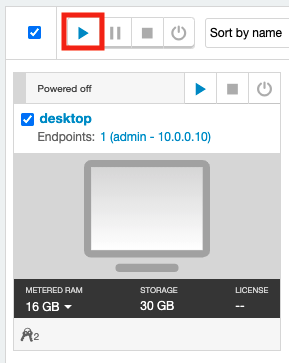
   
2. After the VM is started, click the **desktop** VM to access it.
   
     
   
     <br/>
   
3. Login with **ibmuser** ID.
   
    * Click on the **ibmuser** icon on the Ubuntu screen.
    * When prompted for the password for **ibmuser**, enter "**engageibm**" as the password:
         
	  <br/>
		 
     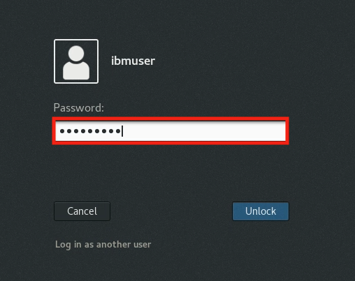
     
	 <br/>
	 
4. Resize the Skytap environment window for a larger viewing area while doing the lab. From the Skytap menu bar, click on the "**Fit to Size**" icon. This will enlarge the viewing area to fit the size of your browser window. 

    
      

## Deploy the hello-openshift image through the web console

### Login to the web console

1. Open the Firefox Web Browser from the VM. 

     
 
     <br/>

2. Select the **openshift console** bookmark at the top left of the browser window to access the OpenShift Container Platform web console.

     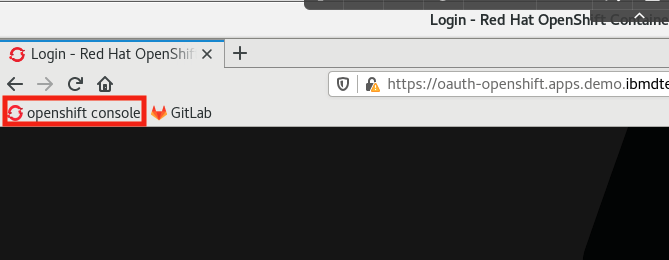
     
	 <br/>
	 
3. This will take you to a login screen. Click on the **htpasswd** login option.

     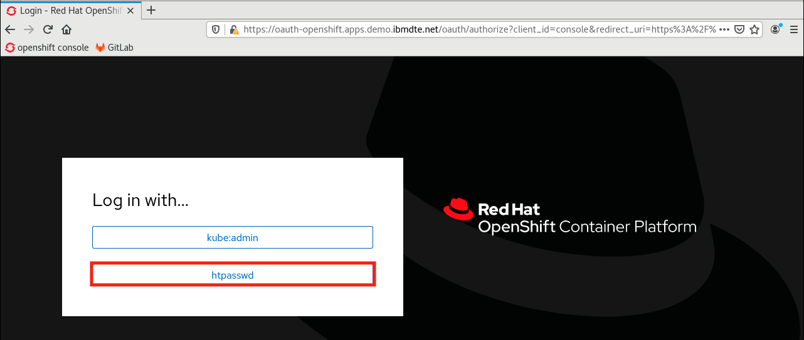
	 
     <br/>
	 
4. Log in to the account using the following credentials:
   
     * Username: **ibmadmin**
     * Password: **engageibm**

     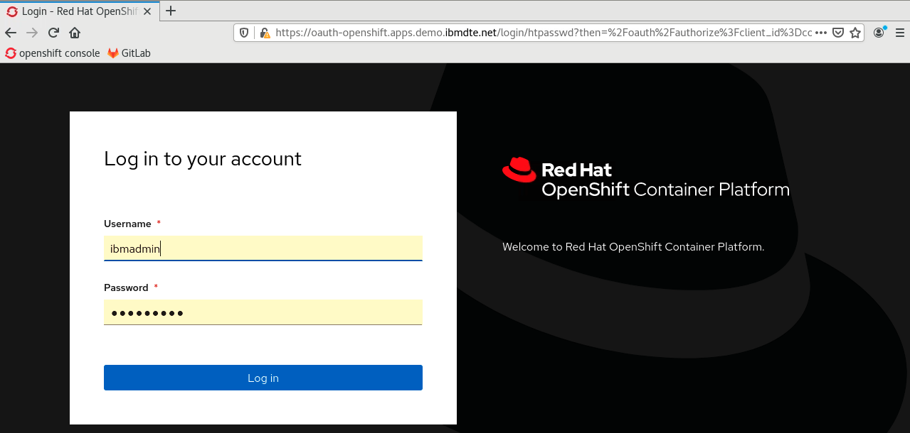


### Overview

1. Click on the **Overview** tab under **Home** in the left menu to view a summary of events:

    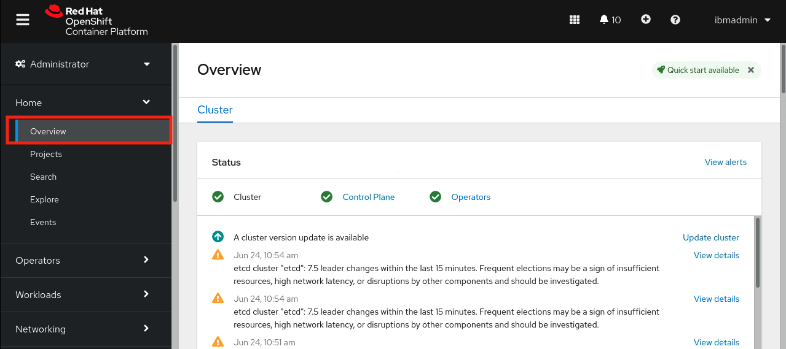

	 <br/>

2. Scroll down to view the utilization of cluster resources:

    

     <br/>

3. Scroll further down to view the cluster inventory. Click through each item in the inventory to find out more:

    

    Note that:

    - **Nodes** represent physical or virtual hardware that your Openshift cluster is running.
    - **Pods** are used to host and run one or more containers. Each node may run multiple pods. Containers in the same pod share the same network and storage.
    - **Storage classes** represent the different types of storage configured and made available for your Openshift cluster. 
    - **Persistent Volume Claims** (PVCs) represent the usage of storage by the pods. After a pod is removed, data not persistent to persistent storage are gone.

### Projects

Openshift `projects` allow you to group related resources together and to assign them separate management policies. 
It is common for artifacts related to different applications to be assigned to different `projects`. Resources that belong to the same project are stored in the same Kubernetes `namespace`.

1. Click on the **Projects** tab under **Home** in the left menu, followed by **Create Project**:

    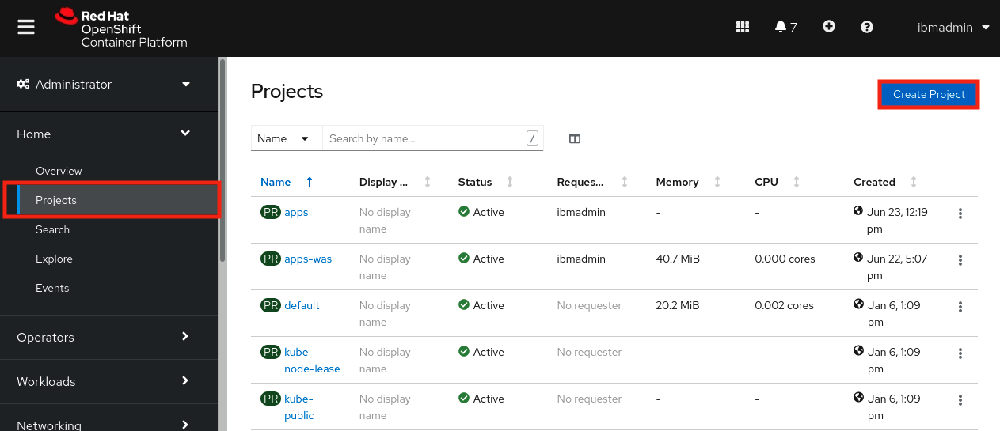

	<br/>

2. In the dialog, enter `myproject` as project name, then click **Create**:

    

	 <br/>
	 
3. After creation, click on each of the tabs of myproject you just created. Note that:

    - The `YAML` tab shows you the YAML representation of your project. Every resource in Openshift is represented as a REST data structure. We'll be working with YAML files a lot more when we interact with Openshift via the command line.
    - The `Role Bindings` tab shows you the security configurations that apply to your project. For now, just take notice that there are many different roles already defined when a project is created. Each of these **roles** is used for a different purpose, and already mapped to different **users** and **groups**, or **service accounts**.

   

### First Application

The typical artifacts you will need to run an application in Openshift are:

- A `container image` containing your application, hosted in a container registry
- One or more `pods` that specifies where to fetch an image and how it should be hosted. 
- A `deployment` to control the number of instances pods. You don't normally configure a `pod` directly. Instead, you configure a `deployment` to manage a set of `pods`.
- A `service` that exposes the application within the internal network, and enables the application to be load balanced within the Openshift cluster.
- A `route` or `ingress` to make the application accessible outside of the Openshift cluster firewall.

    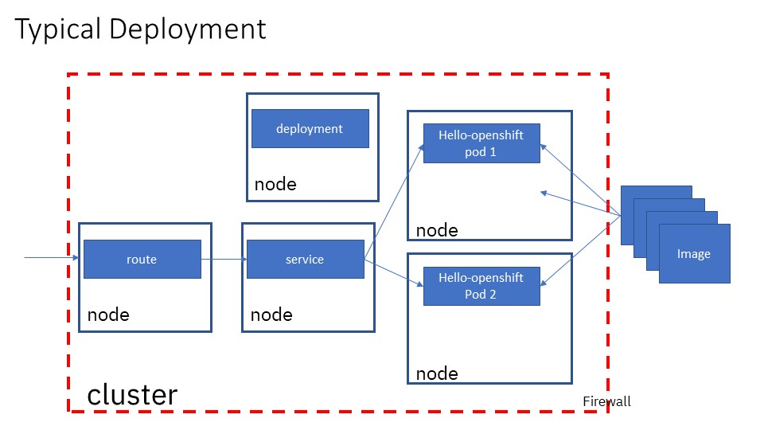

#### First deployment 

1. Under the **Workloads** tab, click **Deployments**. Then click **Create Deployment**:

    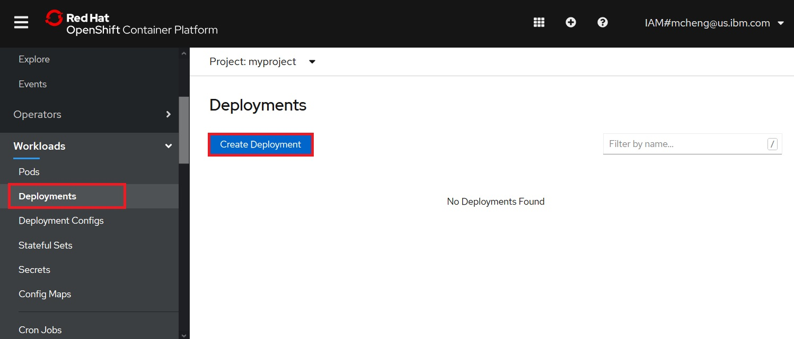

	 <br/>

2. Note that the console shows you the YAML file for the deployment.  Change the number of replicas from default 3 to **2**, then click **Create**:

    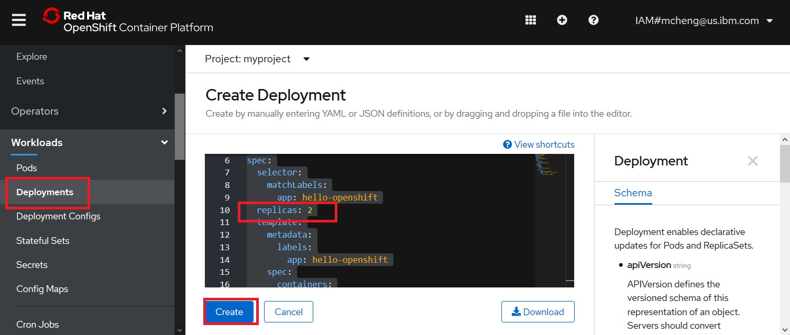


    Here is the specification of the deployment in its entirety:

    ```
    apiVersion: apps/v1
    kind: Deployment
    metadata:
      name: example
      namespace: myproject
    spec:
      selector:
        matchLabels:
          app: hello-openshift
      replicas: 2
      template:
        metadata:
          labels:
            app: hello-openshift
        spec:
          containers:
            - name: hello-openshift
              image: openshift/hello-openshift
              ports:
                - containerPort: 8080
    ```

3. Let's review this resource:

    - Every resource in Openshift has a group, version, and kind. For the `Deployment` resource:
        - The group is `apps`
        - The version is `v1`
        - The kind is `Deployment`
    - The `metadata` specifies data that is needed for the runtime:
        - The name of this instance is `example`
        - The namespace where the resource is running is `myproject`
        - Though not shown here, any labels associated with the resource. We will see the use of labels later.
    - The `spec` section defines the details specific to this kind of resource:
        - The `selector` defines details of the `pods` that this `deployment` will manage. The `matchLabels` attribute with value `app: hello-openshift` means this `deployment` instance will search for and manage all pods whose labels contain `app: hello-openshift`.
    - The `replicas: 2`  field specifies the number of instances to run.
    - The `template` section describes information about how to run the container image and create the `pods`:
        - The `labels` section specifies what labels to add to the pods being to be created. Note that it matches the labels defined in the `selector`.
        - The `containers` section specifies where to fetch the container image and which ports to expose. For our example, the image to run is `openshift/hello-openshift`.

    <br/> 
 
4. Wait for both pods to be running:

    

    <br/> 

5. Click on the **YAML** tab, and note the additions to the original input YAML file.

    

    <br/> 

6. Here is a sample YAML after the deployment is created :

    ```
    kind: Deployment
    apiVersion: apps/v1
    metadata:
      name: example
      namespace: myproject
      selfLink: /apis/apps/v1/namespaces/myproject/deployments/example
      uid: 7c6a339b-385c-41bf-b4bf-3b6a120ef137
      resourceVersion: '297294'
      generation: 1
      creationTimestamp: '2020-01-30T15:45:15Z'
      annotations:
        deployment.kubernetes.io/revision: '1'
    spec:
      replicas: 2
      selector:
        matchLabels:
          app: hello-openshift
      template:
        metadata:
          creationTimestamp: null
          labels:
            app: hello-openshift
        spec:
          containers:
            - name: hello-openshift
              image: openshift/hello-openshift
              ports:
                - containerPort: 8080
                  protocol: TCP
              resources: {}
              terminationMessagePath: /dev/termination-log
              terminationMessagePolicy: File
              imagePullPolicy: Always
          restartPolicy: Always
          terminationGracePeriodSeconds: 30
          dnsPolicy: ClusterFirst
          securityContext: {}
          schedulerName: default-scheduler
      strategy:
        type: RollingUpdate
        rollingUpdate:
          maxUnavailable: 25%
          maxSurge: 25%
      revisionHistoryLimit: 10
      progressDeadlineSeconds: 600
    status:
      observedGeneration: 1
      replicas: 2
      updatedReplicas: 2
      readyReplicas: 2
      availableReplicas: 2
      conditions:
        - type: Available
          status: 'True'
          lastUpdateTime: '2020-01-30T15:45:20Z'
          lastTransitionTime: '2020-01-30T15:45:20Z'
          reason: MinimumReplicasAvailable
          message: Deployment has minimum availability.
        - type: Progressing
          status: 'True'
          lastUpdateTime: '2020-01-30T15:45:20Z'
          lastTransitionTime: '2020-01-30T15:45:15Z'
          reason: NewReplicaSetAvailable
          message: ReplicaSet "example-75778c488" has successfully progressed.
    ```

    <br/> 

7. In the YAML, note that:

    - There are quite a bit more `metadata`. Metadata may be added by any number of controllers as needed to help with their function.
    - The `spec` has more attributes filled in as well. These are default values that were not specified in our original YAML file. But sometimes it is also possible that some values are overridden by background admission controllers.
    - The `status` sub-resource is how Openshift communicates that status of the resource. The `status` is updated regularly as the underlying state of the resource changes.

    <br/> 

8. Click on `Pods`. 
Note that the pods resources are managed by the controller for your `deployment`. 
You do not create the pod resources yourself. 
That is the reason that `Pods` tab is under the `deployment` resource you just created.

    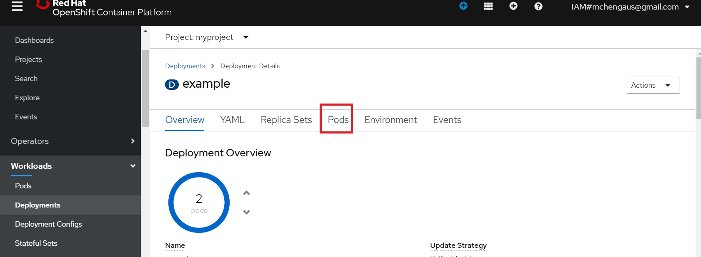

    <br/> 

9. Click on one of the pods:

    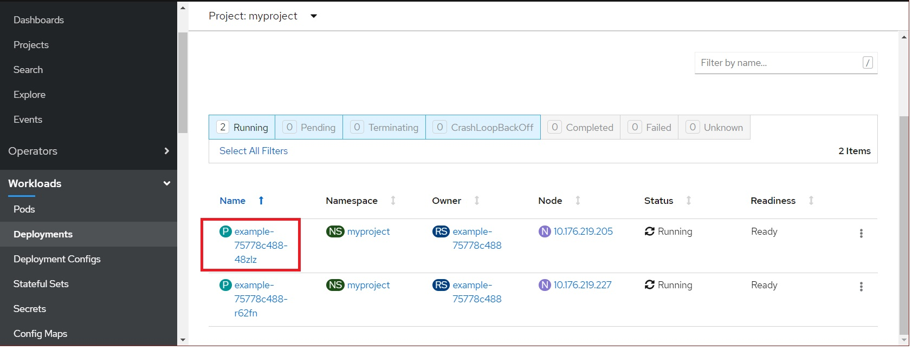

    <br/> 

10. Explore the various **tabs** for your pod

    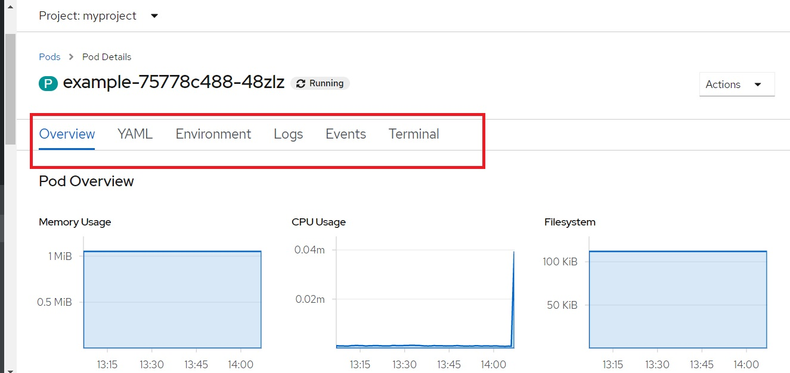

    <br/> 

     - **Overview:** displays the overall resource usage for your pod. Note that for CPU usage, the unit is m, or milli-core, which is 1/1000th of one core.
     - **YAML:** examine the YAML that describes your pod. This YAML is created by the deployment controller based on the specification you supplied in your deployment. Note that labels associated with your pod are what you had specified in the deployment.
     - **Environment:** lists the environment variables defined for your pod. For our `hello-openshift` pod, there is none.
     - **Logs:** shows the console log for your container. Note that it is the same log as the log from the Introduction to Docker lab, as the same image is being used.
     - **Terminal:** Opens a remote shell into your container. As with the Introduction to Docker lab, no shell is available within the container for this image. This makes it more secure, but also more difficult to debug.


### First Service

A **service** enables the pods we just created to be load balanced within the Openshift cluster. 

1. Scroll down to the **Networking** tab on the left navigation, click **Services**, then click **Create Service**:

    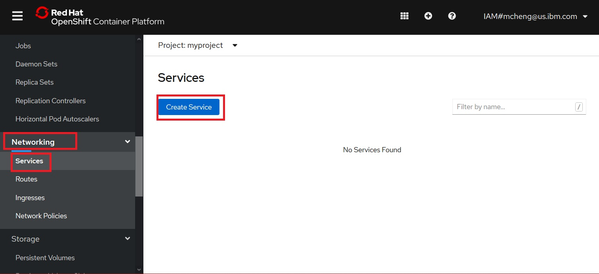

    <br/>

2. Update the YAML parameters as follows:
    
    **(Before update)**
    
    
    a. Under spec.selector: 
	
      - change `MyApp` to `hello-openshift`
      - This is how the service will find the pods to load balance. Therefore, it matches the labels (`spec.selector.matchLabels`) that we used when creating the deployment for the hello-openshift application.
   
    <br/>   
   
    b. Under spec.ports:
	
      - change `80` to `8080` and 
      - change `9376` to `8080` (the same ports we used previously).
    
	<br/>
	
	c. Click `Create`

   
    **(After update)**
    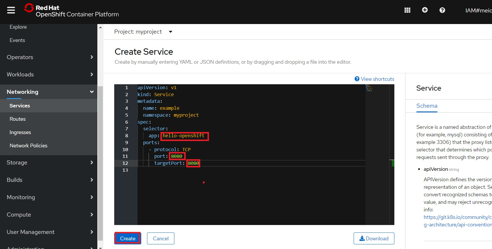

    <br/>
	
3. After the service is created, click on the **YAML** tab:

    

    The YAML file looks like:
    ```
    Kind: Service
    apiVersion: v1
    metadata:
      name: example
      namespace: myproject
      selfLink: /api/v1/namespaces/myproject/services/example
      uid: 6ca3c2b7-bbfa-432e-8757-c60dbf04b26b
      resourceVersion: '307351'
      creationTimestamp: '2020-01-30T16:28:03Z'
    spec:
      ports:
        - protocol: TCP
          port: 8080
          targetPort: 8080
      selector:
        app: hello-openshift
      clusterIP: 172.21.239.191
      type: ClusterIP
      sessionAffinity: None
    status:
      loadBalancer: {}
    ```

4. Note that for this service, there is a cluster wide IP address created, and that it is being load balanced. Also session affinity is not set for this service.

### First Route

A route exposes your internal endpoints outside your cluster's built-in firewall. 

1. Click on the **Route** tab under **Networking** in the left navigation, then click **Create Route**:

    

    <br/>

2. Supply input to the following parameters:

    - Name: `example`
    - Service: `example`
    - Target Port: `8080 --> 8080 (TCP)`
    - Click `Create`

    <br/>

    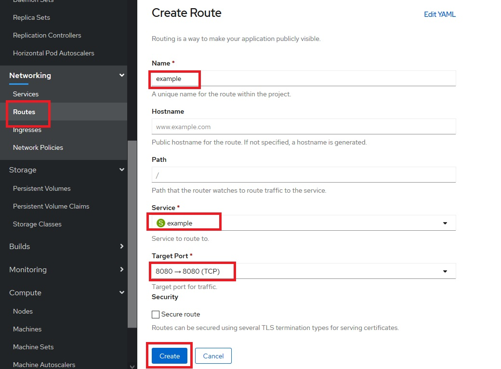

    Note that we are ignoring TLS configuration just for the purpose of this lab.  Security will be addressed in a different lab.

    <br/>

3. Access the route at the link provided under Location. The route location will open in a new browser tab.

    

    <br/>

4. If you have configured everything correctly, the browser will show `Hello Openshift!`. 

  

**Congratulations**, you just deployed your first application to Openshift.


### Changing Replica Instances

1. Click on the **Projects** tab under **Home** from the left navigation, then click on `myproject`:

    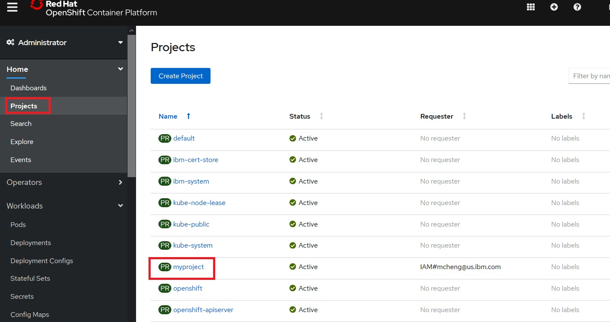

    <br/>

2. Scroll down to see the resources that were created. Recall that we have created one deployment with 2 pods in the specification. We also created one service, and one route.

    

    <br/>

3. Under the **Inventory** section, click on the **2 pods** link:

    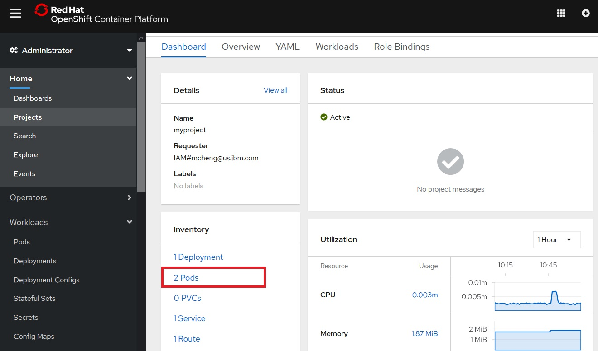

     <br/>

4. Delete one of the pods by clicking on the menu on the right, then selecting `Delete pod`. When prompted, click `Delete`.

    

    This is not the right way to reduce number of instances. You will notice that as soon as one of the pods is being terminated, another one is being created. The reason is that the controller for the `deployment` resource knows that your specification is for **2 instances**, and it honors that specification by creating another one. This also gives you automatic failure recovery should one of the pods crashes on its own.

    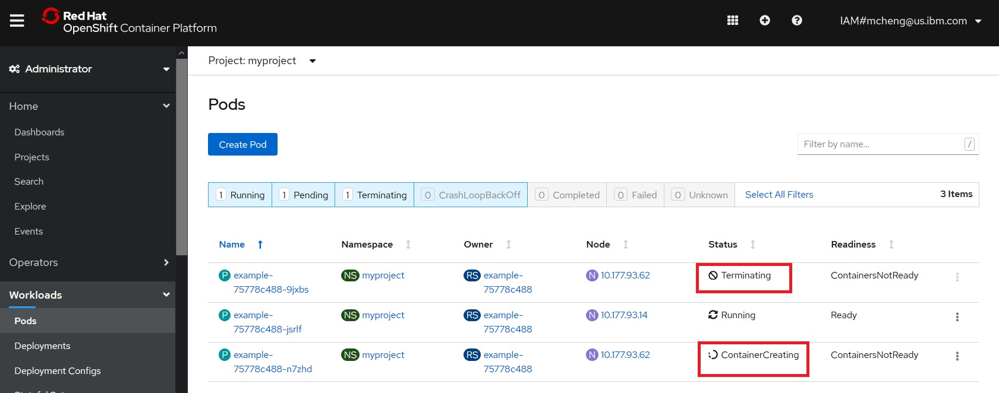

    <br/>

5. To change the number of instances, you will need to change the specification of your deployment. Click on the **Deployments** tab under **Workloads** in the left navigation, then click on `example` deployment:

    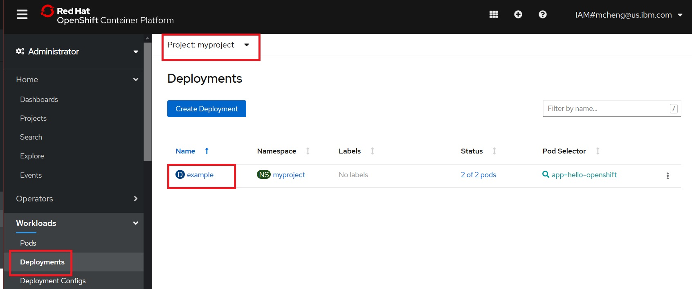

    <br/>

6. Click on the **down arrow** to reduce the replica size down to 1:

    

    <br/>

7. After the operation is completed, click on the **YAML** tab:

    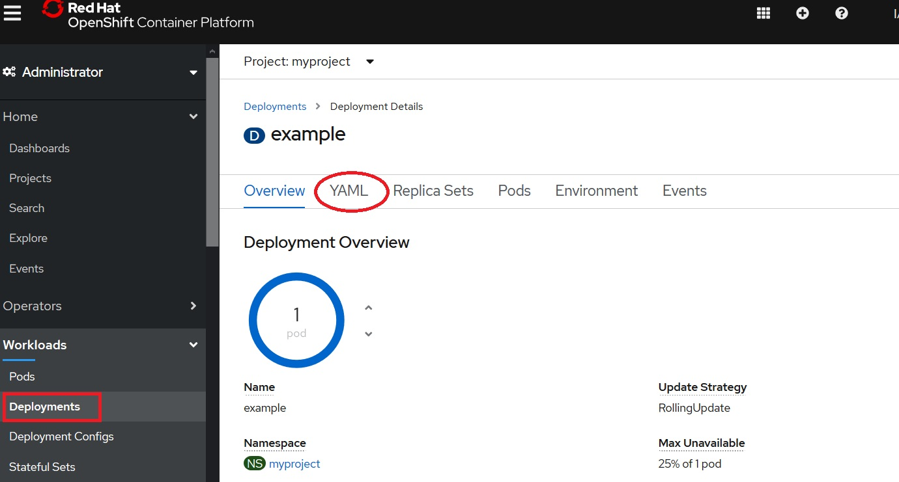

    Note that the console had changed the REST specification on your behalf so that the replica count is now 1:


    


## Deploy the hello-openshift image through the command line

You can use both `oc`, the openshift command line tool, or `kubectl`, the Kubernetes command line tool, to interact with Openshift. 
Resources in Openshift are configured via REST data structure. 
For the command line tools, the REST data structure may be stored either in  a YAML file, or in a JSON file.
The command line tools may be used to:

- List available resources
- Create resources
- Update existing resources
- Delete resources


###  Command Line Terminal

The `oc` command is already installed on your VM's terminal.

1. Open a new terminal window on the Desktop VM:
   
    
   
    <br/>
   
2. If you have not yet cloned the GitHub repo with the lab artifacts, in a previous lab, run the following command on your terminal:
   
        cd /home/ibmuser
		
		git clone https://github.com/IBMTechSales/openshift-workshop-was 


3. Change directory to:  `openshift-workshop-was/labs/Openshift/IntroOpenshift`


        cd /home/ibmuser/openshift-workshop-was/labs/Openshift/IntroOpenshift
    

### Login to OpenShift

1. Return to the Openshift console, click on the arrow next to your login name and select `Copy Login Command`.

    

    <br/>

2. In the new window that pops up, click on `Display Token`:

    

    <br/>

3. Copy the `oc login` command and paste it into your web terminal.

    ```
    oc login --token=<TOKEN> --server=<SERVER Address>
    ```
    
    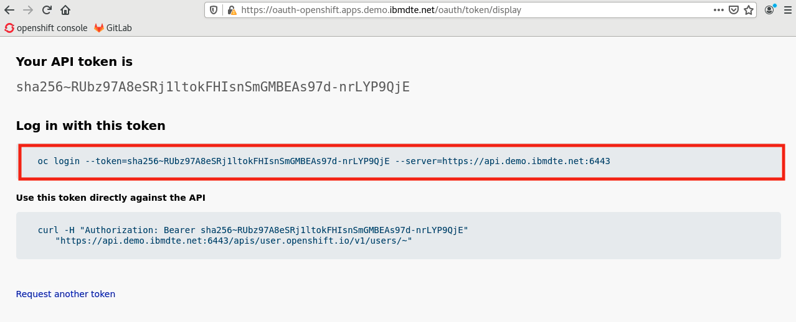
    

4. After login, the project last accessed is displayed, and it may or may not be the `default` project shown below:

    ```
    Logged into "<SERVER address" as "<USER>" using the token provided.

    You have access to 56 projects, the list has been suppressed. You can list all projects with 'oc projects'
    
    Using project "default".
    ```

### Listing resources

Use `oc api-resources` to list all available resource kinds. 
<br/>
Note that resources in Openshift have a `group`, `version`, and `kind`. 
Some resources are global (not in a namespace), while others are scoped to a `namespace`.
<br/>
Many resources also have short names to save typing when using the command line tool.
<br/>
For example, you may use `cm` instead of ConfigMap as a command line parameter when the parameter is for a `KIND`.
<br/><br/>
**Example output:**

```
NAME                                  SHORTNAMES       APIGROUP                              NAMESPACED   KIND
bindings                                                                                     true         Binding
componentstatuses                     cs                                                     false        ComponentStatu
s
configmaps                            cm                                                     true         ConfigMap
endpoints                             ep                                                     true         Endpoints
events                                ev                                                     true         Event
limitranges                           limits                                                 true         LimitRange
namespaces                            ns                                                     false        Namespace
nodes                                 no                                                     false        Node
```


### Listing instances of a resource kind

1. List all projects: `oc get projects`

    ```
    NAME          DISPLAY NAME   STATUS
    default                      Active
    ibm-cert-store               Active
    ibm-system                   Active
    kube-node-lease              Active
    kube-public                  Active
    kube-system                  Active
    myproject                    Active
    ...
    ```


2. List all pods in all namespaces: `oc get pods --all-namespaces`

    ```
    NAMESPACE                                               NAME
      READY   STATUS      RESTARTS   AGE
    ibm-system                                              ibm-cloud-provider-ip-52-116-182-130-67c44c6d5d-bh9x5
      1/1     Running     0          24h
    ibm-system                                              ibm-cloud-provider-ip-52-116-182-130-67c44c6d5d-cs5ln
      1/1     Running     0          24h
    kube-system                                             calico-kube-controllers-549fdb8d79-khkvr
      1/1     Running     0          25h
    ...
    ```


3.  List all pods within a namespace: `oc get pods -n myproject`

    ```
    NAME                       READY   STATUS    RESTARTS   AGE
    example-5fb6876865-pqhcd   1/1     Running   0          21m
    ```
     


### Projects

1. List all projects: `oc get projects`

    ```
    NAME                                                    DISPLAY NAME   STATUS
    default                                                                Active
    ibm-cert-store                                                         Active
    ibm-system                                                             Active
    kube-node-lease                                                        Active
    ```

2. Get current project: `oc project` (Note: current project may not be `myproject` shown below):

    ```
    Using project "default" on server "https://c100-e.us-south.containers.cloud.ibm.com:32541".
    ```

3. Change to a specific project

    ```
    oc project myproject
    ```

    ```
    Now using project "myproject" on server "https://api.demo.ibmdte.net:6443".
    ```


4. Create a new project and make it the current project: 
```
oc new-project  project1
```   

    The output from creating a new project:

    ```
    Now using project "project1" on server "https://c100-e.us-south.containers.cloud.ibm.com:32541".
    ```

4. Switch to the `default` project: 
```
oc project default
```


5. Switch back to `project1`: 
```
oc project project1
```

6. View the REST specification of the project: 
```
oc get project project1 -o yaml
```

    The output of the resource specification in **yaml**

    ```
    apiVersion: project.openshift.io/v1
    kind: Project
    metadata:
      annotations:
        openshift.io/description: ""
        openshift.io/display-name: ""
        openshift.io/requester: IAM#mcheng@us.ibm.com
        openshift.io/sa.scc.mcs: s0:c24,c9
        openshift.io/sa.scc.supplemental-groups: 1000570000/10000
        openshift.io/sa.scc.uid-range: 1000570000/10000
      creationTimestamp: "2020-01-30T20:28:13Z"
      name: project1
      resourceVersion: "364002"
      selfLink: /apis/project.openshift.io/v1/projects/project1
      uid: a817b908-a7fe-4f82-9bfa-e18fa4c12584
    spec:
      finalizers:
      - kubernetes
    status:
      phase: Active
    ```

### First Application

#### First Deployment

1. In your web terminal session, under the directory where you cloned the labs repository `(/home/ibmuser/openshift-workshop-was/labs/Openshift/IntroOpenshift)`, you will find **Deployment.yaml**;  

     For example:
     ```
     root@lab-tools-6d4cbb56b6-cn2k5:/openshift-workshop-was/labs/Openshift/IntroOpenshift# ls -lt
     drwxr-xr-x. 2 root root  4096 Apr  9 01:13 images
     -rw-r--r--. 1 root root 32461 Apr  9 01:13 README.md
     -rw-r--r--. 1 root root   171 Apr  9 01:13 Route.yaml
     -rw-r--r--. 1 root root   207 Apr  9 01:13 Service.yaml
     -rw-r--r--. 1 root root   384 Apr  9 01:13 Deployment.yaml
     ```
	 
2. Review the contents of `Deployment.yaml` and note that it is identical to the to the deployment from the last section except for the namespace. 

     ```
     cat Deployment.yaml
     ```

     This allows us to deploy the same image in a different project. Using the same image customized for different environments is an important concept that will be covered further in future labs.


     ```
      apiVersion: apps/v1
      kind: Deployment
      metadata:
        name: example
        namespace: project1
      spec:
        selector:
          matchLabels:
            app: hello-openshift
        replicas: 2
        template:
          metadata:
            labels:
              app: hello-openshift
          spec:
            containers:
              - name: hello-openshift
                image: openshift/hello-openshift
                ports:
                  - containerPort: 8080
     ```


3. Apply the deployment via the command line: 

    ```
    oc apply -f Deployment.yaml
    ```

    After applying the yaml, you will see a message that the deployment resource  was created

    ```
    deployment.apps/example created
    ```
    
4. Check the status of deployment: 

    ```
    oc get deployment example -o yaml
    ```

    If the status does not show available **replica count of 2**, wait a few seconds, then rerun the command.

    ```
    apiVersion: extensions/v1beta1
    kind: Deployment
    metadata:
      annotations:
        deployment.kubernetes.io/revision: "1"
        kubectl.kubernetes.io/last-applied-configuration: |
          {"apiVersion":"apps/v1","kind":"Deployment","metadata":{"annotations":{},"name":"example","namespace":"project1"},
    "spec":{"replicas":2,"selector":{"matchLabels":{"app":"hello-openshift"}},"template":{"metadata":{"labels":{"app":"hello
    -openshift"}},"spec":{"containers":[{"image":"openshift/hello-openshift","name":"hello-openshift","ports":[{"containerPo
    rt":8080}]}]}}}}
      creationTimestamp: "2020-01-30T20:37:28Z"
      generation: 1
      name: example
      namespace: project1
      resourceVersion: "366251"
      selfLink: /apis/extensions/v1beta1/namespaces/project1/deployments/example
      uid: f011a93d-2231-4187-b265-f350ee830971
    spec:
      progressDeadlineSeconds: 600
      replicas: 2
      revisionHistoryLimit: 10
      selector:
        matchLabels:
          app: hello-openshift
      strategy:
        rollingUpdate:
          maxSurge: 25%
          maxUnavailable: 25%
        type: RollingUpdate
      template:
        metadata:
          creationTimestamp: null
          labels:
            app: hello-openshift
        spec:
          containers:
          - image: openshift/hello-openshift
            imagePullPolicy: Always
            name: hello-openshift
            ports:
            - containerPort: 8080
              protocol: TCP
            resources: {}
            terminationMessagePath: /dev/termination-log
            terminationMessagePolicy: File
          dnsPolicy: ClusterFirst
          restartPolicy: Always
          schedulerName: default-scheduler
          securityContext: {}
          terminationGracePeriodSeconds: 30
    status:
      availableReplicas: 2
      conditions:
      - lastTransitionTime: "2020-01-30T20:37:31Z"
        lastUpdateTime: "2020-01-30T20:37:31Z"
        message: Deployment has minimum availability.
        reason: MinimumReplicasAvailable
        status: "True"
        type: Available
      - lastTransitionTime: "2020-01-30T20:37:28Z"
        lastUpdateTime: "2020-01-30T20:37:31Z"
        message: ReplicaSet "example-75778c488" has successfully progressed.
        reason: NewReplicaSetAvailable
        status: "True"
        type: Progressing
      observedGeneration: 1
      readyReplicas: 2
      replicas: 2
      updatedReplicas: 2
    ```

5. List the running pods created by the controller for the deployment: 
```
oc get pods
```

    The pods should be in the **Running** state

    ```
    NAME                      READY   STATUS    RESTARTS   AGE
    example-75778c488-7k7q2   1/1     Running   0          3m37s
    example-75778c488-c9jhd   1/1     Running   0          3m37s
    ```

6. List the details for one of the pods: 
```
oc get pods <pod name> -o yaml
```

    **Note:** `<pod name>` is listed under `NAME` in the previous command's output.
	
    ```
    apiVersion: v1
    kind: Pod
    metadata:
      annotations:
        cni.projectcalico.org/podIP: 172.30.26.229/32
        openshift.io/scc: restricted
      creationTimestamp: "2020-01-30T20:37:28Z"
      generateName: example-75778c488-
      labels:
        app: hello-openshift
        pod-template-hash: 75778c488
      name: example-75778c488-7k7q2
      namespace: project1
      ownerReferences:
      - apiVersion: apps/v1
        blockOwnerDeletion: true
        controller: true
        kind: ReplicaSet
        name: example-75778c488
        uid: 2b03ef6a-8a1a-4f7e-9502-7249a4dabb98
      resourceVersion: "366248"
      selfLink: /api/v1/namespaces/project1/pods/example-75778c488-7k7q2
      uid: 504c999e-d47d-48f7-afcb-992a5a13fc67
    spec:
      containers:
      - image: openshift/hello-openshift
        imagePullPolicy: Always
        name: hello-openshift
        ports:
        - containerPort: 8080
          protocol: TCP
        resources: {}
        securityContext:
          capabilities:
            drop:
            - KILL
            - MKNOD
            - SETGID
            - SETUID
          runAsUser: 1000570000
        terminationMessagePath: /dev/termination-log
        terminationMessagePolicy: File
        volumeMounts:
        - mountPath: /var/run/secrets/kubernetes.io/serviceaccount
          name: default-token-ngv4p
          readOnly: true
      dnsPolicy: ClusterFirst
      enableServiceLinks: true
      imagePullSecrets:
      - name: default-dockercfg-shjmz
      nodeName: 10.177.93.14
      priority: 0
      restartPolicy: Always
      schedulerName: default-scheduler
      securityContext:
        fsGroup: 1000570000
        seLinuxOptions:
          level: s0:c24,c9
      serviceAccount: default
      serviceAccountName: default
      terminationGracePeriodSeconds: 30
      tolerations:
      - effect: NoExecute
        key: node.kubernetes.io/not-ready
        operator: Exists
        tolerationSeconds: 300
      - effect: NoExecute
        key: node.kubernetes.io/unreachable
        operator: Exists
        tolerationSeconds: 300
      volumes:
      - name: default-token-ngv4p
        secret:
          defaultMode: 420
          secretName: default-token-ngv4p
    status:
      conditions:
      - lastProbeTime: null
        lastTransitionTime: "2020-01-30T20:37:28Z"
        status: "True"
        type: Initialized
      - lastProbeTime: null
        lastTransitionTime: "2020-01-30T20:37:31Z"
        status: "True"
        type: Ready
      - lastProbeTime: null
        lastTransitionTime: "2020-01-30T20:37:31Z"
        status: "True"
        type: ContainersReady
      - lastProbeTime: null
        lastTransitionTime: "2020-01-30T20:37:28Z"
        status: "True"
        type: PodScheduled
      containerStatuses:
      - containerID: cri-o://42828d4a8333d4fa9d3882805680d7693616610ff78a3e07f4794d91b86862b5
        image: docker.io/openshift/hello-openshift:latest
        imageID: docker.io/openshift/hello-openshift@sha256:aaea76ff622d2f8bcb32e538e7b3cd0ef6d291953f3e7c9f556c1ba5baf47e2e
        lastState: {}
        name: hello-openshift
        ready: true
        restartCount: 0
        started: true
        state:
          running:
            startedAt: "2020-01-30T20:37:30Z"
      hostIP: 10.177.93.14
      phase: Running
      podIP: 172.30.26.229
      podIPs:
      - ip: 172.30.26.229
      qosClass: BestEffort
      startTime: "2020-01-30T20:37:28Z"
    ```

7. Show the logs of one of the pods: `oc logs <pod name>`

    ```
    serving on 8888
    serving on 8080
    ```

8. Take a look at `Service.yaml` and note that it's for the `project1` namespace:

    ```
    cat Service.yaml
    ```
    Example output:
    ```
    apiVersion: v1
    kind: Service
    metadata:
      name: example
      namespace: project1
    spec:
      ports:
        - protocol: TCP
          port: 8080
          targetPort: 8080
      selector:
        app: hello-openshift
      type: ClusterIP
    ```

9. Create the service so that it's accessible and load balanced for pods with label `app: hello-openshift` within the `project1` namespace: 

    ```
    oc apply -f Service.yaml
    ```
 
    The service is created

    ```
    service/example created
    ```

10. Examine Route.yaml:
    ```
    cat Route.yaml
    ```
    Output:
    ```
    apiVersion: route.openshift.io/v1
    kind: Route
    metadata:
      name: example
      namespace: project1
    spec:
      port:
        targetPort: 8080
      to:
        kind: Service
        name: example
    ```

11. Apply the route to make the service reachable from outside the cluster: 
    
    ```
    oc apply -f Route.yaml
    ```
    
    The route is created

    ```
    route.route.openshift.io/example created
    ```

12. Generate the URL for the route, and point your browser to it: 
   ```
   echo http://$(oc get route example --template='{{ .spec.host }}')
   ```
   Output:
   ```
   http://example-project1.apps.demo.ibmdte.net
   ```
13. Open your Firefox browser again and visit the URL outputted by the previous command. You should see a web page displaying the following message:

    


### Changing Replica Instance

1. List pods: `oc get pods`

    ```
    NAME                      READY   STATUS    RESTARTS   AGE
    example-75778c488-7k7q2   1/1     Running   0          60m
    example-75778c488-c9jhd   1/1     Running   0          60m
    ```

2. Delete one of the pods: `oc delete pod <pod name>`

    ```
    pod "example-75778c488-7k7q2" deleted
    ```

3. List pods again and note that a new instance has been created as expected. The deployment specified 2 instances, so the controller tries to maintain 2 instances: `oc get pods`

    ```
    NAME                      READY   STATUS    RESTARTS   AGE
    example-75778c488-c9jhd   1/1     Running   0          63m
    example-75778c488-rhjrx   1/1     Running   0          28s
    ```

4. To cange the number of pods, you can patch the resource in one of two ways:
   
     - Scripted patch using the `patch` option of the command line: This command reduces the number of pods to 1. 
      
	     ```
         oc patch deployment example -p '{ "spec": { "replicas": 1 } }'

         oc get pods
       ```
      
       ```
       NAME                       READY   STATUS    RESTARTS   AGE
       example-5fb6876865-xjbb6   1/1     Running   0          14m
       ``` 

     - Interactive patch using the `edit` option of the command line through `vi` editor:
     
	     ```
         oc edit deployment example
       ```
      
	  Under the `spec` section (not under the `status` section), change `replicas: 1` to `replicas: 2`, and **save** the change in the vi editor (by `:wq`).

      The output:
      ```
      deployment.extensions/example edited
      ```

     **Note:** The above edits the copy that is stored in Openshift. You may also edit your local copy of `Deployment.yaml` and re-apply it.

      <br/>

5. List the pods to show 2 pods runing afer issueing the previous commands: 

    ```
    oc get pods
    ```

    ```
    NAME                       READY   STATUS    RESTARTS   AGE
    example-5fb6876865-5vpwk   1/1     Running   0          20s
    example-5fb6876865-xjbb6   1/1     Running   0          20m
    ```


8. Cleanup:
    - `oc delete route example`
    - `oc delete service example`
    - `oc delete deployment example`
    - `oc get pods`  **Note:** You may have to do this a few times, to wait for the pods to be deleted.

Congratulations, you have deployed your first application to Openshift via the command line.
