# Application Management

## Table of Contents

- [Introduction](#introduction)
- [Prerequisites](#prerequisites)
- [Application Logging](#application-logging-hands-on) (Hands-on)
- [Application Monitoring](#application-monitoring-hands-on) (Hands-on)
- [Day-2 Operations](#day-2-operations-hands-on) (Hands-on)
- [Summary](#summary)

## Introduction

In this lab, you'll learn about managing your running applications efficiently using various tools available to you as part of OpenShift and OperatorHub, including the Open Liberty Operator.

<a name="Login_VM"> </a>

## Login to the VM

1. If the VM is not already started, start it by clicking the Play button.
 
    
   
2. After the VM is started, click the **desktop** VM to access it.
   
    
   
3. Login with **ibmuser** ID.
   
    * Click on the **ibmuser** icon on the Ubuntu screen.
    * When prompted for the password for **ibmuser**, enter "**engageibm**" as the password: 
     
    
     
	 <br/>
	 
4. Resize the Skytap environment window for a larger viewing area while doing the lab. From the Skytap menu bar, click on the "**Fit to Size**" icon. This will enlarge the viewing area to fit the size of your browser window. 

   


## Prerequisites

1. Open a terminal window from the VM desktop.

    

	 <br/>

2. Login to OpenShift CLI with the `oc login` command from the web terminal. When prompted for the username and password, enter the following login credentials:
    - Username: **ibmadmin**
    - Password: **engageibm**
    
      

	 <br/>

3. If you have not yet cloned the GitHub repo with the lab artifacts, then run the following command on your terminal:
    ```
    git clone https://github.com/IBMTechSales/openshift-workshop-was.git
    ```


## Build and deploy the traditional WebSphere application (Hands-on)

1. Change to the lab's directory:
   ```
   cd /home/ibmuser/openshift-workshop-was/labs/Openshift/OperationalModernization
   ```

2. Create a new project `apps-was`. 
    
	**Note:** The  `oc new-project` command may fail if the project already exists from running the operational modernization lab. If so, proceed to the next step.
    ```
    oc new-project apps-was
    ```

3. Switch over to the project `apps-was`. 
    
	```
     oc project apps-was
    ```   

4. Build and deploy the application by running the commands in the following sequence. 
 
    **Reminder:** The `.` at the end of the first command is required. 
    ```
    docker build --tag default-route-openshift-image-registry.apps.demo.ibmdte.net/apps-was/cos-was .

    docker login -u openshift -p $(oc whoami -t) default-route-openshift-image-registry.apps.demo.ibmdte.net

    docker push default-route-openshift-image-registry.apps.demo.ibmdte.net/apps-was/cos-was

    oc apply -f deploy
    ```
    
    Example output listing the resources that were created. 
     ```
    deployment.apps/cos-was created
    route.route.openshift.io/cos-was created
    secret/authdata created
    service/cos-was created
    ```

5. Wait for the pod to be available, check status via `oc get pod` command
    
    The output should be: 
    ```
    NAME                      READY   STATUS    RESTARTS   AGE
    cos-was-7d5ff6945-4hjzr   1/1     Running   0          88s
    ```

6. Get the URL to the application:
   ```
   echo http://$(oc get route cos-was  --template='{{ .spec.host }}')/CustomerOrderServicesWeb
   ```
   Example output:
   ```
   http://cos-was-apps-was.apps.demo.ibmdte.net/CustomerOrderServicesWeb
   ```

7. Open a Firefox web browser window from within the VM.

     

     <br/>

8. Go to the URL outputted by the command run in the previous step.

     <br/>

9. If prompted to login into the applicarion, enter the following credentials:
    - Username: **skywalker**
    - Password: **force**

    

     <br/>

10. After login, the application page titled _Electronic and Movie Depot_ will be displayed. From the `Shop` tab, click on an item (a movie) and on the next pop-up panel, drag and drop the item into the shopping cart. 

    

     <br/>

11. Add a few items to the cart. As the items are added, they’ll be shown under _Current Shopping Cart_ (on the upper right) with _Order Total_.

    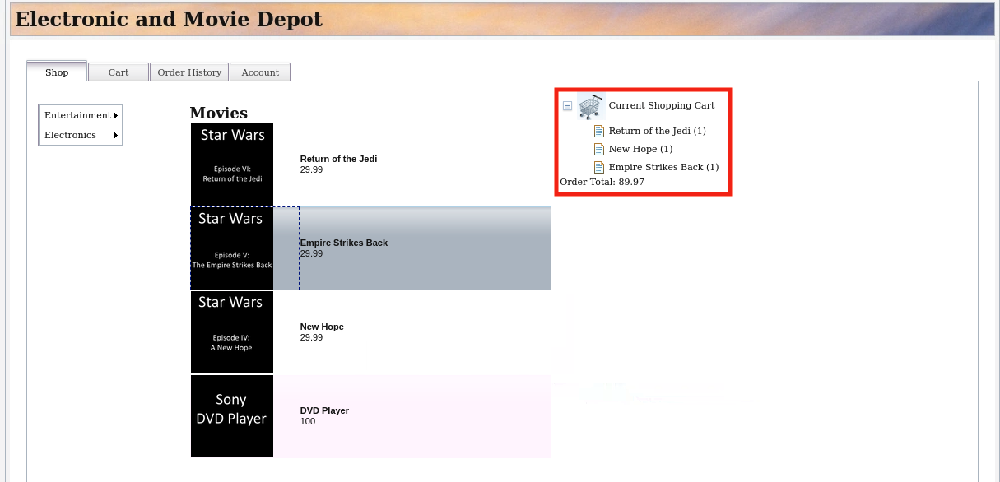

     <br/>

12. Close the browser.


## Build and deploy the Liberty application 


|         |     
| ------------- |
| <strong>Please Read:</strong> <br><br> Skip this section if you just finished the previous lab [Runtime Modernization](https://github.com/IBM/openshift-workshop-was/tree/master/labs/Openshift/RuntimeModernization) and did not clean up the deployment). <br> <br> **Note:** The following steps are to help you re-deploy the Liberty application if the deployment has been deleted from the previous lab Runtime Modernization.  The deployment is required to generate data for the follow-on steps in monitoring.
|


1. From the top level directory, change to the lab's directory `RuntimeModernization` folder:
   ```
   cd /home/ibmuser/openshift-workshop-was/labs/Openshift/RuntimeModernization
   ```

2. Create and switch over to the project `apps`. Also, enable monitoring for the project. 
    
     **Note:** The first step `oc new-project` may fail if the project already exists. If so, proceed to the next command.
     ```
     oc new-project apps

     oc project apps

     oc label namespace apps app-monitoring=true
     ```

3. Build and deploy the application by running the commands in the following sequence. 

     **Reminder:** The `.` at the end of the first command:
     ```
     docker build --tag default-route-openshift-image-registry.apps.demo.ibmdte.net/apps/cos .

     docker login -u openshift -p $(oc whoami -t) default-route-openshift-image-registry.apps.demo.ibmdte.net

     docker push default-route-openshift-image-registry.apps.demo.ibmdte.net/apps/cos

     oc apply -k deploy/overlay-apps
     ```
     Example output:
     ```
     configmap/cos-config created
     secret/db-creds created
     secret/liberty-creds created
     openlibertyapplication.openliberty.io/cos created
     ```

4. Verify the route for the application is created:
   ```
   oc get route cos
   ```
   Example output:
   ```
   NAME   HOST/PORT                       PATH   SERVICES   PORT       TERMINATION          WILDCARD
   cos    cos-apps.apps.demo.ibmdte.net          cos        9443-tcp   reencrypt/Redirect   None
   ```

5. Verify your pod is ready:
   ```
   oc get pod 
   ```
   Example output:
   ```
   NAME                   READY   STATUS    RESTARTS   AGE
   cos-54975b94c6-rh6kt   1/1     Running   0          3m11s
   ```

6. Get the application URL:
   ```
   echo http://$(oc get route cos  --template='{{ .spec.host }}')/CustomerOrderServicesWeb
   ```
   Example output:
   ```
   http://cos-apps.apps.demo.ibmdte.net/CustomerOrderServicesWeb
   ```

7. Return to your Firefox browser window and go to the URL outputted by the command run in the previous step.

8. If prompted to login to the application, enter the following credentials:
    - Username: **skywalker**
    - Password: **force**

    

    <br/> 

9. After login, the application page titled _Electronic and Movie Depot_ will be displayed. From the `Shop` tab, click on an item (a movie) and on the next pop-up panel, drag and drop the item into the shopping cart. **Add multiple items to the shopping cart to trigger more logging.**

    

    <br/>

10. Add a few items to the cart. As the items are added, they’ll be shown under _Current Shopping Cart_ (on the upper right) with _Order Total_.

    
  
  
  
## Application Logging (Hands-on)

Pod processes running in OpenShift frequently produce logs. To effectively manage this log data and ensure no loss of log data occurs when a pod terminates, a log aggregation tool should be deployed on the cluster. 

**Log aggregation tools** help users persist, search, and visualize the log data that is gathered from the pods across the cluster. 

Let's look at application logging with log aggregation using EFK **(Elasticsearch, Fluentd, and Kibana)**. 

  - **Elasticsearch** is a search and analytics engine. 

  - **Fluentd** receives, cleans and parses the log data. 

  - **Kibana** lets users visualize data stored in Elasticsearch with charts and graphs.


**Tip:** If it has been a long time (more than 15 minutes) since the Liberty or WebSphere pods last started, you may want to delete each pod and let a new one start, to ensure that Liberty and WebSphere create some recent logs for Kibana to find.


### Launch Kibana (Hands-on)

1. In your Firefox window, click on the **openshift console** bookmark in the top left, and log in with the **htpasswd** option.

    

    <br/>

2. Log in to the OpenShift account using the following credentials:
    - Username: **ibmadmin**
    - Password: **engageibm**

    

    <br/>

3. In the OpenShift console, from the left-panel, select **Networking** > **Routes**.

4. From the _Project_ drop-down list, select `openshift-logging`. 

5. In the `kibana` route, click on the URL listed under _Location_.

    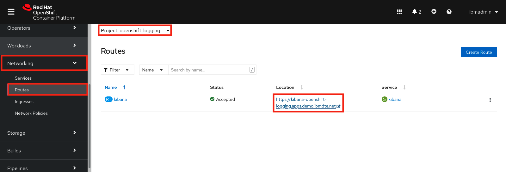

    
    **Note:** If prompted to re-authenicate in OpenShift, use the **htpasswd** option and login with user **ibmadmin** and password **engageibm**

6. This will open a new tab asking you to authorize access. Click on `Allow selected permissions`.

    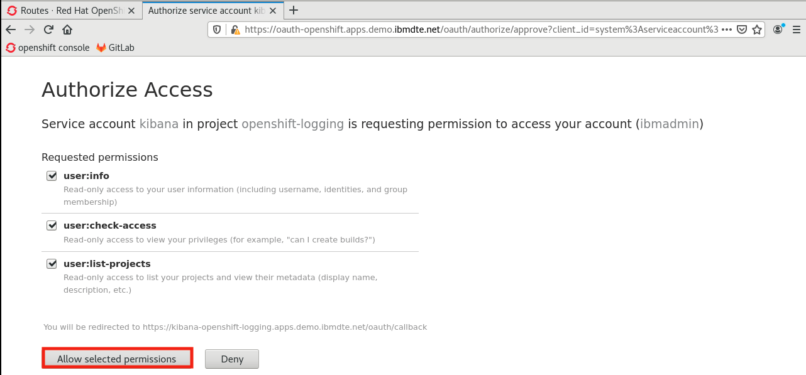

    <br/>

7. In the Kibana console, you'll be prompted to create an index pattern. An index pattern tells Kibana what indices to look for in Elasticsearch. Type `app` so that the index pattern looks like this screenshot:

    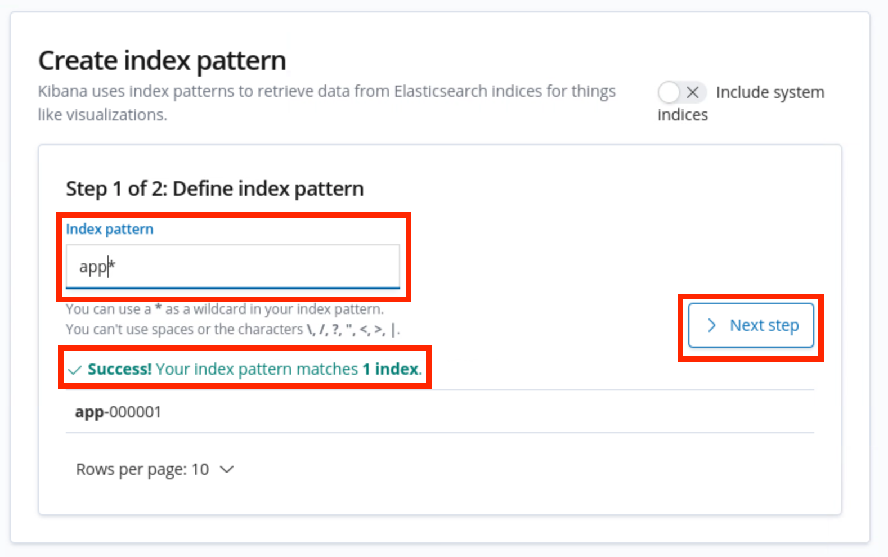

    You should see that your pattern matches at least one index. Then click **Next step**.

    <br/>

8. Click the drop-down for **Time Filter field name** and choose **@timestamp**. Then click **Create index pattern**.

    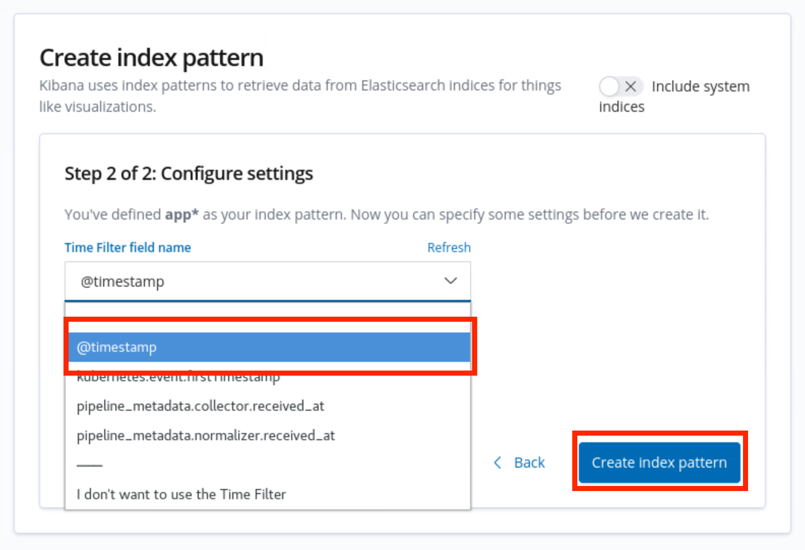

9. You should see a number of fields populated, around 260. To check that the correct fields have been detected, type `ibm` in the **Filter** text box. You should see many fields beginning with the text `ibm`. If not, try clicking the refresh button (arrows in a circle) at the top right of the page.

    


### Import dashboards (Hands-on)

A sample Kabana Dashboard for Liberty has been provided for this lab, and included in GitHub repository for this workshop.

**Tip:** The dashboards are located in `/home/ibmuser/openshift-workshop-was/labs/Openshift/ApplicationManagement/dashboards` on the desktop VM

  

1. Let's import dashboards for Liberty and WAS. From the left-panel, click on **Management**. Click on the **Saved Objects** tab and then click on **Import**.

    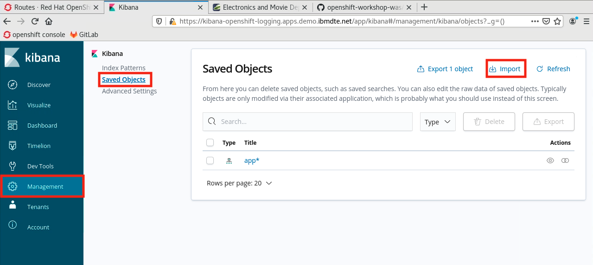

    <br/>

2. Click on **Import** from the right panel that is displayed.

    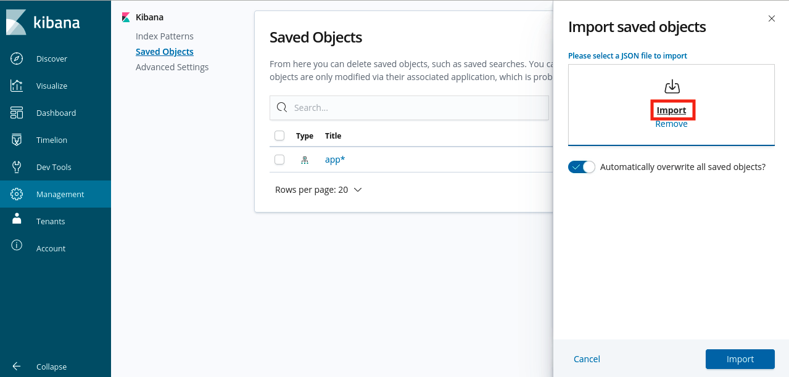

    <br/>

3. This will open your VM's files. Navigate to the location of the dashboard files.  

        /home/ibmuser/openshift-workshop-was/labs/Openshift/ApplicationManagement/dashboards

4. Open the **kibana** folder and select the `ibm-open-liberty-kibana5-problems-dashboard.json` file. Click **Open**.

    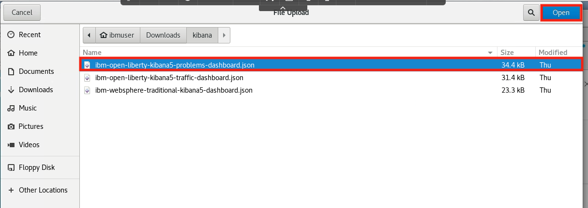

    <br/>

5. Click the **Import** button at the bottom of the panel. 

    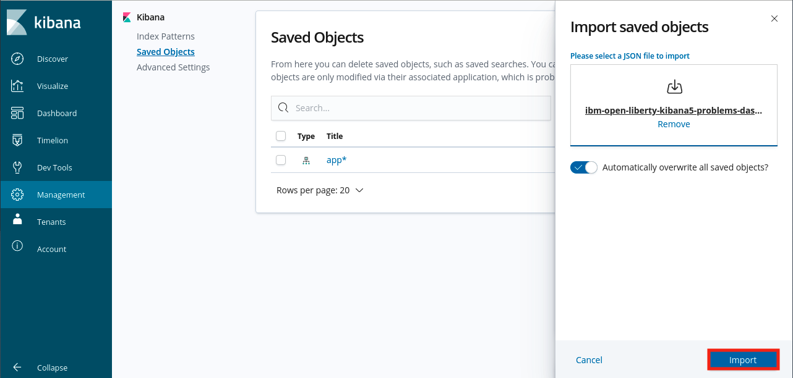

    <br/>

6. When prompted to resolve pattern conflicts, select `app*` as the new index from the drop down menu. Click **Confirm all changes**. 

    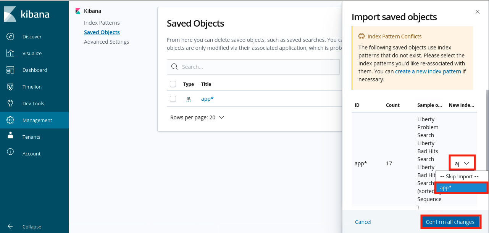

    <br/>

7. It'll take few seconds for the dashboard to import. Click **Done** when it finishes.

    

    <br/>

8. Repeat the steps 2- 7 to import the `ibm-open-liberty-kibana5-traffic-dashboard.json` and `ibm-websphere-traditional-kibana5-dashboard.json` files from the **kibana** folder from the dashboards directroy.

9. Click **Done** when the dashboards have been imported. 


### Explore dashboards (Hands-on)

In the Kibana console, from the left-panel, click on the **Dashboard** tab. You'll see 3 dashboards on the list. 
The first 2 are for Liberty. The last one is for WAS traditional. 

1. Read the description next to each dashboard.

    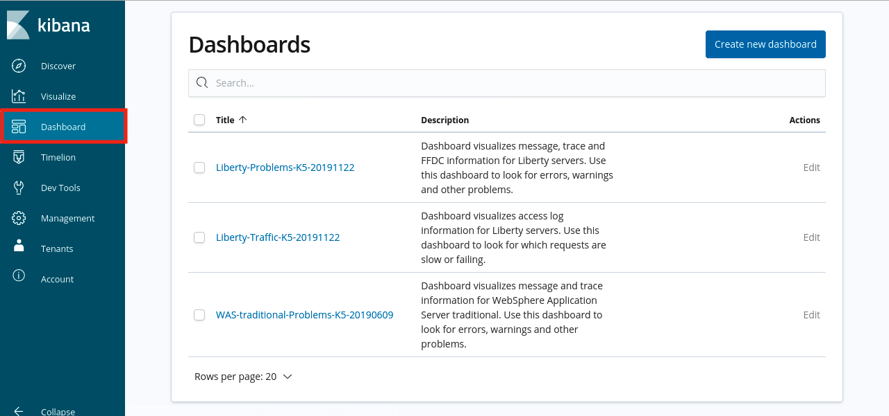


#### Liberty applications (Hands-on)

1. Click on the `Liberty-Problems-K5-20191122` dashboard. This dashboard visualizes message, trace and FFDC information from Liberty applications.

    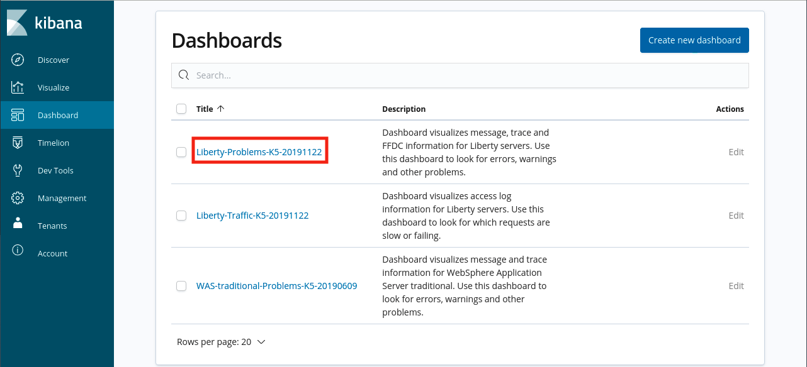

    <br/>

2. By default, data from the last 15 minutes are rendered. Adjust the time-range (from the top-right corner), so that it includes data from when you tried the Open Liberty application.

    

    <br/>

3. Once the data is rendered, you'll see some information about the namespace, pod, containers where events/problems occurred along with a count for each. 

    

    <br/>

4. Scroll down to **Liberty Potential Problem Count** section which lists the number of ERROR, FATAL, SystemErr and WARNING events. You'll likely see some WARNING events.

     <br/>

5. Below that you'll see **Liberty Top Message IDs**. This helps to quickly identify frequently occurring events and their timeline.

    

    <br/>

6. Click on the number above **WARNING**. The dashboard will change other panels to show just the events for warnings. Using this, you can determine whether the failures occurred on one or multiple pods/servers and whether they occurred around the same or different time.

    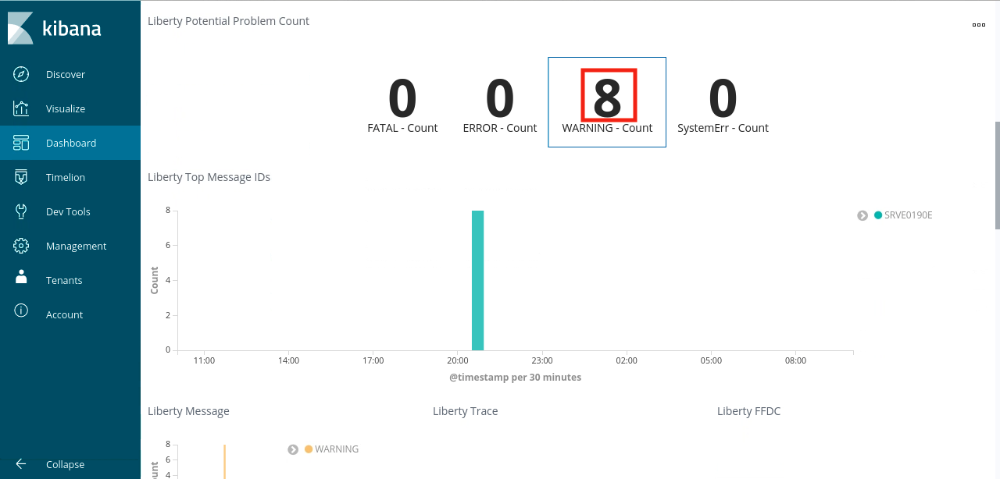

    <br/>

7. Scroll-down to the actual warning messages. In this case, some dojo files were not found. Even though they are warnings, it'll be good to fix them by updating the application (we won't do that as part of this workshop).

    

    <br/>

8. Go back to the list of dashboards and click on `Liberty-Traffic-K5-20191122`. This dashboard helps to identify failing or slow HTTP requests on Liberty applications.

    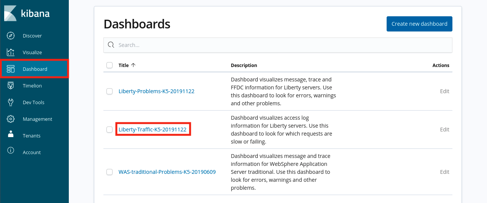

    <br/>

9. As before, adjust the time-range at the top right of the page if no data is rendered.

    <br/>

10. You'll see some information about the namespace, pod, containers for the traffic along with a count for each. 

    

    <br/>

11. Scroll-down to the **Liberty Error Response Code Count** section which lists the number of failed requests with HTTP response codes in the 400s and 500s ranges.

    <br/>

12. Scroll-down to **Liberty Top URLs** which lists the most frequently accessed URLs

    

    - The _/health_ and _/metrics_ endpoints are running on the same server and are queried frequently for readiness/liveness probes and scraping metrics information.

      <br/>

13. On the right-hand side, you'll see list of endpoints that had the slowest response times.

    <br/>

14. Click on the number listed above **400s - Count**. The dashboard will change other panels to show only the traffic with response codes in 400s. You can see the timeline and the actual messages below. These are related to warnings from last dashboard about dojo files not being found (response code 404).

    


#### Traditional WebSphere applications (Hands-on)

1. Return to the list of dashboards and click on `WAS-traditional-Problems-K5-20190609`. Similar to the first dashboard for Liberty, this dashboard visualizes message and trace information for WebSphere Application Server traditional.

    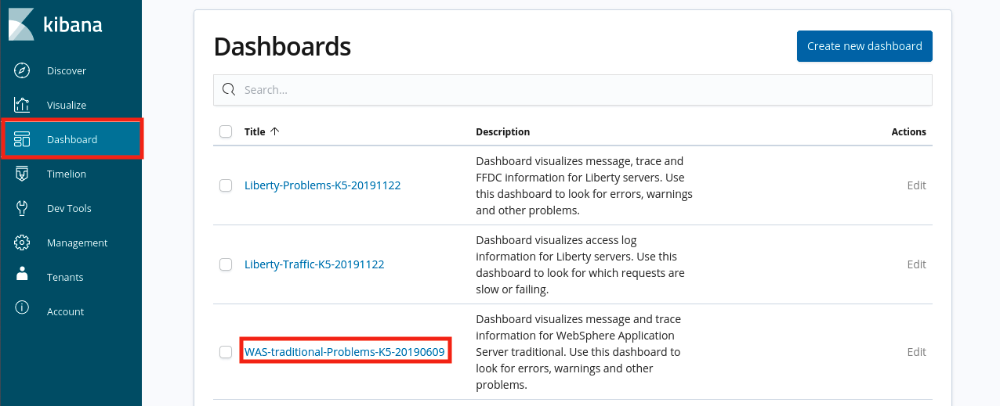

    <br/>
    
2. Again, adjust the time-range as necessary if no data is rendered.

    <br/>

3. Same as before, explore the panels and filter through the events to see messages corresponding to just those events.

    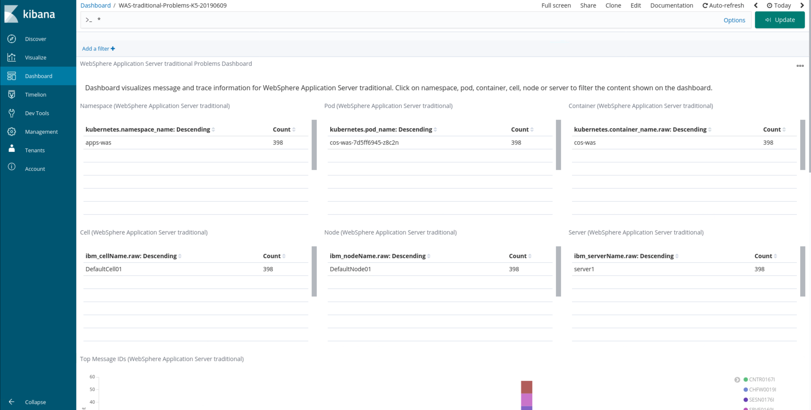


## Application Monitoring (Hands-on)

Building observability into applications externalizes the internal status of a system, enabling operations teams to monitor systems more effectively. It is important that applications are written to produce metrics. 

When the Customer Order Services application was modernized, we used MicroProfile Metrics and it provided a `/metrics` endpoint from where all metrics emitted by the JVM, Open Liberty server and deployed applications could be accessed. Operations teams can gather the metrics and store them in a database with tools like Prometheus. The metrics data can then be visualized and analyzed in dashboards, such as `Grafana`.

### Grafana dashboard (Hands-on)

1. Custom resource [GrafanaDashboard](dashboards/grafana/grafana-dashboard-cos.yaml) defines a set of dashboards for monitoring the Customer Order Services application and Open Liberty. In your terminal, run the following command to create the dashboard resource:

     a. Change directory to `openshift-workshop-was/labs/Openshift/ApplicationManagement` if not done so already.
	 ```
	 cd /home/ibmuser/openshift-workshop-was/labs/Openshift/ApplicationManagement
	 ```
	 
	 
	 b. Run the following command to define the dashboards for monitoring
     ```
     oc apply -f dashboards/grafana/grafana-dashboard-cos.yaml
     ```
    Example output: 
    ```
    grafanadashboard.integreatly.org/liberty-metrics-dashboard created
    ```

    <br/>

2. Use the following steps to access the created dashboard. See the illustrated screen recording at the end of this section: 

     a. In the OpenShift console, from the left-panel, select **Networking** > **Routes**.

     b. From the Project drop-down list, select `app-monitoring`. 

     c. In the `grafana-route` route, click on the URL listed under the **Location** column.

     d. Click on **Log in with OpenShift**. Then, click on **Allow selected permissions**.

     e. In the Grafana home page, from the left-panel, hover over the dashboard icon and click on **Manage**.

     f. You should see `Liberty-Metrics-Dashboard` listed. Click on it.

     g. Explore the dashboards. The first 2 are for the Customer Order Services application. The rest are for Liberty.

     > **TIP:** Adjust the the time range for the metrics dashboard, in order to see data. It has probably been a while since you ran the Operder app.  

     h. Click on **Customer Order Services - Shopping Cart**. By default, it'll show data from the last 15 minutes. Adjust the time-range from the top-right as necessary. 

     i. You should see the frequency of requests, number of requests, pod information, and min/max request times.

     j. Scroll-down to expand the **CPU** section. You'll see information about process CPU time and CPU system load for pods.

     k. Scroll-down to expand the **Servlets** section. You'll see request count and response times for application servlet as well as health and metrics endpoints.

     l. Explore the other sections.

      


## Day-2 Operations (Hands-on)

It is often nessarry to gather server **traces** and/or **dumps** for analyzing some problems with an application. Open Liberty Operator makes it easy to gather these on a server running inside a container.

Storage must be configured so the generated artifacts can persist, even after the Pod is deleted. This storage can be shared by all instances of the Open Liberty applications. 
RedHat OpenShift on IBM Cloud utilizes the storage capabilities provided by IBM Cloud. 

In the lab environment, you will attach storage using the storage class backed by NFS storage that we configured for the lab environment. 


Let's create a request for storage.

### Request storage (Hands-on)


1. In the OpenShift console, from the left-panel, select **Storage** > **Persistent Volume Claims**.

2. From the Project drop-down list, select `apps`. 

3. Click on the **Create Persistent Volume Claim** button.

    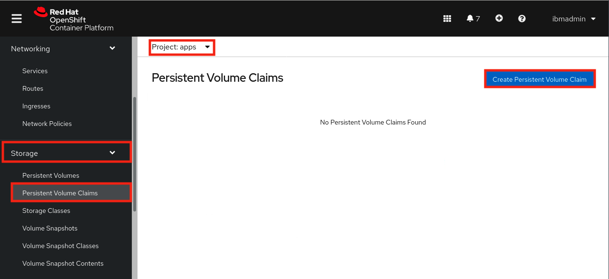

    <br/>

4. Ensure that **Storage Class** is `managed-nfs`. If not, select it from the list.

5. Enter `liberty` for the **Persistent Volume Claim Name** field.

6. Request **1 GiB** by entering `1` in the text box for **Size**.

7. Click on **Create**.

    

    <br/>

8. The created Persistent Volume Claim will be displayed. Wait for the **Status** field to change from `Pending` to `Bound`. It may take 1-2 minutes.

    <br/>

9. Once bound, you should see the volume displayed under the **Persistent Volume** field.

    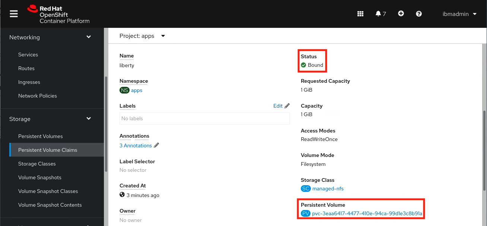

    <br/>

### Enable serviceability (Hands-on)

Now, let's enable the serviceability option for the Customer Order Services application. It's recommended that you do this step during initial deployment of the application - not when you encounter an issue and need to gather server traces or dumps. 

OpenShift cannot attach volumes to running Pods. It'll have to create a new Pod, attach the volume, and then take down the old Pod. If the problem is intermittent or hard to reproduce, you may not be able to reproduce it on the new instance of server running in the new Pod. 

The volume can be shared by all Liberty applications that are in the same namespace and won't be used unless you perform day-2 operation on a particular application. This makes it easy to enable serviceability with initial deployment.

1. Specify the name of the storage request (Persistent Volume Claim) you made earlier to the `spec.serviceability.volumeClaimName` parameter provided by the `OpenLibertyApplication` custom resource. 
   The Open Liberty Operator will attach the volume bound to the claim to each instance of the server. 

     In your terminal, run the following command:
     ```
     oc patch olapp cos -n apps --patch '{"spec":{"serviceability":{"volumeClaimName":"liberty"}}}' --type=merge
     ```
    
 	 - This patches the definition of `olapp` (shortname for `OpenLibertyApplication`) instance `cos` in namespace `apps` (indicated by `-n` option). 
       - The `--patch` option specifies the content to patch with. In this case, we set the value of `spec.serviceability.volumeClaimName` field to `liberty`, which is the name of the Persistent Volume Claim you created earlier. 
       - The `--type=merge` option specifies to merge the previous content with the newly specified field and its value.

         <br/>

2. Run the following command to get the status of `cos` application. Verify that the changes were reconciled and there are no errors:

    ```
    oc get olapp cos -n apps -o wide
    ```
    Example output:
    ```
    NAME IMAGE                                                      EXPOSED   RECONCILED  REASON  MESSAGE  DEPENDENCIESSATISFIED                        AGE
    cos  image-registry.openshift-image-registry.svc:5000/apps/cos  true      True                         True                                   14h

    ```
    The value under `RECONCILED` should be `True`. 
    
   
    >**Note:** If the `REONCILED` value is `False`, then an error >occurred. 
    >The `REASON` and `MESSAGE` columns will display the cause of the failure. 
    >
    >A common mistake is creating the Persistent Volume Claim in another namespace. Ensure that it is created in the `apps` namespace.

	
3. In the OpenShift console, from the left-panel, click on **Workloads** > **Pods**. Wait until there is only 1 pod on the list and its **Ready** column says 1/1.

    <br/>

4. Click on this pod.

    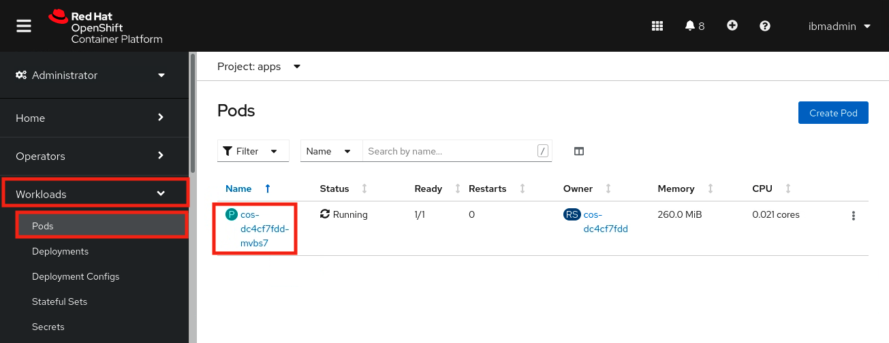

    <br/>

5. The pod's name is needed for requesting server dump and trace in the next sections. Scroll down and copy the value under the **Name** field.

    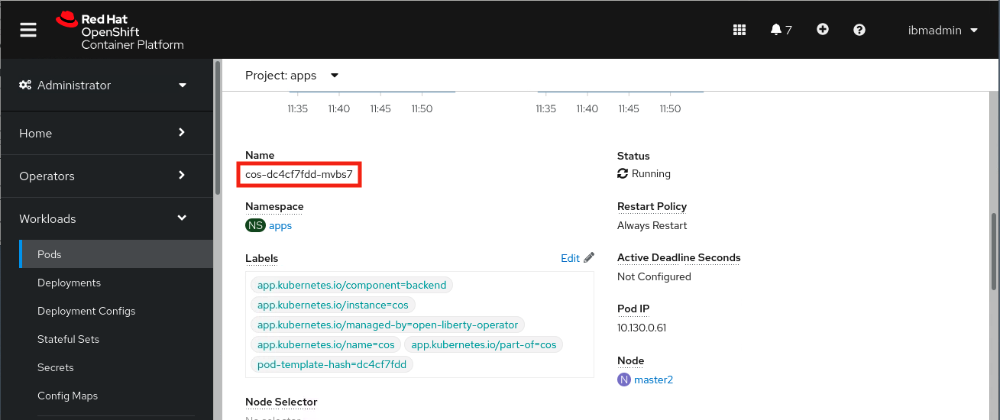

     <br/>

### Request server dump (Hands-on)

You can request a snapshot of the server status including different types of server dumps, from an instance of Open Liberty server running inside a Pod, using Open Liberty Operator and `OpenLibertyDump` custom resource (CR). 

Use the following steps to request a server dump, which are also illustrated in the screen recording below:

1. From the left-panel of the OpenShift console, click on **Operators** > **Installed Operators**.

2. From the **Open Liberty Operator** row, click on `Open Liberty Dump` (displayed under the **Provided APIs** column).

3. Click on the **Create OpenLibertyDump** button. 

4. Replace `Specify_Pod_Name_Here` in the **Pod Name** text field with the pod name you copied earlier.

5. The **Include** field specifies the type of server dumps to request. Let's use the default `heap` and `thread` values.

6. Click on the **Create** button.

7. Click on `example-dump` from the list.

8. Scroll-down to the **Conditions** section and you should see `Started` status has value `True`. Wait for the operator to complete the dump operation. You should see status `Completed` with value `True`.

    

    <br/>

Once the dumps are completed, a zipfile containing the **heap dump** and **thread dump** is created on the storage volume that was attached to the pod. 

From inside of the pod, the dumpfile is in the `/serviceability/apps` folder, as illustrated below. 
  
  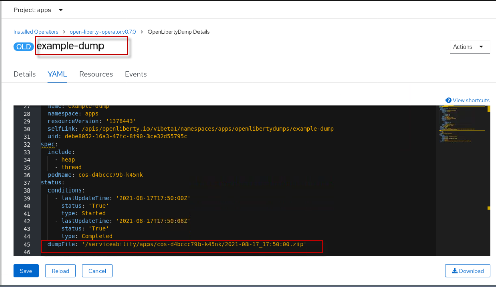
 
 
Additionally, the dumpfile is persisted in the NFS storage location defined by the persistent volume claim.  In this case, the storage is on a separate NFS server. 

For your reference , here is a view of the NFS storage location, where the dumpfile was persisted on the NFS server.

  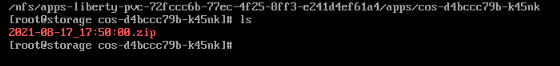


### Request server traces (Hands-on)

You can also request server traces from an instance of Open Liberty server running inside a Pod using the `OpenLibertyTrace` custom resource (CR).

Use the following steps to request a server trace, which is also illustrated in the screen recording below:

1. From the left-panel of the OpenShift console, click on **Operators** > **Installed Operators**.

2. From the **Open Liberty Operator** row, click on `Open Liberty Trace`.

3. Click on the **Create OpenLibertyTrace** button.

4. Replace `Specify_Pod_Name_Here` under the **Pod Name** text field with the pod name you copied earlier.

5. The **Trace Specification** field specifies the trace string to be used to selectively enable trace on Liberty server. Let's use the default value. 

6. Click on the **Create** button.

7. Click on `example-trace` from the list.

8. Scroll-down to the **Conditions** section and you should see `Enabled` status has value `True`. 
    
	
**Additional notes:** 

   - Once the trace has started, it can be stopped by setting the `disable` parameter to true. 
   - Deleting the CR will also stop the tracing. 
   - Changing the `podName` will first stop the tracing on the old Pod before enabling traces on the new Pod. 
   - Maximum trace file size (in MB) and the maximum number of files before rolling over can be specified using `maxFileSize` and `maxFiles` parameters.

   

  

### Accessing the generated files (Hands-on)

The generated trace and dump files should now be in the persistent volume. You used storage from the NFS Server that is included in the lab environment. 

in this lab environment, the NFS server is on the **nfs** VM. You will not access that VM in this lab. However, since the volume is attached to the Pod, you can instead use the Pod's terminal to easily verify that the trace and dump files are present.

The following steps to access the files are illustrated in the screen recording below:

1. Remote shell to your pod via one of two ways:
    
	- From your terminal:
      ```
	  oc project apps
	  
	  oc get pods
	  
      oc rsh <pod-name>
      ```
  
    - OR, From OpenShift console: click on **Workloads** > **Pods**. Click on the pod and then click on **Terminal** tab. 

      <br/>
 
2. Enter the following command to list the files inside of the container runinng in the pod:
    ```
    ls -R serviceability/apps
    ```
    Example output:
    ```
    serviceability/apps:
    cos-dc4cf7fdd-mvbs7

    serviceability/apps/cos-dc4cf7fdd-mvbs7:
    2021-07-13_16:05:25.zip  messages.log  trace_21.07.13_16.52.34.0.log  trace.log
    ```
    The shared volume is mounted at the `serviceability` folder. The sub-folder `apps` is the namespace of the Pod. You should see a zip file for dumps and trace log files. These are produced by the day-2 operations you performed.
    
    

    


## Summary

Congratulations! You've completed **Application Management** lab! 


